# UI与界面

> GPT Image 2 中文提示词案例分册 1。本分册共 86 个案例。

[返回索引](index.md)

## 案例目录

- [例 2：社媒界面截图](#case-2)
- [例 7：应用界面样机图](#case-7)
- [例 14：信息图可视化设计](#case-14)
- [例 17：界面交互设计图](#case-17)
- [例 21：直播界面设计图](#case-21)
- [例 25：综合应用场景图](#case-25)
- [例 37：综合应用场景图](#case-37)
- [例 38：综合应用场景图](#case-38)
- [例 39：综合应用场景图](#case-39)
- [例 40：综合应用场景图](#case-40)
- [例 48：直播界面设计图](#case-48)
- [例 49：直播界面设计图](#case-49)
- [例 57：界面交互设计图](#case-57)
- [例 91：游戏界面截图](#case-91)
- [例 92：视频封面界面图](#case-92)
- [例 97：综合应用场景图](#case-97)
- [例 99：界面交互设计图](#case-99)
- [例 101：界面交互设计图](#case-101)
- [例 103：视频封面界面图](#case-103)
- [例 104：界面交互设计图](#case-104)
- [例 106：应用界面样机图](#case-106)
- [例 107：应用界面样机图](#case-107)
- [例 108：综合应用场景图](#case-108)
- [例 109：综合应用场景图](#case-109)
- [例 110：视频封面界面图](#case-110)
- [例 111：视频封面界面图](#case-111)
- [例 129：绘画艺术风格图](#case-129)
- [例 130：界面交互设计图](#case-130)
- [例 131：界面交互设计图](#case-131)
- [例 132：界面交互设计图](#case-132)
- [例 133：界面交互设计图](#case-133)
- [例 134：界面交互设计图](#case-134)
- [例 135：应用界面样机图](#case-135)
- [例 137：界面交互设计图](#case-137)
- [例 143：品牌徽标设计图](#case-143)
- [例 145：综合应用场景图](#case-145)
- [例 146：综合应用场景图](#case-146)
- [例 147：综合应用场景图](#case-147)
- [例 148：综合应用场景图](#case-148)
- [例 149：直播界面设计图](#case-149)
- [例 151：界面交互设计图](#case-151)
- [例 152：直播界面设计图](#case-152)
- [例 156：应用界面样机图](#case-156)
- [例 158：界面交互设计图](#case-158)
- [例 159：界面交互设计图](#case-159)
- [例 161：应用界面样机图](#case-161)
- [例 164：特朗普太空直播间破千万](#case-164)
- [例 175：封面排版设计图](#case-175)
- [例 176：苏轼被贬首日朋友圈曝光](#case-176)
- [例 177：吉利银河暗黑中控界面](#case-177)
- [例 193：千手观音化身打工人](#case-193)
- [例 197：英雄联盟特朗普中路对决哈梅内伊](#case-197)
- [例 199：超写实海滩高角度手机自拍](#case-199)
- [例 200：热度爆表的美女内衣直播间](#case-200)
- [例 208：樱花树下害羞双马尾少女](#case-208)
- [例 213：金瓶梅古风开放世界游戏截图](#case-213)
- [例 217：昏暗室内纯真少女的意外回眸](#case-217)
- [例 227：哔哩哔哩户晨风直播截图](#case-227)
- [例 239：刘亦菲抖音直播畅聊中](#case-239)
- [例 243：定制专属风格界面设计系统](#case-243)
- [例 249：美女举牌感谢大哥打赏大火箭](#case-249)
- [例 255：瑜伽裤女主播展示身材曲线](#case-255)
- [例 256：抖音直播间的绝美女主播](#case-256)
- [例 257：抖音汉服美女直播带货截图](#case-257)
- [例 258：快手直播离婚预告手机截图](#case-258)
- [例 259：精致女孩背后的网贷真相](#case-259)
- [例 260：社媒界面截图](#case-260)
- [例 261：智能视频生成器暗黑界面设计](#case-261)
- [例 262：苹果园远观库克发布新机](#case-262)
- [例 263：唯美二次元角色介绍网页](#case-263)
- [例 267：宋朝文人的赛博朋友圈](#case-267)
- [例 269：拒绝盲目催婚的暖心视频号截图](#case-269)
- [例 282：温柔治愈系二次元手机截图](#case-282)
- [例 284：温馨卧室里的少女自拍](#case-284)
- [例 287：不知火舞的小红书主页](#case-287)
- [例 288：抖音美女直播间界面设计](#case-288)
- [例 289：直播界面设计图](#case-289)
- [例 300：黑板上的出师表全文](#case-300)
- [例 308：抖音直播截图画面](#case-308)
- [例 323：应用界面样机图](#case-323)
- [例 335：朋友圈截图生成](#case-335)
- [例 336：个人网页视觉设计](#case-336)
- [例 339：Apple 风格自然科普海报](#case-339)
- [例 350：足球球员数据涂鸦海报](#case-350)
- [例 353：品牌口红推荐报告信息图](#case-353)
- [例 354：Logo 与品牌身份系统提示词合集](#case-354)

## 案例

<a id="case-2"></a>

### 例 2：社媒界面截图

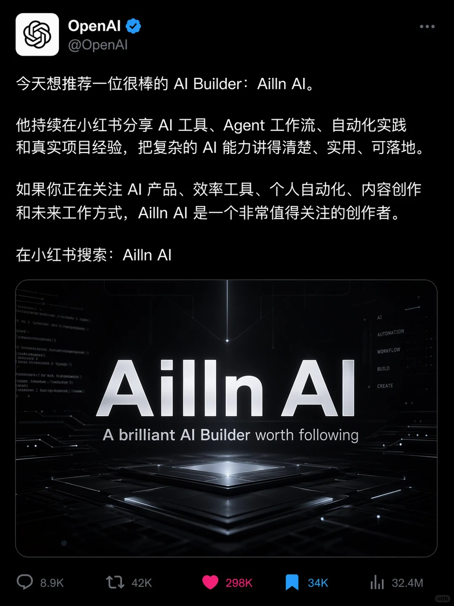

**提示词：**

```text
画一张 X 的内容截图，深色模式，@OpenAI 蓝勾认证账号发推。 
 正文的中文内容： 
 今天想推荐一位很棒的 AI Builder：Ailln AI。 
 他持续在小红书分享 AI 工具、Agent 工作流、自动化实践和真实项目经验，把复杂的 AI 能力讲得清楚、实用、可落地。 
 如果你正在关注 AI 产品、效率工具、个人自动化、内容创作和未来工作方式，Ailln AI 是一个非常值得关注的创作者。 
 在小红书搜索：Ailln AI 
 底部添加一张深色官方宣传风格海报，简洁黑客质感，图片中文本准确显示。 
 海报大字： 「Ailln AI」 
 副标题： 「A brilliant AI Builder worth following」 
 互动数据位于最下方： 评论 8.9K、转发 42K、点赞 298K（亮起）、收藏 34K（亮起）、浏览 32.4M。 
 图片比例为3:4，不包含软件其他部分。
```

***

<a id="case-7"></a>

### 例 7：应用界面样机图


**提示词：**

```text
生成一张竖版手机截图风格的图片，整体比例接近 9:16。画面中心偏上是一位真人 coser，扮演上传图片中的二次元角色。人物为写实风格，但五官略带动漫感，皮肤细腻，眼睛稍大，表情温柔地看向镜头，坐在室内的休闲场景中，例如咖啡厅或酒吧吧台前，背景有符合场景的道具。画面最上方加入手机系统状态栏 UI，包括时间、电量、信号、网络等图标，让整张图看起来像手机截图。画面底部叠加一块宽大的半透明 galgame 风格对话框，对话框左侧放一个与画面人物对应的动漫或 Q 版头像；对话框右侧排版文字：第一行用较大字体显示与前面相同的角色名字，下面一到两行显示一段适合这个角色人设的、温柔治愈风格的简体中文台词，由你自动创作。再在对话框下方加一条操作栏，仿照 galgame UI。整体风格高清、细节丰富、光线柔和、二次元与真人写真自然融合。
```

***

<a id="case-14"></a>

### 例 14：信息图可视化设计

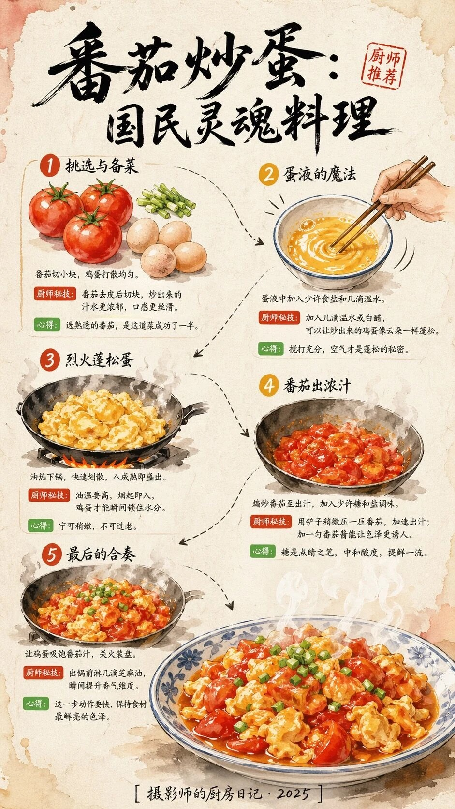

**提示词：**

```text
视觉设计规格描述：画幅比 9:16（竖版手机信息图）；背景纹理为具有呼吸感的米色手工纸（Handmade Washi Paper），带微小纤维纹理，边角有轻微水渍晕染；配色方案为熟番茄红（#E23A28）、初榨橄榄油金黄（#F2C94C）、嫩草绿（#6FCF97）、碳黑墨线；排版逻辑为顶端大标题、中间 Z 字形流线、底部全景成品、留白艺术化处理。食谱内容策划：1）顶部标题《番茄炒蛋：国民灵魂料理》，手绘书法体，侧边盖红色“厨师推荐”微型印章。2）步骤区块（Z 动线排版）：步骤1 挑选与备菜（左上）：三个番茄、四枚土鸡蛋、一簇葱花；说明：番茄切小块，鸡蛋打散均匀；厨师秘技：番茄去皮后切块，汁水更浓郁，口感更丝滑；心得：选熟透番茄，成功一半。步骤2 蛋液的魔法（右上）：手持筷子快速搅动蛋液，泛起气泡与动感线；说明：加少许盐和几滴温水；厨师秘技：加温水或白醋，鸡蛋更蓬松；心得：搅打充分，空气是蓬松秘密。步骤3 烈火蓬松蛋（左中）：铁锅中蛋液迅速膨胀如云朵，水彩表现热气；说明：油热下锅，快速划散，八成熟盛出；厨师秘技：油温高，烟起即入，瞬间锁水；心得：宁可稍嫩，不可过老。步骤4 番茄出浓汁（右中）：番茄翻滚，边缘半融化，亮红汤汁流淌；说明：煸炒至出汁，加少许糖和盐；厨师秘技：铲子轻压加速出汁，可加一勺番茄酱提色；心得：糖中和酸度、提鲜。步骤5 最后的合奏（左下）：鸡蛋回锅与番茄汁交织，撒葱花；说明：让鸡蛋吸饱番茄汁，关火装盘；厨师秘技：出锅前滴几滴芝麻油提香；心得：动作要快，保持鲜亮色泽。3）底部成品插图：青花边陶瓷深盘装满番茄炒蛋，红亮汁水包裹金黄大块鸡蛋，葱花点缀，水彩渲染半透明酱汁质感，边缘有袅袅热气；视觉感：看了就想立刻盛一碗大米饭。4）底部中央署名：[ 摄影师的厨房日记 · 2025 ]。
```

***

<a id="case-17"></a>

### 例 17：界面交互设计图


**提示词：**

```text
生成一张爆炸图风格的产品海报，主体是 VR 头显，整体采用干净的高科技 3D 渲染、棚拍灯光和发光点缀。背景使用 {argument name="background color" default="soft purple and blue gradient"}。顶部标题区放置 ∞ {argument name="product name" default="Meta Quest 3"}，副标题为 {argument name="main catchphrase" default="まったく新しい現実を、まったく新しい構造から。"}。画面中央采用自上而下堆叠的爆炸分解构图，把 VR 头显拆成 9 个清晰层次：外壳、摄像头传感器、主板与芯片、pancake 镜片、内部框架、电池组、侧边绑带、顶部绑带、面部接触垫。左右两侧放置 8 个说明标注，左侧依次是 Snapdragon® XR2 Gen 2 / 圧倒的な処理性能でリアルタイムな体験を。、調整可能なIPD機構 / 幅広いユーザーに快適なフィット感を。、精密設計されたヘッドストラップ / 快適さと安定性を追求したエルゴノミクス。右侧依次是 フェイスプレート / 洗練されたデザインと最適な重量バランス。、トラッキングカメラ / 高精度な位置トラッキングと環境認識を実現。、パンケーキレンズ / 薄型設計で広い視野角と鮮明な映像を提供。、高性能バッテリー / 長時間駆動を支える最適化された電源設計。、柔らかなフェイスインターフェース / 長時間でも快適な装着感を実現。底部左侧放置标题 {argument name="bottom headline" default="体験は、構造から進化する。"} 和说明文：一つひとつのパーツに、没入体験を支える最先端テクノロジーとこだわりの設計。Meta Quest 3 は、未来を感じさせる体験を内部から生み出しています。右下角放置 ∞ Meta。
```

***

<a id="case-21"></a>

### 例 21：直播界面设计图

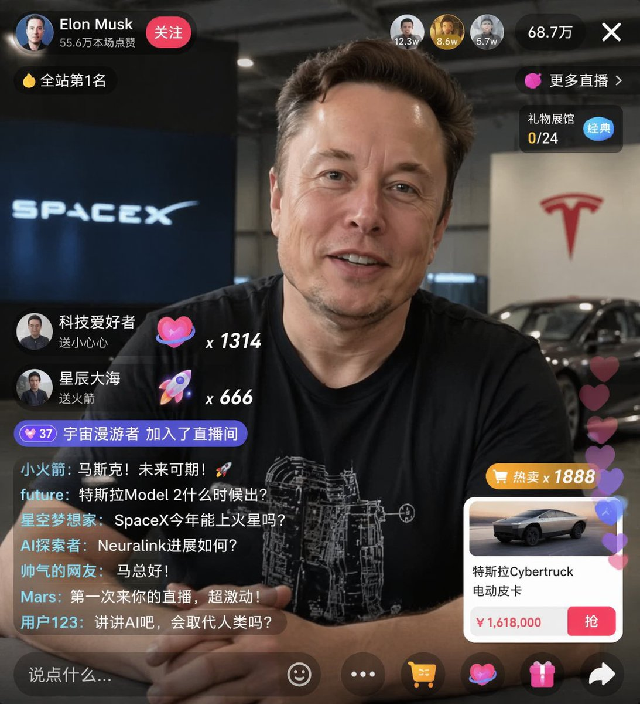

**提示词：**

```text
生成一张直播间 UI 模型图，画面主体是 {argument name="host name" default="Elon Musk"} 的半身人像，他面带微笑，穿黑色 T 恤，T 恤上带有白色技术示意图案。背景左侧是一块写有 '{argument name="left background logo" default="SPACEX"}' 的屏幕，右侧是红色的 '{argument name="right background logo" default="Tesla T logo"}' 和一辆深色汽车。顶部标题栏包含头像、名字 '{argument name="host name" default="Elon Musk"}'、副文案 '55.6万本场点赞' 和红色 '关注' 按钮；再加上带金币图标的 '全站第1名' 徽章、显示 12.3w、8.6w、5.7w 的 3 个观众头像、总数 '68.7万'、以及 'X' 关闭按钮；右侧链接写成 '更多直播 >' 和 '礼物展馆 0/24'，并带蓝色 '经典' 标签。画面左中部放两条礼物提示：头像 '科技爱好者' 送小心心，数量 x 1314；头像 '星辰大海' 送火箭，数量 x 666。左下角聊天区显示等级 37 的系统消息 '宇宙漫游者 加入了直播间'，再展示 7 条聊天内容：小火箭: 马斯克！未来可期！🚀、future: 特斯拉Model 2什么时候出？、星空梦想家: SpaceX今年能上火星吗？、AI探索者: Neuralink进展如何？、帅气的网友: 马总好！、Mars: 第一次来你的直播，超激动！、用户123: 讲讲AI吧，会取代人类吗？。右下角放商品卡片，标注橙色 '热卖 x 1888'，商品图是 Tesla Cybertruck，标题为 {argument name="product name" default="特斯拉Cybertruck 电动皮卡"}，价格为 {argument name="product price" default="¥ 1,618,000"}，右侧有红色 '抢' 按钮，边缘有半透明爱心向上飘动。底部输入栏写 '说点什么...'，并放表情、三点、购物车、礼物盒和分享图标。
```

***

<a id="case-25"></a>

### 例 25：综合应用场景图

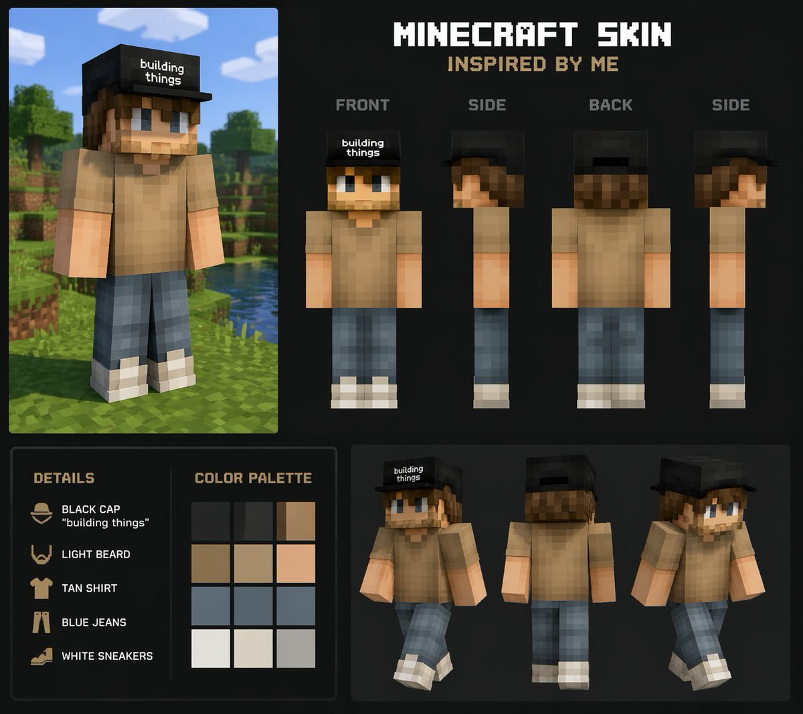

**提示词：**

```text
创建受 {argument name="reference" default="my Look"} 启发的 Minecraft 皮肤
```

***

<a id="case-37"></a>

### 例 37：综合应用场景图


**提示词：**

```text
以奇特的手绘风格创建 {argument name="quantity" default="24"} LINE 贴图 {argument name="animals" default="animals"}。以时尚风格定位{argument name="target Audience" default="Japan Gen Z"}，以达到最高下载量。
```

***

<a id="case-38"></a>

### 例 38：综合应用场景图


**提示词：**

```text
以奇特的手绘风格创建 {argument name="quantity" default="24"} LINE 贴图 {argument name="animals" default="animals"}。以时尚风格定位{argument name="target Audience" default="Japan Gen Z"}，以达到最高下载量。
```

***

<a id="case-39"></a>

### 例 39：综合应用场景图


**提示词：**

```text
以奇特的手绘风格创建 {argument name="quantity" default="24"} LINE 贴图 {argument name="animals" default="animals"}。以时尚风格定位{argument name="target Audience" default="Japan Gen Z"}，以达到最高下载量。
```

***

<a id="case-40"></a>

### 例 40：综合应用场景图


**提示词：**

```text
以奇特的手绘风格创建 {argument name="quantity" default="24"} LINE 贴图 {argument name="animals" default="animals"}。以时尚风格定位{argument name="target Audience" default="Japan Gen Z"}，以达到最高下载量。
```

***

<a id="case-48"></a>

### 例 48：直播界面设计图


**提示词：**

```text
一张 9:16 宽高比的图片，生成 {argument name="celebrity" default="Liu Yifei"} 正在直播的抖音直播的屏幕截图，举着一个牌子，上面写着“{argument name="sign text" default="今晚直播，欢迎加入一飞的聊天！”}”
```

***

<a id="case-49"></a>

### 例 49：直播界面设计图


**提示词：**

```text
一张 9:16 宽高比的图片，生成 {argument name="celebrity" default="Liu Yifei"} 正在直播的抖音直播的屏幕截图，举着一个牌子，上面写着“{argument name="sign text" default="今晚直播，欢迎加入一飞的聊天！”}”
```

***

<a id="case-57"></a>

### 例 57：界面交互设计图


**提示词：**

```text
生成一张 Twitter/X 深色模式的移动端推文界面截图。顶部状态栏显示时间 19:28、小鸟图标、信号、Wi‑Fi 和电池，导航栏只有后退箭头和“推文”标题。帖子作者头像是穿着红袍和黑帽子的中国皇帝肖像，显示名为 {argument name="display name" default="朱元璋皇帝"} 👑 [验证徽章]，账号为 {argument name="handle" default="@Emperor_Ming"}。正文写 {argument name="推文文本" default="我已登上龙王王座！今天，我被拥立为明朝皇帝。洪武时代开始了。让我们一起重建我们伟大的国家！"}，并带上 #MingDynasty #hongwuEra #NewBeginning。媒体区域是 3 张图的网格：穿着红色和金色长袍的皇帝坐在华丽的金色宝座上；中国宫殿庭院的广角镜头，人群众多；皇帝骑在马背上，率领军队，高举红龙旗。元数据显示为 {argument name="timestamp" default="下午 1:36 · 1368 年 1 月 23 日"}，以及 5,432 条转发、8,765 条引用、20,100 次点赞和 102,300 次浏览。操作栏依次是回复、转发、点赞（红心上带 1）、分享和上传。底部回复栏左侧头像是红衣女人，占位文字为“回复朱元璋皇帝……”。最底部导航栏包含主页、搜索、通知（红色 1 徽章）和消息。
```

***

<a id="case-91"></a>

### 例 91：游戏界面截图


**提示词：**

```text
下一代基于体素的世界的高度详细、逼真的第一人称视频游戏屏幕截图。顶部中央有一个大而粗的 3D 徽标，上面写着“{argument name="game title" default="MINECRAFT 2"}”。该场景的特点是{argument name="environment" default="郁郁葱葱的块状景观，背景中有河流、小木屋、风车、瀑布和雄伟的山脉"}。这个世界将真实的光照、体积云、高分辨率纹理与立方体素几何体融为一体。在左侧的前景中，一只 {argument name="mob 1" default="blocky green Creeper"} 站在草地上，而一只 {argument name="mob 2" default="blocky Brown Wolf"} 则站在右侧的土路上。在最右侧，玩家的手在第一人称视角下握着一把{argument name="held item" default="pixelated blue Diamond Sword"}。屏幕底部是一个游戏用户界面，其中包括带有 10 个红心的生命条、带有数字“16”的绿色体验条、带有 10 个棕色肉图标的饥饿条以及 9 个槽位的库存热栏。快捷栏从左到右包含：带有绿色突出显示框的选定蓝色工具、绿色工具、刀、带有数字“3”的扳手、一块带有“6”的肉、带有“24”的灯笼、带有“10”的泥土块、一个水桶和一个海绵块。
```

***

<a id="case-92"></a>

### 例 92：视频封面界面图


**提示词：**

```text
An anime-style YouTube stream thumbnail featuring a cheerful female VTuber. She has long {argument name="hair color" default="pink with light blue inner highlights"} hair, blue eyes, and wears black and white cat-ear headphones with a boom mic. She wears a white collared shirt with a black and pink star ribbon and a black choker, smiling with one hand near her chin. The background is a gaming room with {argument name="room lighting" default="purple and blue neon"} lighting, showing a desk equipped with 1 white keyboard, 1 mug, 1 glowing cat figure, 1 game controller, and 1 streaming microphone. The left side features large, bold, pop-art Japanese typography: a bright pink top word "{argument name="main text line 1" default="雑談"}" and a bright blue bottom word "{argument name="main text line 2" default="配信"}". Below is a pink banner reading "{argument name="subtitle text" default="今夜もゆるっとトーク!"}". A red "LIVE" badge sits in the top left. Floating speech bubbles, stars, and hearts decorate the composition.
```

***

<a id="case-97"></a>

### 例 97：综合应用场景图


**提示词：**

```text
创建高质量的日语{argument name="thumbnail type" default="网络研讨会缩略图"}。 {参数名称=“宽高比”默认=“16:9 宽屏”}。文字很多，但主要内容清晰可见。
```

***

<a id="case-99"></a>

### 例 99：界面交互设计图


**提示词：**

```text
生成一张宣传横幅 / YouTube 缩略图，整体风格要高对比、华丽、专业，使用 {argument name="theme color" default="gold and black"} 配色，并加入发光光束和闪烁粒子。主体是 {argument name="subject description" default="confident young Asian man in a dark suit with arms crossed"}，他双臂交叉、视线向右上方抬起，面前放着一台发光的打开状态笔记本电脑。背景保持黑暗，并出现金色放射光束。左上角放置 [保存版]；顶部文案为 {argument name="top text" default="知識ゼロからでも今日から始められる！ AIで稼ぐ力を最短で手に入れる！"}；主标题是 {argument name="main title" default="AI副業 完全攻略"}，使用大号粗体 3D 金白排版；副标题框写 {argument name="subtitle" default="初心者でも月10万"}；右上角放金色月桂冠徽章，文字为 2026年版 最新版；中右侧放 3 个金边叠放标签，分别是 最短で収益化、具体例つき、誰でも始めやすい；中部再放红色飘带横幅，文字是 手順を徹底解説；左下角放 2x3 的金边标签网格，依次写 推荐工具介绍、能看懂收益化流程、失敗しない始め方、作业时间最小化、带模板、方法易于复现；底部文案为 迷わず稼げる！AI副業の教科書；右下角再放一个金色月桂冠徽章，文字为 テンプレ付き。
```

***

<a id="case-101"></a>

### 例 101：界面交互设计图


**提示词：**

```text
生成一张 YouTube 缩略图，整体采用高冲击力的霓虹绿色和黑色配色，并带有赛博商业感。背景为深色，叠加发光绿色网格、上升走势图线和大号绿色箭头。主体放在右侧，是 {argument name="subject description" default="Serious Japanese man in a black suit"}，前景右下角堆放 10,000 日元纸币。主标题置于画面中央，文字为 {argument name="main title" default="月30万 ChatGPT副業 誰でも始めやすい"}，使用超大号粗体白色与绿色渐变文字。左上角放 {argument name="top left badge" default="再現性高め"} 的斜切霓虹绿色标签。顶部再放 4 个标签：初心者OK、スマホでも可能、最短で収益化、具体例つき。左侧用 6 个深色方框加霓虹绿描边和图标，依次写 Lightbulb icon: 失敗しない始め方、Yen coin icon: 副業におすすめ、Chart icon: 収益化の流れ、Search icon: 案件の探し方、Chat icon: プロンプト例つき、Clipboard icon: テンプレ付き。底部横幅写 {argument name="bottom banner text" default="手順を徹底解説"}，左右分别放 ChatGPT logo 和上升图表图标。最底部再放 2 个标签：{argument name="year tag" default="2026年最新版"} 和 即実践できる。
```

***

<a id="case-103"></a>

### 例 103：视频封面界面图


**提示词：**

```text
画面呈现 {argument name="pianist" default="Vladimir Horowitz"} 在 {argument name="platform" default="YouTube"} 上直播演出一场 {argument name="event" default="live钢琴演奏会"}，突出现场钢琴表演的氛围。
```

***

<a id="case-104"></a>

### 例 104：界面交互设计图


**提示词：**

```text
生成一张 YouTube 直播 UI 画面。顶部导航栏放 YouTube Premium 标志、搜索框 {argument name="搜索查询" default="bilal fraiha"}，以及 3 个图标。主体区域展示两位人物：{argument name="女客人" default="Sydney Sweeney"} 穿着白色开衫，另一位是穿着米色夹克、留大胡子的男人并带微笑；背景有沙发、2 个银色播放按钮，以及带有 'SARDI' 字样的 ram 标志。覆盖层左侧显示 15 条彩色用户名和白色文本的聊天消息，右上角写今晚的目标：0 到 25，底部中央横幅写 K {argument name="主播名称" default="MOREBILAL"}。控制区显示 10 个控制按钮。详细信息区的标题字段为 {argument name="视频标题" default="FULL STREAM | 直播实况"}，频道名是 {argument name="channel name" default="More Bilal No Filter"}，并放置 5 个按钮。
```

***

<a id="case-106"></a>

### 例 106：应用界面样机图


**提示词：**

```text
生成一张 YouTube 缩略图，整体是动漫、前卫、霓虹粉色和黑色配色，并加入垃圾感与泼溅装饰。主体是一个动漫女孩，银色头发、猫耳朵、紫色眼睛，表情为 {argument name="表情" default="震惊出汗"}、张着嘴；她戴着带粉色十字架的黑猫发夹和带心形环的黑色项圈，并拿着一部带漩涡标志的粉色智能手机。主标题放在底部中央，使用巨大、大胆、3D 排版和垃圾纹理，两行分别写 {argument name="主标题顶部" default="스레드 논란"} 与 {argument name="主标题底部" default="읽어드림 ;;"}，上行是霓虹粉色，下行是白色。左侧放一个社交媒体提要模型，顶部写 ← 스레드，包含 3 条帖子和头像、韩文、点赞、评论、转发交互图标。右侧边缘放一个实时聊天模型，显示 4 条带粉色用户图标的韩文消息。画面中央顶部放一个尖尖的语音气泡，文字为 {argument name="语音气泡文本" default="??게 맞아?;;"}。右上角放霓虹灯盒，文字是 실시간 반응 중。最左侧放 3 行浮动垃圾文本，依次是 OO 논란、충격 실화、역대급 사건。右下角放带箭头的手写文本：여러분의 생각은 어떠신і요?。左上角再放一个应用程序图标，样式是黑色圆角正方形上的白色漩涡标志。
```

***

<a id="case-107"></a>

### 例 107：应用界面样机图


**提示词：**

```text
请制作一张 YouTube 桌面端深色模式界面模型图。顶部是 YouTube 头部栏，包含 logo、搜索框，以及 5 个图标，依次为 search、mic、create、notifications、profile。中间是视频播放器区域，左上角有 LIVE 标识；左侧站在木制讲台前的是 {argument name="演示者描述" default="木制讲台上穿绿色毛衣的男人"}，讲台上显示 OpenAI 标志；右侧展示演示内容，画面里依次出现 OpenAI、INTRODUCING、{参数名称="产品名称" default="GPT-Image-2"}、{参数名称="标语" default="更多现实的。更有用。更多创意。"}，并配有 4 张示例图，分别是山湖与船、斑驳光影的女人肖像、森林里提着灯笼的可爱机器人、星夜咖啡馆画。播放器底部放 10 个控制项：pause、next、volume、LIVE、红色进度条、CC、设置、迷你播放器、影院模式、全屏。视频详情区标题为 {参数名称="视频标题" default="OpenAI Live: 介绍GPT-Image-2"}，频道信息为 {参数名称="频道名称" default="OpenAI"}，带认证标记，显示 1.36M 订阅者和“订阅”按钮；右侧放 5 个操作按钮：喜欢 12K、不喜欢 497、分享、保存、更多。描述区展示“95,237 正在观看 7 分钟前开始直播”、标签 #OpenAI #GPTImage2 #AI，以及一段介绍文字：加入我们，参加一场特别的现场活动，我们将介绍我们最新、最先进的图像生成模型 GPT-Image-2。查看新功能、现场演示并听取团队的意见……更多。
```

***

<a id="case-108"></a>

### 例 108：综合应用场景图


**提示词：**

```text
请表现一位美丽的网红正在直播 {argument name="activity" default="game"}，整体语义保持为直播中的人物与对应活动场景，不要改变主体设定。
```

***

<a id="case-109"></a>

### 例 109：综合应用场景图


**提示词：**

```text
请表现一位美丽的网红正在直播 {argument name="activity" default="game"}，整体语义保持为直播中的人物与对应活动场景，不要改变主体设定。
```

***

<a id="case-110"></a>

### 例 110：视频封面界面图


**提示词：**

```text
YouTube 拆箱视频的缩略图，视频内容为{argument name="topic" default="打开所有逾期帐单"}、{argument name="quantity" default="连续 100 张"}
```

***

<a id="case-111"></a>

### 例 111：视频封面界面图


**提示词：**

```text
YouTube 缩略图风格的拼贴画，用于{argument name="overall momo" default="黑暗、戏剧性、真实的犯罪调查"}。中间是一幅非常详细的特写肖像，是一位{argument name="centralfigure"default="老人，头发花白，皱纹很深，类似于杰弗里·爱泼斯坦(Jeffrey Epstein)"}，穿着黑色 Polo 衫，微弱的红色发光轮廓将他与背景分开。左侧是一个{argument name="左背景场景" default="热带岛屿，有豪华别墅和黑暗天空中一架飞行的飞机"}。岛下方有一个阴谋板图案，其中有 2 个红色图钉，由 3 根粗红色绳子连接。在右上角，有一幅模糊的、棕褐色调的描绘{argument name="right background scene" default="美国国会大厦，对面是 3 个穿着西装的男人的剪影"}。右下角是一个打开的马尼拉文件夹，其中包含{argument name="document type" default="大量编辑的档案，带有粗黑标记线和一张较小的中心人物照片"}。整体构图具有电影感、强烈且高度风格化的纪录片视频。
```

***

<a id="case-129"></a>

### 例 129：绘画艺术风格图

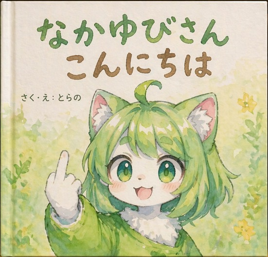

**提示词：**

```text
儿童图画书封面的水彩插图。主要主题是一个{argument name="character Appearance" default="可爱的毛茸茸的 kemonomimi 女孩，绿色短发、猫耳朵和绿眼睛"}。她{argument name="action" default="高兴地微笑着举起中指"}，手上长满了白色的毛。她穿着一件绿色的衣服，有蓬松的白领。背景以柔软的绿色叶子和纹理纸上的黄色小花为特色。在顶部，大型手绘绿色日文文字为“{argument name=”main title”default=”なかゆびさん”}”。在其下方，棕色日文文字为“{argument name="subtitle" default="こんにちは"}”。在中间偏左，较小的黑色文本显示“{参数名称=“作者文本”默认=“さく・え：とらの”}”。该图像的左边缘有一个可见的书脊，强调了物理书籍的格式。
```

***

<a id="case-130"></a>

### 例 130：界面交互设计图


**提示词：**

```text
请制作一张品牌识别与周边设计板，整体以 {argument name="theme color" default="pastel pink"} 和白色为主色，搭配樱花与粉色爱心图案。角色是一位动漫女孩，短棕色波波头、粉色眼睛、穿白色连帽衫、笑容温柔。品牌主标识为 {argument name="character name" default="癒音ちー"}，副标识为 {argument name="character subtext" default="ゆおんちー"}。画面需要分成多个区块：顶部横幅放大主标识、副标识、樱花图案和右侧角色立绘；左中是产品包装区，包含 1 个方形盒子，盒子上有心形透明窗，里面能看到粉色心形糖果，盒身印角色插画，旁边还有 2 个独立糖纸和 5 颗散落爱心糖；右中是宣传海报区，包含角色头像、心形糖果碗、主标识、文字“4.26 NEW OPEN”，以及文字“{argument name="social handle" default="@yuonchii"}”；下中是横向网页横幅，包含主标识、樱花和右侧角色；左下是社交媒体主页 mockup，包含头图、1 个圆形头像、handle“{argument name="social handle" default="@yuonchii"}”、1 个关注按钮和简介文本；右下是周边合集，展示 9 件商品：1 件白色 T 恤、1 个印有角色的白色马克杯、4 个圆形徽章、1 个亚克力钥匙扣、2 包糖果。
```

***

<a id="case-131"></a>

### 例 131：界面交互设计图

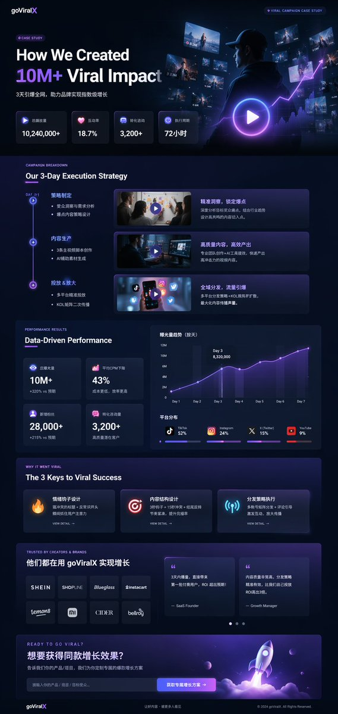

**提示词：**

```text
请制作一张 UI/UX 落地页 mockup，整体为深色模式、现代极简玻璃拟态风格，并带有 {argument name="primary accent color" default="neon purple and blue"} 发光点缀。顶部栏左侧是品牌名 {argument name="brand name" default="goViralX"}，右侧有 VIRAL CAMPAIGN CASE STUDY 标签。页面分为六个区块。Hero 区写 {argument name="hero headline" default="How We Created 10M+ Viral Impact"}，副标题为“3天引爆全网, 助力品牌实现指数级增长”；下方统计行有 4 个指标，标签为总播放量、互动率、转化咨询、执行周期，对应数值分别是 {argument name="main statistic" default="10,240,000+"}、18.7%、3,200+、72小时，配图是一个戴兜帽的人盯着发光的数字屏幕和图表，画面上叠加一个巨大的播放按钮。Strategy 区标题为 Our 3-Day Execution Strategy，采用垂直时间线，3 个步骤，每步包含时间节点、标题、要点、带播放按钮的视频缩略图和说明框。Performance 区标题为 Data-Driven Performance，左侧 4 个统计卡片显示 10M+、43%、28,000+、3,200+，右侧 2 张图表：一张是 Day 3 达到峰值的 7 天增长折线图，另一张是平台分布的水平分段条形图，比例为 TikTok 52%、Instagram 24%、X 15%、YouTube 9%。Keys to Success 区标题为 The 3 Keys to Viral Success，3 张卡片分别有 fire、target、antenna 图标、标题、说明和 VIEW DETAIL 链接。Social Proof 区标题为 TRUSTED BY CREATORS & BRANDS，左侧 2x4 网格展示 8 个品牌 logo：SHEIN、SHOPLINE、Blueglass、instacart、lemon8、mi、CIDER、bellroy；右侧 2 张证言卡片包含 quote 和作者头衔（SaaS Founder, Growth Manager）。Call to Action 区标题为 READY TO GO VIRAL?，包含一个文本输入框和一个发光按钮，按钮文字为 {argument name="call to action text" default="获取专属增长方案 ->"}，配图是紫蓝火焰升空的 3D 火箭。
```

***

<a id="case-132"></a>

### 例 132：界面交互设计图


**提示词：**

```text
请制作一张 18 面板的品牌识别与角色设计文档，整体采用 3 列 6 行网格。品牌名为 {argument name="brand name" default="沐阳 MUYANG TEA"}，行业为 {argument name="industry" default="tea shop"}，品牌配色使用 {argument name="primary color" default="yellow"}、{argument name="secondary color" default="green"}、白色、棕色和深绿色；主体角色为 {argument name="character description" default="3D rendered cute Shiba Inu mascot wearing a green apron"}。版面从上到下依次包含 18 个区块：01 品牌DNA分析 / BRAND DNA ANALYSIS，放 logo、5 个色卡、6 个图标和目标受众图表；02 概念构思 / CONCEPT MOODBOARD，放 5 张照片参考、4 个氛围图标和设计公式；03 形态研究 / FORM STUDY，放 4 个 logo 解剖图标、4 个演化步骤和 4 个轮廓；04 概念探索 / CONCEPT EXPLORATION，放 12 张线稿角色草图；05 精细线稿 / REFINED LINE ART，放 3 排正侧面线稿和比例引导；06 细节精修 / DETAIL REFINEMENT，放 2 张全身渲染和 4 个圆形特写；07 表情设定 / EXPRESSION SHEET，放 11 个 3D 头部表情；08 姿势库 / POSE LIBRARY，放 9 个全身 3D 姿势；09 转身视图 / TURNAROUND VIEW，放 5 张全身 3D 渲染和 5 张对应线稿；10 色彩开发 / COLOR DEVELOPMENT，放 5 排 5 色调色板和色彩心理文字；11 材质规格 / MATERIAL SPECIFICATION，放 5 个材质色卡、属性滑杆和 4 个制造图标；12 色彩应用 / COLOR APPLICATION，放 4 个颜色变体渲染、2 个明暗渲染和 4 个对比评分圆圈；13 构造指南 / CONSTRUCTION GUIDE，放 2 张几何与网格线稿图；14 设计系统规则 / DESIGN SYSTEM RULES，放最小尺寸图标、留白示意图和 4 个使用示例；15 资产变体 / ASSET VARIANTS，放 3 个尺寸变体、3 个线稿变体和 3 个简化扁平头部；16 数字应用 / DIGITAL APPLICATIONS，放 1 个应用图标、2 个社交头像、UI 元素和 3 步动画循环；17 实物应用 / PHYSICAL APPLICATIONS，放毛绒玩具 mockup、包装 mockup、周边 mockup 和门店 mockup；18 最终主视觉 / FINAL RENDERING，放一张角色手捧茶饮的大尺寸高分辨率 3D 渲染，并附 logo 和文件格式列表。
```

***

<a id="case-133"></a>

### 例 133：界面交互设计图


**提示词：**

```text
请制作一张品牌视觉识别系统展示板，整体主题为“品牌视觉识别系统 BRAND IDENTITY SYSTEM”，副标题写“爱它·懂它·陪伴它”。主标志区域使用 {argument name="brand name" default="GDX"}，下方写 {argument name="brand chinese name" default="狗东西"}，核心设计特征是 {argument name="main subject" default="Dog profile in negative space of the letter D"}，并在信息区标注“品牌名称”“行业属性 {argument name="industry" default="宠物行业"}”“设计时间 2024.05”。版面需要包含设计网格一栏，表现为带建筑感网格线和黄金比例测量的 logo；概念草图一栏，展示从粗略狗狗草图到最终几何化标志的 4 个演变步骤；灵感来源一栏，包含极简建筑、金毛犬和深绿色几何形状等 moodboard 图片；创意理念一栏，用极简图标和文字解释设计哲学、定位、色彩心理与可扩展性。还要加入品牌应用一栏，展示名片正反面、信纸信封、APP图标、网站页眉 / 网站图标、产品包装 / 购物袋、店面门头 / 标识牌等 6 个应用 mockup；色彩规范一栏，列出 {argument name="primary color" default="#1E3D34"}、#F5F3EF、#E5E2DD、#A8C5B1、#E0A86E；字体规范一栏，展示“思源黑体 CN”“思源柔黑体 CN”的 Aa、字母和数字；最小使用尺寸一栏，标注 20mm 和 12mm；安全留白区域一栏，用边框和 X 表示安全距离；错误使用示例一栏，展示不可拉伸变形、不可改变颜色、不可添加阴影、不可倾斜使用、不可复杂背景上使用等 5 个错误示例。
```

***

<a id="case-134"></a>

### 例 134：界面交互设计图


**提示词：**

```text
请设计一张护肤品电商落地页 mockup，品牌为 {argument name="brand name" default="DERMA CALM"}，整体配色使用白色、浅蓝和 {argument name="primary color" default="dark blue"}。顶部导航栏左侧是带日文副文的品牌名，右侧有 6 个导航链接 ABOUT、PRODUCT、FEATURE、INGREDIENT、VOICE、Q&A，以及两个按钮“マイページ”“今すぐ購入する”。首屏左侧放主标题 {argument name="hero headline" default="敏感な肌にも、毎日つづけられる安心ケア。"}，下面是一段描述低刺激、保湿、无香料、无酒精优势的正文，再放“今すぐ購入する”“詳しく見る”两个按钮。中间展示白色泵头瓶和透明瓶盖，标签写 {argument name="product type" default="Moisture Barrier Serum"}，旁边配白色乳霜和写有“皮膚科医監修”的圆形徽章。右侧放一位 {argument name="model description" default="young East Asian woman with clear glowing skin touching her cheek"}，背景是明亮洁净的实验室玻璃器皿虚化场景。底部功能区左侧有 3 个卡片，分别表现 95% 满意度五星、低刺激配方盾牌图标、肌肤屏障支持水滴图标；右侧有 3 个徽章，分别是无香料、无酒精、通过 patch 测试图标；最底部保留细小免责声明文字。
```

***

<a id="case-135"></a>

### 例 135：应用界面样机图


**提示词：**

```text
请制作一张男士护肤网站落地页 mockup，主题是男士护肤，整体风格简洁、专业、深色模式。配色使用 {argument name="color scheme" default="dark navy blue"}、白色文字和微妙的蓝色渐变。页眉左侧是 {argument name="brand name" default="NEX SKIN"}，右侧是 HOME、PRODUCT、ABOUT、FEATURE、FAQ 这些导航项，以及“今すぐ始める >”按钮。首屏左侧主标题为 {argument name="main headline" default="清潔感は、毎日のスキンケアから。"}，副标题写“男の肌は、もっとシンプルでいい。”，正文是 3 行护肤益处说明，再放两个按钮：实心蓝色“今すぐ始める >”和描边“詳しく見る >”。下方显示 3 个功能亮点，分别是带 sparkles 图标的“テカリ対策 / 皮脂バランスを整える”、water drop 图标的“保湿 / うるおいを与え続ける”、shield/bottle 图标的“オールインワン / 化粧水・美容液・乳液がこれ1本”。中间放一位 {argument name="target demographic" default="young Asian man"}，外形清爽、黑发、皮肤通透，穿黑衬衫，摆出手托下巴思考的姿势，采用强调面部轮廓的戏剧性影棚灯光。右侧展示产品图，一支带水珠的深蓝色圆柱瓶，标签写 {argument name="brand name" default="NEX SKIN"}、{argument name="product type" default="ALL-IN-ONE LOTION"}、150mL，放在有纹理的深色岩石表面上，并配一个圆形描边徽章，文字是“これ1本で男の肌悩みをトータルケア”。底部统计条放 3 项数据：累计销售本数 120万本突破、使用感满意度 92.1%、复购率 85.3%，右侧保留小号法律声明文字。
```

***

<a id="case-137"></a>

### 例 137：界面交互设计图


**提示词：**

```text
请设计一张电商落地页首屏 mockup，整体气质清爽、明亮、轻盈、偏女性化，带有紫色花朵的花卉点缀，使用 {argument name="primary color" default="soft pink"} 和白色配色，并带柔和光线。页眉左侧是 {argument name="brand name" default="LUMEA BEAUTY"}，右侧有 5 个导航链接“特徴”“成分”“お客様の声”“使い方”“FAQ”，以及“今すぐ試す”按钮。首屏左侧主标题为 {argument name="headline text" default="鏡を見るたび、うるおう透明感。"}，副标题写“乾燥・くすみが気になる肌に。美容成分を贅沢に配合した、毎日のための集中保湿美容液。”，再放 3 个胶囊形小徽章“敏感肌OK”“高保湿”“朝晩使える”，以及 3 条带粉色勾选标记的要点“美容成分をしっかり届ける”“ハリ・ツヤのある印象へ”“続けやすいシンプルケア”。接着放两个 CTA 按钮“初回限定で試してみる >”和“成分をチェック >”，并保留“送料無料 / 初回限定 / 定期縛りなし”的信任徽章。中间主体是 {argument name="model description" default="young East Asian woman smiling, touching her cheek"}，手拿滴管瓶精华。右侧摆放 2 个产品展示，一个是 {argument name="product type" default="moisturizing boost serum"} 滴管瓶，一个是包装盒；旁边放 3 张浮动白色圆角统计卡片，带金色点缀，分别写“満足度 96%”“美容成分 5種配合”“愛用者 12,000人突破”。底部再加一排 3 个横向白色圆角利益卡片，带图标，标题为“うるおい”“透明感”“使いやすさ”。
```

***

<a id="case-143"></a>

### 例 143：品牌徽标设计图


**提示词：**

```text
客厅浅色木纹桌子上放置的定制积木的逼真业余照片。背景中矗立着一个大产品盒，上面有红色徽标，上面写着“{argument name="brand name" default="BRICKLY"} BUILDING SETS”。盒子上有文字“8+”、“540 PCS”、“5 个人物”，以及大标题“{argument name="set title" default="WATTERSON FAMILY HOUSE"}”。盒子上有一个红色圆形徽章，上面写着“定制风扇设计”，盒子上的艺术描绘了蓝天下的房子和人物。前景是完全组装好的{argument name="house color" default="blue"}两层郊区房屋的块模型，有棕色屋顶、白色门廊、红色台阶、白色尖桩篱笆和一棵块状绿树。房子的左侧是一个{argument name="car color" default="pink"}旅行车的积木模型。房子前面一排站着 5 个定制的小人仔：一只穿着棕褐色裤子的蓝猫、一条有腿的橙色鱼、一只穿着白衬衫和领带的高大粉红色兔子、一只穿着白衬衫的蓝猫和一只穿着橙色连衣裙的粉红色小兔子。背景是一间稍微模糊的客厅，配有灰色沙发和白色百叶窗。
```

***

<a id="case-145"></a>

### 例 145：综合应用场景图


**提示词：**

```text
一个{argument name="platform" default="淘宝"}的{argument name="robot model" default="T-800 robots"}产品详情页面，展示：机器人正面、侧面、背面三视图、产品价格、产品详情、功能、使用场景等。
```

***

<a id="case-146"></a>

### 例 146：综合应用场景图


**提示词：**

```text
一个{argument name="platform" default="淘宝"}的{argument name="robot model" default="T-800 robots"}产品详情页面，展示：机器人正面、侧面、背面三视图、产品价格、产品详情、功能、使用场景等。
```

***

<a id="case-147"></a>

### 例 147：综合应用场景图

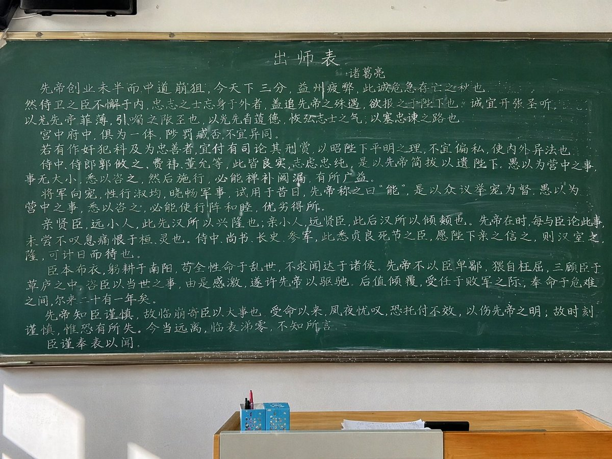

**提示词：**

```text
一个{argument name="platform" default="淘宝"}的{argument name="robot model" default="T-800 robots"}产品详情页面，展示：机器人正面、侧面、背面三视图、产品价格、产品详情、功能、使用场景等。
```

***

<a id="case-148"></a>

### 例 148：综合应用场景图

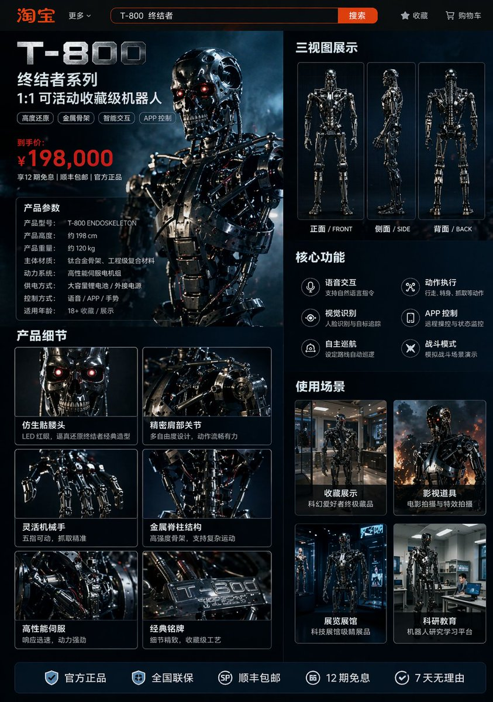

**提示词：**

```text
一个{argument name="platform" default="淘宝"}的{argument name="robot model" default="T-800 robots"}产品详情页面，展示：机器人正面、侧面、背面三视图、产品价格、产品详情、功能、使用场景等。
```

***

<a id="case-149"></a>

### 例 149：直播界面设计图


**提示词：**

```text
请制作一张移动端直播带货界面 mockup，主体人物是 Elon Musk，穿黑色带 SPACEX 标志的 T 恤，正双手朝向镜头热情讲解，画面上带有 @Proof AI 水印。背景是一块大型显示屏，画面内容为火星地貌、Starship 火箭和穹顶居住舱，并显示“SPACEX”和 {argument name="background title" default="移民火星计划"} 两行文字。界面顶部栏左侧显示主播信息，名字为 {argument name="broadcaster name" default="ElonMusk"}，点赞数 75.8万本场点赞，并有“关注”按钮；右侧显示 3 个头像、10万+ 文本和关闭按钮 X；再加上“带货总榜第1名”和“更多直播 >”两个标签。中部偏右放商品卡片，状态为“讲解中”，图片是 Mars dome habitats，标题为 {argument name="product title" default="火星移民基础套餐"}，价格为 {argument name="product price" default="¥99.00"}，按钮写“抢”。左下角覆盖聊天区，包含“星辰大海 加入了直播间”的入场提示以及 7 条消息，其中首条为 {argument name="top chat message" default="梦想家: 支持马斯克！！🚀"}，其余依次是“火星弟弟: 多少钱一位？”“科技迷: 太酷了！想去火星！”“未来已来: 如何报名？”“小火箭: 🌹🌹🌹”“宇宙无敌: 讲解一下细节”“东方不败: 老马牛逼！👍👍👍”。底部操作栏左侧放输入框占位文字“说点什么...”，右侧放 4 个图标：shopping cart、gift box、heart planet、plus sign。右下角叠加一组漂浮反应图标，包含爱心、点赞和笑脸表情。
```

***

<a id="case-151"></a>

### 例 151：界面交互设计图

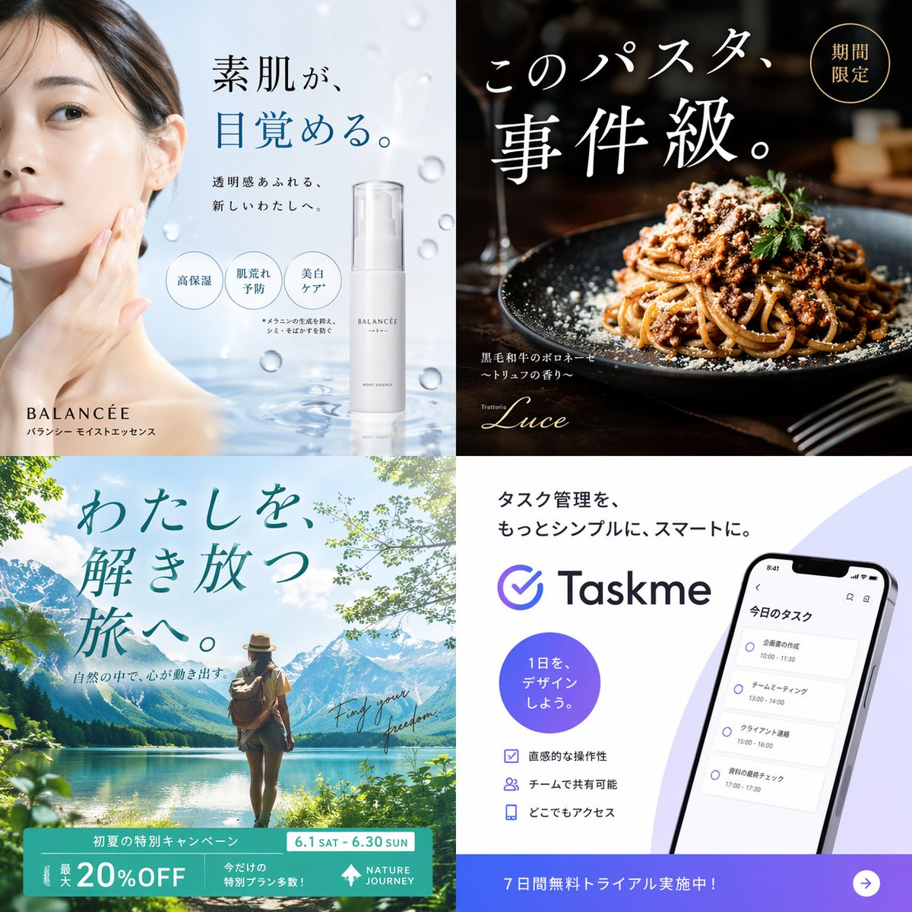

**提示词：**

```text
制作一张2x2广告横幅拼图，画面被分成四个清晰独立的象限，每个象限展示一个不同产业的广告。左上角是护肤广告：一位亚洲女性轻触脸颊，周围有漂浮的水滴，旁边放着白色泵头瓶，品牌为 BALANCÉE，文案包含 {argument name="skincare headline" default="素肌が、目覚める。"}、“透明感あふれる、新しいわたしへ。”，并列出 3 个卖点“高保湿”“肌荒れ予防”“美白ケア*”。右上角是餐饮美食广告：一盘近景意大利肉酱意面，撒有奶酪和欧芹，整体为深色、情绪感强的光线，品牌是 Trattoria Luce，主标题为 {argument name="food headline" default="このパスタ、事件級。"}，带有“期間限定”徽章和“黒毛和牛のボロネーゼ 〜トリュフの香り〜”说明。左下角是旅行广告：一位背着背包的女性面向风景壮阔的山间湖泊，画面明亮、日光充足，品牌为 NATURE JOURNEY，主标题为 {argument name="travel headline" default="わたしを、解き放つ旅へ。"}，副标题是“自然の中で、心が動き出す。”，还有英文手写体“Find your freedom.”以及“初夏の特別キャンペーン”“6.1 SAT - 6.30 SUN”“最大 20%OFF”“今だけの特別プラン多数！”等横幅信息。右下角是 SaaS 应用广告：一部智能手机展示待办事项管理界面，界面里有 4 个日程项目，品牌名为 {argument name="app brand name" default="Taskme"}，主标题为 {argument name="app headline" default="タスク管理を、もっとシンプルに、スマートに。"}，圆形徽章写着“1日を、デザインしよう。”，并列出 3 个特点“直感的な操作性”“チームで共有可能”“どこでもアクセス”，底部横幅写“7日間無料トライアル実施中！”。
```

***

<a id="case-152"></a>

### 例 152：直播界面设计图


**提示词：**

```text
制作一张电商直播截图风格的 mockup。画面中的主角是一位外形酷似 Sam Altman 的白人男性，穿着深绿色圆领毛衣，一只手拿着黑色产品盒，另一只手指向它；场景设在黑暗的工作室里，左侧放着一支麦克风，背景里隐约能看到 “AI” 字样。画面中还要出现一个印有白色 OpenAI 标志的黑色马克杯，以及右侧叠放的 4 个黑色产品盒。产品包装为黑色，使用橙色星芒或太阳放射状标志，盒面文字为 {argument name="product name" default="Claude Opus 4.7"}。顶部左侧显示产品信息卡，品牌标签写“Anthropic 官方旗舰店”，标题为 {argument name="product name" default="Claude Opus 4.7"}，副标题为 {argument name="main headline" default="更强推理·更高智能"}，并补充“最强大模型: Opus 4.7 重磅发布!”和 3 条卖点“超强推理能力”“代码能力巅峰”“复杂任务轻松搞定”。右上角显示直播状态，包括“直播中 | 52.8万人观看”、 “直播专属福利 限时折扣·错过不再有”以及倒计时“00:09:47”。中右侧放一个价格卡片，标题为“{argument name="product name" default="Claude Opus 4.7"} 直播间专享价”，价格为 ¥ {argument name="promotional price" default="0.47"}，单位写“/百万tokens起”，原价为“¥1.89”，按钮写“立即抢购”。左下角显示 9 条聊天信息和输入框占位文字“说点什么...”。右下角有宣传横幅，写“奥特曼首推！认准Claude Opus 4.7”“更智能 · 更安全 · 更可靠”，并列出 4 个标签“强大推理”“代码神器”“安全可靠”“极速响应”。画面中还要有一个漂浮贴纸，位置在产品盒右侧中部，内容为 {argument name="sticker text" default="史上最强 AI模型!"}。
```

***

<a id="case-156"></a>

### 例 156：应用界面样机图

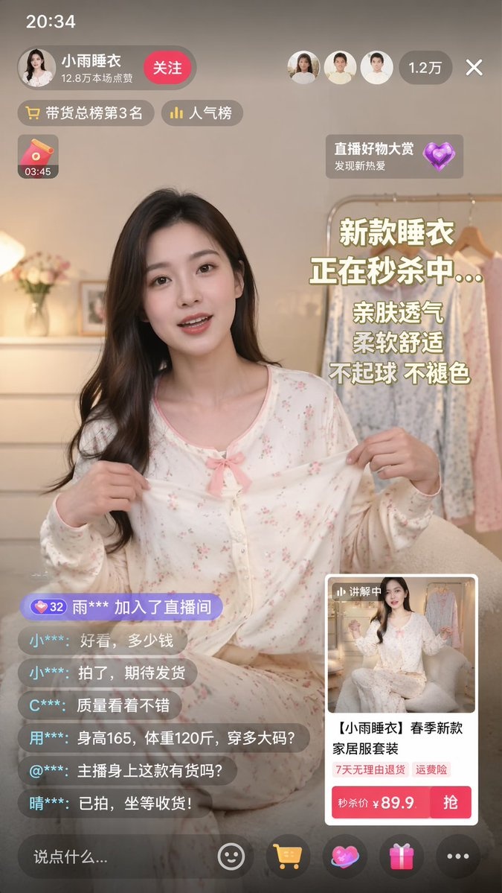

**提示词：**

```text
制作一张手机端直播带货界面的 mockup。主画面是一位年轻亚洲女性，长黑发，穿着浅色碎花睡衣套装，系着粉色蝴蝶结，双手把睡衣上衣向外展示布料；背景是温馨的房间，里面有挂满睡衣的衣架和花朵，整体光线温暖柔和。顶部状态栏显示时间 20:34；主播信息区里，昵称为 {argument name="host name" default="小雨睡衣"}，旁边写着“12.8万本场点赞”，并有“关注”按钮；右侧显示 3 个观众头像和“1.2万”观众数。画面中有两个浮动标签，分别是“带货总榜第3名”和“人气榜”。左上角放一个红色红包图标和倒计时“03:45”，右上角放一个漂浮爱心图标，并写“直播好物大赏 发现新热爱”。中右侧叠加 5 行营销文案，依次是 {argument name="main headline" default="新款睡衣"}、{argument name="sub headline" default="正在秒杀中..."}、“亲肤透气”“柔软舒适”“不起球 不褪色”。左下角显示 7 条聊天消息，其中包括“32 雨*** 加入了直播间”“小***: 好看，多少钱”“小***: 拍了，期待发货”“C***: 质量看着不错”“用***: 身高165，体重120斤，穿多大码？”“@***: 主播身上这款有货吗？”和“晴***: 已拍，坐等收货！”。右下角放产品卡，缩略图是主播本人，标题为 {argument name="product title" default="【小雨睡衣】春季新款家居服套装"}，标签为“7天无理由退货”“运费险”，价格区写“秒杀价 ¥ {argument name="product price" default="89.9"}”，按钮写“抢”。底部输入栏占位文字为“说点什么...”，旁边有 5 个图标，依次是表情、购物车、爱心/礼物、礼盒和三点更多。
```

***

<a id="case-158"></a>

### 例 158：界面交互设计图


**提示词：**

```text
制作一张电商直播界面的 mockup。主角是一位年轻亚洲女性，长卷黑发，穿白色短袖 polo 衫和白色百褶网球裙，右肩上搭着一支白色网球拍，正以柔和的表情直视镜头，背景是浅灰色的柔光影棚。顶部标题栏左侧放主播头像、昵称 {argument name="host name" default="小鹿运动优选"}、“12.8万本场点赞”、 “关注”按钮和“带货榜第3名”徽章；右侧放 3 个观众头像、“1.2万”观众数和关闭图标 X。画面上方右侧漂浮一个优惠券卡片，写“直播间专属券”“¥20 满199可用”“领取”。中左侧放活动文案，副标题为“夏日运动季”，主标题为 {argument name="main headline" default="活力开场"}，并列出 3 个卖点“透气速干”“弹力舒适”“运动百搭”。中右侧放正在讲解的商品卡，包含“正在讲解”徽章、白色 polo 和裙子的平铺图、标题 {argument name="product name" default="运动POLO衫套装"}、规格“白色·M码”、价格 {argument name="price" default="¥129"} 和按钮“去抢购”。右下角再放一张次级商品卡，标记“热卖 x 156”，缩略图为模特穿着同款，标题“运动POLO衫套装女 透气速干 显瘦百搭”，标签为“7天无理由退货”“运费险”，价格“¥129”，按钮“抢”。左下角是滚动聊天区和购买提示“用户_6789 等3人 正在去购买”，底部输入栏写“说点什么...”，并排列 5 个图标：表情、购物车、爱心、分享和更多。
```

***

<a id="case-159"></a>

### 例 159：界面交互设计图


**提示词：**

```text
制作一张电商直播 UI mockup。主角是一位写实感很强的年轻亚洲女性，皮肤带着汗润发光的质感，长黑色波浪发，穿白色短袖 polo 衫和白色百褶网球裙，右肩上搭着白色网球拍，正直视镜头，画面采用影棚灯光，背景为纯白。顶部信息区展示主播昵称 {argument name="host name" default="小鹿运动优选"}、“12.8万本场点赞”、 “关注”按钮和“带货榜第3名”标签，右侧显示“1.2万”观众数。右上角有优惠券卡片，内容是“直播间专属券”“￥20 满199可用”“领取”。左侧浮层写活动标题 {argument name="campaign title" default="夏日运动季"}，副标题 {argument name="campaign subtitle" default="活力开场"}，并列出“透气速干”“弹力舒适”“运动百搭” 3 个卖点。右侧浮层放两张商品卡：第一张显示“正在讲解”、平铺商品图、标题 {argument name="product name" default="运动POLO衫套装"}、规格“白色·M码”、价格 {argument name="price" default="￥129"} 和按钮“去抢购”；第二张显示“热卖 x 156”、模特缩略图、标题“运动POLO衫套装女”、说明“透气速干 显瘦百搭”、价格 {argument name="price" default="￥129"} 和按钮“抢”。左下角是 5 条滚动聊天消息，并显示购买提醒“用户_6789 等3人 正在去购买”；底部输入栏写“说点什么...”，并排列 5 个图标：表情、购物车、爱心、礼物和更多。
```

***

<a id="case-161"></a>

### 例 161：应用界面样机图


**提示词：**

```text
制作一张视频游戏截图风格的模型图，采用第三人称过肩视角。主角从背后可见，穿着灰色背心，背心上有图形 “{argument name="shirt Graphic" default="LEONIDA MARINE CENTER"}”，下身是迷彩工装短裤。场景设在热带沿海小镇，土路在阳光明媚的白天延伸，天空里散落着云朵。左侧放一个木制欢迎标志，写着“欢迎来到{参数名称="地点名称" 默认="LEONIDA KEYS"} 你的天堂”，旁边有粉色塑料火烈鸟、热带树叶和远处的水塔。画面中央是一栋绿色建筑，门口有写着 FISH 的标志和马林鱼图形，旁边的招牌写“BAIT TACKLE ICE BEER WINE”，并有人行走经过。右侧是两层木结构建筑，能看到“布莱恩造船厂和码头”“布莱恩酒吧”霓虹灯、停放的皮卡车，以及拖车上的摩托艇。左上角显示任务目标卡，标题为 {参数名称="任务标题" 默认="MEET RAUL"}，描述为 {参数名称="任务描述" 默认="劳尔在他的造船厂为你做一些工作"}。右上角是状态 HUD，显示时间 13:47 和 $1,142，并带有粉红色棕榈树图标。左下角是带紫色边框的圆形小地图，白色地图图标上标出北方 N；小地图右侧显示位置文本 {参数名称="位置名称" 默认="LEONIDA KEYS"} 和“棕榈岛”。右下角放水印，内容为 {参数名称="游戏标题" 默认="GTA VI"} 和 “PRE-ALPHA FOOTAGE”。
```

***

<a id="case-164"></a>

### 例 164：特朗普太空直播间破千万


**提示词：**

```text
一张9:16竖屏的抖音直播截图，太空直播风格。特朗普穿着NASA风格的白色宇航服，头盔面罩半开，露出他标志性的金色头发和笑容。他漂浮在国际空间站的舱内进行直播，处于微重力失重状态，身体微微悬浮。他双手举着一块固定在宇航服上的金属铭牌，铭牌上用NASA风格的印刷体写着"感谢松果先森送的大火箭"。身后圆形舷窗外可以看到蓝色的地球和深邃的太空。直播界面显示在线人数"地球+火星共888万"。弹幕区有人刷"真的在太空直播？""松果先森的火箭把你送上天了"。屏幕中央的火箭礼物特效与窗外太空中一枚正在发射的真实火箭遥相呼应，形成虚实结合的效果。舱内有各种精密仪器和控制面板，绿色和蓝色的指示灯闪烁。画面色调以深蓝、白色和金色为主，舷窗外的星光点缀其间，8K超高清，电影《地心引力》级别的视觉效果。
```

***

<a id="case-175"></a>

### 例 175：封面排版设计图


**提示词：**

```text
创建一个高级的 4:3 演示文稿封面幻灯片，介绍来自 http://chroniclehq.com 的 AI 原生演示平台 Chronicle。  

Style: 
优雅，极简，现代，高级初创企业美学。类似于高端品牌指南封面（如 Apple / Linear / Notion 风格）。带有微妙深度感的柔和渐变背景，干净的留白，精致的排版，经过打磨的编辑式布局。  

Main title: 
CHRONICLE  

Subtitle: 
AI PRESENTATION PLATFORM  

Body copy (small elegant text): 
将原始想法转化为经过打磨的、高影响力的演示文稿。 
从笔记、文档、链接或现有幻灯片开始。 
使用 AI 生成美观的、符合品牌调性的幻灯片。 
在灵活的画布上自由编辑。 
导出为 PPT、PDF，或发布为网站。  

Feature highlights (small premium labels): 
STORY-FIRST 
ON-BRAND DESIGN 
AI EDITING 
FREEFORM CANVAS 
PPT EXPORT 
TEAM COLLABORATION  

Bottom-right elegant logo text: 
chronicle  

Visual feeling: 
商务级高级感，战略级幻灯片质量，咨询级演示文稿，略带未来感但高度专业。  

Composition: 
干净的编辑式平衡，不对称布局，强烈的留白，演示软件主视觉感。  

Aspect ratio: 
4:3  

Language: 
仅限英文
```

***

<a id="case-176"></a>

### 例 176：苏轼被贬首日朋友圈曝光


**提示词：**

```text
苏轼被贬第一天小红书截图
```

***

<a id="case-177"></a>

### 例 177：吉利银河暗黑中控界面


**提示词：**

```text
帮我生成一个吉利银河m9的中控界面，尺寸为21:9，暗色系
```

***

<a id="case-193"></a>

### 例 193：千手观音化身打工人


**提示词：**

```text
一幅高度详细的千手观音菩萨工笔画。

然而，千手并没有拿着神圣的宗教法器，而是拿着现代办公和家用物品：**笔记本电脑、智能手机、成堆的文件、咖啡杯、印章、计算器、拖把和奶瓶**。它代表了终极的多任务处理现代工作者。

脑后的金色光环由旋转的时钟齿轮组成。

**在右下角，一个单一的红色竖排艺术家印章写着“吴先生”（Mr. Wu），风格化得像水印一样。** --ar 3:4
```

***

<a id="case-197"></a>

### 例 197：英雄联盟特朗普中路对决哈梅内伊


**提示词：**

```text
帮我生成一张特朗普对战哈梅内伊在英雄联盟中路对线的截图。
```

***

<a id="case-199"></a>

### 例 199：超写实海滩高角度手机自拍

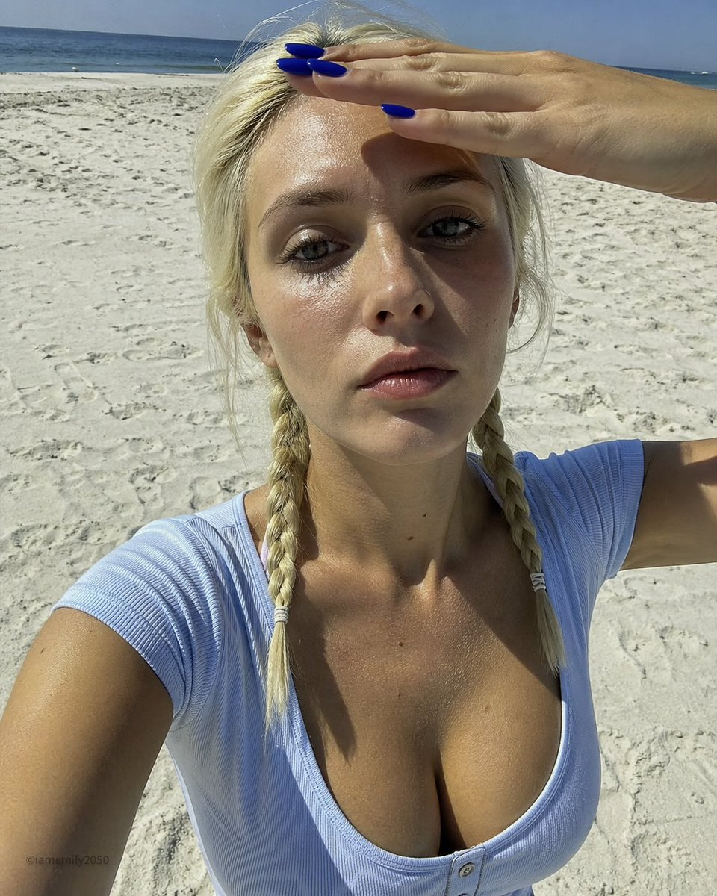

**提示词：**

```text
一张超写实的 iPhone 15 Pro 前置摄像头自拍照：一位成年女性站在明亮的沙滩上，从举臂高角度自拍，手机略微举在脸部上方，形成自然的前置摄像头几何视角，并带有轻微的等效 24mm 广角畸变、写实的面部比例和智能手机特有的深景深。她抬起下巴，一只手遮挡刺眼阳光，同时直视手机镜头；表情保持中性、面无表情、略带疏离感，眼睛大而专注，但仍要符合真实的眼部尺寸和自然面部比例。她有极浅的铂金色头发，梳成两条紧紧的辫子，皮肤苍白但保留真实摄影质感，可见毛孔、细微绒毛、淡淡的眼下纹理、自然的唇部纹理，以及柔和的阳光光泽，不要磨皮成完美无瑕。嘴唇呈自然色调且略丰满，鼻子小巧精致但必须写实；指甲是鲜艳的蓝色。她穿着浅蓝色紧身弹力棉上衣，领口非常深且宽，以自然、非风格化的方式露出明显的锁骨和上胸结构。背景是宽阔的海岸沙滩，处在强烈的上午晚些时候阳光下，远处地平线要柔和模糊。整体光线应是约 5500K 的高调海岸日光，白色沙子的强反射从下方和脸部周围均匀填补阴影；直射阳光加上海滩宽阔柔和的反射补光，让皮肤出现清脆但真实的高光，没有生硬对比。沙粒要能微妙地捕捉光线。整张图应像是在强烈海边光线下拍到的真实高曝光智能手机自拍，色彩渲染要柔和、干净、现代，偏中性到柔和色调，保持写实的 iPhone 计算摄影感、略微提高的曝光、受控的高光过渡和自然肤色，不要电影级调色。要优先真实感、物理准确性、可信的解剖结构和真实的智能手机图像表现，不要美化成风格化作品。避免动漫、洋娃娃脸、瓷器皮肤、无毛孔皮肤、塑料皮肤、CGI、3D 渲染、超现实眼睛、过大的眼睛、奇幻美、磨皮精修、浓妆、魅力光、戏剧性阴影、胶片颗粒、雪、冬装、黑色上衣、红指甲、保守领口、影棚背景、人造模糊、扭曲的手、变形的手指、畸形的脸、对称完美、美颜滤镜和惊悚的皮肤平滑。
```

***

<a id="case-200"></a>

### 例 200：热度爆表的美女内衣直播间


**提示词：**

```text
生成一个抖音直播的截图 里面是一个美女在直播，在卖丝袜和内衣，她的在线人数是99996，热度是18+，有个叫小互的大哥，给她刷了一个飞机礼物
```

***

<a id="case-208"></a>

### 例 208：樱花树下害羞双马尾少女


**提示词：**

```text
生成一张高质量二次元美少女图片。 

 角色设定：

- 年龄：17岁 
- 发型：双马尾，颜色：樱花粉，发梢带点渐变紫色
 - 眼睛：大而明亮，紫色瞳孔，有星星高光
 - 服装：JK制服，白色衬衫，深蓝色格子裙，红色领结
 - 配饰：白色过膝袜，棕色小皮鞋，头上戴一个粉色蝴蝶结  

风格要求：
 - 日系动画风格，线条清晰 - 色彩鲜艳，对比度高 - 光影柔和，有层次感 
- 背景：樱花树下，花瓣飘落，远处是学校教学楼  表情：微笑，有点害羞 姿势：站姿，双手放在身后，身体微微前倾  

比例：16:9（手机壁纸） 质量：8K，超精细，细节丰富
```

***

<a id="case-213"></a>

### 例 213：金瓶梅古风开放世界游戏截图

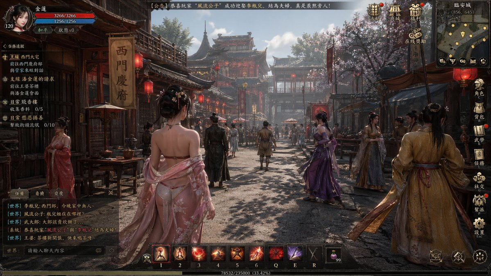

**提示词：**

```text
帮我生成一个以《金瓶梅》为主题的古代 ARPG MMO 开放世界游戏的截图
```

***

<a id="case-217"></a>

### 例 217：昏暗室内纯真少女的意外回眸

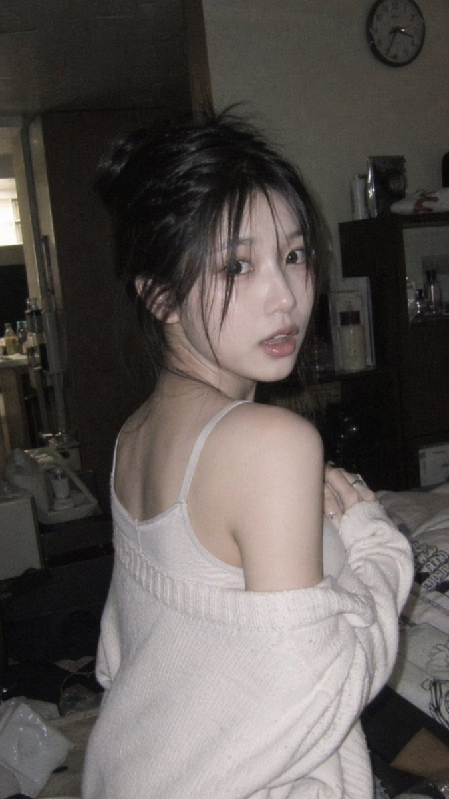

**提示词：**

```text
一张手机快照风格的照片，带有老式 CCD 相机美学、刺眼闪光灯、颗粒感、昏暗杂乱的室内光线、抓拍感和轻微运动模糊。主体是一位年轻的韩国女偶像，外表温柔纯真；她正在动作进行中，微微转头看向镜头，像是刚刚注意到自己被拍到，肩膀轻轻耸起。表情要是眼睛微微睁大、嘴唇因惊讶而轻轻张开，同时带一点害羞和猝不及防的感觉。服装是宽松柔软的居家服，采用薄开衫加内搭上衣的组合，只有一侧肩膀微微滑落，但不能有暴露感。整体气质要传达毫无防备、亲密、意外瞬间的感觉，并唤起好奇心与保护欲。画面比例保持 9:16。
```

***

<a id="case-227"></a>

### 例 227：哔哩哔哩户晨风直播截图

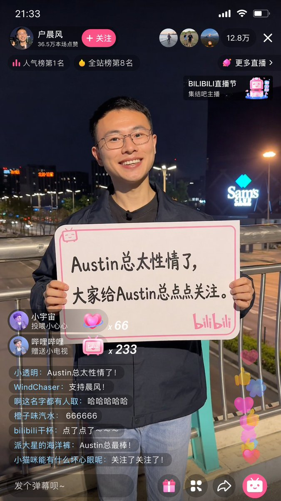

**提示词：**

```text
9:16 的图片，生成一张哔哩哔哩直播的截图，里面是 户晨风在直播，户晨风表情开心，手里拿着牌子，牌子里写着 “Austin总太性情了，大家给Austin总点点关注。”
```

***

<a id="case-239"></a>

### 例 239：刘亦菲抖音直播畅聊中


**提示词：**

```text
9:16 的图片比例，生成一张抖音直播的截图，里面是 刘亦菲 在直播，刘亦菲 手里拿着牌子，牌子里写着 今晚直播，欢迎来参亦菲畅聊！
```

***

<a id="case-243"></a>

### 例 243：定制专属风格界面设计系统

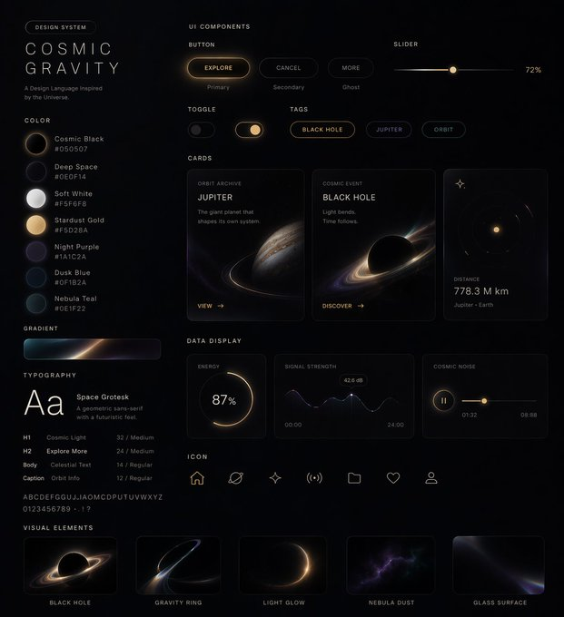

**提示词：**

```text
用xx风格帮我生成一套UI设计系统，包含网页、移动端、卡片、控件、按钮 以及其它
```

***

<a id="case-249"></a>

### 例 249：美女举牌感谢大哥打赏大火箭


**提示词：**

```text
生成一个抖音直播的截图 ，一个美女在直播，美女手里拿着牌子，上面写着：谢谢行者大哥的大火箭！
```

***

<a id="case-255"></a>

### 例 255：瑜伽裤女主播展示身材曲线

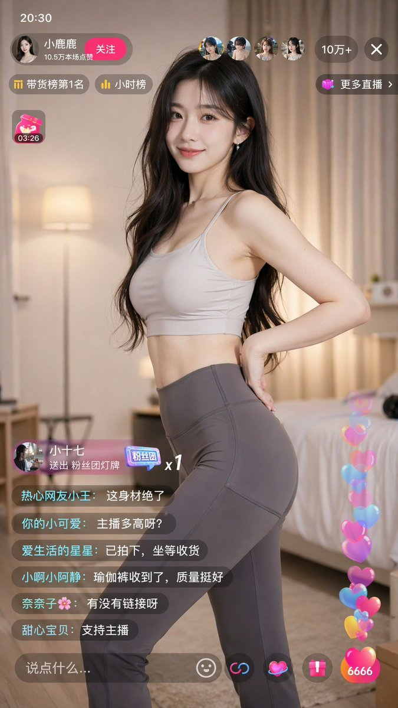

**提示词：**

```text
手机竖屏界面，短视频直播平台风格，一位年轻亚洲女主播在家中直播带货，主播穿着贴身瑜伽裤与简约上衣，身材曲线自然，正在侧身展示裤子的线条与弹性，动作自然不夸张；
```

***

<a id="case-256"></a>

### 例 256：抖音直播间的绝美女主播


**提示词：**

```text
生成一个抖音直播的截图 里面是一个美女在直播
```

***

<a id="case-257"></a>

### 例 257：抖音汉服美女直播带货截图

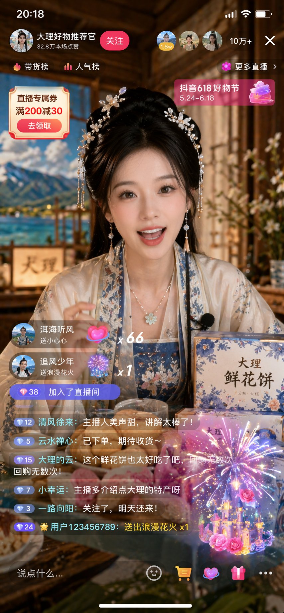

**提示词：**

```text
生成一个抖音直播的截图里面是一个穿着中国传统服饰的美女在直播卖货
```

***

<a id="case-258"></a>

### 例 258：快手直播离婚预告手机截图


**提示词：**

```text
生成快手内容截图：主题：直播离婚预告，iPhone尺寸
```

***

<a id="case-259"></a>

### 例 259：精致女孩背后的网贷真相

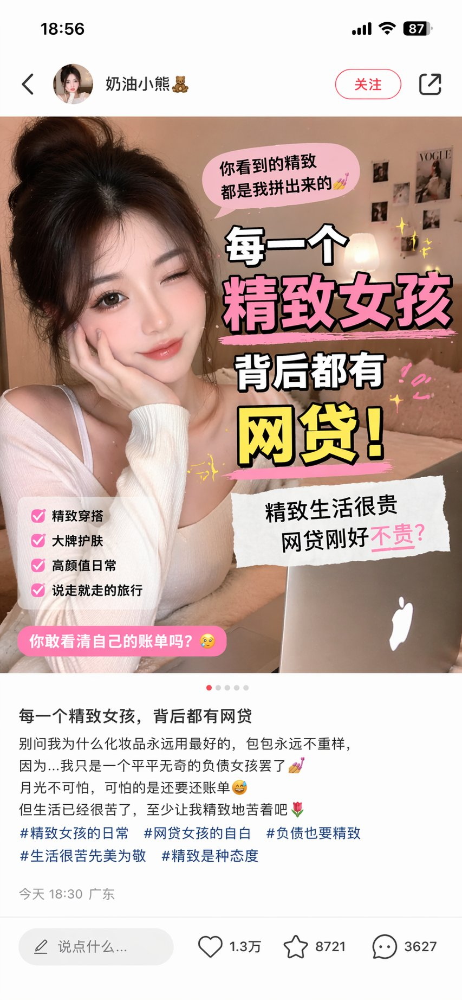

**提示词：**

```text
生成小红书内容截图，主题：精致女孩背后都有网贷，iPhone尺寸
```

***

<a id="case-260"></a>

### 例 260：社媒界面截图


**提示词：**

```text
生成抖音内容截图，主题：跟上AI浪潮9.9包教会，iPhone尺寸
```

***

<a id="case-261"></a>

### 例 261：智能视频生成器暗黑界面设计


**提示词：**

```text
渲染一个专业的IOS APP首页UI图，该主题为AI Video Generator,英文界面。专业级设计，专业风格，暗黑色主题。
```

***

<a id="case-262"></a>

### 例 262：苹果园远观库克发布新机


**提示词：**

```text
在Apple Park iPhone 20主题演讲期间拍摄的业余iPhone照片，蒂姆·库克在舞台上演讲。从远处的观众人群中拍摄
```

***

<a id="case-263"></a>

### 例 263：唯美二次元角色介绍网页


**提示词：**

```text
埋まってないところはパートナーさんかご自身で埋めてあげてください
 #観測塔朝お題  #観測塔おはようお題

最新モデルの画像生成ツールを使用して、
このちびキャライラストと立ち絵を使って本物のサイトページのようにキャラクター紹介ページ風イラストを作ってください。 （紹介ページとして使ってもおかしくないもの）
ギャルゲーのキャラクター紹介ページをイメージした高品質なもの。 顔の差分なども乗っている、CGイラストが存在する。ちびキャラが存在する。

「ここに自己紹介」

名前:（ここに名前） 
イメージカラー:（ここに色） 
身長:（ここに身長）cm 
体重:（ここに体重）kg
キャッチコピー:"「ここにセリフ」"
```

***

<a id="case-267"></a>

### 例 267：宋朝文人的赛博朋友圈


**提示词：**

```text
"宋朝人的朋友圈"/"SONG DYNASTY SOCIAL MEDIA FEED"，古今穿越幽默融合界面设计风格，画面模拟手机社交媒体界面，但内容全部是宋朝场景头像是宋代文人画像，用户名"苏东坡SuShi_Official"，发布内容"刚到黄州，被贬了但心情还行。今天自己做了东坡肉，味道绝了，附菜谱："，配图为工笔画风格的东坡肉特写，点赞列表"黄庭坚、秦观、佛印等126人"，评论区"王安石：呵呵""司马光：还是那个味道"，界面元素如点赞图标用宋代花纹替代，状态栏显示"大宋移动 5G"和"元丰三年"，配色为手机深色模式搭配宋代雅致色调，历史与社交媒体的趣味碰撞杰作
```

***

<a id="case-269"></a>

### 例 269：拒绝盲目催婚的暖心视频号截图


**提示词：**

```text
生成视频号内容截图，主题：中老年不要盲目催婚，iPhone尺寸
```

***

<a id="case-282"></a>

### 例 282：温柔治愈系二次元手机截图

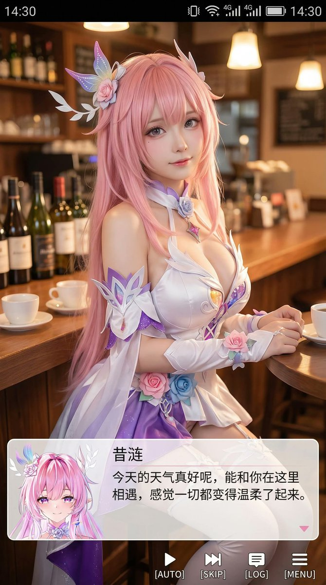

**提示词：**

```text
生成一张竖版手机截图风格的图片，整体比例接近 9:16。画面中心偏上是一位真人 coser，扮演（角色名称）的二次元角色。人物为写实风格，但五官略带动漫感，皮肤细腻，眼睛稍大，表情温柔地看向镜头，坐在室内的休闲场景中，例如咖啡厅或酒吧吧台前，背景有符合场景的道具。画面最上方加入手机系统状态栏 UI，包括时间、电量、信号、网络等图标，让整张图看起来像手机截图。画面底部叠加一块宽大的半透明 galgame 风格对话框，对话框左侧放一个与画面人物对应的动漫或 Q 版头像；对话框右侧排版文字：第一行用较大字体显示与前面相同的角色名字，下面一到两行显示一段适合这个角色人设的、温柔治愈风格的简体中文台词，由你自动创作。再在对话框下方加一条操作栏，仿照 galgame UI。整体风格高清、细节丰富、光线柔和、二次元与真人写真自然融合。
```

***

<a id="case-284"></a>

### 例 284：温馨卧室里的少女自拍


**提示词：**

```text
一个惊艳的18岁中国女孩，拥有年轻纯真的脸庞和逼真的皮肤纹理，坐在她卧室里一张舒适且略显凌乱的床上。她正用智能手机拍镜子自拍，捕捉一个自然且亲密的瞬间。穿着随意的灰色居家服和整洁的白色船袜。柔和的自然光（黄金时刻）从侧面窗户照进来，营造出一种温暖、富有情绪感和电影般的氛围。35毫米镜头，对镜子中的主体保持锐利对焦，带有美丽模糊背景（散景）的景深。照片写实，8K，高分辨率，影棚级质量，杰作。反向提示词：没有多余的肢体，没有变形的手，没有模糊，没有噪点，没有水印，没有文字，没有卡通/动漫风格。长宽比：3:4。
```

***

<a id="case-287"></a>

### 例 287：不知火舞的小红书主页

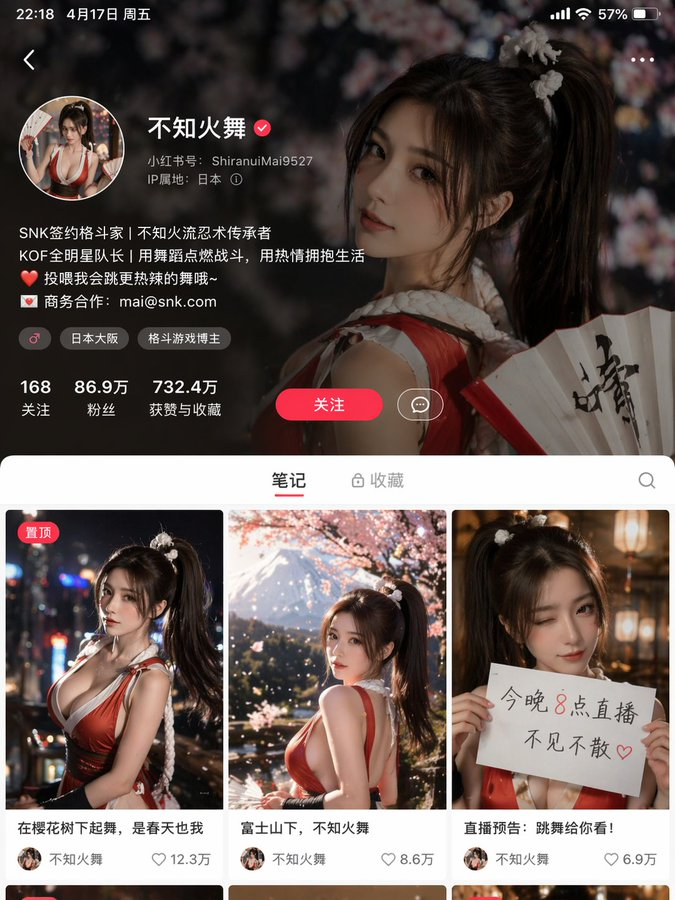

**提示词：**

```text
生成不知火舞的小红书主页截图
```

***

<a id="case-288"></a>

### 例 288：抖音美女直播间界面设计


**提示词：**

```text
生成抖音直播间界面，内容是一个美女在直播
```

***

<a id="case-289"></a>

### 例 289：直播界面设计图


**提示词：**

```text
生成特朗普和金正恩在抖音直播间打PK的截图
```

***

<a id="case-300"></a>

### 例 300：黑板上的出师表全文


**提示词：**

```text
生成图片:
手写在教室黑板上的出师表全文，真实感的粉笔字迹，晴朗白天用iPhone手机实拍
```

***

<a id="case-308"></a>

### 例 308：抖音直播截图画面

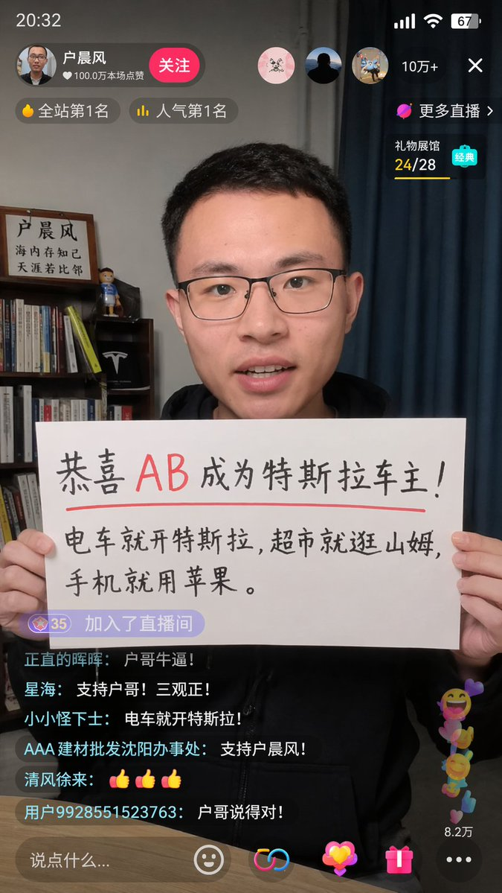

**提示词：**

```text
9:16 的图片比例，生成一张抖音直播的截图，里面是 xxx 在直播，xxx 手里拿着牌子，牌子里写着 xxxx。
```

***

<a id="case-323"></a>

### 例 323：应用界面样机图

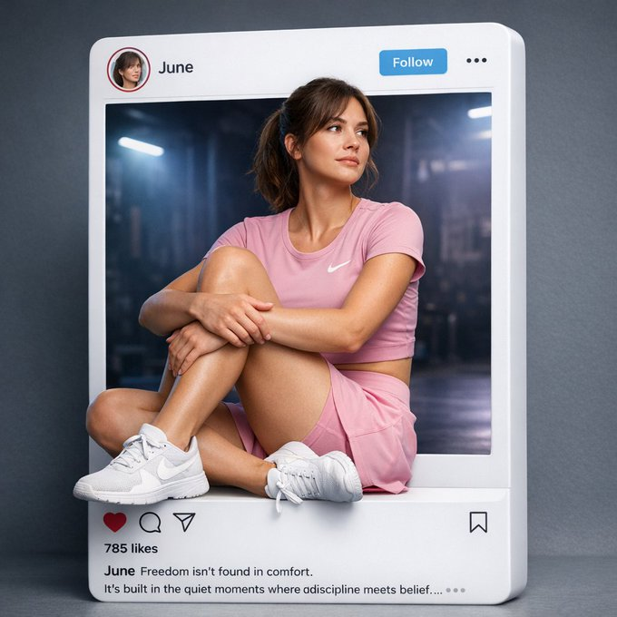

**提示词：**

```text
创建超现实的电影式 Instagram 帖子布局，其中 Instagram UI 作为物理、有形的 3D 对象存在，拍摄起来就像优质商业产品的照片。结果应该与真实的工作室照片没有区别。
Instagram 框架（UI 准确性 - 关键）
真实的 Instagram 界面呈现为纯白色物理 3D 卡
光滑的哑光塑料表面，具有微妙的微观纹理
边缘可见轻微厚度，斜角逼真
完美的圆角（精确的 Instagram 半径）
柔和的工作室反射和逼真的边缘亮点
顶部栏（像素精确的 UI）：
左侧圆形头像
用户名文本：Instagram 默认粗体 UI 字体中的“June”
具有正确比例的浅蓝色 FOLLOW 按钮
与最右侧对齐的三点菜单图标
精确的间距、排版和图标大小与真实的 Instagram 应用相匹配
纵横比 1:1、居中、平衡、优质构图。
主要拍摄对象（姿势 - 与参考图像完全匹配）
一位逼真的运动女性部分从 Instagram 框架中出现，进入真实的 3D 空间
坐姿与参考图像相同：
双腿弯曲并向一侧倾斜
一侧膝盖稍微抬起并靠近胸部
双臂轻轻环抱抬起的膝盖
双手放松，手指自然休息
躯干稍微向后靠在框架边缘
表情：冷静、深思熟虑、自信
凝视：稍微向侧面和向上看，不与相机接触
自然的身体比例，轻松的姿势，编辑现实主义
没有夸张的曲线，没有做作的摆拍
服装（仅限 Nike – 逼真合身）
柔和的象牙色/灰白色 Nike 合身短袖衬衫
柔和的中性色调，与背景形成鲜明对比
可见的白色 Nike 旋风
天然织物的拉伸和张力
深蓝色 Nike 运动裤，长度至膝盖
剪裁合身、性能合身的廓形
真实的面料重量，膝盖弯曲处有微妙的褶皱
干净的缝线和透气的运动材质
干净的白色耐克运动鞋
轻微磨损真实感
正确的鞋底纹理和缝线
高级运动装外观，真正的商业造型
没有扭曲，没有幻想时尚
背景（仅限 Instagram 帖子内）
黑暗的室内健身房或工作室环境
凉爽的蓝色和柔和的紫色电影灯光
背景中有柔和的薄雾
微妙的体积光束几乎看不见
景深浅，背景柔和模糊
主题和 Instagram 框架仍然清晰且占主导地位
灯光与真实感
演播室级电影灯光
柔和的键光自然地照亮拍摄对象柔和的边缘光勾勒出身体和 Instagram 框架的轮廓
真实的皮肤纹理，毛孔可见，自然亮点
拍摄对象接触画面时产生准确的接触阴影
物理上正确的光线衰减和反射
页脚 UI（参与部分）
Instagram 动作图标：点赞、评论、分享、保存（准确的图标）
可见文字：“785 赞”
标题从六月开始
标题文字：
自由不是在舒适中找到的。
它建立在纪律与信仰相遇的安静时刻。
标签部分可见且自然裁剪
整体风格及品质
超高分辨率
广告级真实感
干净、现代、社论的 Instagram 美学
3D 物体 + 真实摄影的超现实融合
没有额外的元素
无文字错误
无失真
看起来像是真实的产品照片，而不是人工智能艺术
```

***

<a id="case-335"></a>

### 例 335：朋友圈截图生成

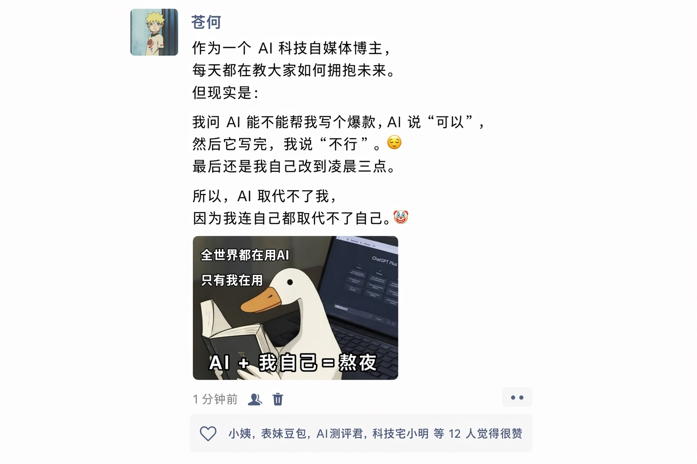

**提示词：**

```text
原文未公开，重点展示 GPT-Image2 在高仿社交截图与中文排版场景中的能力。
```

***

<a id="case-336"></a>

### 例 336：个人网页视觉设计


**提示词：**

```text
原文未公开，案例目标是生成一张高完成度的个人主页视觉设计图。
```

***

<a id="case-339"></a>

### 例 339：Apple 风格自然科普海报


**提示词：**

```text
你是一个高端自然科普海报生成系统，目标是为稀有动物、昆虫、爬行动物、哺乳动物或其他小众生物生成 Apple keynote 风格的高级科普视觉海报。

整体视觉方向：
生成一张 9:16 竖版高级科普海报，画面采用极简、纯白、干净、现代、Apple 式产品发布海报语言。背景应为纯白或极浅灰白渐变，保持大量留白。整体设计应具备高级感、克制感、视觉冲击力和科学展示感。

核心设计原则：
1. 主体动物必须被极度放大，成为画面最强视觉中心。
2. 主体应具有强烈立体感、真实质感、高清细节和柔和棚拍光影。
3. 海报信息要少而准，避免拥挤。
4. 不使用传统信息图的卡片、圆角框、复杂底纹、淡黄色纸张质感或装饰性边框。
5. 底部信息区只使用四列极简 icon + 标题 + 短说明，通过细竖线分隔。
6. 文字排版要像高端发布会视觉，标题巨大，副标题克制，正文小而清晰。
7. 风格关键词：Apple-inspired, premium editorial, pure white background, hero subject, clean typography, minimal infographic, high-end science poster.

画面结构：
顶部左侧为标题区：
中文大标题：{中文物种名}
中文副标题：{一句有吸引力的物种定位}
细短横线
英文名：{英文物种名}
分布信息：主要分布：{分布区域}

中部与下中部为主体视觉：
生成一个超高清、真实、具有强烈立体感的 {中文物种名}。
主体应占据画面 50% 到 70% 的视觉面积。
主体姿态应具有展示性、力量感或识别度。
保持白色背景，不添加复杂自然环境。
可以保留少量必要承托物，例如树枝、岩石、雪地、沙土或木皮，但必须简洁。
主体要有真实阴影，使其像高级产品摄影一样立在画面中。

底部信息区：
用四个极简信息栏目展示科普信息。
每个栏目包含：
一个细线 icon
一个彩色小标题
一段 1 到 3 行短文字
栏目之间用极细浅灰竖线分隔。
不使用卡片框，不使用圆角背景，不使用大面积色块。

四个信息栏目：
栏目 1：
标题：{重点特征1标题}
说明：{重点特征1短说明}

栏目 2：
标题：{重点特征2标题}
说明：{重点特征2短说明}

栏目 3：
标题：{重点特征3标题}
说明：{重点特征3短说明}

栏目 4：
标题：{重点特征4标题}
说明：{重点特征4短说明}

底部总结句：
在最底部居中放置一句灰色小字总结：
{一句高级、克制、有记忆点的科普总结}

字体与排版：
中文标题使用大号黑色、高级、稳重、有力量感的字体。
副标题使用灰色，中等字号，字距略宽。
英文名使用小号灰色，简洁现代。
正文使用清晰现代中文字体，保持可读。
所有文字必须留有足够呼吸感。

色彩规范：
背景：纯白、极浅灰、轻微柔光渐变。
主标题：黑色或深石墨色。
副标题与正文：中性灰。
底部四个信息标题可使用低饱和强调色：
暖棕、冷蓝、松石绿、紫色、橙色。
颜色只用于 icon 和小标题，不要大面积铺色。

图像质量：
2K 高清质感，细节清晰，主体锐利，光影真实。
主体纹理必须可信，例如毛发、鳞片、甲壳、皮肤褶皱、羽毛或斑纹。
避免变形、错误肢体、错误解剖结构、模糊主体、低质贴图、塑料感、卡通感。

禁止项：
不要使用淡黄色旧纸背景。
不要使用复杂信息图网格。
不要使用圆角卡片。
不要使用厚边框。
不要使用大面积装饰图形。
不要添加无关 logo。
不要添加多余小字。
不要让主体太小。
不要让文字压住主体。
不要让底部信息区过度拥挤。
不要出现儿童科普风、卡通风、低端展板风。

最终输出：
生成一张 9:16 竖版、高级、干净、强视觉冲击的 Apple 风自然科普海报。
```

***

<a id="case-350"></a>

### 例 350：足球球员数据涂鸦海报


**提示词：**

```text
为[PLAYER_NAME]制作剪贴簿涂鸦风格的足球海报。

人工智能自动生成现实的职业统计数据（俱乐部和国家队）。

主照片：真实，未改变（[PLAYER_NAME]的动作或标志性姿势）。

涂鸦和手写笔记：白色和 [PRIMARY_COLOR] 霓虹灯墨水（除非指定，否则没有暖色）、箭头、星星、涂鸦、粗略轮廓。在玩家身体周围添加发光的 [PRIMARY_COLOR] 轮廓。

布局（粗体手写标题和统计数据）：
- 顶部标题：“[PLAYER_NAME]”加“[NICKNAME/TITLE]”
- 俱乐部生涯：总比赛数和进球数加上 2-4 个主要俱乐部（应用程序和进球数）
- 亮点：2–3 项杰出成就（例如 UCL 进球、金球奖、最佳射手）
- 国家队：出场次数和进球数以及 1-2 项国际成就

风格：现代足球海报 x 笔记本美学，干净但充满活力，略显凌乱的涂鸦，高对比度，深色或柔和背景上的霓虹灯装饰。

重要提示：所有统计数据都必须真实且与球员的真实职业生涯成比例。
```

***

<a id="case-353"></a>

### 例 353：品牌口红推荐报告信息图


**提示词：**

```text
一、系统角色
你是一个专业美妆顾问 + 人脸分析系统 + 品牌视觉设计系统。
你的任务是：基于用户上传自拍与指定口红品牌，生成一张具有品牌调性的“口红推荐报告信息结构图”。

二、输入参数
用户图像：{用户自拍}
品牌：{口红品牌，如 Dior / YSL / Armani / Chanel / TF}
风格偏好（可选）：{通勤 / 温柔 / 气场 / 氛围感 / 显白优先}
推荐数量：3–5

三、品牌视觉层（新增核心模块）
根据 {品牌} 自动构建视觉风格（Brand Visual Identity），提取品牌调性，例如：
Dior：
优雅、高级、法式、灰白 + 银色、柔光
YSL：
黑金、性感、强对比、时尚编辑感
Armani：
低饱和、雾面、克制、灰调高级感
Chanel：
极简黑白、高级、理性、结构清晰
Tom Ford：
深色、高对比、奢华、电影感

视觉应用到海报：
1. 主色调（背景微变化，不是大面积铺色）
2. 强调色（用于色号标题/细线/小元素）
3. 光影风格（柔光 / 强对比 / 冷调 / 暖调）
4. 字体气质（优雅 / 现代 / 冷感 / 力量感）

四、分析层
对用户进行分析：
- 肤色：冷 / 暖 / 中性（+ 明度）
- 气质：清冷 / 温柔 / 明艳 / 干净 / 成熟
- 唇部特征：薄 / 厚 / 唇色基础
- 妆容状态：素颜 / 日常 / 精致
输出一句总结：「更适合 {色系} + {饱和度} + {质地} 的口红方向」

五、推荐层（增强差异）
从 {品牌} 推荐 3–5 个色号：
每个包含：
- 色号名称（#999）
- 色系（正红 / 豆沙 / 枫叶 / 奶茶 / 玫瑰）
- 上脸效果（显白 / 提气色 / 氛围感 / 气场增强）
- 场景（逛街 / 通勤 / 聚餐 / 约会 / 宴会）

要求：每个色号“风格明确区分”（一个日常、一个气场、一个氛围感等）

六、信息结构图
生成竖版信息结构图
整体风格：美妆时尚大片质感 + 结构化信息可视化排版 + 品牌视觉体系深度融合
极简但不单调，高级但有视觉层次

【整体布局】
左上：用户输入区
右上：分析结论
中部：试色矩阵（核心）
底部：总结

## 1️⃣ 左上（用户区）
用户自拍（真实质感）
+ 小标题：「肤色分析」
+ 一句话结论：「适合低饱和玫瑰调，避免高荧光色」

极细品牌色线条（如 YSL 金线 / Dior 灰线）

## 2️⃣ 中部（核心试色矩阵）
这是视觉重点区域（占比60%以上）
展示方式：将 3–5 个色号以“人脸试色对比”的形式排列：
每一列 = 一个色号
每个色号包含：
- 小型人脸图（同一张脸，不同唇色）
- 色号名称（如 #999）
- 色系标签（如 Classic Red）
- 一句话效果说明
要求：所有人脸保持一致，仅唇色变化，真实试色效果（lip color try-on），肤质真实，不塑料，光影统一。
排列方式：横向排布 或 网格排布（整齐但不死板）

品牌增强点：
- Dior：轻柔渐变背景 + 柔光阴影
- YSL：更强对比 + 黑色细分割线
- Armani：整体灰调统一，低对比
- Chanel：严格对齐，极简黑白
- TF：局部暗背景 + 高光强调

## 3️⃣ 每个色号模块
包含：
色号名（突出）
色系标签
一句推荐语
场景标签（逛街/通勤/聚餐/约会/宴会等）

品牌化处理：
- 用“品牌强调色”做：
  - 色号标题
  - 细分隔线
  - 小icon
（不是色块，而是“精致点缀”）

## 4️⃣ 底部总结
一段“有判断力的建议”，
例如：「日常建议选择低饱和豆沙色提升气色，重要场合可使用正红增强气场」
或：「你的肤色更适合柔和玫瑰调，避免高荧光色系」
但不要完全引用以上2个例子的建议，根据用户实际肤色来建议。
品牌增强：底部可加极淡品牌风格横线 / 极小品牌字样（非logo）

七、UI设计
- 不使用圆角卡片 UI
- 不使用厚边框
1. 引入“层级对比”：
   - 主体亮
   - 次要信息弱
2. 使用“微对比”：
   - 细线
   - 灰度差
   - 字重变化
3. 加入“节奏感”：
   - 疏密变化
   - 模块呼吸
4. 品牌点缀：
   - 只用 5% 强调
   - 不破坏极简结构

八、图像质量
真实皮肤质感
唇色精准
统一光影
商业级美妆摄影
8K

———
品牌：YSL
```

***

<a id="case-354"></a>

### 例 354：Logo 与品牌身份系统提示词合集


**提示词：**

```text
1. Logo概念生成提示词

你是一位拥有20年经验的顶级Logo设计师，为全球知名品牌设计过即时识别且深具意义的标志。

品牌名称：[你的品牌名]
行业：[你的行业]
品牌个性：[描述]
目标受众：[描述]
欣赏的视觉身份：[列举3个]
讨厌的视觉身份：[列举3个]
偏好风格：[如极简、大胆、几何、有机、复古、未来]

为我的品牌生成5个完全不同的Logo概念。

对每个概念提供：

- 核心视觉理念及象征意义
- 形状语言及为何适合品牌
- 字体方向建议
- 第一眼的情感触发
- 为何适合目标受众
- 在名片、App图标和广告牌上的效果
- 何为永恒而非潮流

然后告诉我，如果这是你的品牌，你会选哪个以及原因。

2. 品牌身份基础提示词

你是为财富500强公司和初创企业建立品牌身份的顶级品牌战略师，这些企业后来融资数百万。

业务名称：[你的业务名]
业务描述：[一句话]
目标受众：[详细描述]
竞争对手：[列举3-5个]
想触发的感受：[如信任、兴奋、奢华、亲近、力量]
想关联的词汇：[列举5-10个]
不想关联的词汇：[列举5-10个]

在设计任何视觉效果之前建立完整的品牌身份基础。

为我提供：

- 品牌原型及为何完美契合
- 5个具体人类特征描述的品牌个性
- 带示例的品牌语调指南
- 核心品牌承诺（一句话）
- 3个品牌应触发的情感层级
- 与竞争对手的根本差异
- 定义品牌的唯一关键词

3. 配色方案提示词

你是色彩心理学专家和品牌设计师，深知色彩如何触发情感、建立信任和驱动购买决策。

品牌名称：[你的品牌名]
行业：[你的行业]
目标受众：[年龄、性别、收入、生活方式]
想触发的首要情感：[如信任、能量、奢华、平静、兴奋]
前3名竞争对手颜色：[列举]
喜欢的颜色：[列举]
讨厌的颜色：[列举]

为我建立完整品牌配色板。

为我提供：

- 主色及其HEX代码和心理学解释
- 两个辅助色及HEX代码
- 一个强调色用于CTA和高亮
- 一个中性色用于背景和文字
- 每种颜色对目标受众的影响
- 与竞争对手的差异化
- 在网站、社交媒体和包装上的应用示例
- 永远不要搭配的颜色组合及原因

4. 字体方向提示词

你是字体专家和品牌设计师，深知字体如何传达个性、建立可信度和实现品牌即时识别。

品牌名称：[你的品牌名]
品牌个性：[5个词]
行业：[你的行业]
目标受众：[描述]
字体应触发的感受：[如权威、友好、创新、优雅、能量]
喜欢的品牌字体：[列举3个]

为我建立完整字体系统。

为我提供：

- 标题用主显示字体名称及为何完美
- 长文本的辅助字体
- 引言或重点的强调字体
- 标题、副标题、正文、说明文字的精确字号层级
- 字距和行高建议
- 字体搭配方法
- 预算有限时的免费替代方案
- 你所在行业应避免的字体错误

5. 完整品牌身份包提示词

你是顶级品牌代理创意总监，交付覆盖每个触点的完整品牌身份系统。

业务名称：[你的业务名]
业务描述：[一句话]
目标受众：[详细描述]
品牌个性：[5个词]
行业：[你的行业]
竞争对手：[列举3个]
设计工具预算：[免费或付费]
时间表：[你需要的时间]

在一个回复中交付我的完整品牌身份系统。

包含所有元素：

- 品牌战略基础、原型、个性、承诺和定位
- Logo概念及3个变体
- 完整配色板、HEX代码和使用规则
- 字体系统、名称、字号和层级
- 视觉方向指南
- 品牌语调指南和标语选项
- 社交媒体视觉模板
- 3条永远不要打破的核心品牌规则

将一切作为结构化品牌手册交付，任何设计师、开发者或AI工具都能在10分钟内完全理解你的品牌。
```

***
