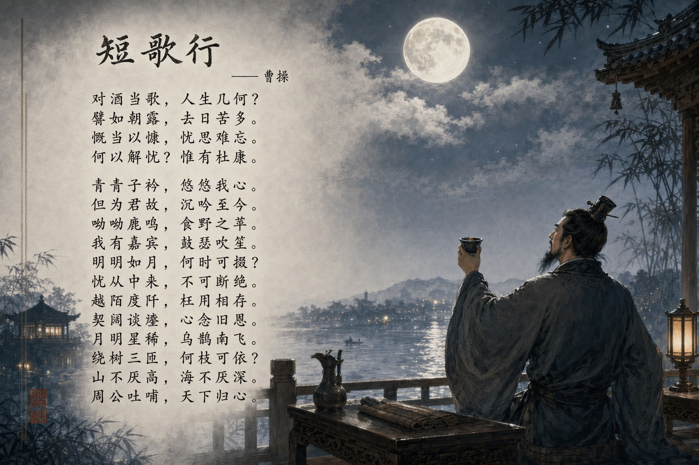

# 历史与古风题材

> GPT Image 2 中文提示词案例分册 11。本分册共 5 个案例。

[返回索引](index.md)

## 案例目录

- [例 44：古风历史题材图](#case-44)
- [例 163：诗仙李白月下直播起舞](#case-163)
- [例 234：朱元璋登基后的推特主页](#case-234)
- [例 292：明朝登基宝玉的推文页面](#case-292)
- [例 337：《短歌行》诗词意境图](#case-337)

## 案例

<a id="case-44"></a>

### 例 44：古风历史题材图


**提示词：**

```text
根据上传图片的风格生成{argument name="dynasty" default="Ming Dynasty"}各皇帝的头像，头像下方列出了他们的谥号和本名。
```

***

<a id="case-163"></a>

### 例 163：诗仙李白月下直播起舞


**提示词：**

```text
李白在抖音直播月下起舞
```

***

<a id="case-234"></a>

### 例 234：朱元璋登基后的推特主页


**提示词：**

```text
创建一个明朝朱元璋登基之后的X帖子页面
```

***

<a id="case-292"></a>

### 例 292：明朝登基宝玉的推文页面


**提示词：**

```text
创建一个宝玉（查阅 https://x.com/dotey 这个推主的主页及部分推文）穿越到明朝，登基之后依据其业务/个性，绘制的其新的X帖子页面。
```

***

<a id="case-337"></a>

### 例 337：《短歌行》诗词意境图



**提示词：**

```text
帮我生成一张《短歌行》的意境图，带整篇《短歌行》文字
```

***
