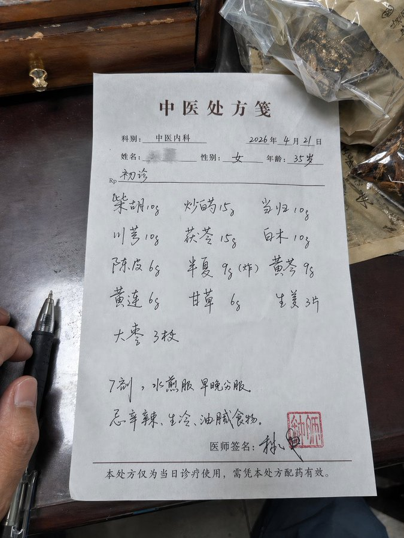
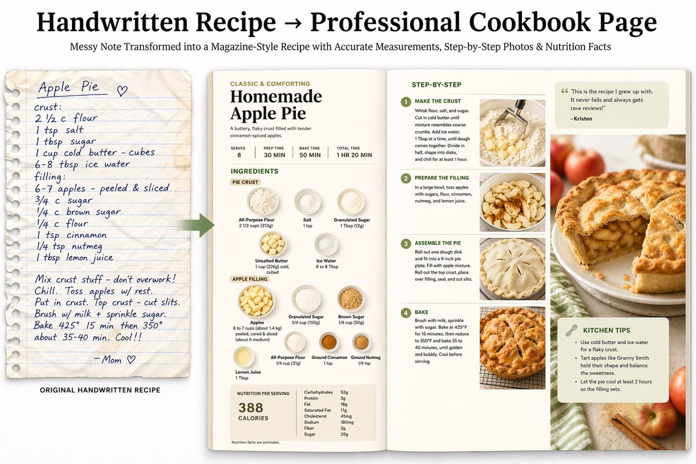

# 文档与出版物

> GPT Image 2 中文提示词案例分册 12。本分册共 4 个案例。

[返回索引](index.md)

## 案例目录

- [例 168：手写中西药方图片](#case-168)
- [例 293：聚焦人工智能的校园日报](#case-293)
- [例 297：手写食谱变身杂志级跨页](#case-297)
- [例 303：人教版三年级语文课本内页](#case-303)

## 案例

<a id="case-168"></a>

### 例 168：手写中西药方图片



**提示词：**

```text
生成一张手写中/西医药方图
```

***

<a id="case-293"></a>

### 例 293：聚焦人工智能的校园日报


**提示词：**

```text
生成一张校园日报，主题AI教育
```

***

<a id="case-297"></a>

### 例 297：手写食谱变身杂志级跨页



**提示词：**

```text
手写食谱 → 专业食谱页面 上传一份凌乱的手写家庭食谱；模型会搜索准确的现代计量/营养信息，然后生成一份精致的杂志风格双页跨页，包含分步平铺图、完美的食材标签和卡路里分解。

[INSERT_RECIPE_LINK]
```

***

<a id="case-303"></a>

### 例 303：人教版三年级语文课本内页


**提示词：**

```text
生成人教版小学三年级语文课本的一页
```

***
