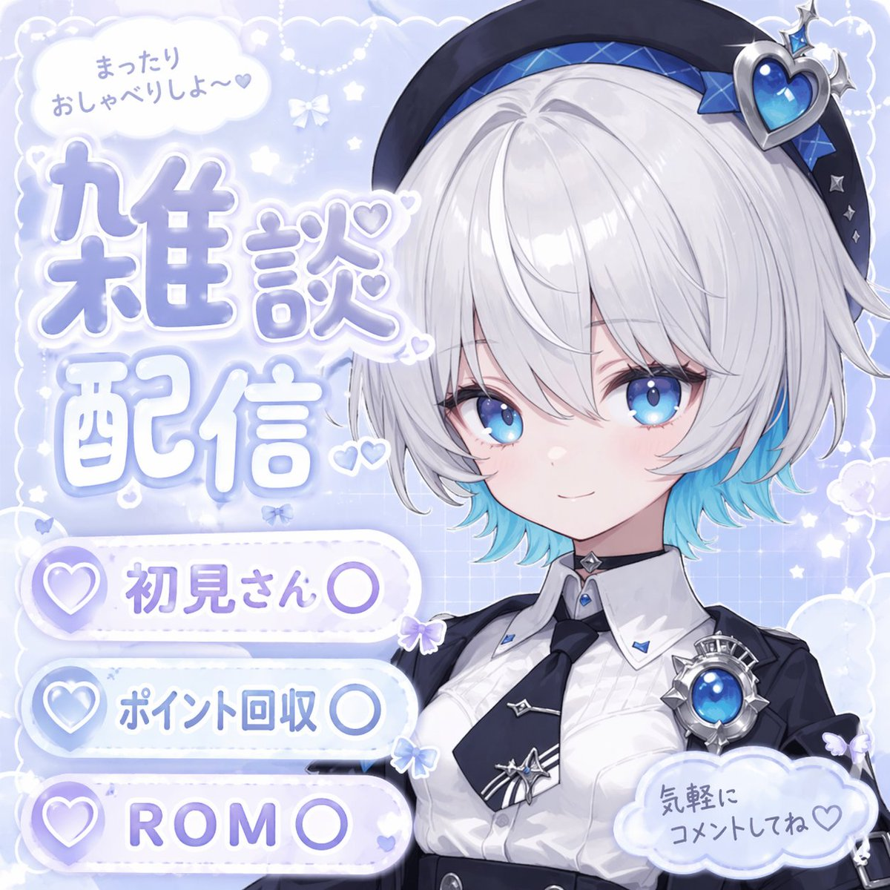
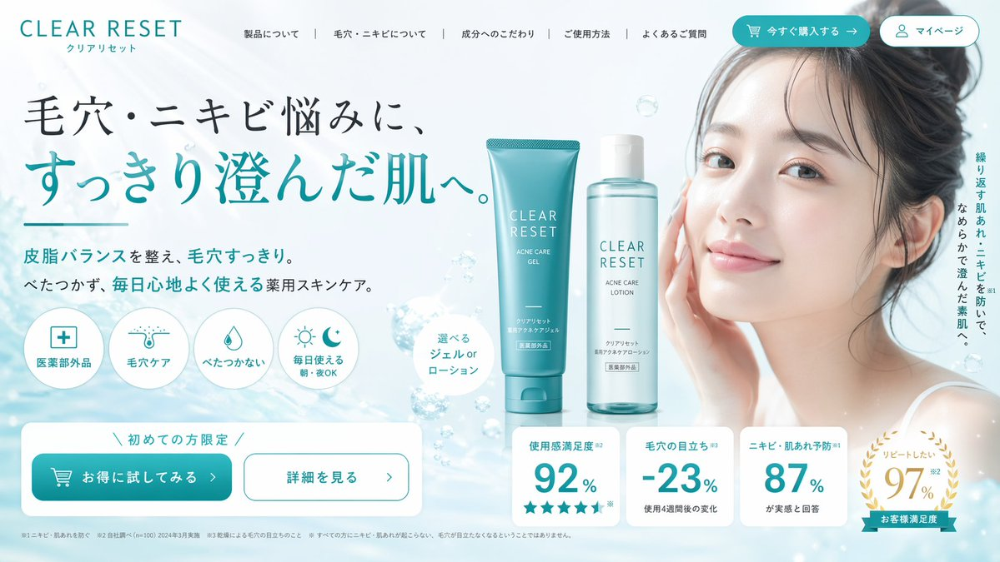
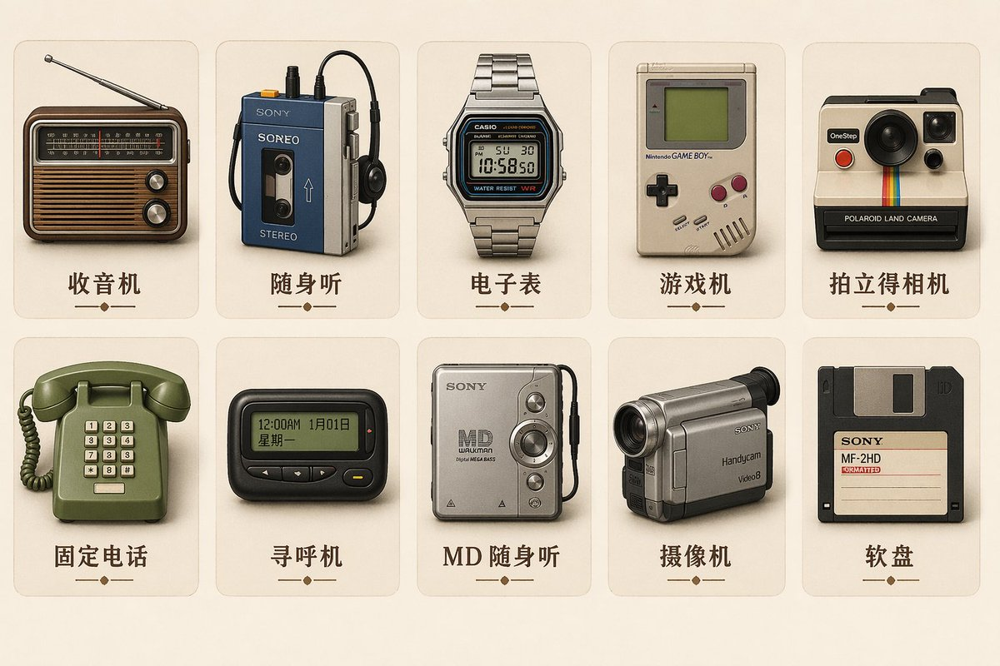

# 品牌与标志

> GPT Image 2 中文提示词案例分册 5。本分册共 7 个案例。

[返回索引](index.md)

## 案例目录

- [例 36：品牌徽标设计图](#case-36)
- [例 53：室内空间渲染图](#case-53)
- [例 95：品牌视觉识别图](#case-95)
- [例 115：品牌视觉识别图](#case-115)
- [例 136：品牌视觉识别图](#case-136)
- [例 150：品牌徽标设计图](#case-150)
- [例 160：品牌吉祥物设定图](#case-160)

## 案例

<a id="case-36"></a>

### 例 36：品牌徽标设计图


**提示词：**

```text
一张逼真的自拍照，照片上是一位年轻男子在室内篮球场上的照片，他留着深色波浪短发和浅色胡茬。他穿着一件带有白色旋风图案的黑色运动 T 恤。他手里拿着一个{argument name="ball color" default="green"}篮球，上面有一个巨大的白色{argument name="logo design" default="OpenAI logo"}。背景是硬木地板、黑色墙垫和靠在混凝土墙上的篮球框。明亮的室内健身房照明与休闲的社交媒体美感。
```

***

<a id="case-53"></a>

### 例 53：室内空间渲染图


**提示词：**

```text
一张 90 年代末的老式业余闪光照片，照片上是一位年轻人正在修理一台街机。他跪在带有图案的深色街机地毯上，回头直视镜头，表情中性。他穿着深色短袖 T 恤、宽松的蓝色牛仔裤、厚实的白色运动鞋和深色棒球帽。街机柜的下部前面板是敞开的，暴露了其复杂的内部电子设备，包括一堆电线、绿色电路板、一个大扬声器和底部的金属冷却风扇。柜子的侧面采用鲜艳的粉色、黑色和白色图形，并带有文字“{argument name="arcade game title" default="Dancing Stage"}”和品牌“{argument name="arcadebrand" default="KONAMI"}”。场景是一个光线昏暗的拱廊内部，在模糊的背景中可以看到其他发光的游戏柜。一把螺丝刀放在男人膝盖附近的地毯上。该图像具有刺眼的直射闪光、略带颗粒感的胶片纹理、深阴影和怀旧的 Y2K 美学。
```

***

<a id="case-95"></a>

### 例 95：品牌视觉识别图



**提示词：**

```text
一张动漫风格直播封面图：角色站在画面右侧，微笑着看向观众，头发为 {argument name="hair color" default="short silver hair with cyan underlights"}，眼睛是明亮的大号蓝眼睛，穿白色翻领衬衫、黑色银边领带、黑色外套、带大号蓝色心形宝石的黑色贝雷帽、蓝色宝石胸针和黑色颈圈。背景使用浅蓝色，点缀白云、闪光、星星、小蝴蝶结和细微网格纹理。左上角放一个对话气泡，文字是“まったりおしゃべりしよ〜♡”。中左放主标题，标题文本为 {argument name="main title" default="雑談配信"}，使用大号柔和蓝色渐变、白色描边，并点缀小爱心。左下角放 3 个白色胶囊形按钮，左侧带紫色爱心图标，标签分别是 {argument name="badge 1 text" default="初見さん〇"}、{argument name="badge 2 text" default="ポイント回収〇"}、{argument name="badge 3 text" default="ROM〇"}。右下角再放一个云朵气泡，文字是“気軽にコメントしてね♡”。
```

***

<a id="case-115"></a>

### 例 115：品牌视觉识别图


**提示词：**

```text
一张双页漫画跨页，采用高度细致的写实漫画风格，黑白网点、戏剧性光影和心理惊悚氛围。主角为 {argument name="main character description" default="young Japanese salaryman in a suit"}，核心主题为 {argument name="core concept" default="surrounded by a massive crowd of identical clones of himself"}。左页使用整页大分镜，场景设定为 {argument name="setting" default="Shibuya scramble crossing at night"}：主角独自站在十字路口中央，震惊地环顾四周，周围所有人都是他的完全复制体。左页文字包括漫画标题 logo “{argument name="manga title" default="俺だらけの街"}”、副标题“第1話 交代”、旁白“その夜、世界は静かに俺をやめた。”，以及拟声“ザワ…”。右页采用 5 格竖向排版：第 1 格是主角眼睛的极近景，表现震惊和冒汗，台词“……は？ なんで……みんな、俺なんだ？”并配拟声“ドクン”；第 2 格是一排 8 个穿西装、面无表情直视前方的复制人，配拟声“ザワ…”；第 3 格是一个复制人俯身在震惊的主角耳边低语，台词“お前の代わりは、もう足りてる。”并配拟声“スッ”；第 4 格是手持智能手机的特写，屏幕显示推送通知“交代を開始します。”，并配拟声“ピロン”；第 5 格是城市街道上无尽复制人群的远景，旁白“最初に消えるのは、名前でも命でもない。居場所だ。”，左下文字“俺は、ここにいていいのか——？”，右下保留 {argument name="cliffhanger text" default="次号へつづく！"}，并用“ザワ… ザワ… ザワ…”收尾。
```

***

<a id="case-136"></a>

### 例 136：品牌视觉识别图



**提示词：**

```text
一个电商落地页首屏，品牌为 {argument name="brand name" default="CLEAR RESET"}，主题是清爽护肤、干净审美与水泡泡背景。整体配色以白色、{argument name="primary color" default="teal"} 和浅蓝为主。页眉左侧放 CLEAR RESET 标志，导航链接依次为 About Product、About Pores/Acne、Ingredients、How to Use、FAQ，右侧放 Buy Now 和 My Page 两个按钮。主视觉标题为 {argument name="main headline" default="毛穴・ニキビ悩みに、すっきり澄んだ肌へ。"}，副标题是“Balances sebum and clears pores. Non-sticky, medicated skincare for comfortable daily use.”，竖排文案是“Prevents recurring rough skin and acne, leading to smooth, clear skin.”。画面中间放一位年轻亚洲女性，皮肤清透有光泽，头发扎起，微笑柔和；中央摆放两件产品，描述为 {argument name="product type" default="acne care gel tube and lotion bottle"}。背景使用浅蓝渐变与漂浮水泡泡。下方加入 4 个圆形图标卖点，文字分别是 Quasi-drug、Pore Care、Non-sticky、Daily Use Morning/Night OK；再加上“Limited to first-time buyers”横幅，以及两个按钮“Try it at a discount”和“See details”。最后补上 4 个白色矩形统计卡片，使用大号青绿色数字，文字为 Satisfaction 92%、Pore visibility -23%、Acne prevention 87%、Want to repeat 97%。
```

***

<a id="case-150"></a>

### 例 150：品牌徽标设计图


**提示词：**

```text
A bright, summery commercial product photography shot featuring a refreshing beverage on a weathered wooden table. In the sharp foreground, there is 1 tall glass filled with a golden, bubbly iced drink garnished with 1 lemon slice and a sprig of rosemary, sitting next to 1 silver aluminum can covered in cold condensation. The can prominently displays the English text {argument name="product name" default="TOKYO HIGHBALL"} below a small gold star logo, featuring a graphic of the drink itself and the Japanese text "アルコール分 7%" near the bottom. To the right of the can, 2 cut lemon wedges rest on the table. In the softly blurred background, a sunny beach scene unfolds with sparkling turquoise water and a clear blue sky. Standing to the left in the background is 1 young woman with long brown hair, wearing a white sleeveless top and a light blue skirt, looking out toward the ocean. Floating elegantly in the sky above the scene is the Japanese text {argument name="catchphrase" default="夏、これがいい。"}. The overall lighting is radiant and inviting, with sparkling bokeh and lens flares emphasizing the crisp, cold, and refreshing atmosphere of a perfect summer day.
```

***

<a id="case-160"></a>

### 例 160：品牌吉祥物设定图



**提示词：**

```text
为{argument name="style" default="retro skeuomorphic style"}中的{argument name="device" default="vintage Electronic Equipment"}生成一组图标，包括图像中的图标名称。
```

***
