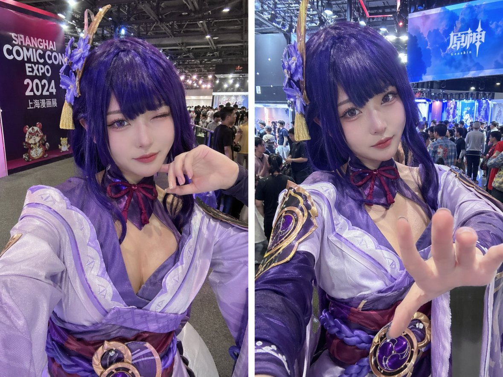
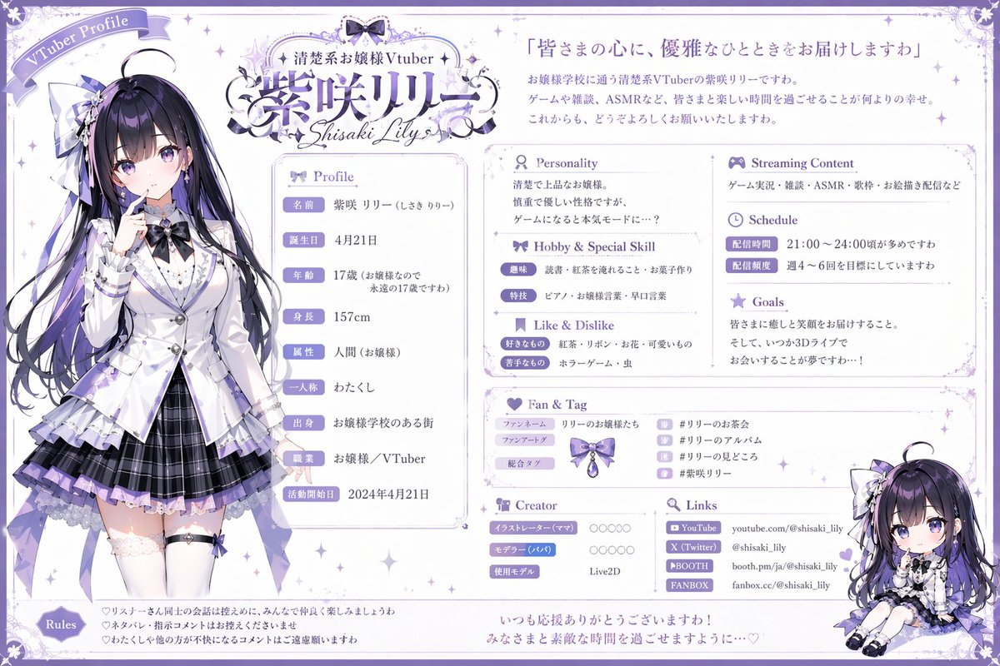
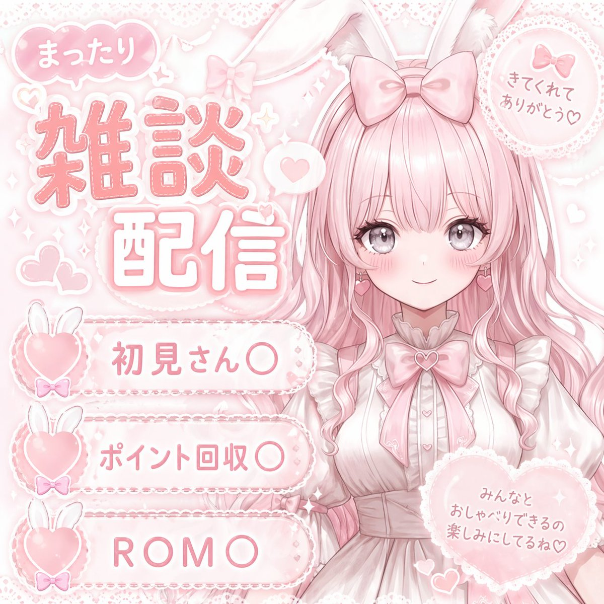
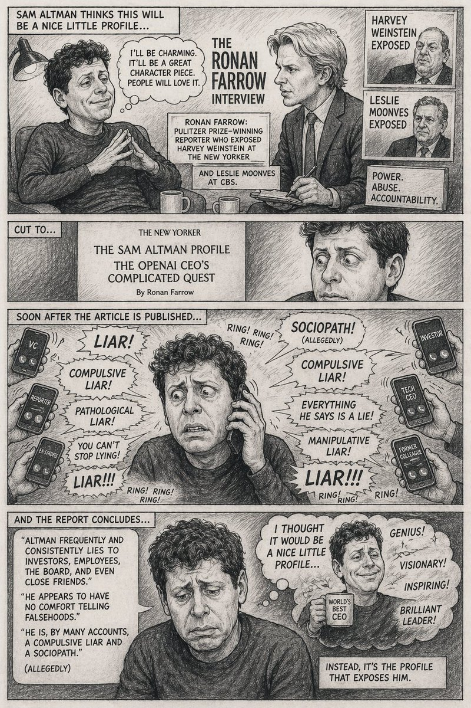
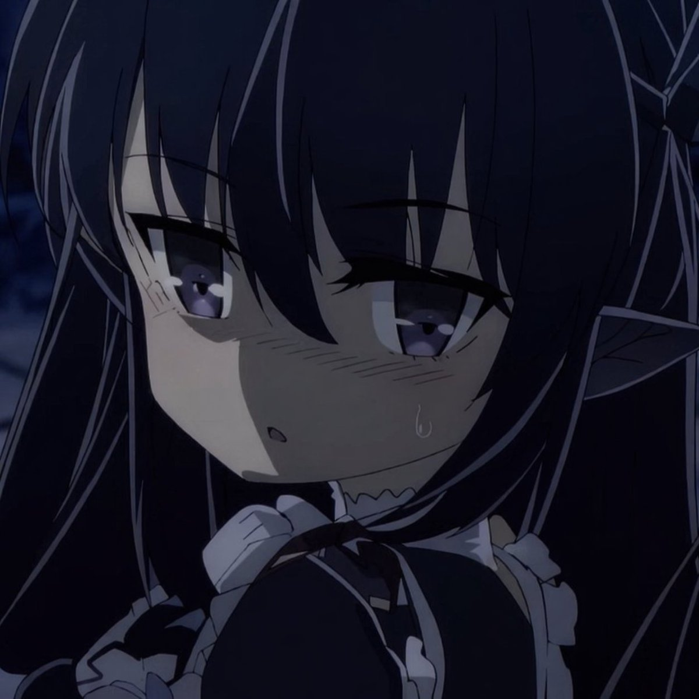

# 插画与艺术

> GPT Image 2 中文提示词案例分册 8。本分册共 27 个案例。

[返回索引](index.md)

## 案例目录

- [例 6：插画艺术创作图](#case-6)
- [例 22：插画艺术风格创作](#case-22)
- [例 24：漫画分镜叙事设计](#case-24)
- [例 32：插画艺术创作图](#case-32)
- [例 34：插画艺术创作图](#case-34)
- [例 41：插画艺术风格创作](#case-41)
- [例 43：插画艺术创作图](#case-43)
- [例 60：漫画分镜叙事设计](#case-60)
- [例 62：插画艺术风格创作](#case-62)
- [例 93：插画艺术风格创作](#case-93)
- [例 94：绘画艺术风格图](#case-94)
- [例 105：动漫插画创作图](#case-105)
- [例 113：动漫插画创作图](#case-113)
- [例 114：插画艺术创作图](#case-114)
- [例 118：漫画分镜叙事设计](#case-118)
- [例 123：插画艺术创作图](#case-123)
- [例 126：插画艺术风格创作](#case-126)
- [例 174：唐朝贵妇遛粉色马甲异形工笔画](#case-174)
- [例 196：试卷上的涂鸦巨龙](#case-196)
- [例 202：宅男必看绝美二次元少女](#case-202)
- [例 238：星云巨鲤与小人的奇幻对话](#case-238)
- [例 242：绝美国风工笔画书签设计](#case-242)
- [例 285：真实动漫画面快照](#case-285)
- [例 306：官方角色设定资料卡](#case-306)
- [例 309：创意树叶拼贴构成的角色画像](#case-309)
- [例 325：皮克斯风阳光少年](#case-325)
- [例 346：立体刺绣小鸟花枝](#case-346)

## 案例

<a id="case-6"></a>

### 例 6：插画艺术创作图


**提示词：**

```text
参考图是角色人设图，为参考图的少女绘制一副日系唯美奇幻风格插画。 
【构图】这是一个宏大的中景日系奇幻插画构图，画面中心是完全保留了完整细节的可爱少女，她站立在无边的、如镜面般平滑的水面中心。天空呈现出高饱和度的粉紫与深蓝交织，一条耀眼的蓝色巨型流星划破天际，配合着边缘发光的瑰丽层云。女孩处于背光状态，形成一个暗调但依然清晰可辨其服装和紫色明亮眼眸的剪影，被流星和星空的边缘光细腻勾勒，她微微仰头，一只手轻轻张开。下方的水面完美、对称地反射出整个壮丽的星空、流星、云彩，以及女孩清晰的倒影，点缀着微小的发光点，营造出天人合一、空灵静谧的唯美梦境意境。 
【日系唯美奇幻风格说明】该风格以高饱和度的粉紫冷暖色调交织出浩瀚星空，并辅以壮丽的流星与边缘发光的层云作为视觉奇观；画面巧妙利用“天空之镜”般的完美水面反射，将宏大的宇宙背景与孤独静立的人物剪影相融合，通过极具电影感的光影渲染与高对比度的表现手法，营造出一种空灵、静谧且带有超现实宿命感的梦境氛围。 
【要求】生成图片的比例9:16，分辨率 4k。
```

***

<a id="case-22"></a>

### 例 22：插画艺术风格创作


**提示词：**

```text
An anime-style illustration of a {argument name="action type" default="high-impact martial arts battle"} between two young female fighters in a {argument name="setting" default="traditional wooden martial arts dojo"}. In the foreground, a girl with black hair in a high bun wears a {argument name="character 1 color theme" default="red and white"} Chinese-style martial arts outfit with baggy pants. She is in a dynamic, low, forward-thrusting stance, surrounded by swirling red energy and water splashes. In the background to the right, a girl with light purple hair in twin buns wears a {argument name="character 2 color theme" default="green and purple"} Chinese dress with gold embroidery and black tights. She is leaping through the air in a flying kick pose, surrounded by swirling blue energy. The wooden floorboards are splintering from the intense impact, with debris and dust flying through the air. Above them hangs a weathered wooden sign with the text "{argument name="sign text" default="武術会"}". The scene features dramatic lighting, a low-angle dynamic perspective, and intense action effects.
```

***

<a id="case-24"></a>

### 例 24：漫画分镜叙事设计



**提示词：**

```text
原神 {argument name="character" default="Raiden Shogun"} 在{argument name="event" default="上海动漫展"}上的角色扮演自拍照
```

***

<a id="case-32"></a>

### 例 32：插画艺术创作图


**提示词：**

```text
请制作一张 3x3 字符表达网格，整体风格使用 {参数名称=艺术风格 默认=3D动画，皮克斯风格}。角色基础设定为 {参数名称=角色描述 默认=有着浓密深色卷发和圆框眼镜的年轻女子}，共同主题是 {参数名称=框架概念 默认=从白皮书的破洞中窥视}。版式为 3 行 3 列，共 9 个面板，每个面板都表现不同表情、动作和穿搭：左上眨眼并调整眼镜，穿绿色毛衣；顶部中间傻笑并放下墨镜，穿红色皮夹克；右上思考，手指放在下巴上，穿黄色连帽衫；中左灿烂微笑，手臂放在边缘，穿黑白条纹衬衫；正中微笑并竖起大拇指，穿橙色系扣衬衫；中偏右表情中性，一边喝珍珠奶茶，穿蓝色毛衣；左下高兴地挥手，穿紫色毛衣背心加白衬衫；底部中间闭眼大笑并双臂交叉，穿粉色开衫；右下表情傻气，戳脸颊，穿青色毛衣。
```

***

<a id="case-34"></a>

### 例 34：插画艺术创作图


**提示词：**

```text
请制作一张角色头像网格，主题为 {参数名称=主题 默认=西游神话}，艺术风格为 {参数名称=艺术风格 default=干净的2D卡通矢量图，粗轮廓，扁平的颜色}。背景使用 {参数名称=背景颜色 默认=浅灰色} 的细微纹理，整体排成圆形肖像网格，每个圆形下方居中放文本标签。共有 4 行内容：第一行放孙悟空、唐三藏、猪八戒、沙悟净；第二行放白龙马、玉皇大帝、观音、牛魔王；第三行放铁扇公主、红孩儿、黑风恶魔、哪吒；第四行重复部分角色，整体为 3 个，底部略微裁剪。每个角色都要保留对应描述中的形象特征，例如孙悟空是金头巾红领巾猴童，唐三藏是金冠和尚，猪八戒拿着耙子，沙悟净留着大胡子并持月牙杖，白龙马是金辔白马，玉皇大帝是白须金冠老人，观音手持柳枝，牛魔王身穿铠甲，铁扇公主拿绿棕叶扇，红孩儿有红头发、角和小火焰，黑风恶魔是红眼发光的黑暗阴影，哪吒则是双发髻并手持火矛。
```

***

<a id="case-41"></a>

### 例 41：插画艺术风格创作



**提示词：**

```text
请制作一张 VTuber 个人资料表，整体主题为 {argument name=color theme default=purple and white}，并加入优雅、蕾丝和缎带元素。角色名为 {argument name=character name default=紫咲リリー}，人设为 {argument name=character archetype default=elegant ojousama}；外观是一位动漫女孩，黑色长发带紫色挑染，紫色眼睛，穿白色西装外套、紫色百褶裙、过膝袜和缎带，站立时手指抵唇并微微侧看。右下角再放同角色的 Q 版版本，坐姿微笑。顶部左侧是写有 VTuber Profile 的缎带横幅；顶部中央放 Logo，包含 {argument name=vtuber type default=清楚系お嬢様Vtuber}、{argument name=character name default=紫咲リリー} 和 Shisaki Lily；顶部右侧放引言 {argument name=catchphrase default=皆さまの心に、優雅なひとときをお届けしますわ}，并接一段 3 行简介。左栏展示全身角色立绘；中栏包含 Profile、Personality、Hobby & Special Skill、Like & Dislike 等区块，其中 Profile 列出姓名、生日、年龄、身高、属性、一人称、出身、职业、活动开始日，Personality 为 2 行文本，Hobby & Special Skill 为趣味和特技，Like & Dislike 为喜欢和不擅长；右栏包含 Streaming Content、Schedule、Goals、Fan & Tag、Creator、Links 等区块，Fan & Tag 需列出粉丝名、粉丝画标签和总合标签，并附 4 行 hashtag 小图标，Creator 列出插画师、建模师和使用模型，Links 列出 YouTube、X(Twitter)、BOOTH、FANBOX，最下方右侧放 Q 版角色插图。页脚部分放 Rules 3 条心形图标说明，以及底部中央 2 行收尾文案。
```

***

<a id="case-43"></a>

### 例 43：插画艺术创作图


**提示词：**

```text
请制作一张人物肖像网格，主题为 {参数名称=主题 默认=权力的游戏角色}，艺术风格为 {参数名称=艺术风格 默认=2D 平面插画，干净的线条艺术，漫画风格，侧面视图朝右，苍白的皮肤带腮红}。版式为 3x3 网格，背景使用浅灰色纹理，外框是白色圆角矩形，每个框架下方都带有文本标签。整张图共 9 个肖像：琼恩·雪诺、丹妮莉丝·坦格利安、提利昂·兰尼斯特、瑟曦·兰尼斯特、奈德·史塔克、艾莉亚·史塔克、詹姆·兰尼斯特、珊莎·史塔克、席恩·葛雷乔伊，并分别保留对应外观特征，例如黑发半束、胡须、深色毛皮斗篷、银色辫子、金发辫子、短黑发、金色短发、红色辫子和深色短卷发等。
```

***

<a id="case-60"></a>

### 例 60：漫画分镜叙事设计


**提示词：**

```text
一张五面板拼贴图，采用上方 3 个面板、下方 2 个面板的网格布局。左上角是模拟时钟，青色背景，时间显示 {参数名称="时钟时间" 默认="7:42"}，整体为平面矢量图风格。中上是一位拿着扑克牌的女人，手持 5 张牌：{参数名称="牌手" 默认="黑桃 A、红心 K、梅花 Q、方块 J、黑桃 10"}，画面呈经典油画肖像风格。右上角是一杯红色液体，使用 {参数名称="玻璃类型" default="酒杯"} 盛满深红色液体，摆在大理石表面上，采用写实工作室摄影风格。左下角是棋盘，处于标准起始位置，画面里有 32 个木制棋子，以逼真的高角度拍摄呈现。右下角是两个骰子，左骰子顶部显示 {参数名称="左骰子顶部"默认="5"}，右骰子顶部显示 {参数名称="右骰子顶部"默认="2"}，风格是红蓝爆发感的波普艺术漫画书半色调。
```

***

<a id="case-62"></a>

### 例 62：插画艺术风格创作


**提示词：**

```text
一张 2x2 的横幅广告拼版图，主题是面向 {argument name="target audience" default="ママ"} 的 {argument name="main theme" default="SNSスクール"}。整体设计风格温和亲切、明亮柔和，并使用 {argument name="color palette" default="soft green, white, and natural beige tones"}。左上角面板使用摄影风格，画面是一位微笑的女性坐在桌前使用笔记本电脑，背景里有一个蹒跚学步的幼儿在玩玩具；标题文字依次为“ママの“やってみたい”を応援！”，“子育てしながら学べる”，“SNSスクール”；功能区只有 1 个图标加文字，内容是“自宅で無理なくスキルアップ (with house icon)”；底部按钮写“無料相談”。右上角面板同样是摄影风格，一位微笑的女性手拿白色杯子看着笔记本电脑；标题文字依次为“ちょっとの時間が、大きな一歩に。”，“スキマ時間を未来につなげる”，“動画講座で学びやすい”；功能区有 3 个带圆形图标和下方文字的项目，分别是“スマホでも学べる (smartphone icon)”、“1日15分からOK (clock icon)”、“繰り返し視聴できる (play button icon)”；底部按钮写“詳しく見る”。左下角面板使用水彩插画风格，画面是一位把头发扎成发髻、微笑着看笔记本电脑的女性，旁边有绿色杯子；标题文字依次为“はじめてでも大丈夫！ (with beginner mark)”，“在宅でできるSNSの仕事”，“未経験OK”；功能区有 3 个带圆形图标和下方文字的项目，分别是“サポート充実 (heart icon)”、“パソコンが苦手でも安心 (laptop icon)”、“収入の柱をつくれる (yen coin icon)”；底部按钮写“体験してみる”。右下角面板使用摄影风格，画面是一位微笑的母亲和年幼女儿坐在沙发上一起看图画书；标题文字依次为“家族との時間も大切に”，“自分らしい働き方へ”，“ママの笑顔がいちばんの未来になる。”；功能区是 3 条带勾选符号的要点，分别为“場所や時間に縛られない”、“やりがいも収入も叶う”、“子どもの成長をそばで見守れる”；左下角还有一个小小的房子和树木插图；底部按钮写“説明会へ”。所有面板底部都要放置一个 {argument name="button style" default="rounded green pill button with white text and a right-pointing arrow icon"}。
```

***

<a id="case-93"></a>

### 例 93：插画艺术风格创作


**提示词：**

```text
一张 VTuber 直播缩略图，整体是动漫风，细节丰富、可爱、闪亮，并使用压倒性的粉色配色。主角是一位棕色双丸子头、琥珀色眼睛、温柔微笑的动漫女孩，穿着粉色和服搭配白色蕾丝围裙，头上有樱花发饰，手里把一支带花装饰的粉色麦克风举在脸边。背景是粉色渐变，点缀闪光、发光爱心和装饰性的粉色蝴蝶结。画面上方放一个横幅文字：{argument name="top subtitle" default="まったりおしゃべりしよ〜🤍"}。主标题写 {argument name="main title" default="雑談配信"}，标题周围围着 3 个大型桃子插图。中间再放一条横幅文字：{argument name="middle subtitle" default="みんなと楽しい時間を過ごしたいなっ♡"}。左下角放 3 条项目符号，使用桃子图标，文字分别是 {argument name="bullet 1" default="初見さん〇"}、{argument name="bullet 2" default="ポイント回収〇"}、ROMO。右下角放一个对话气泡，文字是“コメント大歓迎♪ いっぱいお話し しようねっ♡”。
```

***

<a id="case-94"></a>

### 例 94：绘画艺术风格图



**提示词：**

```text
一张 VTuber 直播缩略图，主题是浅粉色、柔和、可爱，并带有蕾丝、丝带、爱心和兔子元素。角色位于右侧上半身出镜，是一位动漫女孩，拥有 {argument name="hair color" default="pastel pink"} 的长波浪头发、大大的灰色眼睛、脸颊红晕和粉色爱心耳环；她戴着白色兔耳朵，头上还有一个大大的粉色蝴蝶结；穿着带蕾丝的白色蓬松连衣裙，领口处系着一条带爱心宝石的巨大粉色缎带蝴蝶结。背景是柔和粉色，带有细微闪光、蕾丝图案和漂浮爱心。左上角放主标题，使用大号、带白色描边的粉色装饰字体，文字为 {argument name="main title" default="雑談配信"}；标题上方放一个对话气泡，文字“まったり”。右上角放一个带蕾丝边和小粉色蝴蝶结的圆形徽章，文字“きてくれてありがとう♡”。右下角放一个大号蕾丝边爱心徽章，文字“みんなとおしゃべりできるの楽しみにしてるね♡”。左下角放一个 3 条项目的列表区，使用横向圆角长条横幅、蕾丝边，每条左侧都有带白色兔耳朵和小蝴蝶结的粉色爱心，文字分别是 {argument name="list item 1" default="初見さん〇"}、{argument name="list item 2" default="ポイント回収〇"}、{argument name="list item 3" default="ROM〇"}。
```

***

<a id="case-105"></a>

### 例 105：动漫插画创作图


**提示词：**

```text
A high-energy VTuber thumbnail illustration of a smiling anime girl with {argument name="hair color" default="bright blue"} hair in a high ponytail wearing a white shirt. The background is an explosive burst of rainbow light rays and golden sparkles. A golden retro microphone sits in the bottom left. Massive, shiny 3D gold text on the left reads "{argument name="main title text" default="初配信"}". A 3D gold and blue subtitle reads "{argument name="subtitle text" default="一緒に最高の時間を！"}". An ornate blue and gold oval badge in the bottom right displays "{argument name="character name" default="エリン Erin"}". A red top-right badge reads "{argument name="badge text" default="LIVE"}".
```

***

<a id="case-113"></a>

### 例 113：动漫插画创作图


**提示词：**

```text
一幅非常详细的动画插图，描绘了一位凶猛的女战士，拥有飘逸的长发和锐利的{argument name="eye color" default="blue"}眼睛，身穿金色镶边的银色板甲和{argument name="outfit color" default="blue and White"}外衣。她以一种动态的战斗姿态被捕捉到，挥舞着一把巨大的{argument name="weapon type" default="segmentedMetallick-whip-sword"}，它戏剧性地弯曲到最远的前景。该武器留下了一道扫过的动能和风的痕迹。该场景以{argument name="background setting" default="废墟战场为背景，岩石地形、漂浮碎片和大型蓝色横幅在风中飘扬"}，天空阴云密布。该艺术作品具有电影般的灯光、激烈的动作以及对武器的戏剧性强制视角。
```

***

<a id="case-114"></a>

### 例 114：插画艺术创作图



**提示词：**

```text
一张 4 格竖式漫画，整体风格为 {参数名称="艺术风格" 默认="黑白铅笔素描、剖面线阴影、讽刺漫画漫画"}。主角有两位：{参数名称="主角" 默认="山姆·奥特曼"}，卷发，穿休闲毛衣；以及 {参数名称="采访者" 默认="罗南·法罗"}，穿西装、打领带、手里拿着记事本。第 1 格顶部写“萨姆·奥特曼认为这将是一个不错的小简介……”，画面里 subject_1 双手交叉、看上去得意洋洋，subject_2 则认真记笔记；中间文字写“罗南·法罗采访”；插入 2 张肖像，标签分别是“哈维·韦恩斯坦曝光”和“莱斯利·穆恩维斯曝光”；信息框有 3 条文字，分别是“罗南·法罗：在《纽约客》上揭露哈维·韦恩斯坦的普利策奖获奖记者”、“还有哥伦比亚广播公司的莱斯利·穆恩维斯。”、“权力。滥用。责任。”。第 2 格顶部写“切至...”，画面是 subject_1 的特写镜头，看起来很震惊，文章标题区域写 {argument name="publication" default="THE NEW YORKER"}、SAM ALTMAN 简介、OPENAI CEO 的复杂任务、作者：Ronan Farrow。第 3 格顶部写“文章发布后不久...”，画面里 subject_1 看起来压力很大、满头大汗，把手机放在耳边，周围有 6 只手拿着智能手机；手机标签依次是 VC、记者、前员工、投资者、技术首席执行官、前同事；喊叫文本共有 8 条，分别是 {参数名称="主要指控" 默认="骗子"}!、强迫性的骗子！、病态的骗子！、你不能停止撒谎！、骗子！！！、社交变态者！（据称）、他说的一切都是谎言！、操纵性的骗子！；音效写“铃声！铃声！铃声！”。第 4 格顶部写“报告结论...”，画面里 subject_1 看起来彻底失败和沮丧，quote box 里写“奥特曼经常对投资者、员工、董事会甚至亲密朋友撒谎。”“他似乎不愿意说谎。”“从很多方面来看，他是一个强迫性的说谎者和一个社交路径。”（据称）；同时还有一个思想泡泡，画面是快乐的 subject_1 拿着“世界最佳首席执行官”马克杯，文字写“我认为这会是一个不错的小配置文件......”，sparkle words 有 4 条，分别是“天才！”、“有远见！”、“鼓舞人心！”、“才华横溢的领导者！”；底部标题写“相反，是个人资料暴露了他。”。
```

***

<a id="case-118"></a>

### 例 118：漫画分镜叙事设计


**提示词：**

```text
一幅高对比度的黑白插图，描绘了一位身穿锋利西装的老人正在画武士刀。男人有着向后梳的白发，皱纹很深，低头看着刀刃，表情紧张而专注。他穿着深色西装、白衬衫和深色领带。他的手在前景中占据显着位置，当他们握住武士刀华丽的手柄和刀鞘时，呈现出明显的静脉和皱纹。背景是全黑的，强调了戏剧性的灯光和男人的脸、手和衣服上复杂的交叉阴影细节。这种风格类似于一部详细、坚韧的漫画或图画小说。
```

***

<a id="case-123"></a>

### 例 123：插画艺术创作图


**提示词：**

```text
一张动漫角色设定资料页，角色名为 {argument name="character name" default="真田大助"}。角色是一位年轻武士，留着长棕发，穿着武士风格盔甲，胸甲和护具使用 {argument name="main color" default="red"}，百褶袴使用 {argument name="secondary color" default="navy blue"}，并搭配白色短披风。页眉区域要显示标题 {argument name="character name" default="真田大助"}，副标题为 {argument name="character concept" default="戦国時代を舞台にした物語の主人公。日英クォーターの若き武将。"}，并带有“設定資料”徽章。右侧是一张大幅全身站姿正面图，表情自信微笑；背景元素包括六文钱家徽、引语 {argument name="catchphrase" default="この国を守る。その誇りと共に。"}，以及右下角带军旗的黑白日本城堡场景。左侧和下方要按设定页方式排版：左上是 6 行内容的“プロフィール”表格，中左是 3 个视图的“三面図”，分别标注“正面”“側面”“背面”，上中是 6 个表情差分，分别标注“通常”“微笑み”“真剣”“怒り”“驚き”“考え中”，左下是 9 项“衣装・装備詳細”，分别列出“胸当て”“肩当て”“腕甲(籠手)”“脚甲(脛当て・膝当て)”“革靴”“白マント(短)”“帯”“袴/着物部分”“打刀”，下中是 8 色“カラーパレット”，分别为“真田赤”“濃紺”“金”“白”“茶”“茶褐色”“肌色”“銀”，右下是“世界観”段落说明。
```

***

<a id="case-126"></a>

### 例 126：插画艺术风格创作


**提示词：**

```text
An anime-style light novel cover illustration featuring two characters in an intimate pose. On the left, a young woman with short dark hair, purple eyes, wearing a white hat, a frilly white dress with a pink bow tie, white gloves, and two white flower hairpins. She has an affectionate, teasing smile and is gently touching the chin of the man next to her. On the right, an adult man with {argument name="man's hair color" default="red"} hair parted in the middle, purple eyes, and a light goatee. He is wearing a black button-down shirt and has a slightly annoyed, reluctant expression with a sweat drop on his cheek. The scene features soft, romantic lighting with out-of-focus purple flower petals in the foreground corners. The image includes several Japanese text elements: a large stylized main title at the bottom reading {argument name="main title" default="ちかつば"}, a subtitle below it reading {argument name="subtitle" default="ーその溺愛、独占欲の裏返し。ー"}, vertical text on the top left reading {argument name="left quote" default="可愛いだけじゃ、許さない。"}, and vertical text on the top right reading {argument name="right quote" default="その不機嫌、俺だけに向けろよ。"}.
```

***

<a id="case-174"></a>

### 例 174：唐朝贵妇遛粉色马甲异形工笔画


**提示词：**

```text
一幅细节丰富的工笔画，描绘了一位唐朝贵族女子在御花园中漫步。她看起来优雅而平静。

她手里拿着一根金色的牵引绳。牵引绳的尽头是一只可怕的**异形怪物（出自电影《异形》）**。然而，这只异形穿着一件**可爱的粉色丝绸马甲**，并且表现得像一只训练有素的狗。

背景有牡丹和蝴蝶。

**在右下角，有一个红色的竖排艺术家印章，写着“吴先生”（Mr. Wu），风格像水印一样。** --ar 3:4
```

***

<a id="case-196"></a>

### 例 196：试卷上的涂鸦巨龙


**提示词：**

```text
一个巨大的巨龙，庞大的规模，高耸的存在感，
一个远超人类尺寸的巨大实体，压倒性和压迫性的，
用极其密集的混乱涂鸦线条绘制，
超密集的重叠笔触，纠缠和混乱的线条画，
在真实的印刷英文/中文教科书或试卷页面上，
可见的文本、布局和纸张纹理清晰透出，
圆珠笔绘画风格，精细的墨水线条，杂乱的分层笔触，
没有干净的轮廓，一切由混乱的涂鸦构成，
黑暗和柔和的底色（黑色，深靛蓝，暗紫罗兰色），
带有微妙的低饱和度霓虹点缀（蓝色，青色，紫色），
仅在关键区域（眼睛，核心，裂缝，静脉）有选择性的生物发光，
不是整体的亮度，
取决于主体的有机或机械纹理，
错综复杂的细节，复杂的表面图案，
形态从混乱中浮现，
高密度中心，边缘消融为松散的涂鸦，
主体附近微小的人类剪影强调了尺度感，
半透明层，由线条密度产生的深度，
原始的，不完美的，嘈杂的，充满活力的手绘感，
略带诡异，超现实，神秘的氛围，
混合媒体插画，涂鸦艺术，
极其详细，黑暗团块和发光点缀之间的高对比度，
杰作，极其详细
```

***

<a id="case-202"></a>

### 例 202：宅男必看绝美二次元少女


**提示词：**

```text
生成高质量美女（宅男必备）
```

***

<a id="case-238"></a>

### 例 238：星云巨鲤与小人的奇幻对话


**提示词：**

```text
一幅超现实主义数字插画风格，采用低角度仰拍视角。画面描绘了一条巨型彩色锦鲤遨游在梦幻般的星云中，四周环绕着色彩鲜艳的星云与气泡。 
画面中央还站着一个小人，背对观众，神情平静地仰望空中这条巨大的锦鲤，锦鲤头向下看着小人。 
整体画面呈现出强烈的大小对比，氛围空灵又梦幻。比例9:16
```

***

<a id="case-242"></a>

### 例 242：绝美国风工笔画书签设计


**提示词：**

```text
生成一系列工笔画书签的设计稿
```

***

<a id="case-285"></a>

### 例 285：真实动漫画面快照



**提示词：**

```text
向我展示这张附带的图像作为一部真实动漫的快照
```

***

<a id="case-306"></a>

### 例 306：官方角色设定资料卡


**提示词：**

```text
基于此角色和背景，请制作一份类似官方设定资料的角色资料卡。
・包含三视图：正面、侧面和背面
・添加角色面部表情的变化・分解并展示服装和装备的详细部分
・添加色板・包含世界观设定的简要说明
・总体上，使用有组织的布局（白色背景，插画风格）
```

***

<a id="case-309"></a>

### 例 309：创意树叶拼贴构成的角色画像


**提示词：**

```text
以 {角色名称} 为主体，整体完全由天然树叶制成，做成创意树叶拼贴艺术。画面用分层的绿叶和干叶构成身体、面部和衣服，清楚展示叶脉和纹理，呈现手工植物艺术风格。背景保持干净的白色，构图为俯视平铺，高度细节，使用柔和自然光，并强调逼真的树叶纹理，整体达到 8k 质感。
```

***

<a id="case-325"></a>

### 例 325：皮克斯风阳光少年


**提示词：**

```text
一个风格化的3D卡通肖像，一位年轻男子，拥有短棕发和富有表现力的绿色眼睛，温暖地微笑。他穿着黑色西装外套内搭白色T恤，现代休闲时尚。类似皮克斯/迪士尼风格角色设计，皮肤光滑，柔和光照，略微夸张的面部特征。高细节、精美的3D渲染，友好且平易近人的表情。渐变背景为柔和的蓝绿色和粉色，工作室灯光，浅景深，高分辨率。
```

***

<a id="case-346"></a>

### 例 346：立体刺绣小鸟花枝


**提示词：**

```text
精致立体刺绣风插画，浅浮雕纤维艺术效果，纯净「蚕丝白 + 奶白」底色，细腻丝线质感。画面为数只小鸟停在蜿蜒花枝上，周围点缀粉白、浅桃、珊瑚粉、淡金色花朵与叶片，构图轻盈雅致、留白充足。鸟儿羽毛以奶白、浅蓝、淡粉、浅金丝线刺绣表现，花枝纤细自然，花朵层层叠线，整体呈现高级手工刺绣、丝线堆绣、柔和光影、细节丰富、温柔清新的艺术效果。
```

***
