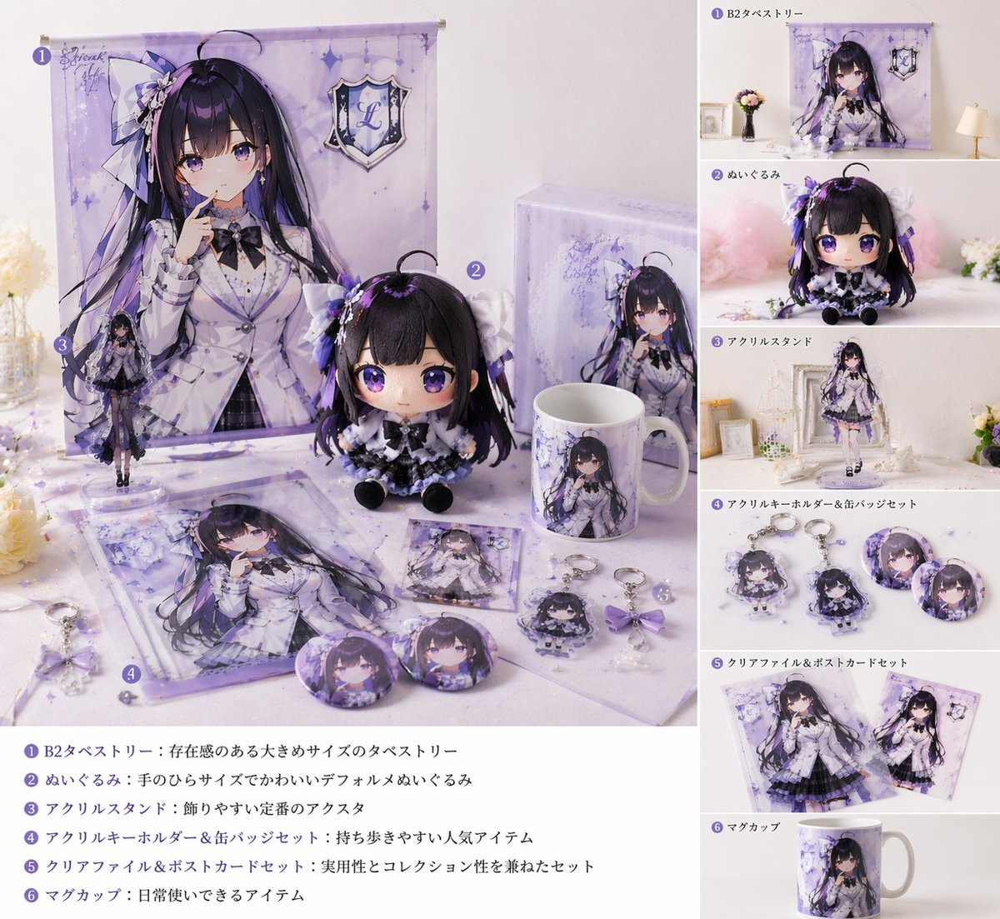
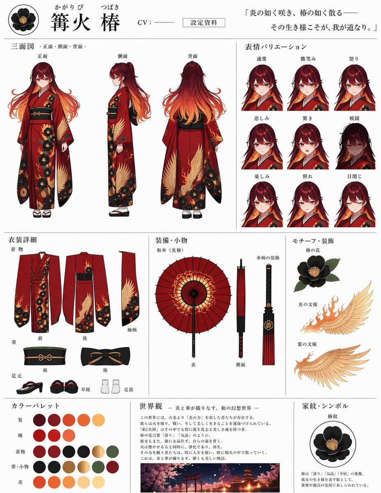
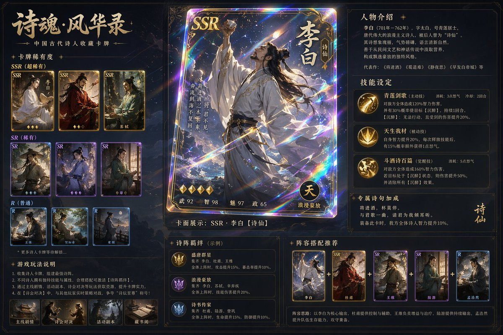
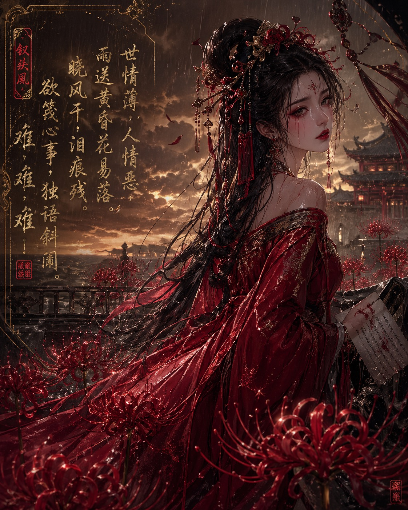

# 人物与角色

> GPT Image 2 中文提示词案例分册 9。本分册共 8 个案例。

[返回索引](index.md)

## 案例目录

- [例 27：人物角色设定图](#case-27)
- [例 54：人物角色设定图](#case-54)
- [例 155：人物角色设定图](#case-155)
- [例 162：人物角色设定图](#case-162)
- [例 166：十二黄金圣斗士卡牌合集](#case-166)
- [例 271：人物角色设定图](#case-271)
- [例 290：古风诗人镭射典藏卡牌](#case-290)
- [例 340：彼岸花丛中的红妆女子](#case-340)

## 案例

<a id="case-27"></a>

### 例 27：人物角色设定图


**提示词：**

```text
一组即时照片，平铺在白色布料表面上。角色拥有{argument name="hair color" default="long pink hair with blue inner color"}，穿着{argument name="outfit" default="black and white maid uniform with frilly headband and black ribbons"}，眼睛是reddish-pink。整体排成两行五张的宝丽来照片，共10张：上排第1张手里抱着粉色爱心抱枕；第2张眨眼并比出剪刀手；第3张做手势爱心，底边有粉色爱心涂鸦；第4张双手托腮，神情温柔微笑；第5张手持红玫瑰并眨眼。下排第1张手指抵唇，表情羞涩；第2张抱着一块小粉色蛋糕；第3张眨眼、手靠近脸，边框上有签名'{argument name="signature text" default="Hanashi"}'和爱心涂鸦；第4张抱着粉色兔子玩偶，带闪光涂鸦，边框上有签名'{argument name="signature text" default="Hanashi"}'和兔子涂鸦；第5张眨眼、带闪光涂鸦，边框上有信息'{argument name="message text" default="いつも応援ありがとう！これからもよろしくね♪"}'以及签名'{argument name="signature text" default="Hanashi"}'。
```

***

<a id="case-54"></a>

### 例 54：人物角色设定图


**提示词：**

```text
一个2x2的四宫格讽刺产品广告网格。左上角是{argument name="top left product name" default="座る石"}：画面里一名穿白衬衫和深色裤子的男人坐在公园里一块巨大的圆石上；文案是“いつでも、どこでも、落ち着ける。”；销售徽章写着“累計販売数 12,000個 突破!”；竖排文字是“公園のベンチが埋まっていた日に。”；功能点共3条，分别是“重さ約8kgで安定感抜群”“底面フェルト加工で傷つけにくい”“付属の専用ベルトで持ち運び簡単”；旁边再放一张带皮革背带的小图；规格写“耐荷重 150kg”“安心の日本製”。右上角是{argument name="top right product name" default="磨きたくない人の歯ブラシ"}：一支浅蓝色牙刷斜放在深蓝背景上，牙刷上写着“I don't want to brush my yeeth.”，主文案“持っているだけで安心感”，竖排文字“歯を磨く代わりに、これを持つ。”，销售徽章“シリーズ累計販売数 85,000本 突破!”；功能点3条分别是“気持ちを落ち着けるお守り代わりに”“会議や商談前のエチケットに”“磨かない選択を、もっと自由に。”；底部横幅写“歯磨きストレスから、あなたを解放する。”。左下角是{argument name="bottom left product name" default="雲の貯金箱"}：手把硬币投入毛茸茸的白色云朵存钱罐，文案“空気より軽い、安心感。”，销售徽章“累計販売数 23,567個 突破!”；功能点3条是“ふわふわの触り心地”“割れないから安心”“インテリアに馴染むデザイン”；颜色变体有 blue、pink、white 三种；价格为“¥2,980 (税込)”；底部文字是“今日から、空に向かってコツコツ貯めよう。”。右下角是{argument name="bottom right product name" default="叱ってくれる石"}：一块圆石放在木桌上，旁边有笔，石头上写字；石头文字是{argument name="scolding phrase" default="いいかげんやれ"}；主文案“やる気が出ないあなたへ。”；销售徽章“累計販売数 18,000個 突破!”；功能点3条是“見るたびに心を奮い立たせる”“厳選された言葉をランダム表示”“電池不要、半永久的に叱ってくれる”；可选短句10条分别是“甘えるな”“考えるな”“動け”“現実を見ろ”“逃げるな”“寝るな”“やればできる”“お前ならできる”“寝るな”“もう言い訳するな”；价格为“¥3,500 (税込)”。
```

***

<a id="case-155"></a>

### 例 155：人物角色设定图



**提示词：**

```text
在{argument name="style" default="live-action"}中为标准{argument name="character type" default="Vtuber"}创建{argument name="items" default="fangoods"}
```

***

<a id="case-162"></a>

### 例 162：人物角色设定图


**提示词：**

```text
如果{argument name="voice" default="chatgpt voice"}是一个角色，就把它设计成一个角色形象。
```

***

<a id="case-166"></a>

### 例 166：十二黄金圣斗士卡牌合集


**提示词：**

```text
生成圣斗士星矢12个黄金圣斗士的12宫格卡牌图片，每张卡牌上写上对应的中文名，每行4个，宽高比16:9。
```

***

<a id="case-271"></a>

### 例 271：人物角色设定图



**提示词：**

```text
お借りして噂のGPT-Image-2でキャラシート作ってみましたｽｺﾞｯ(๑°ㅁ°๑)‼✧更に色々指示してあげたらもっといい感じになりそう✨キャラは以前チャッピーにお願いして描いて貰った我が分身です( *¯ ꒳¯*)
```

***

<a id="case-290"></a>

### 例 290：古风诗人镭射典藏卡牌



**提示词：**

```text
为中国古代诗人设计一套游戏卡片，并按照SSR SR R 分级，重点卡片有放大展示的效果，包括卡面设计和人物介绍，有很高级的游戏卡片质感，稀有卡片还会有特色的光影例如镭射效果 需要有套卡设计和技能设计，并附带较为详细的说明
```

***

<a id="case-340"></a>

### 例 340：彼岸花丛中的红妆女子



**提示词：**

```text
异质感oc，绝美红妆女子，位于彼岸花丛中，张力。 唐琬《钗头凤·世情薄》 世情薄，人情恶，雨送黄昏花易落。晓风干，泪痕残。欲笺心事，独语斜阑。难，难，难！
```

***
