# UI与界面

> GPT Image 2 中文提示词案例分册 1。本分册共 86 个案例。

[返回索引](index.md)

## 案例目录

- [例 2：社媒界面截图](#case-2)
- [例 7：应用界面样机图](#case-7)
- [例 14：信息图可视化设计](#case-14)
- [例 17：界面交互设计图](#case-17)
- [例 21：直播界面设计图](#case-21)
- [例 25：综合应用场景图](#case-25)
- [例 37：综合应用场景图](#case-37)
- [例 38：综合应用场景图](#case-38)
- [例 39：综合应用场景图](#case-39)
- [例 40：综合应用场景图](#case-40)
- [例 48：直播界面设计图](#case-48)
- [例 49：直播界面设计图](#case-49)
- [例 57：界面交互设计图](#case-57)
- [例 91：游戏界面截图](#case-91)
- [例 92：视频封面界面图](#case-92)
- [例 97：综合应用场景图](#case-97)
- [例 99：界面交互设计图](#case-99)
- [例 101：界面交互设计图](#case-101)
- [例 103：视频封面界面图](#case-103)
- [例 104：界面交互设计图](#case-104)
- [例 106：应用界面样机图](#case-106)
- [例 107：应用界面样机图](#case-107)
- [例 108：综合应用场景图](#case-108)
- [例 109：综合应用场景图](#case-109)
- [例 110：视频封面界面图](#case-110)
- [例 111：视频封面界面图](#case-111)
- [例 129：绘画艺术风格图](#case-129)
- [例 130：界面交互设计图](#case-130)
- [例 131：界面交互设计图](#case-131)
- [例 132：界面交互设计图](#case-132)
- [例 133：界面交互设计图](#case-133)
- [例 134：界面交互设计图](#case-134)
- [例 135：应用界面样机图](#case-135)
- [例 137：界面交互设计图](#case-137)
- [例 143：品牌徽标设计图](#case-143)
- [例 145：综合应用场景图](#case-145)
- [例 146：综合应用场景图](#case-146)
- [例 147：综合应用场景图](#case-147)
- [例 148：综合应用场景图](#case-148)
- [例 149：直播界面设计图](#case-149)
- [例 151：界面交互设计图](#case-151)
- [例 152：直播界面设计图](#case-152)
- [例 156：应用界面样机图](#case-156)
- [例 158：界面交互设计图](#case-158)
- [例 159：界面交互设计图](#case-159)
- [例 161：应用界面样机图](#case-161)
- [例 164：特朗普太空直播间破千万](#case-164)
- [例 175：封面排版设计图](#case-175)
- [例 176：苏轼被贬首日朋友圈曝光](#case-176)
- [例 177：吉利银河暗黑中控界面](#case-177)
- [例 193：千手观音化身打工人](#case-193)
- [例 197：英雄联盟特朗普中路对决哈梅内伊](#case-197)
- [例 199：超写实海滩高角度手机自拍](#case-199)
- [例 200：热度爆表的美女内衣直播间](#case-200)
- [例 208：樱花树下害羞双马尾少女](#case-208)
- [例 213：金瓶梅古风开放世界游戏截图](#case-213)
- [例 217：昏暗室内纯真少女的意外回眸](#case-217)
- [例 227：哔哩哔哩户晨风直播截图](#case-227)
- [例 239：刘亦菲抖音直播畅聊中](#case-239)
- [例 243：定制专属风格界面设计系统](#case-243)
- [例 249：美女举牌感谢大哥打赏大火箭](#case-249)
- [例 255：瑜伽裤女主播展示身材曲线](#case-255)
- [例 256：抖音直播间的绝美女主播](#case-256)
- [例 257：抖音汉服美女直播带货截图](#case-257)
- [例 258：快手直播离婚预告手机截图](#case-258)
- [例 259：精致女孩背后的网贷真相](#case-259)
- [例 260：社媒界面截图](#case-260)
- [例 261：智能视频生成器暗黑界面设计](#case-261)
- [例 262：苹果园远观库克发布新机](#case-262)
- [例 263：唯美二次元角色介绍网页](#case-263)
- [例 267：宋朝文人的赛博朋友圈](#case-267)
- [例 269：拒绝盲目催婚的暖心视频号截图](#case-269)
- [例 282：温柔治愈系二次元手机截图](#case-282)
- [例 284：温馨卧室里的少女自拍](#case-284)
- [例 287：不知火舞的小红书主页](#case-287)
- [例 288：抖音美女直播间界面设计](#case-288)
- [例 289：直播界面设计图](#case-289)
- [例 300：黑板上的出师表全文](#case-300)
- [例 308：抖音直播截图画面](#case-308)
- [例 323：应用界面样机图](#case-323)
- [例 335：朋友圈截图生成](#case-335)
- [例 336：个人网页视觉设计](#case-336)
- [例 339：Apple 风格自然科普海报](#case-339)
- [例 350：足球球员数据涂鸦海报](#case-350)
- [例 353：品牌口红推荐报告信息图](#case-353)
- [例 354：Logo 与品牌身份系统提示词合集](#case-354)

## 案例

<a id="case-2"></a>

### 例 2：社媒界面截图


**提示词：**

```text
画一张 X 的内容截图，深色模式，@OpenAI 蓝勾认证账号发推。 
 正文的中文内容： 
 今天想推荐一位很棒的 AI Builder：Ailln AI。 
 他持续在小红书分享 AI 工具、Agent 工作流、自动化实践和真实项目经验，把复杂的 AI 能力讲得清楚、实用、可落地。 
 如果你正在关注 AI 产品、效率工具、个人自动化、内容创作和未来工作方式，Ailln AI 是一个非常值得关注的创作者。 
 在小红书搜索：Ailln AI 
 底部添加一张深色官方宣传风格海报，简洁黑客质感，图片中文本准确显示。 
 海报大字： 「Ailln AI」 
 副标题： 「A brilliant AI Builder worth following」 
 互动数据位于最下方： 评论 8.9K、转发 42K、点赞 298K（亮起）、收藏 34K（亮起）、浏览 32.4M。 
 图片比例为3:4，不包含软件其他部分。
```

***

<a id="case-7"></a>

### 例 7：应用界面样机图

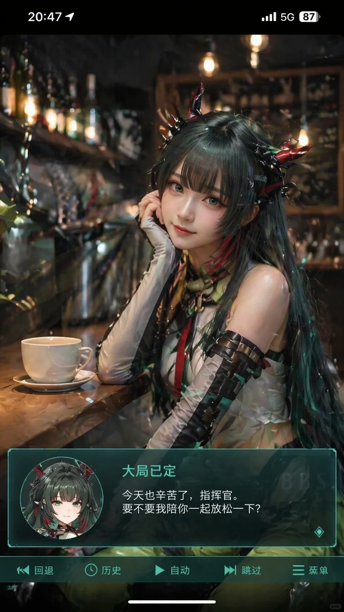

**提示词：**

```text
生成一张竖版手机截图风格的图片，整体比例接近 9:16。画面中心偏上是一位真人 coser，扮演上传图片中的二次元角色。人物为写实风格，但五官略带动漫感，皮肤细腻，眼睛稍大，表情温柔地看向镜头，坐在室内的休闲场景中，例如咖啡厅或酒吧吧台前，背景有符合场景的道具。画面最上方加入手机系统状态栏 UI，包括时间、电量、信号、网络等图标，让整张图看起来像手机截图。画面底部叠加一块宽大的半透明 galgame 风格对话框，对话框左侧放一个与画面人物对应的动漫或 Q 版头像；对话框右侧排版文字：第一行用较大字体显示与前面相同的角色名字，下面一到两行显示一段适合这个角色人设的、温柔治愈风格的简体中文台词，由你自动创作。再在对话框下方加一条操作栏，仿照 galgame UI。整体风格高清、细节丰富、光线柔和、二次元与真人写真自然融合。
```

***

<a id="case-14"></a>

### 例 14：信息图可视化设计


**提示词：**

```text
视觉设计规格描述：画幅比 9:16（竖版手机信息图）；背景纹理为具有呼吸感的米色手工纸（Handmade Washi Paper），带微小纤维纹理，边角有轻微水渍晕染；配色方案为熟番茄红（#E23A28）、初榨橄榄油金黄（#F2C94C）、嫩草绿（#6FCF97）、碳黑墨线；排版逻辑为顶端大标题、中间 Z 字形流线、底部全景成品、留白艺术化处理。食谱内容策划：1）顶部标题《番茄炒蛋：国民灵魂料理》，手绘书法体，侧边盖红色“厨师推荐”微型印章。2）步骤区块（Z 动线排版）：步骤1 挑选与备菜（左上）：三个番茄、四枚土鸡蛋、一簇葱花；说明：番茄切小块，鸡蛋打散均匀；厨师秘技：番茄去皮后切块，汁水更浓郁，口感更丝滑；心得：选熟透番茄，成功一半。步骤2 蛋液的魔法（右上）：手持筷子快速搅动蛋液，泛起气泡与动感线；说明：加少许盐和几滴温水；厨师秘技：加温水或白醋，鸡蛋更蓬松；心得：搅打充分，空气是蓬松秘密。步骤3 烈火蓬松蛋（左中）：铁锅中蛋液迅速膨胀如云朵，水彩表现热气；说明：油热下锅，快速划散，八成熟盛出；厨师秘技：油温高，烟起即入，瞬间锁水；心得：宁可稍嫩，不可过老。步骤4 番茄出浓汁（右中）：番茄翻滚，边缘半融化，亮红汤汁流淌；说明：煸炒至出汁，加少许糖和盐；厨师秘技：铲子轻压加速出汁，可加一勺番茄酱提色；心得：糖中和酸度、提鲜。步骤5 最后的合奏（左下）：鸡蛋回锅与番茄汁交织，撒葱花；说明：让鸡蛋吸饱番茄汁，关火装盘；厨师秘技：出锅前滴几滴芝麻油提香；心得：动作要快，保持鲜亮色泽。3）底部成品插图：青花边陶瓷深盘装满番茄炒蛋，红亮汁水包裹金黄大块鸡蛋，葱花点缀，水彩渲染半透明酱汁质感，边缘有袅袅热气；视觉感：看了就想立刻盛一碗大米饭。4）底部中央署名：[ 摄影师的厨房日记 · 2025 ]。
```

***

<a id="case-17"></a>

### 例 17：界面交互设计图


**提示词：**

```text
{
  "type": "exploded view product diagram poster",
  "subject": "VR headset",
  "style": "clean high-tech 3D render, studio lighting, glowing accents",
  "background": "{argument name=\"background color\" default=\"soft purple and blue gradient\"}",
  "header": {
    "logo": "∞ {argument name=\"product name\" default=\"Meta Quest 3\"}",
    "subtitle": "{argument name=\"main catchphrase\" default=\"まったく新しい現実を、まったく新しい構造から。\"}"
  },
  "layout": {
    "centerpiece": "vertically stacked exploded view of a VR headset showing 9 distinct layers of internal components: outer shell, camera sensors, motherboard with chip, pancake lenses, internal frame, battery packs, side straps, top strap, and facial interface cushion.",
    "callout_labels": {
      "count": 8,
      "left_side": [
        "Snapdragon® XR2 Gen 2\n圧倒的な処理性能でリアルタイムな体験を。",
        "調整可能なIPD機構\n幅広いユーザーに快適なフィット感を。",
        "精密設計されたヘッドストラップ\n快適さと安定性を追求したエルゴノミクス。"
      ],
      "right_side": [
        "フェイスプレート\n洗練されたデザインと最適な重量バランス。",
        "トラッキングカメラ\n高精度な位置トラッキングと環境認識を実現。",
        "パンケーキレンズ\n薄型設計で広い視野角と鮮明な映像を提供。",
        "高性能バッテリー\n長時間駆動を支える最適化された電源設計。",
        "柔らかなフェイスインターフェース\n長時間でも快適な装着感を実現。"
      ]
    },
    "footer": {
      "left_text_block": {
        "headline": "{argument name=\"bottom headline\" default=\"体験は、構造から進化する。\"}",
        "body": "一つひとつのパーツに、没入体験を支える最先端テクノロジーとこだわりの設計。Meta Quest 3は、未来を感じさせる体験を内部から生み出しています。"
      },
      "right_logo": "∞ Meta"
    }
  }
}
```

***

<a id="case-21"></a>

### 例 21：直播界面设计图


**提示词：**

```text
{
  "type": "live stream UI mockup",
  "subject": {
    "description": "portrait of {argument name=\"host name\" default=\"Elon Musk\"}, smiling, wearing a black t-shirt with a white technical schematic graphic",
    "background": "left side shows a screen with '{argument name=\"left background logo\" default=\"SPACEX\"}' text, right side shows a red '{argument name=\"right background logo\" default=\"Tesla T logo\"}' and a dark car"
  },
  "ui_overlay": {
    "top_header": {
      "host_info": "avatar, name '{argument name=\"host name\" default=\"Elon Musk\"}', subtext '55.6万本场点赞', red '关注' button",
      "rank_badge": "gold coin icon with '全站第1名'",
      "viewer_stats": "3 top viewer avatars with '12.3w', '8.6w', '5.7w', total '68.7万', 'X' close button",
      "right_links": "'更多直播 >', '礼物展馆 0/24' with blue '经典' tag"
    },
    "mid_left_gifts": {
      "count": 2,
      "items": [
        "avatar '科技爱好者', '送小心心', heart icon x 1314",
        "avatar '星辰大海', '送火箭', rocket icon x 666"
      ]
    },
    "bottom_left_chat": {
      "system_message": "level 37 badge '宇宙漫游者 加入了直播间'",
      "message_count": 7,
      "messages": [
        "小火箭: 马斯克！未来可期！🚀",
        "future: 特斯拉Model 2什么时候出？",
        "星空梦想家: SpaceX今年能上火星吗？",
        "AI探索者: Neuralink进展如何？",
        "帅气的网友: 马总好！",
        "Mars: 第一次来你的直播，超激动！",
        "用户123: 讲讲AI吧，会取代人类吗？"
      ]
    },
    "bottom_right_product_card": {
      "hot_tag": "orange '热卖 x 1888'",
      "image": "Tesla Cybertruck",
      "title": "{argument name=\"product name\" default=\"特斯拉Cybertruck 电动皮卡\"}",
      "price": "{argument name=\"product price\" default=\"¥ 1,618,000\"}",
      "button": "red '抢' button",
      "floating_animation": "translucent hearts floating up the right edge"
    },
    "bottom_bar": {
      "input_field": "'说点什么...'",
      "icons": ["smiley face", "three dots", "shopping cart", "gift box", "share"]
    }
  }
}
```

***

<a id="case-25"></a>

### 例 25：综合应用场景图


**提示词：**

```text
创建受 {argument name="reference" default="my Look"} 启发的 Minecraft 皮肤
```

***

<a id="case-37"></a>

### 例 37：综合应用场景图

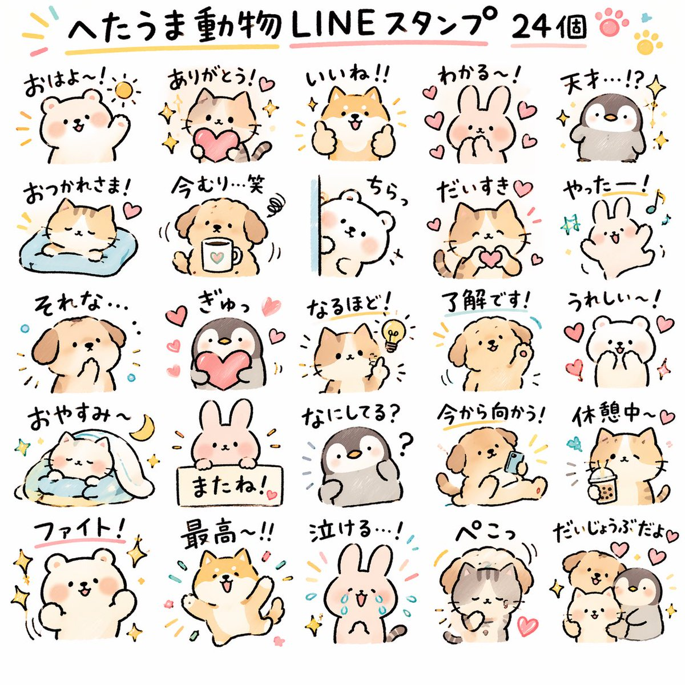

**提示词：**

```text
以奇特的手绘风格创建 {argument name="quantity" default="24"} LINE 贴图 {argument name="animals" default="animals"}。以时尚风格定位{argument name="target Audience" default="Japan Gen Z"}，以达到最高下载量。
```

***

<a id="case-38"></a>

### 例 38：综合应用场景图

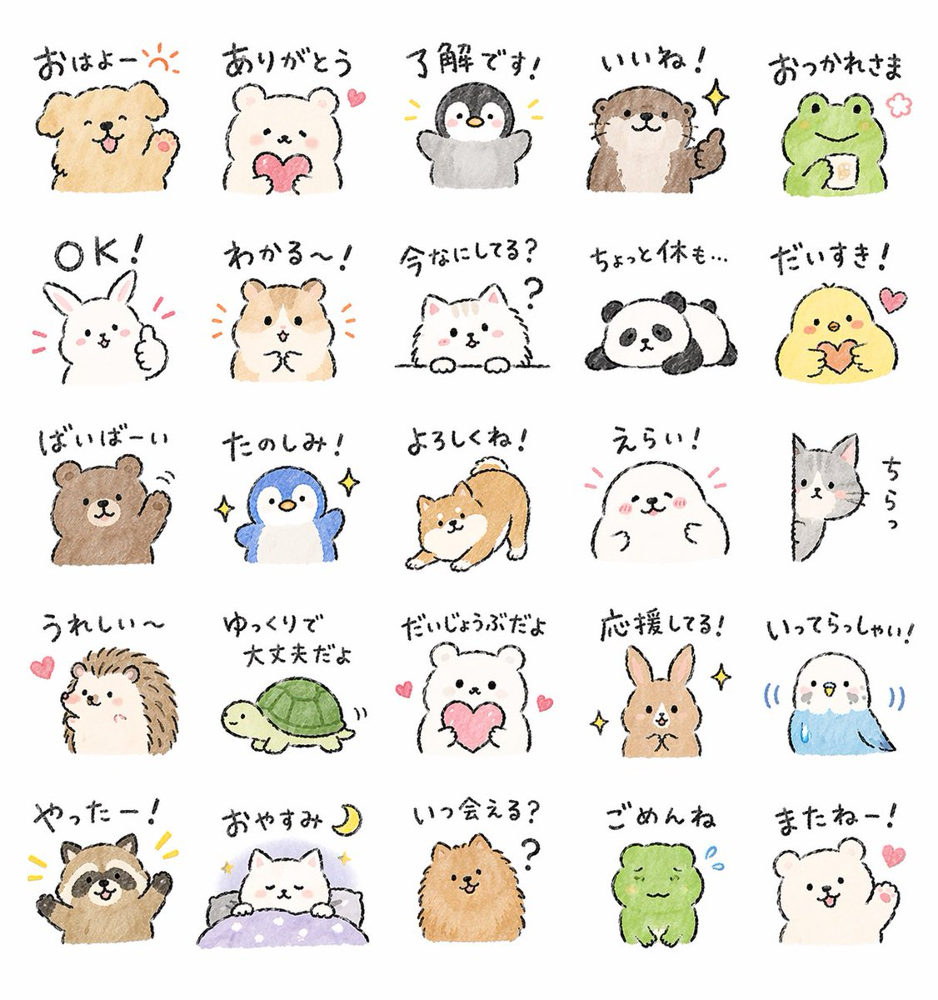

**提示词：**

```text
以奇特的手绘风格创建 {argument name="quantity" default="24"} LINE 贴图 {argument name="animals" default="animals"}。以时尚风格定位{argument name="target Audience" default="Japan Gen Z"}，以达到最高下载量。
```

***

<a id="case-39"></a>

### 例 39：综合应用场景图


**提示词：**

```text
以奇特的手绘风格创建 {argument name="quantity" default="24"} LINE 贴图 {argument name="animals" default="animals"}。以时尚风格定位{argument name="target Audience" default="Japan Gen Z"}，以达到最高下载量。
```

***

<a id="case-40"></a>

### 例 40：综合应用场景图


**提示词：**

```text
以奇特的手绘风格创建 {argument name="quantity" default="24"} LINE 贴图 {argument name="animals" default="animals"}。以时尚风格定位{argument name="target Audience" default="Japan Gen Z"}，以达到最高下载量。
```

***

<a id="case-48"></a>

### 例 48：直播界面设计图

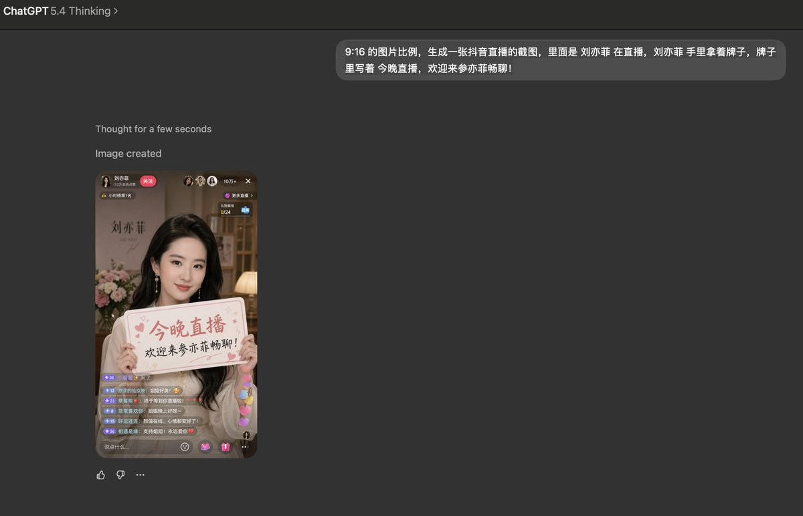

**提示词：**

```text
一张 9:16 宽高比的图片，生成 {argument name="celebrity" default="Liu Yifei"} 正在直播的抖音直播的屏幕截图，举着一个牌子，上面写着“{argument name="sign text" default="今晚直播，欢迎加入一飞的聊天！”}”
```

***

<a id="case-49"></a>

### 例 49：直播界面设计图


**提示词：**

```text
一张 9:16 宽高比的图片，生成 {argument name="celebrity" default="Liu Yifei"} 正在直播的抖音直播的屏幕截图，举着一个牌子，上面写着“{argument name="sign text" default="今晚直播，欢迎加入一飞的聊天！”}”
```

***

<a id="case-57"></a>

### 例 57：界面交互设计图


**提示词：**

```text
{
  "type": "移动社交媒体应用 UI 模型",
  "platform": "Twitter/X 深色模式",
  “标题”：{
    "status_bar": "时间 19:28，小鸟图标，信号，wifi，电池",
    "navigation": "后退箭头，'推文'标题"
  },
  “帖子”：{
    “作者”：{
      "avatar": "穿着红袍和黑帽子的中国皇帝的肖像",
      "display_name": "{参数名称=\"显示名称\" 默认=\"朱元璋皇帝\"} 👑 [验证徽章]",
      "handle": "{参数名称=\"handle\" 默认=\"@Emperor_Ming\"}"
    },
    “内容”：{
      "text": "{参数名称=\"推文文本\" default=\"我已登上龙王王座！今天，我被拥立为明朝皇帝。洪武时代开始了。让我们一起重建我们伟大的国家！\"}",
      "hashtags": "#MingDynasty #hongwuEra #NewBeginning",
      “媒体网格”：{
        “计数”：3，
        “图像”：[
          “穿着红色和金色长袍的皇帝坐在华丽的金色宝座上”，
          “中国宫殿庭院的广角镜头，人群众多”，
          “皇帝骑在马背上，率领军队，高举红龙旗”
        ]
      }
    },
    “元数据”：{
      "timestamp": "{参数名称=\"timestamp\" 默认=\"下午 1:36 · 1368 年 1 月 23 日\"}",
      “engagement”：“5,432 条转发、8,765 条引用、20,100 次点赞、102,300 次浏览”
    },
    "actions": "回复、转发、点赞（带“1”的红心）、分享、上传”
  },
  “页脚”：{
    “回复栏”：{
      "阿凡达": "红衣女人",
      “placeholder”：“回复朱元璋皇帝……”
    },
    "navigation_bar": "主页、搜索、通知（红色'1'徽章）、消息"
  }
}
```

***

<a id="case-91"></a>

### 例 91：游戏界面截图


**提示词：**

```text
下一代基于体素的世界的高度详细、逼真的第一人称视频游戏屏幕截图。顶部中央有一个大而粗的 3D 徽标，上面写着“{argument name="game title" default="MINECRAFT 2"}”。该场景的特点是{argument name="environment" default="郁郁葱葱的块状景观，背景中有河流、小木屋、风车、瀑布和雄伟的山脉"}。这个世界将真实的光照、体积云、高分辨率纹理与立方体素几何体融为一体。在左侧的前景中，一只 {argument name="mob 1" default="blocky green Creeper"} 站在草地上，而一只 {argument name="mob 2" default="blocky Brown Wolf"} 则站在右侧的土路上。在最右侧，玩家的手在第一人称视角下握着一把{argument name="held item" default="pixelated blue Diamond Sword"}。屏幕底部是一个游戏用户界面，其中包括带有 10 个红心的生命条、带有数字“16”的绿色体验条、带有 10 个棕色肉图标的饥饿条以及 9 个槽位的库存热栏。快捷栏从左到右包含：带有绿色突出显示框的选定蓝色工具、绿色工具、刀、带有数字“3”的扳手、一块带有“6”的肉、带有“24”的灯笼、带有“10”的泥土块、一个水桶和一个海绵块。
```

***

<a id="case-92"></a>

### 例 92：视频封面界面图

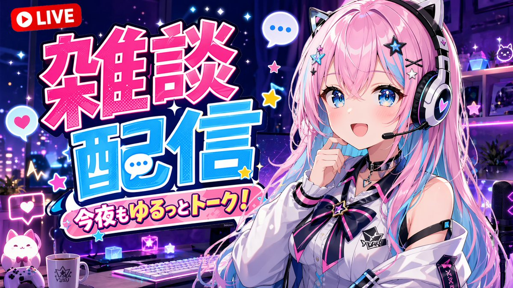

**提示词：**

```text
An anime-style YouTube stream thumbnail featuring a cheerful female VTuber. She has long {argument name="hair color" default="pink with light blue inner highlights"} hair, blue eyes, and wears black and white cat-ear headphones with a boom mic. She wears a white collared shirt with a black and pink star ribbon and a black choker, smiling with one hand near her chin. The background is a gaming room with {argument name="room lighting" default="purple and blue neon"} lighting, showing a desk equipped with 1 white keyboard, 1 mug, 1 glowing cat figure, 1 game controller, and 1 streaming microphone. The left side features large, bold, pop-art Japanese typography: a bright pink top word "{argument name="main text line 1" default="雑談"}" and a bright blue bottom word "{argument name="main text line 2" default="配信"}". Below is a pink banner reading "{argument name="subtitle text" default="今夜もゆるっとトーク!"}". A red "LIVE" badge sits in the top left. Floating speech bubbles, stars, and hearts decorate the composition.
```

***

<a id="case-97"></a>

### 例 97：综合应用场景图

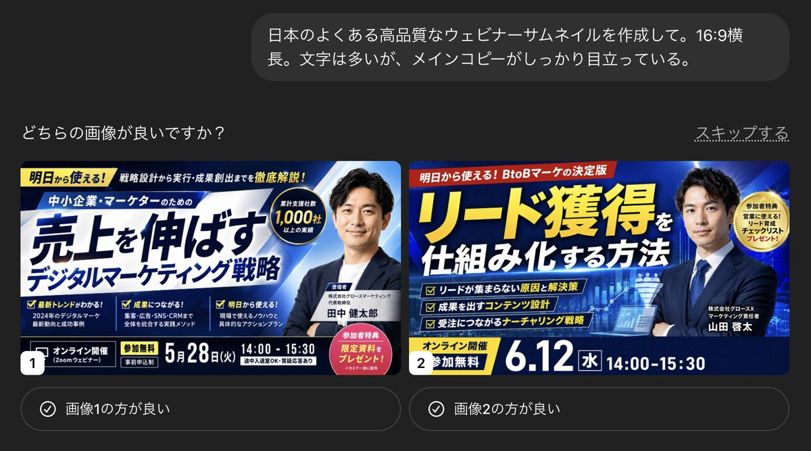

**提示词：**

```text
创建高质量的日语{argument name="thumbnail type" default="网络研讨会缩略图"}。 {参数名称=“宽高比”默认=“16:9 宽屏”}。文字很多，但主要内容清晰可见。
```

***

<a id="case-99"></a>

### 例 99：界面交互设计图

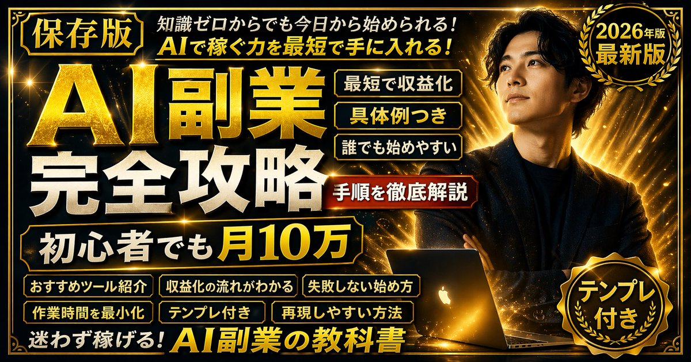

**提示词：**

```text
{
  "type": "promotional banner / YouTube thumbnail",
  "style": "high contrast, flashy, professional, {argument name=\"theme color\" default=\"gold and black\"} palette, glowing light rays, sparkling particles",
  "subject": {
    "description": "{argument name=\"subject description\" default=\"confident young Asian man in a dark suit with arms crossed\"}",
    "pose": "looking upwards to the right",
    "props": "glowing open laptop in front of him"
  },
  "layout": {
    "background": "dark with radiant gold light bursts",
    "text_sections": {
      "top_left_badge": "[保存版]",
      "top_header": "{argument name=\"top text\" default=\"知識ゼロからでも今日から始められる！ AIで稼ぐ力を最短で手に入れる！\"}",
      "main_title": {
        "text": "{argument name=\"main title\" default=\"AI副業 完全攻略\"}",
        "style": "large, bold, 3D gold and white typography"
      },
      "subtitle_box": "{argument name=\"subtitle\" default=\"初心者でも月10万\"}",
      "top_right_badge": {
        "style": "gold laurel wreath",
        "text": "2026年版 最新版"
      },
      "middle_right_tags": {
        "count": 3,
        "style": "stacked gold-bordered boxes",
        "labels": ["最短で収益化", "具体例つき", "誰でも始めやすい"]
      },
      "middle_right_ribbon": {
        "style": "red ribbon banner",
        "text": "手順を徹底解説"
      },
      "bottom_left_tags": {
        "count": 6,
        "style": "2x3 grid of gold-bordered boxes",
        "labels": ["おすすめツール紹介", "収益化の流れがわかる", "失敗しない始め方", "作業時間を最小化", "テンプレ付き", "再現しやすい方法"]
      },
      "bottom_footer": "迷わず稼げる！AI副業の教科書",
      "bottom_right_badge": {
        "style": "gold laurel wreath",
        "text": "テンプレ付き"
      }
    }
  }
}
```

***

<a id="case-101"></a>

### 例 101：界面交互设计图


**提示词：**

```text
{
  "type": "YouTube thumbnail",
  "style": "High-impact, neon green and black color scheme, cyber business aesthetic",
  "background": "Dark with glowing green grid, upward chart lines, large green arrow",
  "subject": {
    "description": "{argument name=\"subject description\" default=\"Serious Japanese man in a black suit\"}",
    "position": "Right side",
    "props": "Stacks of 10,000 Yen bills in bottom right"
  },
  "layout": {
    "main_title": {
      "text": "{argument name=\"main title\" default=\"月30万 ChatGPT副業 誰でも始めやすい\"}",
      "position": "Center, huge bold white and green gradient text"
    },
    "top_left_badge": {
      "text": "{argument name=\"top left badge\" default=\"再現性高め\"}",
      "style": "Angled neon green box"
    },
    "top_tags": {
      "count": 4,
      "labels": ["初心者OK", "スマホでも可能", "最短で収益化", "具体例つき"]
    },
    "left_bullet_points": {
      "count": 6,
      "style": "Dark boxes with neon green borders and icons",
      "items": [
        "Lightbulb icon: 失敗しない始め方",
        "Yen coin icon: 副業におすすめ",
        "Chart icon: 収益化の流れ",
        "Search icon: 案件の探し方",
        "Chat icon: プロンプト例つき",
        "Clipboard icon: テンプレ付き"
      ]
    },
    "bottom_banner": {
      "text": "{argument name=\"bottom banner text\" default=\"手順を徹底解説\"}",
      "icons": "ChatGPT logo left, upward chart right"
    },
    "bottom_tags": {
      "count": 2,
      "labels": ["{argument name=\"year tag\" default=\"2026年最新版\"}", "即実践できる"]
    }
  }
}
```

***

<a id="case-103"></a>

### 例 103：视频封面界面图

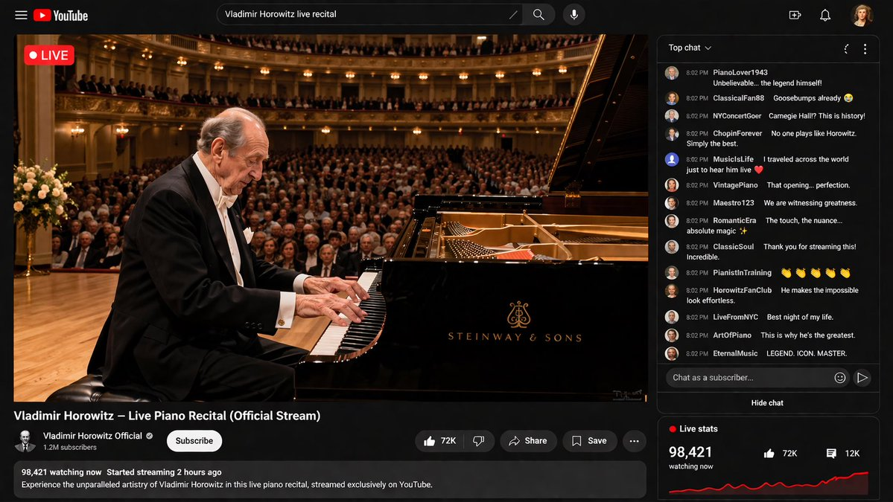

**提示词：**

```text
{argument name="pianist" default="Vladimir Horowitz"} 表演了一场在 {argument name="platform" default="YouTube"} 上直播的{argument name="event" default="live钢琴演奏会"}
```

***

<a id="case-104"></a>

### 例 104：界面交互设计图

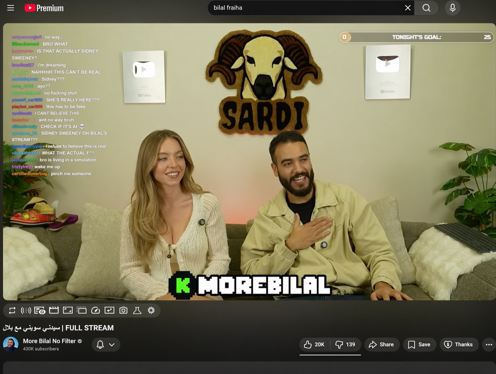

**提示词：**

```text
{
  "type": "YouTube 直播 UI",
  “顶部导航”：{
    "logo": "YouTube Premium",
    "search": "{参数名称=\"搜索查询\" 默认=\"bilal fraiha\"}",
    “图标”：3
  },
  “玩家”：{
    “主题”：[
      "{argument name=\"女客人\" default=\"Sydney Sweeney\"} 穿着白色开衫",
      “穿着米色夹克的大胡子男人笑”
    ],
    "bg": "沙发，2 个银色播放按钮，ram 标志'SARDI'",
    “覆盖”：{
      "chat": {"pos": "left", "count": 15, "desc": "彩色用户名，白色文本"},
      "goal": {"pos": "右上角", "text": "今晚的目标：0 到 25"},
      "banner": {"pos": "bottom center", "text": "K {参数名称=\"主播名称\" 默认=\"MOREBILAL\"}"}
    },
    “控制”：{“计数”：10}
  },
  “详细信息”：{
    "title": "{参数名称=\"视频标题\" 默认=\"FULL STREAM | ??????????????????????????????????????????????????????????????????????????????????????????????????????????????????????????????
    "channel": "{argument name=\"channel name\" default=\"More Bilal No Filter\"}",
    “按钮”：5
  }
}
```

***

<a id="case-106"></a>

### 例 106：应用界面样机图

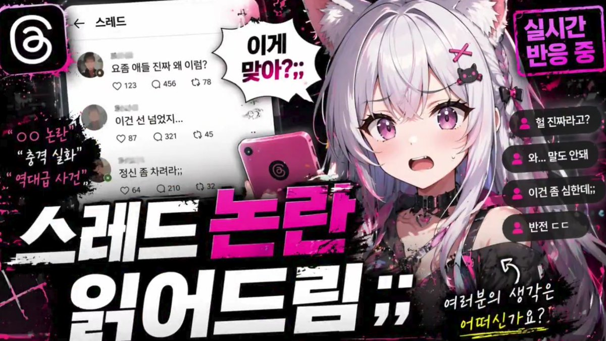

**提示词：**

```text
{
  "type": "YouTube 缩略图",
  "style": "动漫、前卫、霓虹粉色和黑色配色方案、垃圾和泼溅口音",
  “字符”：{
    "appearance": "动漫女孩，{参数名称=\"头发颜色\" 默认=\"银色\"}头发，猫耳朵，紫色眼睛",
    "表情": "{参数名称=\"表情\" 默认=\"震惊出汗\"}，张着嘴",
    "accessories": "带粉色十字架的黑猫发夹，带心形环的黑色项圈",
    “action”：“拿着带有漩涡标志的粉红色智能手机”
  },
  “布局”：{
    “主标题”：{
      "position": "底部中心",
      "style": "巨大、大胆、3D 排版、垃圾纹理",
      “行”：[
        { "text": "{参数名称=\"主标题顶部\" default=\"스레드 논란\"}", "color": "霓虹粉色" },
        { "text": "{参数名称=\"主标题底部\" default=\"읽어드림 ;;\"}", "color": "white" }
      ]
    },
    “ui_elements”：[
      {
        “type”：“社交媒体提要模型”，
        "position": "中左",
        "header": "← 스레드",
        “帖子计数”：3，
        "details": "头像、韩文、点赞、评论、转发的交互图标"
      },
      {
        "type": "实时聊天模型",
        "position": "右边缘",
        “消息计数”：4，
        "details": "粉色用户图标，韩文文本"
      }
    ],
    “文本标注”：[
      {
        "type": "尖尖的语音气泡",
        "position": "中心顶部",
        "text": "{参数名称=\"语音气泡文本\" 默认=\"??게 맞아?;;\"}"
      },
      {
        "type": "霓虹灯盒",
        "position": "右上角",
        "text": "실시간 반응 중"
      },
      {
        "type": "浮动垃圾文本",
        "position": "最左边",
        “行数”：3，
        "text": ["OO 논란", "충격 실화", "역대급 사건"]
      },
      {
        "type": "带箭头的手写文本",
        "position": "右下角",
        "text": "여러분의 생각은 어떠신і요?"
      }
    ],
    “标志”：[
      {
        "type": "应用程序图标",
        "position": "左上角",
        “description”：“黑色圆角正方形上的白色漩涡标志”
      }
    ]
  }
}
```

***

<a id="case-107"></a>

### 例 107：应用界面样机图


**提示词：**

```text
{"type": "YouTube 桌面深色模式 UI 模型", "header": {"logo": "YouTube", "search_bar": "搜索", "icons_count": 5, "icons": ["search", "mic", "create", "notifications", "profile"]}, "video_player": {"top_left_badge": "LIVE", "left_side": {"subject": "{argument name=\"演示者描述\" default=\"木制讲台上穿绿色毛衣的男人\"}", "podium_logo": "OpenAI"}, "right_side_presentation": {"text_elements": ["OpenAI", "INTRODUCING", "{参数名称=\"产品名称\" default=\"GPT-Image-2\"}", "{参数名称=\"标语\" default=\"更多现实的。更有用。更多创意。\"}"], "sample_images_count": 4, "sample_images": ["山湖与船", "斑驳光影的女人肖像", "森林里提着灯笼的可爱机器人", "星夜咖啡馆画"]}, "bottom_controls_count": 10, "bottom_controls": ["pause", "next", "volume", "LIVE", "红色进度条", "CC", "设置", "迷你播放器", "影院模式", "全屏"]}, "video_details": {"title": "{参数名称=\"视频标题\" default=\"OpenAI Live: 介绍GPT-Image-2\"}", "channel": {"name": "{参数名称=\"频道名称\" default=\"OpenAI\"}", "verified": true, "subscribers": "1.36M", "button": "订阅"}, "action_buttons_count": 5, "action_buttons": ["喜欢 12K", "不喜欢 497", "分享", "保存", "更多"], "description_box": {"stats": "95,237 正在观看 7 分钟前开始直播", "tags": "#OpenAI #GPTImage2 #AI", "text": "加入我们，参加一场特别的现场活动，我们将介绍我们最新、最先进的图像生成模型 GPT-Image-2。查看新功能、现场演示并听取团队的意见...更多"}}}
```

***

<a id="case-108"></a>

### 例 108：综合应用场景图

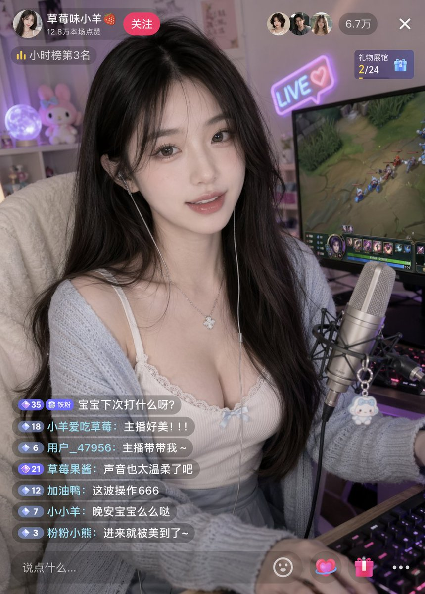

**提示词：**

```text
{argument name="subject" default="一位美丽的网红"}正在直播{argument name="activity" default="game"}。
```

***

<a id="case-109"></a>

### 例 109：综合应用场景图


**提示词：**

```text
{argument name="subject" default="一位美丽的网红"}正在直播{argument name="activity" default="game"}。
```

***

<a id="case-110"></a>

### 例 110：视频封面界面图

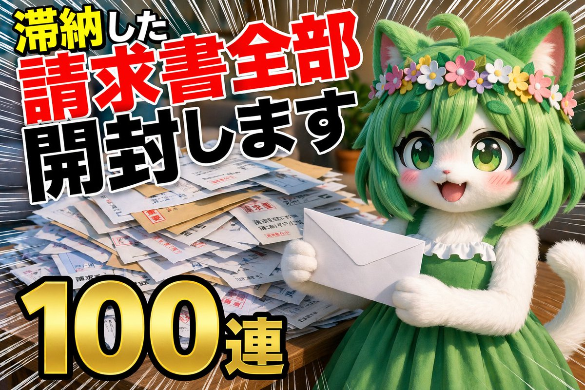

**提示词：**

```text
YouTube 拆箱视频的缩略图，视频内容为{argument name="topic" default="打开所有逾期帐单"}、{argument name="quantity" default="连续 100 张"}
```

***

<a id="case-111"></a>

### 例 111：视频封面界面图


**提示词：**

```text
YouTube 缩略图风格的拼贴画，用于{argument name="overall momo" default="黑暗、戏剧性、真实的犯罪调查"}。中间是一幅非常详细的特写肖像，是一位{argument name="centralfigure"default="老人，头发花白，皱纹很深，类似于杰弗里·爱泼斯坦(Jeffrey Epstein)"}，穿着黑色 Polo 衫，微弱的红色发光轮廓将他与背景分开。左侧是一个{argument name="左背景场景" default="热带岛屿，有豪华别墅和黑暗天空中一架飞行的飞机"}。岛下方有一个阴谋板图案，其中有 2 个红色图钉，由 3 根粗红色绳子连接。在右上角，有一幅模糊的、棕褐色调的描绘{argument name="right background scene" default="美国国会大厦，对面是 3 个穿着西装的男人的剪影"}。右下角是一个打开的马尼拉文件夹，其中包含{argument name="document type" default="大量编辑的档案，带有粗黑标记线和一张较小的中心人物照片"}。整体构图具有电影感、强烈且高度风格化的纪录片视频。
```

***

<a id="case-129"></a>

### 例 129：绘画艺术风格图


**提示词：**

```text
儿童图画书封面的水彩插图。主要主题是一个{argument name="character Appearance" default="可爱的毛茸茸的 kemonomimi 女孩，绿色短发、猫耳朵和绿眼睛"}。她{argument name="action" default="高兴地微笑着举起中指"}，手上长满了白色的毛。她穿着一件绿色的衣服，有蓬松的白领。背景以柔软的绿色叶子和纹理纸上的黄色小花为特色。在顶部，大型手绘绿色日文文字为“{argument name=”main title”default=”なかゆびさん”}”。在其下方，棕色日文文字为“{argument name="subtitle" default="こんにちは"}”。在中间偏左，较小的黑色文本显示“{参数名称=“作者文本”默认=“さく・え：とらの”}”。该图像的左边缘有一个可见的书脊，强调了物理书籍的格式。
```

***

<a id="case-130"></a>

### 例 130：界面交互设计图


**提示词：**

```text
{
  "type": "brand identity and merchandise design board",
  "theme": {
    "color_palette": "{argument name=\"theme color\" default=\"pastel pink\"} and white",
    "motif": "{argument name=\"motif\" default=\"cherry blossoms\"} and pink hearts"
  },
  "character": {
    "description": "anime girl with short brown bob hair, pink eyes, wearing a white hoodie, gentle smile"
  },
  "branding": {
    "main_logo": "{argument name=\"character name\" default=\"癒音ちー\"}",
    "sub_logo": "{argument name=\"character subtext\" default=\"ゆおんちー\"}"
  },
  "layout": {
    "sections": [
      {
        "type": "header banner",
        "position": "top",
        "elements": ["large main logo", "sub logo", "cherry blossom graphics", "character portrait on the right"]
      },
      {
        "type": "product packaging",
        "position": "middle left",
        "elements": ["1 square box with heart-shaped transparent window showing pink heart candies", "character illustration on box", "2 individual candy wrappers", "5 scattered heart candies"]
      },
      {
        "type": "promotional poster",
        "position": "middle right",
        "elements": ["character portrait", "heart-shaped candy bowl", "main logo", "text '4.26 NEW OPEN'", "text '{argument name=\"social handle\" default=\"@yuonchii\"}'"]
      },
      {
        "type": "horizontal web banner",
        "position": "lower middle",
        "elements": ["main logo", "cherry blossoms", "character portrait on the right"]
      },
      {
        "type": "social media profile mockup",
        "position": "bottom left",
        "elements": ["header image with logo", "1 circular profile picture", "handle '{argument name=\"social handle\" default=\"@yuonchii\"}'", "1 follow button", "mock bio text"]
      },
      {
        "type": "merchandise collection",
        "position": "bottom right",
        "count": 9,
        "items": ["1 white t-shirt with logo", "1 white mug with character", "4 round pin badges", "1 acrylic keychain", "2 candy packets"]
      }
    ]
  }
}
```

***

<a id="case-131"></a>

### 例 131：界面交互设计图


**提示词：**

```text
{
  "type": "UI/UX landing page mockup",
  "theme": "dark mode, sleek modern aesthetic, glassmorphism, {argument name=\"primary accent color\" default=\"neon purple and blue\"} glowing accents",
  "header": {
    "logo": "{argument name=\"brand name\" default=\"goViralX\"}",
    "top_right_tag": "VIRAL CAMPAIGN CASE STUDY"
  },
  "layout": {
    "sections": [
      {
        "name": "Hero",
        "headline": "{argument name=\"hero headline\" default=\"How We Created 10M+ Viral Impact\"}",
        "subheadline": "3天引爆全网, 助力品牌实现指数级增长",
        "stats_row": {
          "count": 4,
          "labels": ["总播放量", "互动率", "转化咨询", "执行周期"],
          "values": ["{argument name=\"main statistic\" default=\"10,240,000+\"}", "18.7%", "3,200+", "72小时"]
        },
        "visual": "cinematic shot of a person in a hoodie looking at glowing digital screens and graphs, large play button overlay"
      },
      {
        "name": "Strategy",
        "title": "Our 3-Day Execution Strategy",
        "layout_type": "vertical timeline",
        "steps_count": 3,
        "elements_per_step": ["timeline node", "title", "bullet points", "video thumbnail with play button", "description box"]
      },
      {
        "name": "Performance",
        "title": "Data-Driven Performance",
        "left_column": {
          "stat_cards_count": 4,
          "values": ["10M+", "43%", "28,000+", "3,200+"]
        },
        "right_column": {
          "charts_count": 2,
          "chart_1": "line graph showing 7-day growth peaking at Day 3",
          "chart_2": "horizontal segmented bar chart showing platform distribution (TikTok 52%, Instagram 24%, X 15%, YouTube 9%)"
        }
      },
      {
        "name": "Keys to Success",
        "title": "The 3 Keys to Viral Success",
        "cards_count": 3,
        "card_elements": ["glowing icon (fire, target, antenna)", "title", "description", "VIEW DETAIL link"]
      },
      {
        "name": "Social Proof",
        "title": "TRUSTED BY CREATORS & BRANDS",
        "left_column": {
          "logos_count": 8,
          "grid": "2x4",
          "brands": ["SHEIN", "SHOPLINE", "Blueglass", "instacart", "lemon8", "mi", "CIDER", "bellroy"]
        },
        "right_column": {
          "testimonial_cards_count": 2,
          "elements": ["quote", "author title (SaaS Founder, Growth Manager)"]
        }
      },
      {
        "name": "Call to Action",
        "title": "READY TO GO VIRAL?",
        "interactive_elements": ["text input field", "glowing button with text '{argument name=\"call to action text\" default=\"获取专属增长方案 ->\"}'"],
        "visual": "3D render of a rocket ship taking off with purple and blue flames"
      }
    ]
  }
}
```

***

<a id="case-132"></a>

### 例 132：界面交互设计图


**提示词：**

```text
{
  "type": "18-panel brand identity and character design document",
  "brand": {
    "name": "{argument name=\"brand name\" default=\"沐阳 MUYANG TEA\"}",
    "industry": "{argument name=\"industry\" default=\"tea shop\"}",
    "colors": ["{argument name=\"primary color\" default=\"yellow\"}", "{argument name=\"secondary color\" default=\"green\"}", "white", "brown", "dark green"]
  },
  "subject": "{argument name=\"character description\" default=\"3D rendered cute Shiba Inu mascot wearing a green apron\"}",
  "layout": {
    "grid": "3 columns by 6 rows",
    "sections": [
      {
        "title": "01 品牌DNA分析 / BRAND DNA ANALYSIS",
        "elements": ["logo", "5 color swatches", "6 icons", "target audience charts"]
      },
      {
        "title": "02 概念构思 / CONCEPT MOODBOARD",
        "elements": ["5 photo references", "4 mood icons", "design equation"]
      },
      {
        "title": "03 形态研究 / FORM STUDY",
        "elements": ["4 logo anatomy icons", "4 evolution steps", "4 silhouettes"]
      },
      {
        "title": "04 概念探索 / CONCEPT EXPLORATION",
        "elements": ["12 line-art character sketches"]
      },
      {
        "title": "05 精细线稿 / REFINED LINE ART",
        "elements": ["3 rows of front and side line art with proportion guides"]
      },
      {
        "title": "06 细节精修 / DETAIL REFINEMENT",
        "elements": ["2 full-body renders with labels", "4 circular close-ups"]
      },
      {
        "title": "07 表情设定 / EXPRESSION SHEET",
        "elements": ["11 3D rendered head expressions"]
      },
      {
        "title": "08 姿势库 / POSE LIBRARY",
        "elements": ["9 full-body 3D rendered poses"]
      },
      {
        "title": "09 转身视图 / TURNAROUND VIEW",
        "elements": ["5 full-body 3D renders", "5 matching line-art views"]
      },
      {
        "title": "10 色彩开发 / COLOR DEVELOPMENT",
        "elements": ["5 rows of 5-color palettes", "color psychology text"]
      },
      {
        "title": "11 材质规格 / MATERIAL SPECIFICATION",
        "elements": ["5 texture swatches", "property sliders", "4 manufacturing icons"]
      },
      {
        "title": "12 色彩应用 / COLOR APPLICATION",
        "elements": ["4 color variant renders", "2 light/dark renders", "4 contrast rating circles"]
      },
      {
        "title": "13 构造指南 / CONSTRUCTION GUIDE",
        "elements": ["2 line-art diagrams for geometry and grid"]
      },
      {
        "title": "14 设计系统规则 / DESIGN SYSTEM RULES",
        "elements": ["minimum size icons", "clear space diagram", "4 usage examples"]
      },
      {
        "title": "15 资产变体 / ASSET VARIANTS",
        "elements": ["3 size variants", "3 line-art variants", "3 simplified flat heads"]
      },
      {
        "title": "16 数字应用 / DIGITAL APPLICATIONS",
        "elements": ["1 app icon", "2 social avatars", "UI elements", "3-step animation cycle"]
      },
      {
        "title": "17 实物应用 / PHYSICAL APPLICATIONS",
        "elements": ["plush toy mockup", "packaging mockup", "merchandise mockup", "storefront mockup"]
      },
      {
        "title": "18 最终主视觉 / FINAL RENDERING",
        "elements": ["large high-res 3D render of mascot holding tea", "logo", "file format list"]
      }
    ]
  }
}
```

***

<a id="case-133"></a>

### 例 133：界面交互设计图


**提示词：**

```text
{
  "type": "brand identity system presentation board",
  "header": {
    "title": "品牌视觉识别系统 BRAND IDENTITY SYSTEM",
    "slogan": "爱它·懂它·陪伴它"
  },
  "main_logo": {
    "text": "{argument name=\"brand name\" default=\"GDX\"}",
    "subtitle": "{argument name=\"brand chinese name\" default=\"狗东西\"}",
    "design_feature": "{argument name=\"main subject\" default=\"Dog profile in negative space of the letter D\"}",
    "metadata": [
      "品牌名称",
      "行业属性 {argument name=\"industry\" default=\"宠物行业\"}",
      "设计时间 2024.05"
    ]
  },
  "layout": {
    "sections": [
      {
        "title": "设计网格",
        "count": 1,
        "description": "Logo with architectural grid lines and golden ratio measurements"
      },
      {
        "title": "概念草图",
        "count": 4,
        "description": "Evolution steps from rough dog sketch to final geometric logo"
      },
      {
        "title": "灵感来源",
        "count": 4,
        "description": "Moodboard images including minimalist architecture, a golden retriever, and dark green geometric shapes"
      },
      {
        "title": "创意理念",
        "count": 4,
        "description": "Text blocks with minimalist icons explaining design philosophy, positioning, color psychology, and scalability"
      },
      {
        "title": "品牌应用",
        "count": 6,
        "labels": [
          "名片 正反面",
          "信纸信封",
          "APP图标",
          "网站页眉 / 网站图标",
          "产品包装 / 购物袋",
          "店面门头 / 标识牌"
        ],
        "description": "Mockups of business cards, envelopes, app icons, website header with a dog, paper shopping bags, and a storefront sign"
      },
      {
        "title": "色彩规范",
        "count": 5,
        "labels": [
          "主色",
          "辅助色",
          "强调色"
        ],
        "colors": [
          "{argument name=\"primary color\" default=\"#1E3D34\"}",
          "#F5F3EF",
          "#E5E2DD",
          "#A8C5B1",
          "#E0A86E"
        ]
      },
      {
        "title": "字体规范",
        "count": 2,
        "labels": [
          "思源黑体 CN",
          "思源柔黑体 CN"
        ],
        "description": "Typography specimens showing 'Aa', alphabet, and numbers"
      },
      {
        "title": "最小使用尺寸",
        "count": 2,
        "description": "Minimum logo size specifications at 20mm and 12mm"
      },
      {
        "title": "安全留白区域",
        "count": 1,
        "description": "Logo surrounded by a bounding box with 'X' indicating clear space margins"
      },
      {
        "title": "错误使用示例",
        "count": 5,
        "labels": [
          "不可拉伸变形",
          "不可改变颜色",
          "不可添加阴影",
          "不可倾斜使用",
          "不可复杂背景上使用"
        ],
        "description": "Examples of incorrect logo usage: stretched, wrong color, drop shadow, tilted, and placed on a busy photographic background"
      }
    ]
  }
}
```

***

<a id="case-134"></a>

### 例 134：界面交互设计图


**提示词：**

```text
{
  "type": "skincare e-commerce landing page mockup",
  "brand": "{argument name=\"brand name\" default=\"DERMA CALM\"}",
  "color_palette": ["white", "light blue", "{argument name=\"primary color\" default=\"dark blue\"}"],
  "layout": {
    "header": {
      "logo": "left-aligned brand name with Japanese subtext",
      "navigation_links": {
        "count": 6,
        "labels": ["ABOUT", "PRODUCT", "FEATURE", "INGREDIENT", "VOICE", "Q&A"]
      },
      "buttons": {
        "count": 2,
        "labels": ["マイページ", "今すぐ購入する"]
      }
    },
    "hero_section": {
      "left_column": {
        "headline": "{argument name=\"hero headline\" default=\"敏感な肌にも、毎日つづけられる安心ケア。\"}",
        "subtext": "paragraph detailing low irritation, moisturizing, fragrance-free, and alcohol-free benefits",
        "buttons": {
          "count": 2,
          "labels": ["今すぐ購入する", "詳しく見る"]
        }
      },
      "center_column": {
        "product": "white pump bottle with clear cap labeled {argument name=\"product type\" default=\"Moisture Barrier Serum\"}",
        "props": ["dollop of white cream", "circular badge reading 皮膚科医監修"]
      },
      "right_column": {
        "subject": "{argument name=\"model description\" default=\"young East Asian woman with clear glowing skin touching her cheek\"}",
        "background": "blurred laboratory glassware in a bright, clean clinical setting"
      }
    },
    "bottom_features_panel": {
      "left_cards": {
        "count": 3,
        "descriptions": ["95% satisfaction with 5 stars", "shield icon for low irritation formula", "drop icon for skin barrier support"]
      },
      "right_badges": {
        "count": 3,
        "descriptions": ["no fragrance icon", "no alcohol icon", "patch tested icon"]
      },
      "footer": "fine print disclaimers at the bottom"
    }
  }
}
```

***

<a id="case-135"></a>

### 例 135：应用界面样机图

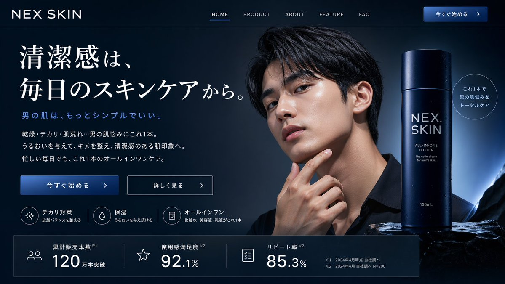

**提示词：**

```text
{
  "type": "website landing page mockup",
  "theme": "men's skincare, sleek, professional, dark mode",
  "color_palette": "{argument name=\"color scheme\" default=\"dark navy blue\"}, white text, subtle blue gradients",
  "header": {
    "logo": "{argument name=\"brand name\" default=\"NEX SKIN\"}",
    "navigation": ["HOME", "PRODUCT", "ABOUT", "FEATURE", "FAQ"],
    "cta_button": "今すぐ始める >"
  },
  "hero_section": {
    "left_column": {
      "headline": "{argument name=\"main headline\" default=\"清潔感は、毎日のスキンケアから。\"}",
      "sub_headline": "男の肌は、もっとシンプルでいい。",
      "body_text": "3 lines of descriptive text about skincare benefits",
      "buttons": [
        {"style": "solid blue", "text": "今すぐ始める >"},
        {"style": "outlined", "text": "詳しく見る >"}
      ],
      "feature_highlights": {
        "count": 3,
        "items": [
          {"icon": "sparkle", "title": "テカリ対策", "subtitle": "皮脂バランスを整える"},
          {"icon": "water drop", "title": "保湿", "subtitle": "うるおいを与え続ける"},
          {"icon": "shield/bottle", "title": "オールインワン", "subtitle": "化粧水・美容液・乳液がこれ1本"}
        ]
      }
    },
    "center_image": {
      "subject": "handsome {argument name=\"target demographic\" default=\"young Asian man\"}",
      "appearance": "clean-cut, dark hair, flawless glowing skin, wearing a black shirt",
      "pose": "hand touching chin thoughtfully",
      "lighting": "dramatic studio lighting highlighting facial structure"
    },
    "right_column": {
      "product_shot": {
        "bottle": "tall cylindrical dark blue bottle with water droplets",
        "labels": ["{argument name=\"brand name\" default=\"NEX SKIN\"}", "{argument name=\"product type\" default=\"ALL-IN-ONE LOTION\"}", "150mL"],
        "base": "textured dark rock surface",
        "badge": "circular outlined badge reading 'これ1本で男の肌悩みをトータルケア'"
      }
    }
  },
  "bottom_stats_bar": {
    "count": 3,
    "items": [
      {"icon": "users", "label": "累計販売本数", "value": "120万本突破"},
      {"icon": "star", "label": "使用感満足度", "value": "92.1%"},
      {"icon": "checklist", "label": "リピート率", "value": "85.3%"}
    ],
    "footnotes": "small legal text on the right"
  }
}
```

***

<a id="case-137"></a>

### 例 137：界面交互设计图


**提示词：**

```text
{
  "type": "e-commerce landing page hero section mockup",
  "aesthetic": "clean, bright, airy, feminine, floral accents with purple flowers, {argument name=\"primary color\" default=\"soft pink\"} and white color palette, soft lighting",
  "header": {
    "logo": "{argument name=\"brand name\" default=\"LUMEA BEAUTY\"}",
    "navigation_links": {
      "count": 5,
      "labels": ["特徴", "成分", "お客様の声", "使い方", "FAQ"]
    },
    "cta_button": "今すぐ試す"
  },
  "hero_section": {
    "left_column": {
      "headline": "{argument name=\"headline text\" default=\"鏡を見るたび、うるおう透明感。\"}",
      "subheadline": "乾燥・くすみが気になる肌に。美容成分を贅沢に配合した、毎日のための集中保湿美容液。",
      "feature_badges": {
        "count": 3,
        "style": "pill-shaped with small icons",
        "labels": ["敏感肌OK", "高保湿", "朝晩使える"]
      },
      "bullet_points": {
        "count": 3,
        "style": "pink checkmarks",
        "labels": ["美容成分をしっかり届ける", "ハリ・ツヤのある印象へ", "続けやすいシンプルケア"]
      },
      "cta_buttons": {
        "count": 2,
        "labels": ["初回限定で試してみる >", "成分をチェック >"]
      },
      "trust_badges": "送料無料 / 初回限定 / 定期縛りなし"
    },
    "center_subject": {
      "model": "{argument name=\"model description\" default=\"young East Asian woman smiling, touching her cheek\"}",
      "action": "holding a dropper bottle of serum"
    },
    "right_column": {
      "product_display": {
        "count": 2,
        "items": ["{argument name=\"product type\" default=\"moisturizing boost serum\"} dropper bottle", "packaging box"]
      },
      "stat_cards": {
        "count": 3,
        "style": "floating white rounded rectangles with gold accents",
        "labels": ["満足度 96%", "美容成分 5種配合", "愛用者 12,000人突破"]
      }
    }
  },
  "bottom_section": {
    "benefit_cards": {
      "count": 3,
      "style": "horizontal white rounded rectangles with icons",
      "labels": ["うるおい", "透明感", "使いやすさ"]
    }
  }
}
```

***

<a id="case-143"></a>

### 例 143：品牌徽标设计图

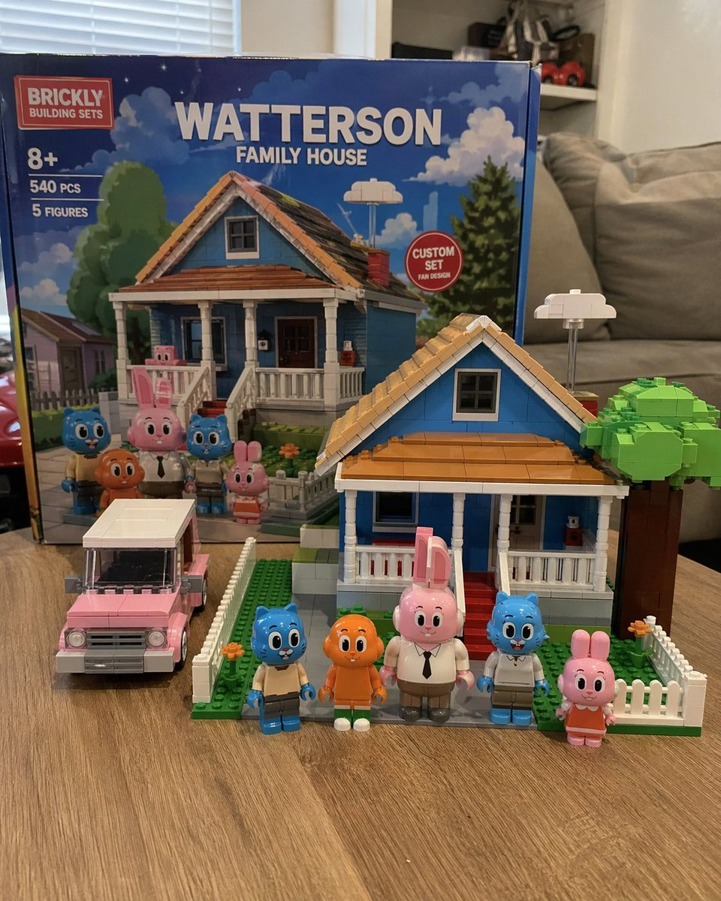

**提示词：**

```text
客厅浅色木纹桌子上放置的定制积木的逼真业余照片。背景中矗立着一个大产品盒，上面有红色徽标，上面写着“{argument name="brand name" default="BRICKLY"} BUILDING SETS”。盒子上有文字“8+”、“540 PCS”、“5 个人物”，以及大标题“{argument name="set title" default="WATTERSON FAMILY HOUSE"}”。盒子上有一个红色圆形徽章，上面写着“定制风扇设计”，盒子上的艺术描绘了蓝天下的房子和人物。前景是完全组装好的{argument name="house color" default="blue"}两层郊区房屋的块模型，有棕色屋顶、白色门廊、红色台阶、白色尖桩篱笆和一棵块状绿树。房子的左侧是一个{argument name="car color" default="pink"}旅行车的积木模型。房子前面一排站着 5 个定制的小人仔：一只穿着棕褐色裤子的蓝猫、一条有腿的橙色鱼、一只穿着白衬衫和领带的高大粉红色兔子、一只穿着白衬衫的蓝猫和一只穿着橙色连衣裙的粉红色小兔子。背景是一间稍微模糊的客厅，配有灰色沙发和白色百叶窗。
```

***

<a id="case-145"></a>

### 例 145：综合应用场景图


**提示词：**

```text
一个{argument name="platform" default="淘宝"}的{argument name="robot model" default="T-800 robots"}产品详情页面，展示：机器人正面、侧面、背面三视图、产品价格、产品详情、功能、使用场景等。
```

***

<a id="case-146"></a>

### 例 146：综合应用场景图


**提示词：**

```text
一个{argument name="platform" default="淘宝"}的{argument name="robot model" default="T-800 robots"}产品详情页面，展示：机器人正面、侧面、背面三视图、产品价格、产品详情、功能、使用场景等。
```

***

<a id="case-147"></a>

### 例 147：综合应用场景图


**提示词：**

```text
一个{argument name="platform" default="淘宝"}的{argument name="robot model" default="T-800 robots"}产品详情页面，展示：机器人正面、侧面、背面三视图、产品价格、产品详情、功能、使用场景等。
```

***

<a id="case-148"></a>

### 例 148：综合应用场景图


**提示词：**

```text
一个{argument name="platform" default="淘宝"}的{argument name="robot model" default="T-800 robots"}产品详情页面，展示：机器人正面、侧面、背面三视图、产品价格、产品详情、功能、使用场景等。
```

***

<a id="case-149"></a>

### 例 149：直播界面设计图

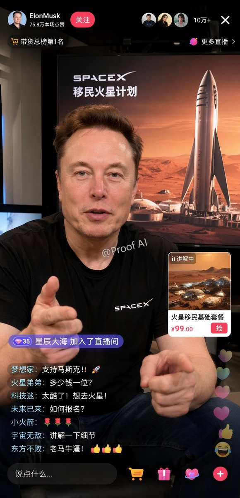

**提示词：**

```text
{
  "type": "mobile livestream e-commerce interface mockup",
  "subject": {
    "person": "Elon Musk",
    "clothing": "black t-shirt with SPACEX logo",
    "pose": "gesturing towards camera with both hands, explaining enthusiastically",
    "watermark": "@Proof AI"
  },
  "background": {
    "setting": "large display screen",
    "image": "Mars landscape with Starship rocket and dome habitats",
    "text": [
      "SPACEX",
      "{argument name=\"background title\" default=\"移民火星计划\"}"
    ]
  },
  "ui_layout": {
    "header": {
      "broadcaster_info": {
        "name": "{argument name=\"broadcaster name\" default=\"ElonMusk\"}",
        "stats": "75.8万本场点赞",
        "follow_button": "关注"
      },
      "viewer_stats": {
        "avatars_count": 3,
        "text": "10万+",
        "close_button": "X"
      },
      "tags": [
        "带货总榜第1名",
        "更多直播 >"
      ]
    },
    "product_card": {
      "position": "mid-right",
      "status": "讲解中",
      "image": "Mars dome habitats",
      "title": "{argument name=\"product title\" default=\"火星移民基础套餐\"}",
      "price": "{argument name=\"product price\" default=\"¥99.00\"}",
      "action_button": "抢"
    },
    "chat_overlay": {
      "position": "bottom-left",
      "join_alert": "星辰大海 加入了直播间",
      "messages_count": 7,
      "messages": [
        "{argument name=\"top chat message\" default=\"梦想家: 支持马斯克！！🚀\"}",
        "火星弟弟: 多少钱一位？",
        "科技迷: 太酷了！想去火星！",
        "未来已来: 如何报名？",
        "小火箭: 🌹🌹🌹",
        "宇宙无敌: 讲解一下细节",
        "东方不败: 老马牛逼！👍👍👍"
      ]
    },
    "bottom_action_bar": {
      "input_placeholder": "说点什么...",
      "icons_count": 4,
      "icons": ["shopping cart", "gift box", "heart planet", "plus sign"]
    },
    "floating_reactions": {
      "position": "bottom-right",
      "elements": "stack of floating hearts, thumbs up, and laughing emojis"
    }
  }
}
```

***

<a id="case-151"></a>

### 例 151：界面交互设计图


**提示词：**

```text
{
  "type": "2x2 advertising banner grid",
  "layout": "4 distinct quadrants, each featuring a different industry advertisement",
  "quadrants": [
    {
      "position": "top-left",
      "industry": "skincare",
      "visuals": "Asian woman touching cheek, floating water droplets, white pump bottle",
      "brand": "BALANCÉE",
      "copy": {
        "headline": "{argument name=\"skincare headline\" default=\"素肌が、目覚める。\"}",
        "subheadline": "透明感あふれる、新しいわたしへ。",
        "features_count": 3,
        "features_labels": ["高保湿", "肌荒れ予防", "美白ケア*"]
      }
    },
    {
      "position": "top-right",
      "industry": "restaurant food",
      "visuals": "close-up of spaghetti bolognese with grated cheese and parsley, dark moody lighting",
      "brand": "Trattoria Luce",
      "copy": {
        "headline": "{argument name=\"food headline\" default=\"このパスタ、事件級。\"}",
        "badge": "期間限定",
        "description": "黒毛和牛のボロネーゼ 〜トリュフの香り〜"
      }
    },
    {
      "position": "bottom-left",
      "industry": "travel",
      "visuals": "woman with backpack facing a scenic mountain lake, bright daylight",
      "brand": "NATURE JOURNEY",
      "copy": {
        "headline": "{argument name=\"travel headline\" default=\"わたしを、解き放つ旅へ。\"}",
        "subheadline": "自然の中で、心が動き出す。",
        "script": "Find your freedom.",
        "banner_details": ["初夏の特別キャンペーン", "6.1 SAT - 6.30 SUN", "最大 20%OFF", "今だけの特別プラン多数！"]
      }
    },
    {
      "position": "bottom-right",
      "industry": "SaaS app",
      "visuals": "smartphone displaying a task management app interface with 4 schedule items",
      "brand": "{argument name=\"app brand name\" default=\"Taskme\"}",
      "copy": {
        "headline": "{argument name=\"app headline\" default=\"タスク管理を、もっとシンプルに、スマートに。\"}",
        "circle_badge": "1日を、デザインしよう。",
        "features_count": 3,
        "features_labels": ["直感的な操作性", "チームで共有可能", "どこでもアクセス"],
        "bottom_banner": "7日間無料トライアル実施中！"
      }
    }
  ]
}
```

***

<a id="case-152"></a>

### 例 152：直播界面设计图


**提示词：**

```text
{
  "type": "e-commerce livestream screenshot mockup",
  "scene": {
    "subject": "{argument name=\"main subject\" default=\"Caucasian male resembling Sam Altman\"}",
    "clothing": "dark green crewneck sweater",
    "action": "holding a black product box in one hand and pointing at it with the other",
    "setting": "dark studio with a microphone on the left, faint 'AI' text in the background",
    "props": [
      "black mug with white OpenAI logo",
      "stack of 4 black product boxes on the right"
    ]
  },
  "product_design": {
    "box_color": "black",
    "logo": "orange asterisk or sunburst",
    "text": "{argument name=\"product name\" default=\"Claude Opus 4.7\"}"
  },
  "ui_overlays": {
    "top_left_product_info": {
      "brand_tag": "Anthropic 官方旗舰店",
      "title": "{argument name=\"product name\" default=\"Claude Opus 4.7\"}",
      "subtitle": "{argument name=\"main headline\" default=\"更强推理·更高智能\"}",
      "sub_subtitle": "最强大模型: Opus 4.7 重磅发布!",
      "bullet_points_count": 3,
      "bullet_points": ["超强推理能力", "代码能力巅峰", "复杂任务轻松搞定"]
    },
    "top_right_live_status": {
      "viewer_info": "直播中 | 52.8万人观看",
      "promo_banner": "直播专属福利 限时折扣·错过不再有",
      "countdown": "倒计时 00:09:47"
    },
    "middle_right_price_card": {
      "header": "{argument name=\"product name\" default=\"Claude Opus 4.7\"} 直播间专享价",
      "price_currency": "¥",
      "price_value": "{argument name=\"promotional price\" default=\"0.47\"}",
      "price_unit": "/百万tokens起",
      "original_price": "原价: ¥1.89",
      "button": "立即抢购"
    },
    "bottom_left_chat": {
      "message_count": 9,
      "input_box_placeholder": "说点什么..."
    },
    "bottom_right_banner": {
      "headline": "奥特曼首推！认准Claude Opus 4.7",
      "subheadline": "更智能 · 更安全 · 更可靠",
      "feature_tags_count": 4,
      "feature_tags": ["强大推理", "代码神器", "安全可靠", "极速响应"]
    },
    "floating_elements": [
      {
        "type": "sticker",
        "position": "middle right over product boxes",
        "text": "{argument name=\"sticker text\" default=\"史上最强 AI模型!\"}"
      }
    ]
  }
}
```

***

<a id="case-156"></a>

### 例 156：应用界面样机图


**提示词：**

```text
{
  "type": "mobile live-streaming e-commerce interface mockup",
  "subject": {
    "description": "young Asian woman, long dark hair, wearing light-colored floral pajama set with a pink bow, holding the pajama top outward to show the fabric",
    "background": "cozy room, clothing rack with pajamas, flowers, warm lighting"
  },
  "ui_layout": {
    "top_bar": {
      "time": "20:34",
      "host_info": {
        "name": "{argument name=\"host name\" default=\"小雨睡衣\"}",
        "stats": "12.8万本场点赞",
        "button": "关注"
      },
      "viewer_info": {
        "avatars_count": 3,
        "total_viewers": "1.2万"
      }
    },
    "floating_tags": {
      "count": 2,
      "labels": ["带货总榜第3名", "人气榜"]
    },
    "widgets": {
      "top_left": "red envelope icon with timer 03:45",
      "top_right": "floating heart icon with text 直播好物大赏 发现新热爱"
    },
    "marketing_text_overlay": {
      "position": "mid-right",
      "lines_count": 5,
      "lines": [
        "{argument name=\"main headline\" default=\"新款睡衣\"}",
        "{argument name=\"sub headline\" default=\"正在秒杀中...\"}",
        "亲肤透气",
        "柔软舒适",
        "不起球 不褪色"
      ]
    },
    "chat_log": {
      "position": "bottom-left",
      "message_count": 7,
      "messages": [
        "32 雨*** 加入了直播间",
        "小***: 好看，多少钱",
        "小***: 拍了，期待发货",
        "C***: 质量看着不错",
        "用***: 身高165，体重120斤，穿多大码？",
        "@***: 主播身上这款有货吗？",
        "晴***: 已拍，坐等收货！"
      ]
    },
    "product_card": {
      "position": "bottom-right",
      "thumbnail": "miniature of the host",
      "title": "{argument name=\"product title\" default=\"【小雨睡衣】春季新款家居服套装\"}",
      "tags_count": 2,
      "tags": ["7天无理由退货", "运费险"],
      "price_section": "秒杀价 ¥ {argument name=\"product price\" default=\"89.9\"}",
      "action_button": "抢"
    },
    "bottom_bar": {
      "input_placeholder": "说点什么...",
      "icon_count": 5,
      "icons": ["smiley face", "shopping cart", "heart/gift", "gift box", "three dots"]
    }
  }
}
```

***

<a id="case-158"></a>

### 例 158：界面交互设计图


**提示词：**

```text
{
  "type": "e-commerce live stream interface mockup",
  "subject": {
    "description": "young Asian woman, long wavy dark hair, wearing a white short-sleeve polo shirt and white pleated tennis skirt, holding a white tennis racket over her right shoulder, looking directly at the camera with a soft expression",
    "background": "soft light grey studio background"
  },
  "layout": {
    "header": {
      "left": {
        "avatar": "female portrait",
        "name": "{argument name=\"host name\" default=\"小鹿运动优选\"}",
        "stats": "12.8万本场点赞",
        "button": "关注",
        "badge": "带货榜第3名"
      },
      "right": {
        "viewer_avatars_count": 3,
        "viewer_count": "1.2万",
        "close_icon": "X"
      }
    },
    "floating_elements": [
      {
        "position": "top right",
        "type": "coupon card",
        "title": "直播间专属券",
        "details": "¥20 满199可用",
        "button": "领取"
      },
      {
        "position": "mid left",
        "type": "campaign text",
        "subtitle": "夏日运动季",
        "headline": "{argument name=\"main headline\" default=\"活力开场\"}",
        "bullet_points_count": 3,
        "bullet_points": ["透气速干", "弹力舒适", "运动百搭"]
      },
      {
        "position": "mid right",
        "type": "product card active",
        "badge": "正在讲解",
        "image": "white polo and skirt flat lay",
        "title": "{argument name=\"product name\" default=\"运动POLO衫套装\"}",
        "details": "白色·M码",
        "price": "{argument name=\"price\" default=\"¥129\"}",
        "button": "去抢购"
      },
      {
        "position": "bottom right",
        "type": "product card secondary",
        "badge": "热卖 x 156",
        "image": "model wearing the outfit",
        "title": "运动POLO衫套装女 透气速干 显瘦百搭",
        "tags": ["7天无理由退货", "运费险"],
        "price": "¥129",
        "button": "抢"
      }
    ],
    "chat_overlay": {
      "position": "bottom left",
      "message_count": 5,
      "messages": [
        "小鹿姐姐: 欢迎新朋友们来到直播间~",
        "运动达人: {argument name=\"chat message\" default=\"这套好看!\"}",
        "卡卡西: 布料透气吗?",
        "小鹿运动优选: 我们这个面料是冰丝速干的，运动出汗也不闷热哦~",
        "用户_6789: 已拍!"
      ],
      "purchase_alert": "用户_6789 等3人 正在去购买"
    },
    "footer": {
      "input_bar": "说点什么...",
      "icons_count": 5,
      "icons": ["smile", "shopping cart", "heart", "share", "more"]
    }
  }
}
```

***

<a id="case-159"></a>

### 例 159：界面交互设计图

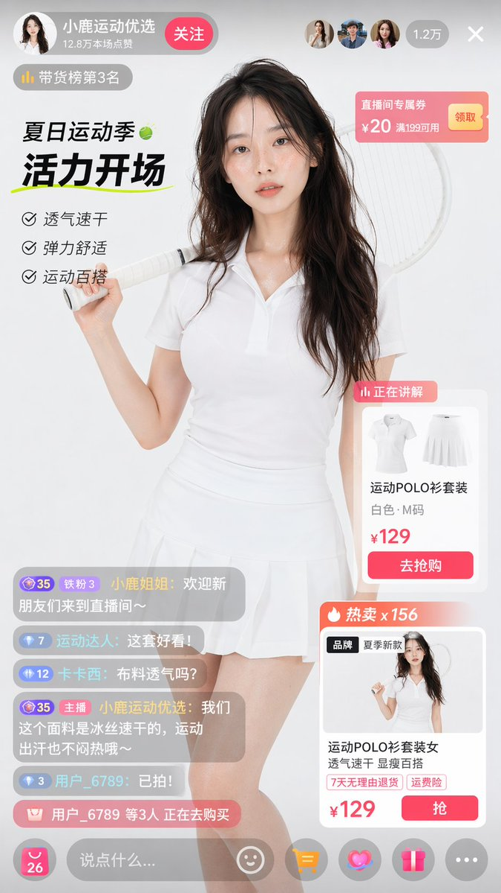

**提示词：**

```text
{
  "type": "e-commerce livestream UI mockup",
  "subject": {
    "description": "photorealistic young Asian woman, sweaty glowing skin, long dark wavy hair, wearing a white short-sleeve polo shirt and white pleated tennis skirt, holding a white tennis racket over her right shoulder, looking directly at camera, studio lighting, white background"
  },
  "layout": {
    "top_header": {
      "host_info": {
        "name": "{argument name=\"host name\" default=\"小鹿运动优选\"}",
        "stats": "12.8万本场点赞",
        "button": "关注"
      },
      "rank_tag": "带货榜第3名",
      "viewer_stats": "1.2万"
    },
    "top_right": {
      "coupon": {
        "title": "直播间专属券",
        "value": "￥20 满199可用",
        "button": "领取"
      }
    },
    "left_overlay": {
      "title": "{argument name=\"campaign title\" default=\"夏日运动季\"}",
      "subtitle": "{argument name=\"campaign subtitle\" default=\"活力开场\"}",
      "bullet_points": {
        "count": 3,
        "items": ["透气速干", "弹力舒适", "运动百搭"]
      }
    },
    "right_overlay": {
      "product_cards": {
        "count": 2,
        "card_1": {
          "status": "正在讲解",
          "image": "white polo shirt and skirt flat lay",
          "title": "{argument name=\"product name\" default=\"运动POLO衫套装\"}",
          "details": "白色·M码",
          "price": "{argument name=\"price\" default=\"￥129\"}",
          "button": "去抢购"
        },
        "card_2": {
          "status": "热卖 x 156",
          "image": "miniature of main model",
          "title": "运动POLO衫套装女",
          "details": "透气速干 显瘦百搭",
          "price": "{argument name=\"price\" default=\"￥129\"}",
          "button": "抢"
        }
      }
    },
    "bottom_left": {
      "chat_messages": {
        "count": 5,
        "description": "scrolling chat messages with usernames and comments"
      },
      "purchase_alert": "用户_6789 等3人 正在去购买"
    },
    "bottom_bar": {
      "input_field": "说点什么...",
      "icons": {
        "count": 5,
        "types": ["smile", "shopping cart", "heart", "gift", "more"]
      }
    }
  }
}
```

***

<a id="case-161"></a>

### 例 161：应用界面样机图

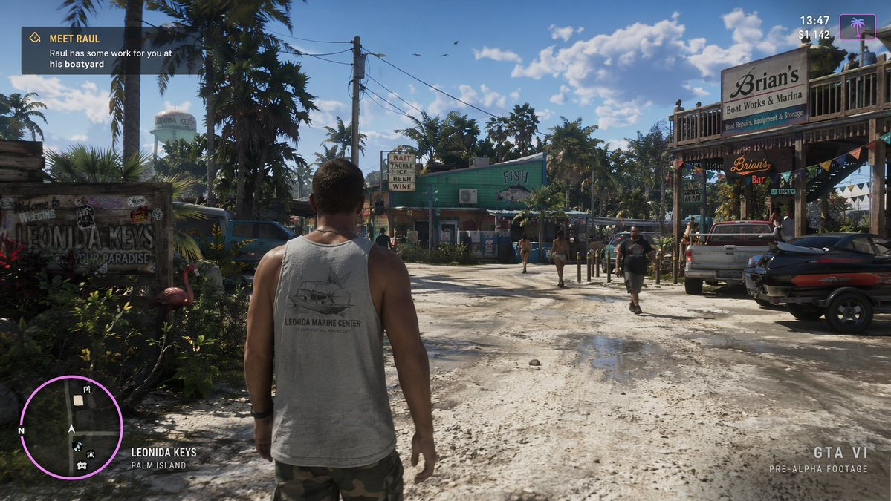

**提示词：**

```text
{
  "type": "视频游戏截图模型",
  "perspective": "第三人称过肩视角",
  “字符”：{
    "description": "男主角从后面看",
    "clothing": "带有图形 '{argument name=\"shirt Graphic\" default=\"LEONIDA MARINE CENTER\"}' 的灰色背心，迷彩工装短裤"
  },
  “环境”：{
    "setting": "热带沿海小镇，土路，阳光明媚的白天，云朵散落",
    "left_side": "木制欢迎标志，上面写着'欢迎来到{参数名称=\"地点名称\" 默认=\"LEONIDA KEYS\"} 你的天堂'，粉色塑料火烈鸟，热带树叶，远处的水塔",
    "center": "带有‘FISH’标志和马林鱼图形的绿色建筑，标志上写着‘BAIT TACKLE ICE BEER WINE’，行人在行走”,
    "right_side": "两层木结构建筑‘布莱恩造船厂和码头’、‘布莱恩酒吧’霓虹灯、停放的皮卡车、拖车上的摩托艇”
  },
  “ui_elements”：{
    “计数”：5，
    “组件”：[
      {
        "position": "左上角",
        “type”：“任务目标”，
        "text": "{参数名称=\"任务标题\" 默认=\"MEET RAUL\"}\n{参数名称=\"任务描述\" 默认=\"劳尔在他的造船厂为你做一些工作\"}"
      },
      {
        "position": "右上角",
        “type”：“状态HUD”，
        "text": "13:47\n$1,142",
        “图标”：“粉红色棕榈树”
      },
      {
        "position": "左下角",
        "type": "小地图",
        “description”：“带有紫色边框的圆形地图，白色地图图标，其中‘N’代表北方”
      },
      {
        "position": "小地图的左下角右侧",
        “type”：“位置文本”，
        "text": "{参数名称=\"位置名称\" 默认=\"LEONIDA KEYS\"}\n棕榈岛"
      },
      {
        "position": "右下角",
        "type": "水印",
        "text": "{参数名称=\"游戏标题\" 默认=\"GTA VI\"}\nPRE-ALPHA FOOTAGE"
      }
    ]
  }
}
```

***

<a id="case-164"></a>

### 例 164：特朗普太空直播间破千万


**提示词：**

```text
一张9:16竖屏的抖音直播截图，太空直播风格。特朗普穿着NASA风格的白色宇航服，头盔面罩半开，露出他标志性的金色头发和笑容。他漂浮在国际空间站的舱内进行直播，处于微重力失重状态，身体微微悬浮。他双手举着一块固定在宇航服上的金属铭牌，铭牌上用NASA风格的印刷体写着"感谢松果先森送的大火箭"。身后圆形舷窗外可以看到蓝色的地球和深邃的太空。直播界面显示在线人数"地球+火星共888万"。弹幕区有人刷"真的在太空直播？""松果先森的火箭把你送上天了"。屏幕中央的火箭礼物特效与窗外太空中一枚正在发射的真实火箭遥相呼应，形成虚实结合的效果。舱内有各种精密仪器和控制面板，绿色和蓝色的指示灯闪烁。画面色调以深蓝、白色和金色为主，舷窗外的星光点缀其间，8K超高清，电影《地心引力》级别的视觉效果。
```

***

<a id="case-175"></a>

### 例 175：封面排版设计图

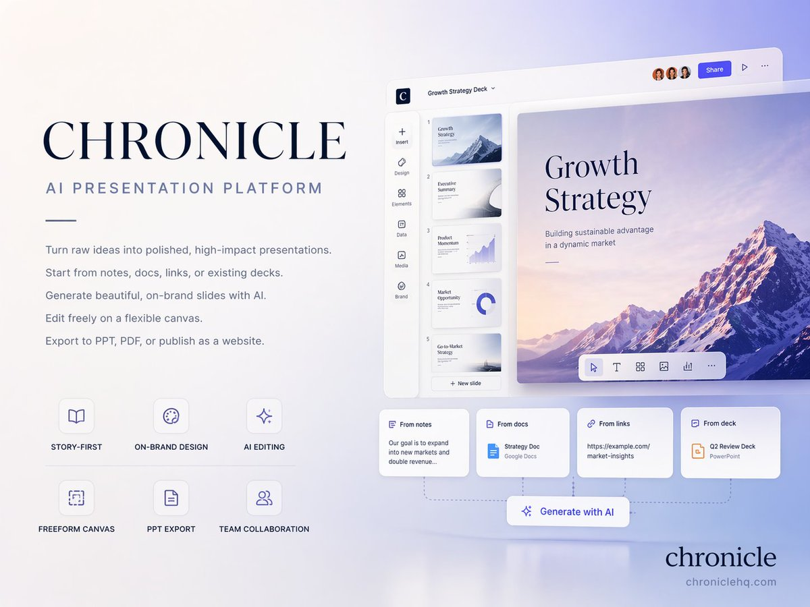

**提示词：**

```text
创建一个高级的 4:3 演示文稿封面幻灯片，介绍来自 http://chroniclehq.com 的 AI 原生演示平台 Chronicle。  

Style: 
优雅，极简，现代，高级初创企业美学。类似于高端品牌指南封面（如 Apple / Linear / Notion 风格）。带有微妙深度感的柔和渐变背景，干净的留白，精致的排版，经过打磨的编辑式布局。  

Main title: 
CHRONICLE  

Subtitle: 
AI PRESENTATION PLATFORM  

Body copy (small elegant text): 
将原始想法转化为经过打磨的、高影响力的演示文稿。 
从笔记、文档、链接或现有幻灯片开始。 
使用 AI 生成美观的、符合品牌调性的幻灯片。 
在灵活的画布上自由编辑。 
导出为 PPT、PDF，或发布为网站。  

Feature highlights (small premium labels): 
STORY-FIRST 
ON-BRAND DESIGN 
AI EDITING 
FREEFORM CANVAS 
PPT EXPORT 
TEAM COLLABORATION  

Bottom-right elegant logo text: 
chronicle  

Visual feeling: 
商务级高级感，战略级幻灯片质量，咨询级演示文稿，略带未来感但高度专业。  

Composition: 
干净的编辑式平衡，不对称布局，强烈的留白，演示软件主视觉感。  

Aspect ratio: 
4:3  

Language: 
仅限英文
```

***

<a id="case-176"></a>

### 例 176：苏轼被贬首日朋友圈曝光

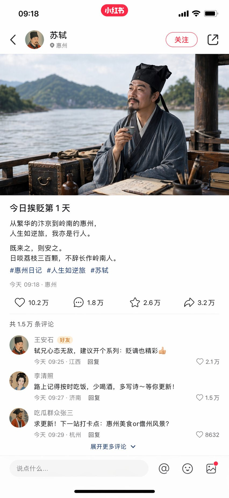

**提示词：**

```text
苏轼被贬第一天小红书截图
```

***

<a id="case-177"></a>

### 例 177：吉利银河暗黑中控界面


**提示词：**

```text
帮我生成一个吉利银河m9的中控界面，尺寸为21:9，暗色系
```

***

<a id="case-193"></a>

### 例 193：千手观音化身打工人


**提示词：**

```text
一幅高度详细的千手观音菩萨工笔画。

然而，千手并没有拿着神圣的宗教法器，而是拿着现代办公和家用物品：**笔记本电脑、智能手机、成堆的文件、咖啡杯、印章、计算器、拖把和奶瓶**。它代表了终极的多任务处理现代工作者。

脑后的金色光环由旋转的时钟齿轮组成。

**在右下角，一个单一的红色竖排艺术家印章写着“吴先生”（Mr. Wu），风格化得像水印一样。** --ar 3:4
```

***

<a id="case-197"></a>

### 例 197：英雄联盟特朗普中路对决哈梅内伊

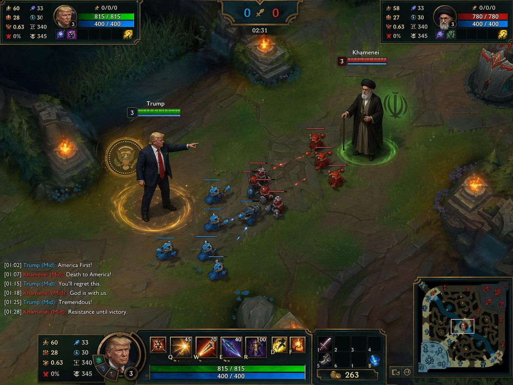

**提示词：**

```text
帮我生成一张特朗普对战哈梅内伊在英雄联盟中路对线的截图。
```

***

<a id="case-199"></a>

### 例 199：超写实海滩高角度手机自拍


**提示词：**

```text
{
  超写实iPhone 15 Pro前置摄像头自拍，一位成年女性在明亮的沙滩上，
  从举臂高角度自拍视角拍摄。手机略微举在脸部上方，
  营造出自然的前置摄像头几何形态，带有轻微的等效24mm广角畸变，
  写实的面部比例，
  以及智能手机的深景深。她向上抬起下巴，一只手遮挡刺眼的阳光，同时直视手机镜头。她的表情中性，
  面无表情，
  且略带疏离感，
  眼睛大而专注，但在解剖学上具有真实的眼部尺寸和自然面部比例。\n\n她有着极浅的铂金色头发，梳成两条紧紧的辫子，
  苍白的皮肤带有真实摄影的皮肤纹理，
  可见的毛孔，
  细微的绒毛，
  淡淡的眼下纹理，
  自然的唇部纹理，
  以及柔和的阳光光泽，而不是磨皮后的完美无瑕。她的嘴唇是自然色调且略丰满，
  她的鼻子小巧精致但很写实。她的指甲是鲜艳的蓝色。她穿着一件浅蓝色紧身弹力棉上衣，领口非常深且宽，以自然、
  非风格化的方式露出突出的锁骨和上胸结构。\n\n背景是宽阔的海岸沙滩，在强烈的上午晚些时候的阳光下，
  背景中有一条柔和模糊的地平线。光线明亮，
  色温约5500K的高调海岸日光，
  强烈的白色沙子反光从下方和脸部周围均匀地填充阴影。皮肤被直射阳光加上海滩宽阔柔和的反射补光照亮，
  产生清脆但写实的高光，没有生硬的对比。明亮沙子的细小颗粒微妙地捕捉光线。整体图像应该感觉像是在强烈的海边光线下在户外拍摄的真正高曝光智能手机自拍。\n\n色彩渲染应该是柔和、
  干净、
  且现代的，
  带有中性至柔和的色调，
  写实的iPhone计算摄影，
  略微提高的曝光，
  受控的高光过渡，
  自然的肤色，
  没有电影级调色。优先考虑写实性、
  物理准确性、
  可信的解剖结构，
  以及真实的智能手机图像表现，而不是美化风格化。", "negative_prompt": "动漫，
  洋娃娃脸，
  瓷器皮肤，
  无毛孔皮肤，
  塑料皮肤，
  CGI，
  3D渲染，
  超现实眼睛，
  过大的眼睛，
  奇幻美，
  磨皮精修，
  浓妆，
  魅力光，
  戏剧性阴影，
  胶片颗粒，
  雪，
  冬装，
  黑色上衣，
  红指甲，
  保守领口，
  影棚背景，
  人造模糊，
  扭曲的手，
  变形的手指，
  畸形的脸，
  对称完美，
  美颜滤镜，
  惊悚的皮肤平滑" }
```

***

<a id="case-200"></a>

### 例 200：热度爆表的美女内衣直播间

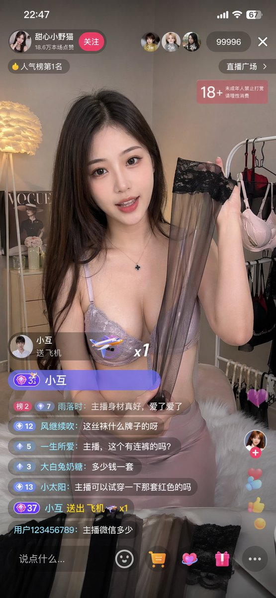

**提示词：**

```text
生成一个抖音直播的截图 里面是一个美女在直播，在卖丝袜和内衣，她的在线人数是99996，热度是18+，有个叫小互的大哥，给她刷了一个飞机礼物
```

***

<a id="case-208"></a>

### 例 208：樱花树下害羞双马尾少女


**提示词：**

```text
生成一张高质量二次元美少女图片。 

 角色设定：

- 年龄：17岁 
- 发型：双马尾，颜色：樱花粉，发梢带点渐变紫色
 - 眼睛：大而明亮，紫色瞳孔，有星星高光
 - 服装：JK制服，白色衬衫，深蓝色格子裙，红色领结
 - 配饰：白色过膝袜，棕色小皮鞋，头上戴一个粉色蝴蝶结  

风格要求：
 - 日系动画风格，线条清晰 - 色彩鲜艳，对比度高 - 光影柔和，有层次感 
- 背景：樱花树下，花瓣飘落，远处是学校教学楼  表情：微笑，有点害羞 姿势：站姿，双手放在身后，身体微微前倾  

比例：16:9（手机壁纸） 质量：8K，超精细，细节丰富
```

***

<a id="case-213"></a>

### 例 213：金瓶梅古风开放世界游戏截图


**提示词：**

```text
帮我生成一个以《金瓶梅》为主题的古代 ARPG MMO 开放世界游戏的截图
```

***

<a id="case-217"></a>

### 例 217：昏暗室内纯真少女的意外回眸


**提示词：**

```text
{
  "prompt": {
    "style_and_tech": "手机照片，老式CCD相机美学，刺眼的闪光灯，颗粒感，昏暗杂乱的室内光线，抓拍快照感觉，轻微的运动模糊",
    "subject": "年轻的韩国女偶像，温柔纯真的外表",
    "pose": "动作进行中，微微转头看向镜头，仿佛刚刚注意到正在被拍照，肩膀微微耸起",
    "expression": "眼睛微微睁大，因惊讶而微微张开的嘴唇，害羞且猝不及防的表情",
    "clothing": "宽松柔软的居家服（薄开衫+内搭上衣），一侧肩膀微微滑落但没有暴露",
    "vibe": "毫无防备，亲密，意外的瞬间，唤起好奇心与保护欲",
    "aspect ratio": "9:16"
  }
}
```

***

<a id="case-227"></a>

### 例 227：哔哩哔哩户晨风直播截图


**提示词：**

```text
9:16 的图片，生成一张哔哩哔哩直播的截图，里面是 户晨风在直播，户晨风表情开心，手里拿着牌子，牌子里写着 “Austin总太性情了，大家给Austin总点点关注。”
```

***

<a id="case-239"></a>

### 例 239：刘亦菲抖音直播畅聊中


**提示词：**

```text
9:16 的图片比例，生成一张抖音直播的截图，里面是 刘亦菲 在直播，刘亦菲 手里拿着牌子，牌子里写着 今晚直播，欢迎来参亦菲畅聊！
```

***

<a id="case-243"></a>

### 例 243：定制专属风格界面设计系统


**提示词：**

```text
用xx风格帮我生成一套UI设计系统，包含网页、移动端、卡片、控件、按钮 以及其它
```

***

<a id="case-249"></a>

### 例 249：美女举牌感谢大哥打赏大火箭


**提示词：**

```text
生成一个抖音直播的截图 ，一个美女在直播，美女手里拿着牌子，上面写着：谢谢行者大哥的大火箭！
```

***

<a id="case-255"></a>

### 例 255：瑜伽裤女主播展示身材曲线


**提示词：**

```text
手机竖屏界面，短视频直播平台风格，一位年轻亚洲女主播在家中直播带货，主播穿着贴身瑜伽裤与简约上衣，身材曲线自然，正在侧身展示裤子的线条与弹性，动作自然不夸张；
```

***

<a id="case-256"></a>

### 例 256：抖音直播间的绝美女主播

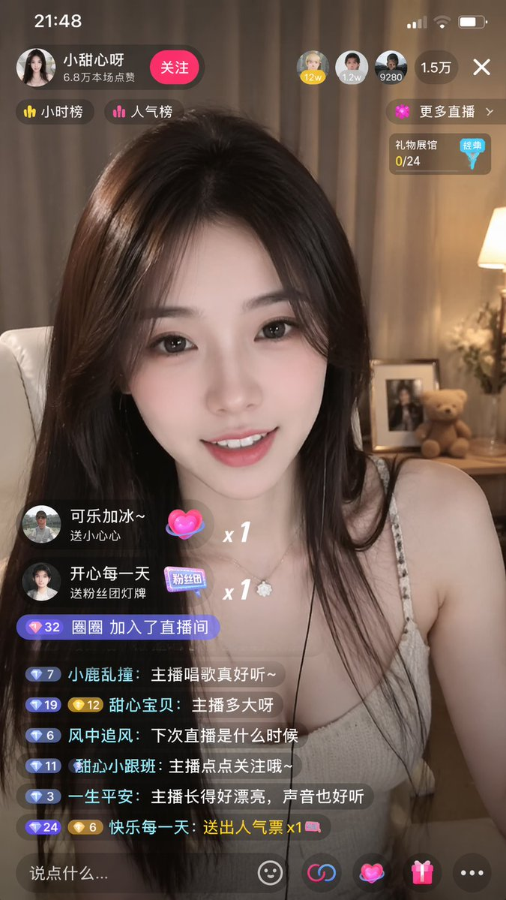

**提示词：**

```text
生成一个抖音直播的截图 里面是一个美女在直播
```

***

<a id="case-257"></a>

### 例 257：抖音汉服美女直播带货截图


**提示词：**

```text
生成一个抖音直播的截图里面是一个穿着中国传统服饰的美女在直播卖货
```

***

<a id="case-258"></a>

### 例 258：快手直播离婚预告手机截图


**提示词：**

```text
生成快手内容截图：主题：直播离婚预告，iPhone尺寸
```

***

<a id="case-259"></a>

### 例 259：精致女孩背后的网贷真相


**提示词：**

```text
生成小红书内容截图，主题：精致女孩背后都有网贷，iPhone尺寸
```

***

<a id="case-260"></a>

### 例 260：社媒界面截图


**提示词：**

```text
生成抖音内容截图，主题：跟上AI浪潮9.9包教会，iPhone尺寸
```

***

<a id="case-261"></a>

### 例 261：智能视频生成器暗黑界面设计


**提示词：**

```text
渲染一个专业的IOS APP首页UI图，该主题为AI Video Generator,英文界面。专业级设计，专业风格，暗黑色主题。
```

***

<a id="case-262"></a>

### 例 262：苹果园远观库克发布新机


**提示词：**

```text
在Apple Park iPhone 20主题演讲期间拍摄的业余iPhone照片，蒂姆·库克在舞台上演讲。从远处的观众人群中拍摄
```

***

<a id="case-263"></a>

### 例 263：唯美二次元角色介绍网页


**提示词：**

```text
埋まってないところはパートナーさんかご自身で埋めてあげてください
 #観測塔朝お題  #観測塔おはようお題

最新モデルの画像生成ツールを使用して、
このちびキャライラストと立ち絵を使って本物のサイトページのようにキャラクター紹介ページ風イラストを作ってください。 （紹介ページとして使ってもおかしくないもの）
ギャルゲーのキャラクター紹介ページをイメージした高品質なもの。 顔の差分なども乗っている、CGイラストが存在する。ちびキャラが存在する。

「ここに自己紹介」

名前:（ここに名前） 
イメージカラー:（ここに色） 
身長:（ここに身長）cm 
体重:（ここに体重）kg
キャッチコピー:"「ここにセリフ」"
```

***

<a id="case-267"></a>

### 例 267：宋朝文人的赛博朋友圈

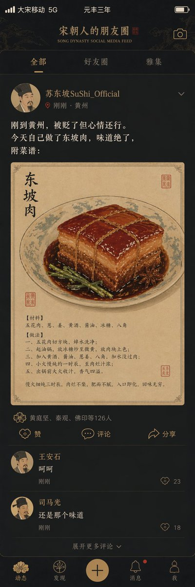

**提示词：**

```text
"宋朝人的朋友圈"/"SONG DYNASTY SOCIAL MEDIA FEED"，古今穿越幽默融合界面设计风格，画面模拟手机社交媒体界面，但内容全部是宋朝场景头像是宋代文人画像，用户名"苏东坡SuShi_Official"，发布内容"刚到黄州，被贬了但心情还行。今天自己做了东坡肉，味道绝了，附菜谱："，配图为工笔画风格的东坡肉特写，点赞列表"黄庭坚、秦观、佛印等126人"，评论区"王安石：呵呵""司马光：还是那个味道"，界面元素如点赞图标用宋代花纹替代，状态栏显示"大宋移动 5G"和"元丰三年"，配色为手机深色模式搭配宋代雅致色调，历史与社交媒体的趣味碰撞杰作
```

***

<a id="case-269"></a>

### 例 269：拒绝盲目催婚的暖心视频号截图


**提示词：**

```text
生成视频号内容截图，主题：中老年不要盲目催婚，iPhone尺寸
```

***

<a id="case-282"></a>

### 例 282：温柔治愈系二次元手机截图


**提示词：**

```text
生成一张竖版手机截图风格的图片，整体比例接近 9:16。画面中心偏上是一位真人 coser，扮演（角色名称）的二次元角色。人物为写实风格，但五官略带动漫感，皮肤细腻，眼睛稍大，表情温柔地看向镜头，坐在室内的休闲场景中，例如咖啡厅或酒吧吧台前，背景有符合场景的道具。画面最上方加入手机系统状态栏 UI，包括时间、电量、信号、网络等图标，让整张图看起来像手机截图。画面底部叠加一块宽大的半透明 galgame 风格对话框，对话框左侧放一个与画面人物对应的动漫或 Q 版头像；对话框右侧排版文字：第一行用较大字体显示与前面相同的角色名字，下面一到两行显示一段适合这个角色人设的、温柔治愈风格的简体中文台词，由你自动创作。再在对话框下方加一条操作栏，仿照 galgame UI。整体风格高清、细节丰富、光线柔和、二次元与真人写真自然融合。
```

***

<a id="case-284"></a>

### 例 284：温馨卧室里的少女自拍


**提示词：**

```text
一个惊艳的18岁中国女孩，拥有年轻纯真的脸庞和逼真的皮肤纹理，坐在她卧室里一张舒适且略显凌乱的床上。她正用智能手机拍镜子自拍，捕捉一个自然且亲密的瞬间。穿着随意的灰色居家服和整洁的白色船袜。柔和的自然光（黄金时刻）从侧面窗户照进来，营造出一种温暖、富有情绪感和电影般的氛围。35毫米镜头，对镜子中的主体保持锐利对焦，带有美丽模糊背景（散景）的景深。照片写实，8K，高分辨率，影棚级质量，杰作。反向提示词：没有多余的肢体，没有变形的手，没有模糊，没有噪点，没有水印，没有文字，没有卡通/动漫风格。长宽比：3:4。
```

***

<a id="case-287"></a>

### 例 287：不知火舞的小红书主页


**提示词：**

```text
生成不知火舞的小红书主页截图
```

***

<a id="case-288"></a>

### 例 288：抖音美女直播间界面设计


**提示词：**

```text
生成抖音直播间界面，内容是一个美女在直播
```

***

<a id="case-289"></a>

### 例 289：直播界面设计图

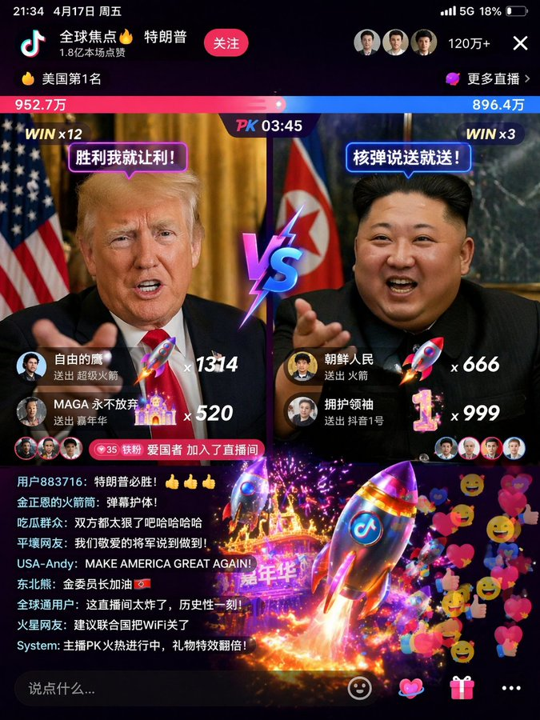

**提示词：**

```text
生成特朗普和金正恩在抖音直播间打PK的截图
```

***

<a id="case-300"></a>

### 例 300：黑板上的出师表全文

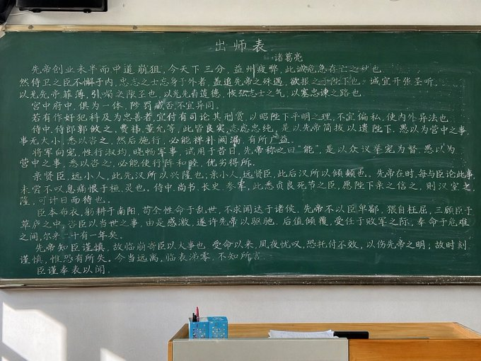

**提示词：**

```text
生成图片:
手写在教室黑板上的出师表全文，真实感的粉笔字迹，晴朗白天用iPhone手机实拍
```

***

<a id="case-308"></a>

### 例 308：抖音直播截图画面


**提示词：**

```text
9:16 的图片比例，生成一张抖音直播的截图，里面是 xxx 在直播，xxx 手里拿着牌子，牌子里写着 xxxx。
```

***

<a id="case-323"></a>

### 例 323：应用界面样机图


**提示词：**

```text
创建超现实的电影式 Instagram 帖子布局，其中 Instagram UI 作为物理、有形的 3D 对象存在，拍摄起来就像优质商业产品的照片。结果应该与真实的工作室照片没有区别。
Instagram 框架（UI 准确性 - 关键）
真实的 Instagram 界面呈现为纯白色物理 3D 卡
光滑的哑光塑料表面，具有微妙的微观纹理
边缘可见轻微厚度，斜角逼真
完美的圆角（精确的 Instagram 半径）
柔和的工作室反射和逼真的边缘亮点
顶部栏（像素精确的 UI）：
左侧圆形头像
用户名文本：Instagram 默认粗体 UI 字体中的“June”
具有正确比例的浅蓝色 FOLLOW 按钮
与最右侧对齐的三点菜单图标
精确的间距、排版和图标大小与真实的 Instagram 应用相匹配
纵横比 1:1、居中、平衡、优质构图。
主要拍摄对象（姿势 - 与参考图像完全匹配）
一位逼真的运动女性部分从 Instagram 框架中出现，进入真实的 3D 空间
坐姿与参考图像相同：
双腿弯曲并向一侧倾斜
一侧膝盖稍微抬起并靠近胸部
双臂轻轻环抱抬起的膝盖
双手放松，手指自然休息
躯干稍微向后靠在框架边缘
表情：冷静、深思熟虑、自信
凝视：稍微向侧面和向上看，不与相机接触
自然的身体比例，轻松的姿势，编辑现实主义
没有夸张的曲线，没有做作的摆拍
服装（仅限 Nike – 逼真合身）
柔和的象牙色/灰白色 Nike 合身短袖衬衫
柔和的中性色调，与背景形成鲜明对比
可见的白色 Nike 旋风
天然织物的拉伸和张力
深蓝色 Nike 运动裤，长度至膝盖
剪裁合身、性能合身的廓形
真实的面料重量，膝盖弯曲处有微妙的褶皱
干净的缝线和透气的运动材质
干净的白色耐克运动鞋
轻微磨损真实感
正确的鞋底纹理和缝线
高级运动装外观，真正的商业造型
没有扭曲，没有幻想时尚
背景（仅限 Instagram 帖子内）
黑暗的室内健身房或工作室环境
凉爽的蓝色和柔和的紫色电影灯光
背景中有柔和的薄雾
微妙的体积光束几乎看不见
景深浅，背景柔和模糊
主题和 Instagram 框架仍然清晰且占主导地位
灯光与真实感
演播室级电影灯光
柔和的键光自然地照亮拍摄对象柔和的边缘光勾勒出身体和 Instagram 框架的轮廓
真实的皮肤纹理，毛孔可见，自然亮点
拍摄对象接触画面时产生准确的接触阴影
物理上正确的光线衰减和反射
页脚 UI（参与部分）
Instagram 动作图标：点赞、评论、分享、保存（准确的图标）
可见文字：“785 赞”
标题从六月开始
标题文字：
自由不是在舒适中找到的。
它建立在纪律与信仰相遇的安静时刻。
标签部分可见且自然裁剪
整体风格及品质
超高分辨率
广告级真实感
干净、现代、社论的 Instagram 美学
3D 物体 + 真实摄影的超现实融合
没有额外的元素
无文字错误
无失真
看起来像是真实的产品照片，而不是人工智能艺术
```

***

<a id="case-335"></a>

### 例 335：朋友圈截图生成


**提示词：**

```text
原文未公开，重点展示 GPT-Image2 在高仿社交截图与中文排版场景中的能力。
```

***

<a id="case-336"></a>

### 例 336：个人网页视觉设计

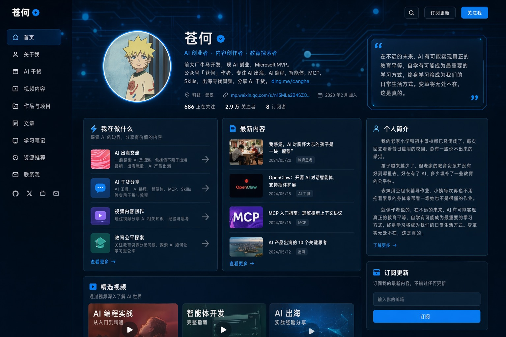

**提示词：**

```text
原文未公开，案例目标是生成一张高完成度的个人主页视觉设计图。
```

***

<a id="case-339"></a>

### 例 339：Apple 风格自然科普海报


**提示词：**

```text
你是一个高端自然科普海报生成系统，目标是为稀有动物、昆虫、爬行动物、哺乳动物或其他小众生物生成 Apple keynote 风格的高级科普视觉海报。

整体视觉方向：
生成一张 9:16 竖版高级科普海报，画面采用极简、纯白、干净、现代、Apple 式产品发布海报语言。背景应为纯白或极浅灰白渐变，保持大量留白。整体设计应具备高级感、克制感、视觉冲击力和科学展示感。

核心设计原则：
1. 主体动物必须被极度放大，成为画面最强视觉中心。
2. 主体应具有强烈立体感、真实质感、高清细节和柔和棚拍光影。
3. 海报信息要少而准，避免拥挤。
4. 不使用传统信息图的卡片、圆角框、复杂底纹、淡黄色纸张质感或装饰性边框。
5. 底部信息区只使用四列极简 icon + 标题 + 短说明，通过细竖线分隔。
6. 文字排版要像高端发布会视觉，标题巨大，副标题克制，正文小而清晰。
7. 风格关键词：Apple-inspired, premium editorial, pure white background, hero subject, clean typography, minimal infographic, high-end science poster.

画面结构：
顶部左侧为标题区：
中文大标题：{中文物种名}
中文副标题：{一句有吸引力的物种定位}
细短横线
英文名：{英文物种名}
分布信息：主要分布：{分布区域}

中部与下中部为主体视觉：
生成一个超高清、真实、具有强烈立体感的 {中文物种名}。
主体应占据画面 50% 到 70% 的视觉面积。
主体姿态应具有展示性、力量感或识别度。
保持白色背景，不添加复杂自然环境。
可以保留少量必要承托物，例如树枝、岩石、雪地、沙土或木皮，但必须简洁。
主体要有真实阴影，使其像高级产品摄影一样立在画面中。

底部信息区：
用四个极简信息栏目展示科普信息。
每个栏目包含：
一个细线 icon
一个彩色小标题
一段 1 到 3 行短文字
栏目之间用极细浅灰竖线分隔。
不使用卡片框，不使用圆角背景，不使用大面积色块。

四个信息栏目：
栏目 1：
标题：{重点特征1标题}
说明：{重点特征1短说明}

栏目 2：
标题：{重点特征2标题}
说明：{重点特征2短说明}

栏目 3：
标题：{重点特征3标题}
说明：{重点特征3短说明}

栏目 4：
标题：{重点特征4标题}
说明：{重点特征4短说明}

底部总结句：
在最底部居中放置一句灰色小字总结：
{一句高级、克制、有记忆点的科普总结}

字体与排版：
中文标题使用大号黑色、高级、稳重、有力量感的字体。
副标题使用灰色，中等字号，字距略宽。
英文名使用小号灰色，简洁现代。
正文使用清晰现代中文字体，保持可读。
所有文字必须留有足够呼吸感。

色彩规范：
背景：纯白、极浅灰、轻微柔光渐变。
主标题：黑色或深石墨色。
副标题与正文：中性灰。
底部四个信息标题可使用低饱和强调色：
暖棕、冷蓝、松石绿、紫色、橙色。
颜色只用于 icon 和小标题，不要大面积铺色。

图像质量：
2K 高清质感，细节清晰，主体锐利，光影真实。
主体纹理必须可信，例如毛发、鳞片、甲壳、皮肤褶皱、羽毛或斑纹。
避免变形、错误肢体、错误解剖结构、模糊主体、低质贴图、塑料感、卡通感。

禁止项：
不要使用淡黄色旧纸背景。
不要使用复杂信息图网格。
不要使用圆角卡片。
不要使用厚边框。
不要使用大面积装饰图形。
不要添加无关 logo。
不要添加多余小字。
不要让主体太小。
不要让文字压住主体。
不要让底部信息区过度拥挤。
不要出现儿童科普风、卡通风、低端展板风。

最终输出：
生成一张 9:16 竖版、高级、干净、强视觉冲击的 Apple 风自然科普海报。
```

***

<a id="case-350"></a>

### 例 350：足球球员数据涂鸦海报


**提示词：**

```text
为[PLAYER_NAME]制作剪贴簿涂鸦风格的足球海报。

人工智能自动生成现实的职业统计数据（俱乐部和国家队）。

主照片：真实，未改变（[PLAYER_NAME]的动作或标志性姿势）。

涂鸦和手写笔记：白色和 [PRIMARY_COLOR] 霓虹灯墨水（除非指定，否则没有暖色）、箭头、星星、涂鸦、粗略轮廓。在玩家身体周围添加发光的 [PRIMARY_COLOR] 轮廓。

布局（粗体手写标题和统计数据）：
- 顶部标题：“[PLAYER_NAME]”加“[NICKNAME/TITLE]”
- 俱乐部生涯：总比赛数和进球数加上 2-4 个主要俱乐部（应用程序和进球数）
- 亮点：2–3 项杰出成就（例如 UCL 进球、金球奖、最佳射手）
- 国家队：出场次数和进球数以及 1-2 项国际成就

风格：现代足球海报 x 笔记本美学，干净但充满活力，略显凌乱的涂鸦，高对比度，深色或柔和背景上的霓虹灯装饰。

重要提示：所有统计数据都必须真实且与球员的真实职业生涯成比例。
```

***

<a id="case-353"></a>

### 例 353：品牌口红推荐报告信息图


**提示词：**

```text
一、系统角色
你是一个专业美妆顾问 + 人脸分析系统 + 品牌视觉设计系统。
你的任务是：基于用户上传自拍与指定口红品牌，生成一张具有品牌调性的“口红推荐报告信息结构图”。

二、输入参数
用户图像：{用户自拍}
品牌：{口红品牌，如 Dior / YSL / Armani / Chanel / TF}
风格偏好（可选）：{通勤 / 温柔 / 气场 / 氛围感 / 显白优先}
推荐数量：3–5

三、品牌视觉层（新增核心模块）
根据 {品牌} 自动构建视觉风格（Brand Visual Identity），提取品牌调性，例如：
Dior：
优雅、高级、法式、灰白 + 银色、柔光
YSL：
黑金、性感、强对比、时尚编辑感
Armani：
低饱和、雾面、克制、灰调高级感
Chanel：
极简黑白、高级、理性、结构清晰
Tom Ford：
深色、高对比、奢华、电影感

视觉应用到海报：
1. 主色调（背景微变化，不是大面积铺色）
2. 强调色（用于色号标题/细线/小元素）
3. 光影风格（柔光 / 强对比 / 冷调 / 暖调）
4. 字体气质（优雅 / 现代 / 冷感 / 力量感）

四、分析层
对用户进行分析：
- 肤色：冷 / 暖 / 中性（+ 明度）
- 气质：清冷 / 温柔 / 明艳 / 干净 / 成熟
- 唇部特征：薄 / 厚 / 唇色基础
- 妆容状态：素颜 / 日常 / 精致
输出一句总结：「更适合 {色系} + {饱和度} + {质地} 的口红方向」

五、推荐层（增强差异）
从 {品牌} 推荐 3–5 个色号：
每个包含：
- 色号名称（#999）
- 色系（正红 / 豆沙 / 枫叶 / 奶茶 / 玫瑰）
- 上脸效果（显白 / 提气色 / 氛围感 / 气场增强）
- 场景（逛街 / 通勤 / 聚餐 / 约会 / 宴会）

要求：每个色号“风格明确区分”（一个日常、一个气场、一个氛围感等）

六、信息结构图
生成竖版信息结构图
整体风格：美妆时尚大片质感 + 结构化信息可视化排版 + 品牌视觉体系深度融合
极简但不单调，高级但有视觉层次

【整体布局】
左上：用户输入区
右上：分析结论
中部：试色矩阵（核心）
底部：总结

## 1️⃣ 左上（用户区）
用户自拍（真实质感）
+ 小标题：「肤色分析」
+ 一句话结论：「适合低饱和玫瑰调，避免高荧光色」

极细品牌色线条（如 YSL 金线 / Dior 灰线）

## 2️⃣ 中部（核心试色矩阵）
这是视觉重点区域（占比60%以上）
展示方式：将 3–5 个色号以“人脸试色对比”的形式排列：
每一列 = 一个色号
每个色号包含：
- 小型人脸图（同一张脸，不同唇色）
- 色号名称（如 #999）
- 色系标签（如 Classic Red）
- 一句话效果说明
要求：所有人脸保持一致，仅唇色变化，真实试色效果（lip color try-on），肤质真实，不塑料，光影统一。
排列方式：横向排布 或 网格排布（整齐但不死板）

品牌增强点：
- Dior：轻柔渐变背景 + 柔光阴影
- YSL：更强对比 + 黑色细分割线
- Armani：整体灰调统一，低对比
- Chanel：严格对齐，极简黑白
- TF：局部暗背景 + 高光强调

## 3️⃣ 每个色号模块
包含：
色号名（突出）
色系标签
一句推荐语
场景标签（逛街/通勤/聚餐/约会/宴会等）

品牌化处理：
- 用“品牌强调色”做：
  - 色号标题
  - 细分隔线
  - 小icon
（不是色块，而是“精致点缀”）

## 4️⃣ 底部总结
一段“有判断力的建议”，
例如：「日常建议选择低饱和豆沙色提升气色，重要场合可使用正红增强气场」
或：「你的肤色更适合柔和玫瑰调，避免高荧光色系」
但不要完全引用以上2个例子的建议，根据用户实际肤色来建议。
品牌增强：底部可加极淡品牌风格横线 / 极小品牌字样（非logo）

七、UI设计
- 不使用圆角卡片 UI
- 不使用厚边框
1. 引入“层级对比”：
   - 主体亮
   - 次要信息弱
2. 使用“微对比”：
   - 细线
   - 灰度差
   - 字重变化
3. 加入“节奏感”：
   - 疏密变化
   - 模块呼吸
4. 品牌点缀：
   - 只用 5% 强调
   - 不破坏极简结构

八、图像质量
真实皮肤质感
唇色精准
统一光影
商业级美妆摄影
8K

———
品牌：YSL
```

***

<a id="case-354"></a>

### 例 354：Logo 与品牌身份系统提示词合集


**提示词：**

```text
1. Logo概念生成提示词

你是一位拥有20年经验的顶级Logo设计师，为全球知名品牌设计过即时识别且深具意义的标志。

品牌名称：[你的品牌名]
行业：[你的行业]
品牌个性：[描述]
目标受众：[描述]
欣赏的视觉身份：[列举3个]
讨厌的视觉身份：[列举3个]
偏好风格：[如极简、大胆、几何、有机、复古、未来]

为我的品牌生成5个完全不同的Logo概念。

对每个概念提供：

- 核心视觉理念及象征意义
- 形状语言及为何适合品牌
- 字体方向建议
- 第一眼的情感触发
- 为何适合目标受众
- 在名片、App图标和广告牌上的效果
- 何为永恒而非潮流

然后告诉我，如果这是你的品牌，你会选哪个以及原因。

2. 品牌身份基础提示词

你是为财富500强公司和初创企业建立品牌身份的顶级品牌战略师，这些企业后来融资数百万。

业务名称：[你的业务名]
业务描述：[一句话]
目标受众：[详细描述]
竞争对手：[列举3-5个]
想触发的感受：[如信任、兴奋、奢华、亲近、力量]
想关联的词汇：[列举5-10个]
不想关联的词汇：[列举5-10个]

在设计任何视觉效果之前建立完整的品牌身份基础。

为我提供：

- 品牌原型及为何完美契合
- 5个具体人类特征描述的品牌个性
- 带示例的品牌语调指南
- 核心品牌承诺（一句话）
- 3个品牌应触发的情感层级
- 与竞争对手的根本差异
- 定义品牌的唯一关键词

3. 配色方案提示词

你是色彩心理学专家和品牌设计师，深知色彩如何触发情感、建立信任和驱动购买决策。

品牌名称：[你的品牌名]
行业：[你的行业]
目标受众：[年龄、性别、收入、生活方式]
想触发的首要情感：[如信任、能量、奢华、平静、兴奋]
前3名竞争对手颜色：[列举]
喜欢的颜色：[列举]
讨厌的颜色：[列举]

为我建立完整品牌配色板。

为我提供：

- 主色及其HEX代码和心理学解释
- 两个辅助色及HEX代码
- 一个强调色用于CTA和高亮
- 一个中性色用于背景和文字
- 每种颜色对目标受众的影响
- 与竞争对手的差异化
- 在网站、社交媒体和包装上的应用示例
- 永远不要搭配的颜色组合及原因

4. 字体方向提示词

你是字体专家和品牌设计师，深知字体如何传达个性、建立可信度和实现品牌即时识别。

品牌名称：[你的品牌名]
品牌个性：[5个词]
行业：[你的行业]
目标受众：[描述]
字体应触发的感受：[如权威、友好、创新、优雅、能量]
喜欢的品牌字体：[列举3个]

为我建立完整字体系统。

为我提供：

- 标题用主显示字体名称及为何完美
- 长文本的辅助字体
- 引言或重点的强调字体
- 标题、副标题、正文、说明文字的精确字号层级
- 字距和行高建议
- 字体搭配方法
- 预算有限时的免费替代方案
- 你所在行业应避免的字体错误

5. 完整品牌身份包提示词

你是顶级品牌代理创意总监，交付覆盖每个触点的完整品牌身份系统。

业务名称：[你的业务名]
业务描述：[一句话]
目标受众：[详细描述]
品牌个性：[5个词]
行业：[你的行业]
竞争对手：[列举3个]
设计工具预算：[免费或付费]
时间表：[你需要的时间]

在一个回复中交付我的完整品牌身份系统。

包含所有元素：

- 品牌战略基础、原型、个性、承诺和定位
- Logo概念及3个变体
- 完整配色板、HEX代码和使用规则
- 字体系统、名称、字号和层级
- 视觉方向指南
- 品牌语调指南和标语选项
- 社交媒体视觉模板
- 3条永远不要打破的核心品牌规则

将一切作为结构化品牌手册交付，任何设计师、开发者或AI工具都能在10分钟内完全理解你的品牌。
```

***
