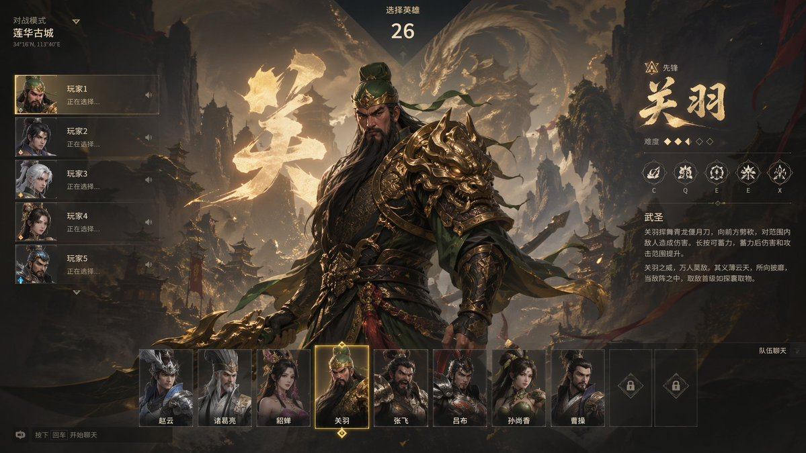
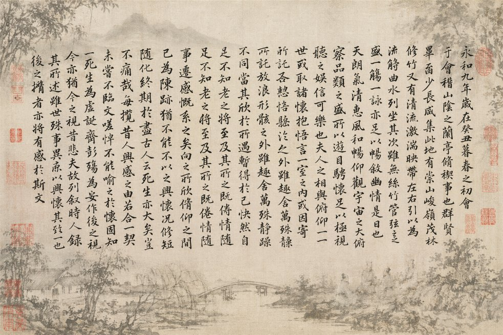
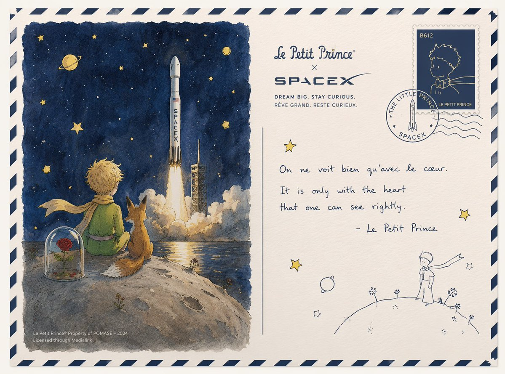
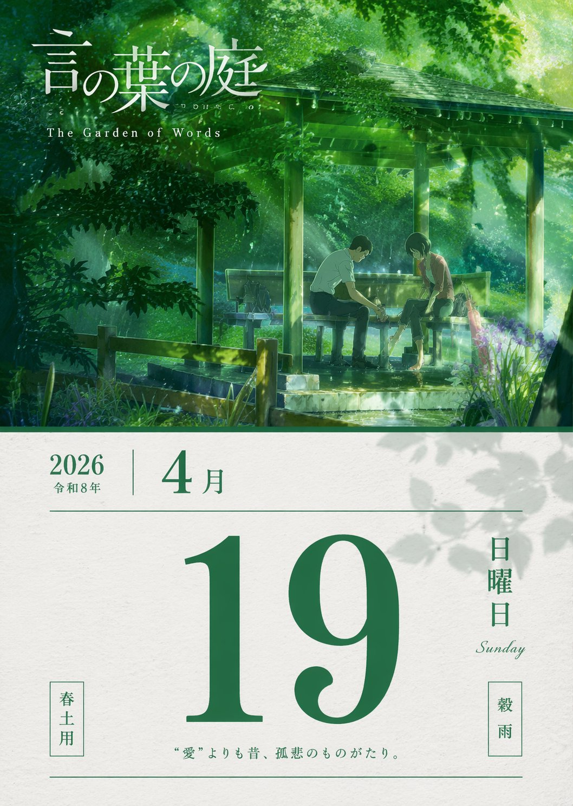
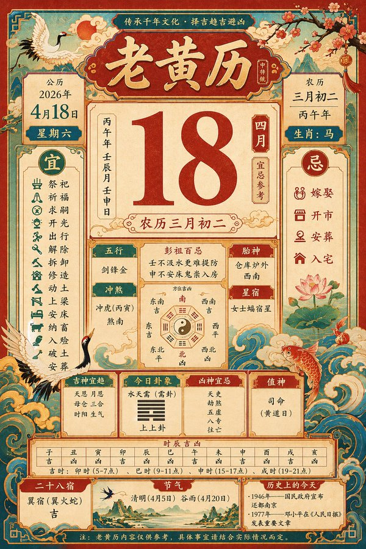
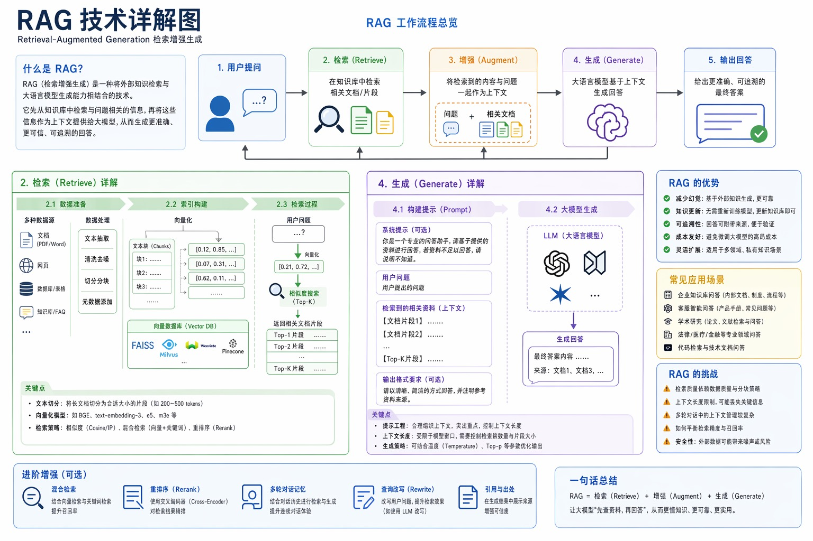

# 其他应用场景

> GPT Image 2 中文提示词案例分册 13。本分册共 25 个案例。

[返回索引](index.md)

## 案例目录

- [例 178：亚马逊详情图设计](#case-178)
- [例 185：武则天发微博自拍太魔性了](#case-185)
- [例 188：暗黑极简头像网站视觉设计](#case-188)
- [例 201：三甲医院真实门诊处方笺](#case-201)
- [例 203：杠精视角的独特文案创意](#case-203)
- [例 205：皇宫深处的御用快递驿站](#case-205)
- [例 209：神话三国枪战世界](#case-209)
- [例 210：萌系大模型训练图解](#case-210)
- [例 214：绘制金瓶梅知识图谱](#case-214)
- [例 225：大师级真迹复刻](#case-225)
- [例 232：兰亭集序书法帖意境图](#case-232)
- [例 233：蒙娜丽莎畅饮可乐的趣味油画](#case-233)
- [例 245：马斯克专属篆刻印章设计](#case-245)
- [例 246：黑白线稿勾勒的上海风情](#case-246)
- [例 248：景德镇青花瓷全景解说图谱](#case-248)
- [例 250：小王子与星舰的浪漫联名](#case-250)
- [例 251：言叶之庭春雨绿意单日历](#case-251)
- [例 252：五一劳动节手举牌创意设计集](#case-252)
- [例 265：日式潮流广告四联画](#case-265)
- [例 268：威化岛回军前夕李成桂动态](#case-268)
- [例 273：橙红渐变中的孤独剪影](#case-273)
- [例 281：赛博朋克科幻曼荼罗](#case-281)
- [例 295：复古传统老黄历二零二六年四月十八](#case-295)
- [例 326：红蓝撞色高跟诱惑](#case-326)
- [例 334：RAG 技术详解图](#case-334)

## 案例

<a id="case-178"></a>

### 例 178：亚马逊详情图设计


**提示词：**

```text
生成一套亚马逊 A+=详情图
```

***

<a id="case-185"></a>

### 例 185：武则天发微博自拍太魔性了


**提示词：**

```text
武则天自拍登记发微博
```

***

<a id="case-188"></a>

### 例 188：暗黑极简头像网站视觉设计


**提示词：**

```text
用 ABCD（a black cover design) 的风格，为 图你太美 设计一个 vi 系统。图你太美是一个头像美图分享 网站。
```

***

<a id="case-201"></a>

### 例 201：三甲医院真实门诊处方笺


**提示词：**

```text
一张三甲医院的门诊处方笺，医生潦草的手写字，包含真实合理的 诊断、药品名、剂量，右下角有医生签名和科室章。
```

***

<a id="case-203"></a>

### 例 203：杠精视角的独特文案创意


**提示词：**

```text
杠精视角文案 + GPT Image 2
```

***

<a id="case-205"></a>

### 例 205：皇宫深处的御用快递驿站


**提示词：**

```text
生成一张古代皇宫 × 快递驿站
```

***

<a id="case-209"></a>

### 例 209：神话三国枪战世界



**提示词：**

```text
模仿《无畏契约》的风格，生成一个三国神话的 FPS 游戏
```

***

<a id="case-210"></a>

### 例 210：萌系大模型训练图解


**提示词：**

```text
可爱地解释一下大语言模型训练过程
```

***

<a id="case-214"></a>

### 例 214：绘制金瓶梅知识图谱


**提示词：**

```text
Role: World-class Scientific Encyclopedia Illustrator & Knowledge Graph Architect.

Task: Generate a highly detailed, extremely intricate, and visually stunning "Universal Illustrated Encyclopedia Science Infographic" in a classic, unbranded (NO logos) scientific encyclopedia style.

Subject Matter: Choose one from [People, Plants, or Animals]. 

Specific Subject: [e.g., The Giant Squid / Leonardo da Vinci / The Sequoia Tree].

Style: Fine, detailed scientific illustration on a retro, aged beige paper background. Delicate linework. Intricately complex and professional.

Key Visual Requirements:

1.  Lifelike 3D Effect (The Central Subject): The central subject in the "C position" must be rendered with extraordinary realism and dynamism. Create a dramatic sense of depth where the character, plant, or animal appears to break the frame, leaping or bursting out of the flat paper towards the viewer (an effect similar to anamorphic 3D or dynamic pop-out, with high-precision realism).

2.  Layout & Strategic White Space:
    * Central Subject: Dominates the center, with intentional "strategic white space" around it to enhance the popping-out effect and make the figure the clear focal point.
    * Surrounding Modules: The surrounding area (left, right, top, bottom, and corners) must be filled with 6-8 distinct, highly organized knowledge modules, depending on the subject. There should be a sense of organized density, not random clutter. The modules themselves must have clear borders, headers, and extensive, detailed content.

3.  Connections: Use a complex, logical network of fine leader lines, arrows, brackets, dotted lines, and small connection points to link the central figure to all surrounding modules, and interconnect the modules themselves into a cohesive knowledge web.

4.  Text & Annotation (Hard Requirement - Must be CLEAR Chinese):
    * Main Title: A large, prominent, beautifully executed **Chinese calligraphy** (书法体) of the specific subject's name [e.g., "大王乌贼"].
    * Calligraphic Accents: Scattered throughout the main content and module titles, use beautiful, clear Chinese calligraphy for important terms.
    * Standard Chinese Text: All other descriptive text, handwritten notes (大量清晰中文手写注释), module content, and annotations must be clear, legible Chinese characters (简体中文), not gibberish or unreadable symbols. Ensure text clarity is prioritized.
    * Leader Line Annotations: Every single small component, detail, submodule, diagram, or illustration within the modules must have detailed leader line annotations (拟解剖图) pointing directly to it for maximum professionalism and educational value. Every part should be labeled.

Subject-Specific Module Structure (Example for general reference):

A. For Humans [People]:
   - Module 1: Anatomy & Skeletal Structure (w/ magnified cross-sections)
   - Module 2: Physiological Processes (e.g., Circulatory/Nervous System)
   - Module 3: Historical Context & Timeline (Key Achievements)
   - Module 4: Major Contribution Diagram (Detailed breakdown)
   - Module 5: Cognitive Process / Psychological Insight
   - Module 6: Genetic Profile / Evolution
   - Module 7: Global Influence & Cultural Impact
   - Module 8: Cultural Representations / Legacy

B. For Animals:
   - Module 1: Full External Sketch & Anatomy (w/ microscope magnified detail circular windows)
   - Module 2: Behavioral Patterns & Lifecycle (e.g., Mating/Migration, Flowchart style)
   - Module 3: Digestive & Skeletal System
   - Module 4: Habitats & Distribution Map (with environmental details)
   - Module 5: Unique Adaptations (e.g., camouflage, hunting tools)
   - Module 6: Evolutionary History & Relatives
   - Module 7: Symbiotic Relationships / Ecosystem Role
   - Module 8: Conservation Status & Human Interaction

C. For Plants:
   - Module 1: Full Plant Sketch & Anatomy (w/ magnified leaf/root details)
   - Module 2: Photosynthesis & Lifecycle Flow (w/ icons for environment)
   - Module 3: Cellular Structure (Magnified circular views)
   - Module 4: Medicinal Properties / Practical Applications (as in original original prompt)
   - Module 5: Environmental Adaptations / Unique Features
   - Module 6: Distribution Map & Environmental Context
   - Module 7: Genetic Variations & Cultivation
   - Module 8: Historical Usage & Folklore

Overall Composition: Extremely dense with information, organized into 6-8 structured modules, but balanced with strategic empty space around the center to allow the main, hyper-realistic figure to pop. Hard-core, professional, academic, but visually engaging due to the dynamic 3D central figure. No branding from any specific encyclopedia (e.g., no "DK" logos). All annotations must be legible. All handwritten notes must be clear. Main titles in Chinese calligraphy. Aspect Ratio: 3:4.

主题内容：潘金莲
```

***

<a id="case-225"></a>

### 例 225：大师级真迹复刻


**提示词：**

```text
帮我生成xxxx真迹图片
```

***

<a id="case-232"></a>

### 例 232：兰亭集序书法帖意境图



**提示词：**

```text
结合王羲之的《兰亭集序》里的内容，生成一副书法帖图片，要求图片背景符合《兰亭集序》的意境，背景图可以使用蒙版，前景是《兰亭集序》
```

***

<a id="case-233"></a>

### 例 233：蒙娜丽莎畅饮可乐的趣味油画


**提示词：**

```text
生成一张蒙娜丽莎喝可乐的油画。
```

***

<a id="case-245"></a>

### 例 245：马斯克专属篆刻印章设计


**提示词：**

```text
给”埃隆·马斯克”设计一组篆刻印章
```

***

<a id="case-246"></a>

### 例 246：黑白线稿勾勒的上海风情


**提示词：**

```text
设计一张黑色线稿风格的上海明信片
```

***

<a id="case-248"></a>

### 例 248：景德镇青花瓷全景解说图谱


**提示词：**

```text
为我生成景德镇青花瓷的详细解说图，配上详细的中文知识解析
```

***

<a id="case-250"></a>

### 例 250：小王子与星舰的浪漫联名



**提示词：**

```text
设计一张小王子和SpaceX联名的明信片
```

***

<a id="case-251"></a>

### 例 251：言叶之庭春雨绿意单日历



**提示词：**

```text
生成一张言叶之庭2026年4月19日单日日历
```

***

<a id="case-252"></a>

### 例 252：五一劳动节手举牌创意设计集


**提示词：**

```text
生成一系列五一劳动节的手举牌设计
```

***

<a id="case-265"></a>

### 例 265：日式潮流广告四联画


**提示词：**

```text
生成四张虚构的日式广告图片，涵盖不同类型并排排列。采用专业设计师创作的潮流设计。宽高比为1:1
```

***

<a id="case-268"></a>

### 例 268：威化岛回军前夕李成桂动态


**提示词：**

```text
请制作太祖李成桂的 X 平台动态页面，内容发生在威化岛回军发动前夕，包含他与崔莹将军互相 diss 的帖子。
```

***

<a id="case-273"></a>

### 例 273：橙红渐变中的孤独剪影


**提示词：**

```text
生成一张电影级极简肖像，一个孤独的男人站在强烈的橙色到红色渐变环境中，强烈的剪影光，深邃的阴影对比，反光的光滑地面，对称构图，极简
```

***

<a id="case-281"></a>

### 例 281：赛博朋克科幻曼荼罗


**提示词：**

```text
でChatGPTで画像を作成してもらって、今日また作成してもらったらGPT image 2かもしれず、出来が変わったように見えるのでメモ

左の水色と黄色のが先週
右の紫のが今日

右のは透明感とか解像度、緻密さが違うような気がする…

プロンプト
曼荼羅の近未来SF版を描いて
```

***

<a id="case-295"></a>

### 例 295：复古传统老黄历二零二六年四月十八



**提示词：**

```text
生成一张2026年4月18日的老黄历
```

***

<a id="case-326"></a>

### 例 326：红蓝撞色高跟诱惑


**提示词：**

```text
{
  "global_settings": {
    "resolution": "8K",
    "quality": "超高清晰度",
    "aspect_ratio": "2:3",
    "render_style": "AI编辑、高细节3D渲染",
    "lighting_quality": "柔和影棚光与逼真阴影",
    "sharpness": "极致清晰、锐利边缘",
    "noise": "无",
    "compression": "无"
  },
  "Module_1_Image_1_Style": {
    "subject": {
      "character_type": "风格化3D卡通女性",
      "pose": "站立、身体微微侧转、一手抬起食指触唇",
      "expression": "灿烂微笑、大眼睛",
      "hair": {
        "color": "黑色",
        "style": "双辫马尾",
        "accessories": "绿色帽子"
      },
      "face": {
        "eyes": "大而圆、深色瞳孔",
        "skin": "光滑、哑光、风格化纹理"
      }
    },
    "clothing": {
      "top": "无袖绿色短款上衣",
      "bottom": "宽松绿色束脚运动裤配抽绳",
      "footwear": "白色运动鞋"
    },
    "accessories": {
      "luggage": "绿色硬壳拉杆行李箱"
    },
    "color_palette": [
      "多种绿色",
      "白色点缀"
    ],
    "background": {
      "color": "纯绿色",
      "texture": "柔软、微颗粒影棚背景"
    },
    "composition": {
      "framing": "全身",
      "camera_angle": "平视",
      "depth": "主体与背景锐利分离"
    }
  },
  "Module_2_Image_2_Style": {
    "subject": {
      "character_type": "风格化3D卡通女性",
      "pose": "微微后仰靠在背景上",
      "expression": "俏皮、嘴唇轻撅、眼睛斜视",
      "hair": {
        "color": "棕色",
        "style": "短发、凌乱",
        "accessories": "红色太阳镜架在头顶"
      }
    },
    "clothing": {
      "dress": "贴身蓝色罗纹吊带裙",
      "footwear": "红色高跟凉鞋配蝴蝶结"
    },
    "color_palette": [
      "大胆红色",
      "深蓝"
    ],
    "background": {
      "color": "纯红色",
      "texture": "光滑哑光表面"
    },
    "lighting": {
      "direction": "一侧柔和定向光",
      "shadow": "在红色背景上投下清晰影子"
    },
    "composition": {
      "framing": "全身",
      "pose_emphasis": "弯曲身姿、交叉双腿"
    }
  },
  "Module_3_Image_3_Style": {
    "subject": {
      "characters": [
        {
          "type": "风格化3D卡通女性",
          "position": "左侧",
          "wrapped_in": "红色纹理毯子",
          "expression": "平静、浅笑、眼睛向上看"
        },
        {
          "type": "风格化3D卡通男性",
          "position": "右侧",
          "wrapped_in": "橙色纹理毯子",
          "expression": "中性、温柔目光向上"
        }
      ]
    },
    "environment": {
      "furniture": "红色沙发",
      "floor": "红色地面",
      "background": {
        "color": "深红色",
        "texture": "织物状横向纹理"
      }
    },
    "details": {
      "feet": "女性赤脚、男性穿袜",
      "blanket_texture": "厚实针织面料"
    },
    "composition": {
      "framing": "居中、中景宽镜头",
      "symmetry": "左右平衡构图"
    }
  }
}
```

***

<a id="case-334"></a>

### 例 334：RAG 技术详解图



**提示词：**

```text
帮我生成一张 RAG 技术的详细讲解图
```

***
