# 图表与信息可视化

> GPT Image 2 中文提示词案例分册 2。本分册共 59 个案例。

[返回索引](index.md)

## 案例目录

- [例 1：信息图可视化设计](#case-1)
- [例 8：科普百科图](#case-8)
- [例 11：一张手绘风格的城市美食地图，以台州为主题](#case-11)
- [例 13：信息图可视化设计](#case-13)
- [例 18：信息图可视化设计](#case-18)
- [例 19：信息图可视化设计](#case-19)
- [例 20：信息图可视化设计](#case-20)
- [例 23：信息图可视化设计](#case-23)
- [例 51：信息图可视化设计](#case-51)
- [例 55：信息图可视化设计](#case-55)
- [例 64：信息图可视化设计](#case-64)
- [例 65：信息图可视化设计](#case-65)
- [例 66：信息图可视化设计](#case-66)
- [例 67：信息图可视化设计](#case-67)
- [例 68：信息图可视化设计](#case-68)
- [例 69：信息图可视化设计](#case-69)
- [例 70：信息图可视化设计](#case-70)
- [例 71：关系图谱信息图](#case-71)
- [例 72：信息图可视化设计](#case-72)
- [例 73：信息图可视化设计](#case-73)
- [例 74：关系图谱信息图](#case-74)
- [例 75：关系图谱信息图](#case-75)
- [例 76：关系图谱信息图](#case-76)
- [例 77：关系图谱信息图](#case-77)
- [例 78：图像生成案例图](#case-78)
- [例 79：图像生成案例图](#case-79)
- [例 80：图像生成案例图](#case-80)
- [例 82：信息图可视化设计](#case-82)
- [例 83：信息图可视化设计](#case-83)
- [例 84：关系图谱信息图](#case-84)
- [例 85：关系图谱信息图](#case-85)
- [例 86：关系图谱信息图](#case-86)
- [例 87：关系图谱信息图](#case-87)
- [例 88：信息图可视化设计](#case-88)
- [例 89：信息图可视化设计](#case-89)
- [例 90：信息图可视化设计](#case-90)
- [例 102：信息图可视化设计](#case-102)
- [例 112：信息图可视化设计](#case-112)
- [例 157：电商商品展示设计](#case-157)
- [例 171：信息图可视化设计](#case-171)
- [例 179：蒸汽朋克射手座解剖图谱](#case-179)
- [例 183：一张中文健身信息图](#case-183)
- [例 206：国风工笔八仙长卷插画](#case-206)
- [例 211：天坛古建拆解全图](#case-211)
- [例 215：西方艺术演进像素博物馆](#case-215)
- [例 218：绘制科学百科知识图谱](#case-218)
- [例 222：精致模块化科普百科图鉴](#case-222)
- [例 235：治愈系助眠指南九宫格](#case-235)
- [例 241：关键人物关系图谱](#case-241)
- [例 270：信息图可视化设计](#case-270)
- [例 274：成都吃货暴走手绘美食地图](#case-274)
- [例 296：博物馆级中文拆解信息图鉴](#case-296)
- [例 302：九位大师的机械键盘设计图鉴](#case-302)
- [例 310：零食品牌技术分解图](#case-310)
- [例 331：西安手绘水彩城市地图](#case-331)
- [例 333：AI 眼镜爆炸拆解图](#case-333)
- [例 341：AP Calculus 学习表信息图](#case-341)
- [例 347：4×4 动作分解参考表](#case-347)
- [例 348：胡须风格分析海报](#case-348)

## 案例

<a id="case-1"></a>

### 例 1：信息图可视化设计

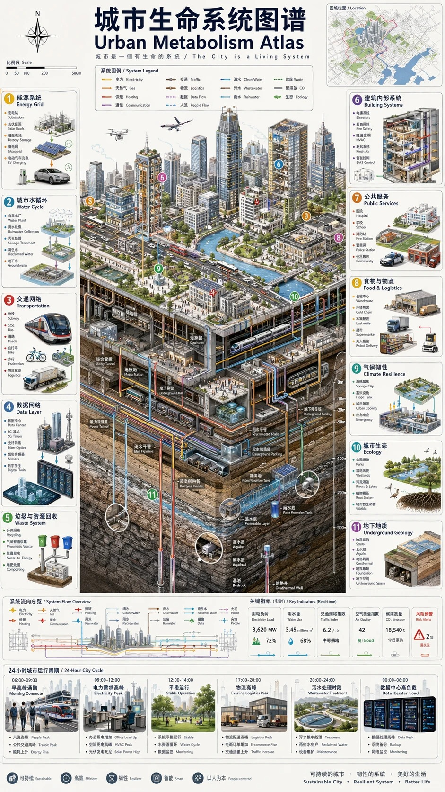

**提示词：**

```text
Vertical 9:16 isometric cutaway infographic "城市生命系统图谱 / Urban Metabolism Atlas". Smart city from sky to bedrock: skyscrapers, streets, subway, utility tunnels, water/sewage/gas/heating pipes, fiber, data center, flood tanks, aquifers, geothermal wells, bedrock. Color-coded flows for power/water/data/traffic/waste. 12 numbered panels bilingual CN/EN: 能源/水循环/交通/数据/垃圾/建筑/公共服务/ 物流/气候韧性/生态/地质/治理看板. 24h timeline at bottom. Style: engineering white paper + scientific atlas, light paper bg, crisp lines, 8K. No cyberpunk, no gibberish text, must show both above AND below ground.
```

***

<a id="case-8"></a>

### 例 8：科普百科图


**提示词：**

```text
根据【主题】生成一张高质量竖版「科普百科图」。 
这张图不是普通海报，也不是单纯插画，而是一张兼具图鉴感、百科感、信息结构感和收藏感的模块化科普信息图。整体风格参考高级博物图鉴、现代百科书页、生活方式知识卡，以及社交媒体上更容易传播的信息图风格。 
让画面包含： 
一个清晰好看的主题主视觉 
若干局部特征放大细节 
多个圆角模块化信息分区 
清楚的标题层级与重点标签 
简洁但信息丰富的百科内容 
可视化评分、要点总结或 Top 5 模块 
内容栏目请根据主题自动适配，优先从这些方向里选择并合理组合： 
基础档案、分类信息、外观特征、习性生态、形成机制或结构组成、生长或使用条件、养护或维护建议、风险与注意事项、适合人群或适用场景、优缺点对比、快速评分卡。 
视觉要求： 
浅色干净背景，柔和配色，轻阴影，精致小图标，圆角信息框，整体排版整洁清爽。信息密度要丰富，但不能显得拥挤，阅读体验要舒服。最终效果要像真正可以发布、阅读、收藏、批量做成系列内容的科普百科卡，而不是广告感很重的宣传海报。 
不要做成普通商业宣传海报，要重点突出“知识整理”“模块信息”“图鉴式展示”这几个特征。
```

***

<a id="case-11"></a>

### 例 11：一张手绘风格的城市美食地图，以台州为主题

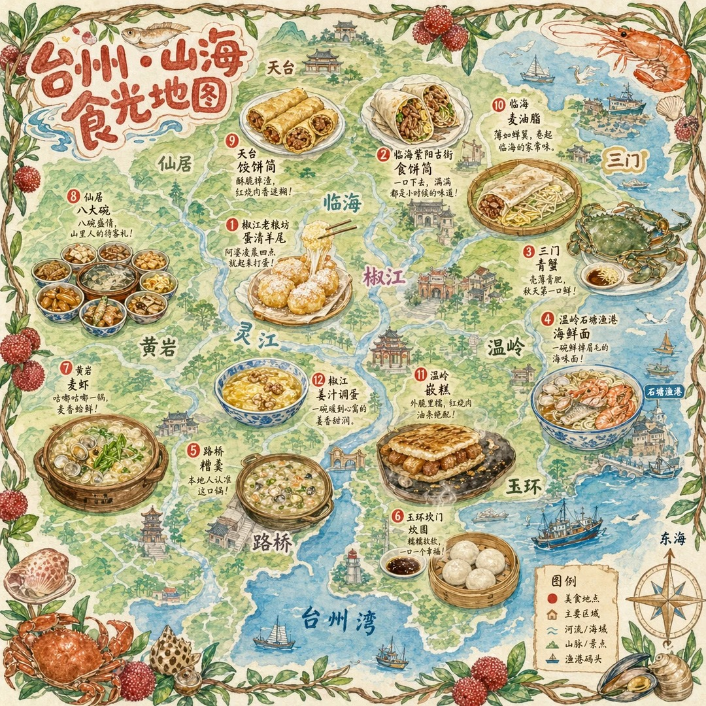

**提示词：**

```text
一张手绘风格的城市美食地图，以台州为主题。画面以鸟瞰视角的手绘简化城市地图为底，标注椒江、路桥、黄岩等区域和灵江、台州湾等水系地标，不追求精确比例而是追求可爱的水彩手绘感。地图上分布着12个美食地点的精致手绘小插画：1. 椒江老粮坊的蛋清羊尾（金黄蓬松的蛋泡甜点撒着糖粉，筷子夹起拉丝）2. 临海紫阳古街的食饼筒（一个饱满的麦饼卷切开露出肉丝、蛋皮、米面等丰富馅料）3. 三门的青蟹（一只肥硕的青壳大蟹张着大钳子，旁边一小碟姜醋）4. 温岭石塘渔港的海鲜面（粗瓷大碗浓白鱼汤面铺满虾、蛏子、小黄鱼）5. 路桥的糟羹（一锅稠厚的五彩羹，芥菜、冬笋、香干、牡蛎粒粒可见）6. 玉环坎门的炊圆（三四个白胖糯米团子卧在笼屉里，旁边酱油碟滴着麻油）7. 黄岩的麦虾（陶锅里面疙瘩配蛤蜊、青菜翻滚冒泡）8. 仙居的八大碗（八只粗陶小碗围成一圈——土鸡、溪鱼、豆腐皮俱全）9. 天台的饺饼筒（几卷金黄酥脆的薄饼整齐码放，露出红烧肉和豆面馅）10. 临海的麦油脂（竹盘上摊着薄如蝉翼的饼皮卷着肉末、豆芽、鸡蛋丝）11. 温岭的嵌糕（厚实的年糕饼中间嵌着红烧肉和油条，正在铁板上滋滋作响）12. 椒江的姜汁调蛋（一只青花碗里琥珀色姜汤卧着嫩滑蛋花，撒几粒核桃碎）。每个插画约占地图5%面积，旁边用手写体标注店名和一句推荐语如“阿婆凌晨四点就起来和面”“本地人认准这口锅”。地图边缘用手绘藤蔓、杨梅枝和小海鲜（虾、蟹、贝壳）装饰形成边框。右下角有一个手绘指南针（标注“东海”方向）和图例说明。左上角标题“台州·山海食光地图”使用胖圆的手绘美术字，用杨梅和小黄鱼点缀装饰。整体画风为水彩+彩铅混合的手绘质感，颜色以杨梅红、姜黄、海蓝、翠绿为主，图片比例1:1。
```

***

<a id="case-13"></a>

### 例 13：信息图可视化设计

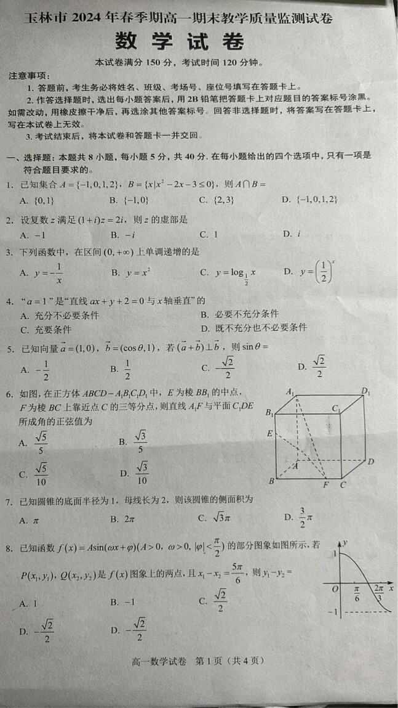

**提示词：**

```text
A realistic photo of a Chinese high school math exam paper, printed inblack and white on slightly gray paper, titled “数学试卷”, with multiplechoice questions and math formulas, including a small 3D geometrycube diagram. The paper is photographed casually with asmartphone, slightly tilted, with uneven lighting, soft shadows, andminor blur. The text is in Chinese with a mix of bold title font andstandard serif body font. Realistic paper texture, exam layout,authentic classroom test sheet style.
```

***

<a id="case-18"></a>

### 例 18：信息图可视化设计


**提示词：**

```text
{
  "type": "illustrated map infographic",
  "style": "{argument name=\"art style\" default=\"watercolor and ink hand-drawn illustration on vintage parchment\"}",
  "title_section": {
    "text": "{argument name=\"city name\" default=\"成都\"} {argument name=\"map title\" default=\"吃货暴走地图\"}",
    "mascot": "cartoon red chili pepper wearing sunglasses and giving a thumbs up"
  },
  "border": "{argument name=\"border decoration\" default=\"vine of green leaves and red chili peppers\"}",
  "layout": {
    "background": "textured beige parchment paper with yellow roads, blue rivers, and green park areas",
    "sections": [
      {
        "title": "landmarks",
        "count": 6,
        "illustrations": ["traditional pavilion", "traditional monastery", "modern skyscraper with climbing panda", "tall TV tower", "traditional gate", "industrial buildings"],
        "labels": ["人民公园", "文殊院", "IFS", "339电视塔", "宽窄巷子", "东郊记忆"]
      },
      {
        "title": "food_spots",
        "count": 12,
        "illustrations": ["mapo tofu", "dumplings in chili oil", "skewers in pot", "sticky rice balls", "egg baking cake", "nine-grid hotpot", "sweet potato noodles", "cold skewers", "spicy mixed dish", "covered tea bowl", "ice jelly dessert", "spicy rabbit heads"],
        "labels": ["1 陈麻婆豆腐", "2 钟水饺", "3 春熙路", "4 宽窄巷子·三大炮", "5 建设路·叶婆婆蛋烘糕", "6 玉林路·小龙坎火锅", "7 香香巷·肥肠粉", "8 武侯祠大街·钵钵鸡", "9 东郊记忆·冒椒火辣", "10 人民公园·鹤鸣茶社", "11 锦里古街·冰粉", "12 双流老妈兔头"]
      },
      {
        "title": "图例",
        "position": "bottom-right",
        "count": 5,
        "items": ["red dot", "green house", "green tree", "blue line", "yellow double line"],
        "labels": ["美食地点", "地标景点", "公园绿地", "河流湖泊", "主要道路"]
      }
    ],
    "centerpiece": "giant panda sitting and eating bamboo",
    "bottom_right_extras": ["vintage compass rose with N, S, E, W", "disclaimer text '温馨提示：吃辣需谨慎，肠胃要保护~' with a red chili pepper icon"]
  }
}
```

***

<a id="case-19"></a>

### 例 19：信息图可视化设计


**提示词：**

```text
为{argument name="theme" default="Momotaro"}制作一张说明性幻灯片（{argument name="format" default="ponchi-e diagram"}），将“Irasutoya”的温和氛围与“霞关幻灯片”的压倒性信息密度融为一体。
```

***

<a id="case-20"></a>

### 例 20：信息图可视化设计


**提示词：**

```text
为{argument name="theme" default="Momotaro"}制作一张说明性幻灯片（{argument name="format" default="ponchi-e diagram"}），将“Irasutoya”的温和氛围与“霞关幻灯片”的压倒性信息密度融为一体。
```

***

<a id="case-23"></a>

### 例 23：信息图可视化设计


**提示词：**

```text
{
  "type": "evolutionary timeline infographic",
  "instruction": "Using REFERENCE_0 as a structural base, transform the flat vector design into a highly realistic 3D infographic. Replace the smooth ramps with distinct stone steps and upgrade all organisms to photorealistic 3D models.",
  "style": {
    "background": "{argument name=\"background style\" default=\"vintage textured parchment paper\"}",
    "staircase": "{argument name=\"staircase material\" default=\"realistic textured stone blocks\"}",
    "subjects": "{argument name=\"organism style\" default=\"highly detailed photorealistic 3D renders\"}"
  },
  "layout": {
    "main_title": "{argument name=\"main title\" default=\"人类演化\"}",
    "sections": [
      {
        "position": "left sidebar",
        "count": 8,
        "labels": ["L0: 单细胞生命", "L1: 多细胞生物", "L2: 动物界", "L3: 脊索动物", "L4: 上陆革命", "L5: 哺乳纲", "L6: 人科演化", "L7: 智人纪元"]
      },
      {
        "position": "top right",
        "title": "获得的功能 / 失去的功能",
        "description": "Legend with plus and minus icons"
      },
      {
        "position": "bottom center",
        "title": "演化关键里程碑",
        "count": 6,
        "description": "Timeline with a silhouette graphic of 6 figures showing ape-to-human evolution"
      }
    ],
    "centerpiece": {
      "description": "Winding stone staircase with 25 numbered steps featuring specific organisms.",
      "count": 25,
      "notable_elements": [
        "Step 07: Jellyfish",
        "Step 09: Ammonite",
        "Step 10: Trilobite",
        "Step 24: Walking human",
        "Step 25: {argument name=\"future evolution concept\" default=\"glowing cosmic silhouette with a question mark\"}"
      ]
    }
  }
}
```

***

<a id="case-51"></a>

### 例 51：信息图可视化设计


**提示词：**

```text
{
  "type": "7-day fashion lookbook infographic",
  "header": {
    "title": "{argument name=\"main title\" default=\"一周穿搭指南\"}",
    "subtitle": "{argument name=\"style keywords\" default=\"温柔 | 靓丽 | 优雅\"}",
    "slogan_cn": "优雅不设限，自信每一天",
    "slogan_en": "{argument name=\"english slogan\" default=\"ELEGANCE HAS NO LIMIT, BE CONFIDENT EVERY DAY\"}"
  },
  "subject": "{argument name=\"subject description\" default=\"young elegant Asian woman\"}",
  "layout": {
    "columns": 7,
    "column_elements": [
      "day_header",
      "main_portrait",
      "4_detail_thumbnails",
      "outfit_specs",
      "keywords_colors",
      "3_color_swatches",
      "star_ratings",
      "fabric_price",
      "4_season_icons"
    ],
    "days": [
      { "day": "周一 (MONDAY)", "outfit": "beige blazer suit", "scene": "场景：重要会议 / 正式商务" },
      { "day": "周二 (TUESDAY)", "outfit": "pink blazer suit", "scene": "场景：日常通勤" },
      { "day": "周三 (WEDNESDAY)", "outfit": "cream knit cardigan set", "scene": "场景：生活休闲" },
      { "day": "周四 (THURSDAY)", "outfit": "champagne slip dress", "scene": "场景：外出私会" },
      { "day": "周五 (FRIDAY)", "outfit": "blue knit top, white skirt", "scene": "场景：休闲社交" },
      { "day": "周六 (SATURDAY)", "outfit": "white sports bra, purple leggings", "scene": "场景：运动休闲" },
      { "day": "周日 (SUNDAY)", "outfit": "beige lounge knitwear", "scene": "场景：居家 / 约会" }
    ]
  },
  "footer": {
    "tips": "{argument name=\"footer tips\" default=\"Tips: 根据天气与场合灵活调整，配饰是提升整体造型的关键；保持自信与舒适，才是穿搭的最终目的。\"}",
    "legend": [
      "春: 春季适用",
      "夏: 夏季适用",
      "秋: 秋季适用",
      "冬: 冬季适用"
    ]
  }
}
```

***

<a id="case-55"></a>

### 例 55：信息图可视化设计


**提示词：**

```text
帮我制作一下这道菜{argument name="dish name" default="辣椒炒肉"}的详细制作流程图，风格写实，适合小红书图文比例。
```

***

<a id="case-64"></a>

### 例 64：信息图可视化设计

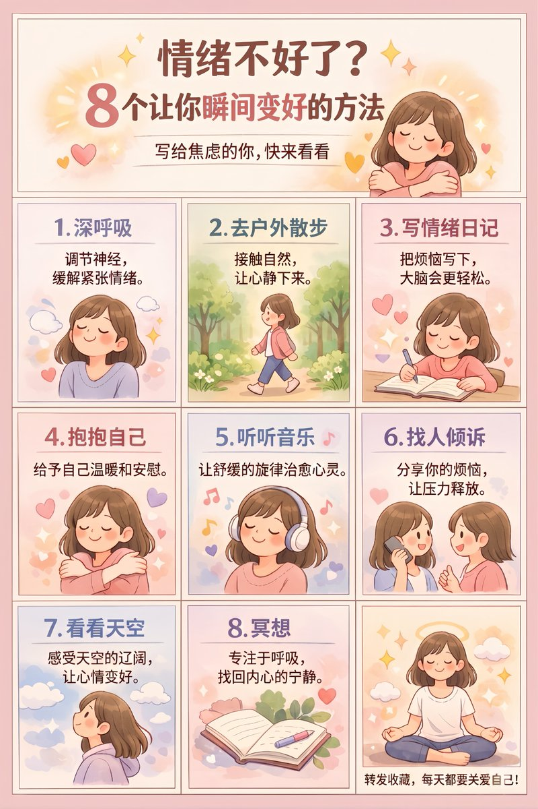

**提示词：**

```text
{"type":"infographic poster","style":"cute flat vector illustration, cozy, warm, soft shading, {argument name=\"color palette\" default=\"pastel Morandi colors, soft pinks, purples, and warm tones\"}","character":"{argument name=\"character description\" default=\"young woman with shoulder-length brown hair wearing a pinkish-purple shirt\"}","layout":{"structure":"4 rows, 3 columns. Top row is a merged header. Rows 2-4 contain 9 individual panels.","header":{"title":"{argument name=\"main title\" default=\"情绪不好了？\"}","subtitle":"{argument name=\"subtitle\" default=\"8个让你瞬间变好的方法\"}","sub_subtitle":"写给焦虑的你，快来看看","visual":"character hugging herself, surrounded by yellow sparkles and hearts"},"grid_panels":[{"id":1,"title":"1. 深呼吸","text":"调节神经，缓解紧张情绪。","visual":"character with eyes closed, smiling, surrounded by clouds"},{"id":2,"title":"2. 去户外散步","text":"接触自然，让心静下来。","visual":"character walking outdoors among green trees and bushes"},{"id":3,"title":"3. 写情绪日记","text":"把烦恼写下，大脑会更轻松。","visual":"character sitting at a desk writing in a notebook with a pen, floating hearts"},{"id":4,"title":"4. 抱抱自己","text":"给予自己温暖和安慰。","visual":"character hugging herself with eyes closed, floating hearts"},{"id":5,"title":"5. 听听音乐","text":"让舒缓的旋律治愈心灵。","visual":"character wearing large white headphones, eyes closed, floating colorful music notes"},{"id":6,"title":"6. 找人倾诉","text":"分享你的烦恼，让压力释放。","visual":"character holding a smartphone, talking to another similar-looking girl, floating hearts"},{"id":7,"title":"7. 看看天空","text":"感受天空的辽阔，让心情变好。","visual":"character looking up at a blue sky with white clouds and sparkles"},{"id":8,"title":"8. 冥想","text":"专注于呼吸，找回内心的宁静。","visual":"an open notebook, a pen, and a pink flower on a desk"},{"id":9,"title":"none","text":"{argument name=\"footer text\" default=\"转发收藏，每天都要关爱自己！\"}","visual":"character sitting cross-legged in a meditation pose, eyes closed, with a glowing halo behind her head"}]}}
```

***

<a id="case-65"></a>

### 例 65：信息图可视化设计


**提示词：**

```text
A breathtaking and extremely complex world-building infographic masterpiece conceptualizing the "{argument name="theme" default="Fundamental Differences between Confucianism, Buddhism, and Taoism"}", designed as a profound {argument name="style" default="ancient Oriental mythological manuscript"}.
Background: Pure white vintage textured canvas with a light beige aged parchment base color, subtle frayed edges, and water stain textures.
Core Layout: Central vision uses a grand "vertical egg-shaped layered structure", with Buddhism, Taoism, and Confucianism layers from top to bottom.
Margins: Four corners are decorated with fine micro-illustrations featuring ancient observation notes, ritual implements, and runes.
Colors: Low-saturation sage green, light gold, and off-white as main tones; overall light and soft without harsh high-saturation colors.
Details: Architectural lines, landscape brushwork, lotus patterns, and cloud layers are clearly visible and exquisitely detailed.
Seamless Fusion: The three layers transition naturally through clouds and flowing water; the Buddhist halo, Taoist Taiji mist, and Confucian scholarly aura connect seamlessly.
Style: Classical ink line art + low-saturation digital watercolor, with a light Chinese-style ancient book manuscript texture.
Text Annotations: Authentic Traditional Chinese characters in a mottled vintage Song typeface. Each annotation includes a short title + a line of poetic description, connected to corresponding details by dark gold hair-thin lines with no overlapping pointers.
Aspect Ratio: {argument name="aspect ratio" default="3:4"} vertical format, independent and complete.

Title Area (Top): `儒釋道·根本區別` (Confucianism, Buddhism, Taoism: Fundamental Differences)
Central Layer Labels:
Top "Buddhism": `釋`, `Relationship between man and self`, `Selflessness, governing the heart, letting go` 
Middle "Taoism": `道`, `Relationship between man and all things`, `Non-action, governing the body, being open-minded` 
Bottom "Confucianism": `儒`, `Relationship between man and man`, `No ego, governing the world, taking responsibility` 
Side Annotations:
Left: `Purity`: pure heart and clear mind, cutting off troubles; `Stillness`: following nature, returning to the original heart; `Respect`: respecting responsibility, active involvement in society.
Right: `60+ Spiritual Cultivation`: looking lightly at gain/loss; `35-55 Conduct`: living with flexibility, following laws; `7-35 Actions`: forging ahead, building careers.
Bottom Summary: `The balance between being in the world and being out of the world is high-level life wisdom.`
```

***

<a id="case-66"></a>

### 例 66：信息图可视化设计

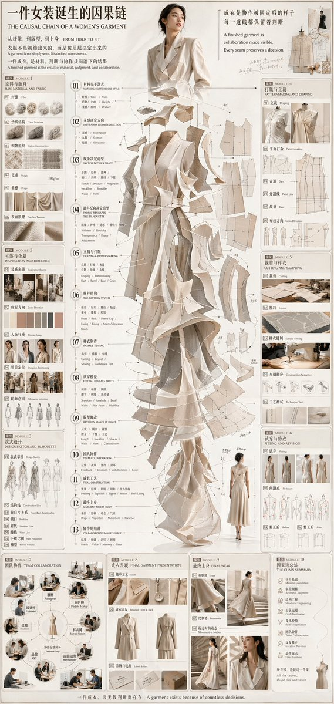

**提示词：**

```text
{
  "type": "fashion design process infographic",
  "title": "{argument name=\"main title\" default=\"一件女装诞生的因果链 THE CAUSAL CHAIN OF A WOMEN'S GARMENT\"}",
  "subtitle": "从纤维，到版型，到上身 FROM FIBER TO FIT",
  "style": {
    "aesthetic": "elegant editorial, technical fashion illustration, highly detailed",
    "color_palette": "{argument name=\"color palette\" default=\"beige, cream, and neutral tones\"}"
  },
  "layout": {
    "centerpiece": {
      "description": "Exploded-view illustration of a {argument name=\"garment type\" default=\"women's trench coat dress\"} showing cascading layers of fabric, pattern pieces, and stitching lines. Top shows a model wearing the finished garment.",
      "central_list": {
        "count": 13,
        "type": "numbered steps with pointer lines",
        "labels": ["01 Material", "02 Inspiration", "03 Sketch", "04 Fabric", "05 Draping", "06 Pattern", "07 Sewing", "08 Fitting", "09 Revision", "10 Team", "11 Construction", "12 Garment", "13 Collaboration"]
      }
    },
    "left_column": [
      {
        "module": "MODULE 1: RAW MATERIAL AND FABRIC",
        "count": 6,
        "items": ["Fiber", "Yarn Structure", "Fabric Construction", "Weight", "Drape", "Surface Texture"]
      },
      {
        "module": "MODULE 2: INSPIRATION AND DIRECTION",
        "count": 5,
        "items": ["Inspiration Source", "Color Direction", "Woman Image", "Occasion Positioning", "Silhouette Intention"]
      },
      {
        "module": "MODULE 3: DESIGN SKETCH AND SILHOUETTE",
        "count": 7,
        "items": ["Design Sketch", "Construction Line", "Front Back Relationship", "Neckline", "Shoulder Line", "Waist Line", "Hem Proportion"]
      }
    ],
    "right_column": [
      {
        "module": "MODULE 4: PATTERNMAKING AND DRAPING",
        "count": 6,
        "items": ["Draping", "Patternmaking", "Dart", "Panel Line", "Ease", "Grain Direction"]
      },
      {
        "module": "MODULE 5: CUTTING AND SAMPLING",
        "count": 5,
        "items": ["Cutting", "Layout", "Sample Sewing", "Construction Sequence", "Technique Test"]
      },
      {
        "module": "MODULE 6: FITTING AND REVISION",
        "count": 4,
        "items": ["Fitting", "Fit Issues", "Before", "After"]
      }
    ],
    "bottom_row": [
      {
        "module": "MODULE 7: TEAM COLLABORATION",
        "count": 8,
        "items": ["Designer", "Patternmaker", "Fabric Buyer", "Sample Maker", "Merchandiser", "QC", "Feedback Loop", "Model"]
      },
      {
        "module": "MODULE 8: FINAL GARMENT PRESENTATION",
        "count": 3,
        "items": ["Details", "Finished Front & Back", "Labels & Care"]
      },
      {
        "module": "MODULE 9: FINAL WEAR",
        "count": 3,
        "items": ["Drape", "Proportion", "Movement in Motion"]
      },
      {
        "module": "MODULE 10: THE CHAIN SUMMARY",
        "count": 8,
        "items": ["Material Foundation", "Aesthetic Judgment", "Structural Engineering", "Craft Realization", "Body Negotiation", "Team Collaboration", "Iterative Revision", "Final Garment"]
      }
    ],
    "footer": "{argument name=\"footer text\" default=\"一件成衣，因无数判断而存在 A garment exists because of countless decisions.\"}"
  }
}
```

***

<a id="case-67"></a>

### 例 67：信息图可视化设计


**提示词：**

```text
{
  "type": "medical infographic poster",
  "style": "highly detailed anatomical illustrations, clean structured layout, scientific diagrammatic style",
  "color_palette": "{argument name=\"color palette\" default=\"medical red, blue, beige, and anatomical flesh tones\"}",
  "language": "{argument name=\"language\" default=\"bilingual Chinese and English\"}",
  "header": {
    "main_title": "{argument name=\"main title\" default=\"糖尿病诞生的因果链\"}",
    "english_title": "{argument name=\"english title\" default=\"THE CAUSAL CHAIN OF DIABETES\"}",
    "subtitle": "从胰岛素失灵，到高血糖，到全身损伤"
  },
  "layout": {
    "centerpiece": "{argument name=\"central subject\" default=\"transparent human body showing circulatory system and internal organs\"}",
    "sections_count": 14,
    "sections": [
      { "id": "01", "title": "葡萄糖进入生命", "visuals": ["stomach and intestines"] },
      { "id": "02", "title": "胰腺与胰岛素", "visuals": ["pancreas", "beta cell"] },
      { "id": "03", "title": "正常胰岛素作用", "visuals": ["receptor signaling diagram", "muscle, liver, adipose icons"] },
      { "id": "04", "title": "胰岛素抵抗: 2型通路开始", "visuals": ["receptor blockage diagram", "7 lifestyle icons"] },
      { "id": "05", "title": "肝脏持续释放葡萄糖", "visuals": ["liver"] },
      { "id": "06", "title": "β细胞衰竭: 代偿到失败", "visuals": ["beta-cell decline line chart"] },
      { "id": "07", "title": "1型糖尿病分支", "visuals": ["autoimmune destruction diagram"] },
      { "id": "08", "title": "高血糖与血液化学", "visuals": ["blood vessel with glucose", "glucose indicators table", "glucose variability chart"] },
      { "id": "09", "title": "高血糖导致组织损伤", "visuals": ["4 pathways of damage diagrams"] },
      { "id": "10", "title": "急性代谢后果", "visuals": ["7 symptom icons"] },
      { "id": "11", "title": "微血管并发症", "visuals": ["eye", "kidney", "nerve cross-section"] },
      { "id": "12", "title": "大血管并发症与组织损伤", "visuals": ["heart", "brain", "diabetic foot"] },
      { "id": "13", "title": "器官系统长期代价", "visuals": ["text list"] },
      { "id": "14", "title": "糖尿病是调控系统失灵", "visuals": ["metabolic control flowchart"] }
    ],
    "footer": {
      "core_message": "核心信息 CORE MESSAGE"
    }
  }
}
```

***

<a id="case-68"></a>

### 例 68：信息图可视化设计


**提示词：**

```text
{
  "type": "comprehensive medical infographic",
  "style": "highly detailed 3D medical illustration, clinical white background, clean typography",
  "header": {
    "title_cn": "{argument name=\"main title\" default=\"痛风诞生的因果链\"}",
    "title_en": "{argument name=\"english title\" default=\"THE CAUSAL CHAIN OF GOUT\"}",
    "subtitle": "Pain is not the beginning. Metabolic imbalance is.",
    "top_right_sequence": {
      "count": 6,
      "labels": ["Metabolism", "Transport", "Crystallization", "Immunity", "Inflammation", "Damage"]
    }
  },
  "centerpiece": {
    "description": "{argument name=\"central figure\" default=\"transparent anatomical human body showing liver, kidneys, and vascular system\"}",
    "details": "pathway highlighted in {argument name=\"highlight color\" default=\"glowing red\"} descending to the foot"
  },
  "layout": {
    "left_column": [
      { "id": "01", "title": "Purine Sources", "elements": 6, "labels": ["Red meat", "Organ meats", "Seafood", "Beer", "Endogenous", "Fructose"] },
      { "id": "02", "title": "Uric Acid Production", "elements": 2, "labels": ["Chemical pathway", "Liver"] },
      { "id": "03", "title": "Renal & Intestinal Excretion", "elements": 2, "labels": ["Kidney nephron", "Intestines"] },
      { "id": "04", "title": "Hyperuricemia", "elements": 2, "labels": ["Blood vial", "Solubility graph"] }
    ],
    "center_overlay": [
      { "id": "05", "title": "Crystal Physics", "elements": 3, "labels": ["Supersaturation beaker", "Precipitation beaker", "Molecular structure"] },
      { "id": "06", "title": "Joint Deposition & Local Environment", "elements": 1, "labels": ["First MTP joint cross-section"] }
    ],
    "right_column": [
      { "id": "07", "title": "Immune Inflammatory Cascade", "elements": 4, "labels": ["Macrophage", "Inflammasome", "Neutrophil", "Cytokines"] },
      { "id": "08", "title": "Acute Gout Flare", "elements": 1, "labels": ["Inflamed foot"] },
      { "id": "09", "title": "Chronic Structural Damage", "elements": 1, "labels": ["Bone erosion joint"] },
      { "id": "10", "title": "Tophus Formation", "elements": 2, "labels": ["Hand tophi", "Foot tophi"] },
      { "id": "11", "title": "Beyond the Joint", "elements": 2, "labels": ["Kidney stones", "Systemic burden"] }
    ],
    "bottom_row": [
      { "id": "12", "title": "Pain Is the Final Signal", "elements": 7, "labels": ["Increased Purine", "Overproduction", "Reduced Excretion", "Hyperuricemia", "Crystal Formation", "Immune Activation", "Man in pain"] }
    ]
  },
  "theme": "{argument name=\"disease focus\" default=\"gout and uric acid crystallization\"}"
}
```

***

<a id="case-69"></a>

### 例 69：信息图可视化设计

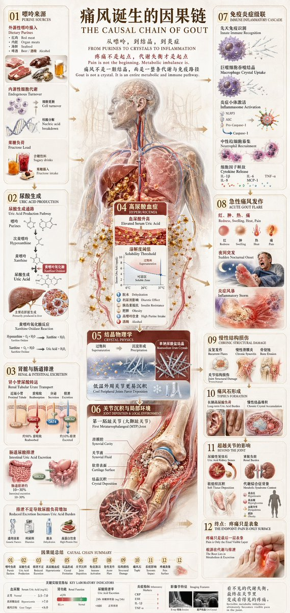

**提示词：**

```text
{
  "type": "comprehensive medical infographic",
  "style": "highly detailed 3D medical illustration, clinical white background, clean typography",
  "header": {
    "title_cn": "{argument name=\"main title\" default=\"痛风诞生的因果链\"}",
    "title_en": "{argument name=\"english title\" default=\"THE CAUSAL CHAIN OF GOUT\"}",
    "subtitle": "Pain is not the beginning. Metabolic imbalance is.",
    "top_right_sequence": {
      "count": 6,
      "labels": ["Metabolism", "Transport", "Crystallization", "Immunity", "Inflammation", "Damage"]
    }
  },
  "centerpiece": {
    "description": "{argument name=\"central figure\" default=\"transparent anatomical human body showing liver, kidneys, and vascular system\"}",
    "details": "pathway highlighted in {argument name=\"highlight color\" default=\"glowing red\"} descending to the foot"
  },
  "layout": {
    "left_column": [
      { "id": "01", "title": "Purine Sources", "elements": 6, "labels": ["Red meat", "Organ meats", "Seafood", "Beer", "Endogenous", "Fructose"] },
      { "id": "02", "title": "Uric Acid Production", "elements": 2, "labels": ["Chemical pathway", "Liver"] },
      { "id": "03", "title": "Renal & Intestinal Excretion", "elements": 2, "labels": ["Kidney nephron", "Intestines"] },
      { "id": "04", "title": "Hyperuricemia", "elements": 2, "labels": ["Blood vial", "Solubility graph"] }
    ],
    "center_overlay": [
      { "id": "05", "title": "Crystal Physics", "elements": 3, "labels": ["Supersaturation beaker", "Precipitation beaker", "Molecular structure"] },
      { "id": "06", "title": "Joint Deposition & Local Environment", "elements": 1, "labels": ["First MTP joint cross-section"] }
    ],
    "right_column": [
      { "id": "07", "title": "Immune Inflammatory Cascade", "elements": 4, "labels": ["Macrophage", "Inflammasome", "Neutrophil", "Cytokines"] },
      { "id": "08", "title": "Acute Gout Flare", "elements": 1, "labels": ["Inflamed foot"] },
      { "id": "09", "title": "Chronic Structural Damage", "elements": 1, "labels": ["Bone erosion joint"] },
      { "id": "10", "title": "Tophus Formation", "elements": 2, "labels": ["Hand tophi", "Foot tophi"] },
      { "id": "11", "title": "Beyond the Joint", "elements": 2, "labels": ["Kidney stones", "Systemic burden"] }
    ],
    "bottom_row": [
      { "id": "12", "title": "Pain Is the Final Signal", "elements": 7, "labels": ["Increased Purine", "Overproduction", "Reduced Excretion", "Hyperuricemia", "Crystal Formation", "Immune Activation", "Man in pain"] }
    ]
  },
  "theme": "{argument name=\"disease focus\" default=\"gout and uric acid crystallization\"}"
}
```

***

<a id="case-70"></a>

### 例 70：信息图可视化设计


**提示词：**

```text
{
  "type": "technical infographic",
  "subject": "{argument name=\"subject matter\" default=\"digital photography process\"}",
  "header": {
    "title": "{argument name=\"main title\" default=\"一张照片诞生的因果链 THE CAUSAL CHAIN OF A PHOTOGRAPH\"}",
    "subtitle": "从世界，到图像 FROM WORLD TO IMAGE"
  },
  "centerpiece": {
    "description": "Exploded isometric view of a modern mirrorless camera",
    "model": "{argument name=\"camera model\" default=\"Canon EOS R5\"}",
    "labeled_parts_count": 12,
    "labeled_parts": [
      "EVF",
      "Body Structure",
      "Control Dials",
      "Thermal Design",
      "Optical Axis",
      "IBIS Stabilizer",
      "Shutter Unit",
      "Full-Frame Sensor",
      "{argument name=\"processor name\" default=\"DIGIC X Processor\"}",
      "Main PCB",
      "High-Speed Bus",
      "Card Slot"
    ]
  },
  "layout": {
    "left_column": {
      "description": "Chronological causal chain",
      "count": 13,
      "steps": [
        "01 REALITY EXISTS",
        "02 PHOTONS LEAVE THE WORLD",
        "03 LENS ACCEPTS & BENDS LIGHT",
        "04 APERTURE SELECTS",
        "05 SHUTTER CUTS TIME",
        "06 FOCUS SETS PRIORITY",
        "07 SENSOR RECEIVES EVENT",
        "08 LIGHT BECOMES CHARGE",
        "09 ANALOG READOUT",
        "10 A/D CONVERSION",
        "11 COMPUTATION RECONSTRUCTS",
        "12 IMAGE APPEARS",
        "13 MEMORY OUTLIVES"
      ]
    },
    "right_column": {
      "title": "八大模块 / 8 MODULES",
      "count": 8,
      "modules": [
        "1 ORIGIN OF LIGHT",
        "2 LENS SHAPES REALITY",
        "3 APERTURE & SHUTTER EDIT THE WORLD",
        "4 FOCUS DECIDES CLARITY",
        "5 SENSOR MEASURES LIGHT",
        "6 SIGNAL BORN & AMPLIFIED",
        "7 COMPUTATION BUILDS IMAGE",
        "8 FILE BECOMES MEMORY"
      ]
    },
    "side_diagrams": {
      "count": 7,
      "descriptions": [
        "Ray cone & image formation",
        "Aperture & depth of field",
        "Shutter & motion",
        "Focal plane & clarity",
        "Pixel structure",
        "Photoelectric conversion",
        "Analog signal waveform"
      ]
    },
    "footer": {
      "count": 5,
      "description": "Philosophical summary points"
    }
  },
  "style": "technical, precise, wireframe elements, glowing data lines, photorealistic camera components, clean typography, dual-language"
}
```

***

<a id="case-71"></a>

### 例 71：关系图谱信息图

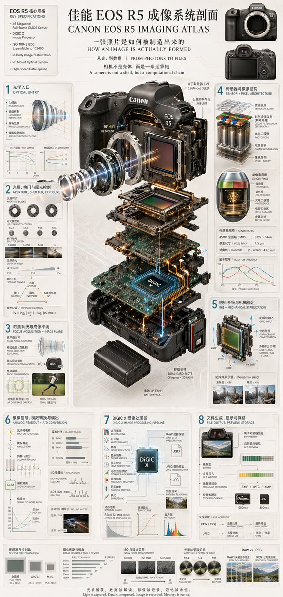

**提示词：**

```text
{
  "type": "technical infographic and exploded view diagram",
  "header": {
    "title": "{argument name=\"main title\" default=\"佳能 EOS R5 成像系统剖面 CANON EOS R5 IMAGING ATLAS\"}",
    "subtitles": [
      "一张照片是如何被制造出来的 HOW AN IMAGE IS ACTUALLY FORMED",
      "从光，到数据 | FROM PHOTONS TO FILES",
      "相机不是壳体，而是一条运算链 A camera is not a shell, but a computational chain"
    ],
    "top_left_box": {
      "title": "EOS R5 核心规格 KEY SPECIFICATIONS",
      "bullet_points_count": 6
    },
    "top_right_images": {
      "count": 2,
      "description": "front and back views of the camera body"
    }
  },
  "centerpiece": {
    "description": "highly detailed 3D exploded view of the {argument name=\"camera model\" default=\"Canon EOS R5\"} camera, showing internal components separated vertically",
    "components_visible": [
      "lens mount",
      "lens elements with glowing blue light rays",
      "image sensor",
      "motherboard with glowing {argument name=\"processor name\" default=\"DIGIC X\"} chip",
      "battery pack",
      "dual card slots",
      "electronic viewfinder (EVF)"
    ]
  },
  "layout": {
    "numbered_sections": [
      {
        "number": 1,
        "title": "光学入口 OPTICAL ENTRY",
        "elements": ["lens cross-section with light rays", "2 line graphs"]
      },
      {
        "number": 2,
        "title": "光圈、快门与曝光控制 APERTURE, SHUTTER, EXPOSURE",
        "elements": ["3 aperture blade diagrams", "4 shutter speed example photos", "depth of field diagram", "exposure triangle diagram"]
      },
      {
        "number": 3,
        "title": "对焦系统与成像平面 FOCUS ACQUISITION + IMAGE PLANE",
        "elements": ["lens alignment diagram", "AF coverage photo of a runner"]
      },
      {
        "number": 4,
        "title": "传感器与像素结构 SENSOR + PIXEL ARCHITECTURE",
        "elements": ["3D pixel array diagram", "single pixel cross-section diagram", "sensor spec table", "quantum efficiency graph"]
      },
      {
        "number": 5,
        "title": "防抖系统与机械稳定 IBIS + MECHANICAL STABILIZATION",
        "elements": ["sensor shift mechanism diagram with yaw/pitch/roll axes", "2 stabilization effect comparison photos"]
      },
      {
        "number": 6,
        "title": "模拟信号、模数转换与读出 ANALOG READOUT + A/D CONVERSION",
        "elements": ["signal flowchart", "3 readout timing graphs", "signal-to-noise ratio graph", "rolling shutter example photo of a car"]
      },
      {
        "number": 7,
        "title": "DIGIC X 图像处理链 DIGIC X IMAGE PROCESSING PIPELINE",
        "elements": ["processing flowchart with central chip", "dynamic range graph", "tone curve graph", "histogram"]
      },
      {
        "number": 8,
        "title": "文件生成、显示与存储 FILE OUTPUT, PREVIEW, STORAGE",
        "elements": ["file output flowchart", "2 storage card icons", "file workflow diagram"]
      }
    ],
    "bottom_comparisons": {
      "count": 5,
      "labels": [
        "传感器尺寸对比 SENSOR SIZE COMPARISON",
        "镜头焦距与视角 FOCAL LENGTH & ANGLE OF VIEW",
        "ISO 与噪点关系 ISO & NOISE RELATIONSHIP",
        "光圈与景深关系 APERTURE & DEPTH OF FIELD",
        "RAW vs JPEG"
      ]
    },
    "footer": "{argument name=\"footer quote\" default=\"光被捕获，数据被解读，影像被记录，记忆被永恒。 Light is captured. Data is interpreted. Image is recorded. Memory is eternal.\"}"
  },
  "style": "clean, technical, highly detailed, photorealistic components, blueprint-style annotations, light gray background, precise typography"
}
```

***

<a id="case-72"></a>

### 例 72：信息图可视化设计

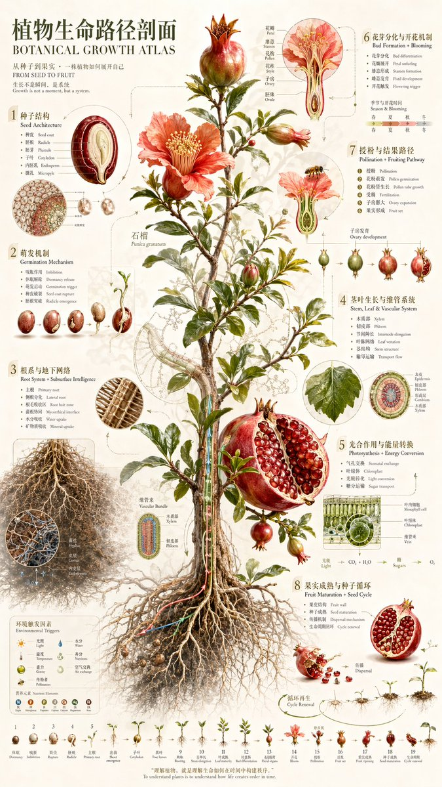

**提示词：**

```text
{
  "type": "scientific botanical infographic poster",
  "subject": "{argument name=\"plant species\" default=\"Pomegranate (Punica granatum)\"}",
  "style": "vintage botanical illustration mixed with modern infographic design, highly detailed, {argument name=\"color palette\" default=\"earthy greens, deep reds, parchment background\"}",
  "header": {
    "main_title": "{argument name=\"main title\" default=\"植物生命路径剖面\"}",
    "english_title": "{argument name=\"english title\" default=\"BOTANICAL GROWTH ATLAS\"}",
    "subtitle": "从种子到果实，一株植物如何展开自己 / FROM SEED TO FRUIT"
  },
  "centerpiece": "full plant showing extensive root system, woody stem, green leaves, blooming red flowers, and ripe fruits including one halved to show seeds",
  "layout": {
    "numbered_sections": [
      { "number": 1, "title": "种子结构 / Seed Architecture", "content": "cross-section of a single seed with 6 labeled parts" },
      { "number": 2, "title": "萌发机制 / Germination Mechanism", "content": "sequence of 5 sprouting seeds showing radicle emergence" },
      { "number": 3, "title": "根系与地下网络 / Root System + Subsurface Intelligence", "content": "detailed root network with 2 circular microscopic cross-sections showing vascular bundles and hyphae" },
      { "number": 4, "title": "茎叶生长与维管系统 / Stem, Leaf & Vascular System", "content": "leaf detail and circular stem cross-section with 5 labeled layers" },
      { "number": 5, "title": "光合作用与能量转换 / Photosynthesis + Energy Conversion", "content": "3D cellular cross-section of a leaf showing mesophyll and chloroplasts, plus a chemical equation diagram" },
      { "number": 6, "title": "花芽分化与开花机制 / Bud Formation + Blooming", "content": "detailed flower cross-section showing stamen and ovary, plus a 4-season timeline" },
      { "number": 7, "title": "授粉与结果路径 / Pollination + Fruiting Pathway", "content": "bee approaching a flower cross-section, followed by a sequence of 5 stages of ovary development into a fruit" },
      { "number": 8, "title": "果实成熟与种子循环 / Fruit Maturation + Seed Cycle", "content": "ripe fruit breaking open, seeds dispersing downwards to a new sprout" }
    ],
    "additional_elements": [
      { "position": "bottom left", "title": "环境触发因素 / Environmental Triggers", "content": "grid of 6 weather/environmental icons and 6 nutrient element icons (N, P, K, Ca, Mg, Fe)" },
      { "position": "bottom edge", "title": "Growth Timeline", "content": "linear sequence of 19 small plant icons showing the complete life cycle from seed to mature plant" }
    ],
    "footer_quote": "{argument name=\"bottom quote\" default=\"理解植物，就是理解生命如何在时间中构建秩序。\"}"
  }
}
```

***

<a id="case-73"></a>

### 例 73：信息图可视化设计


**提示词：**

```text
{
  "type": "complex urban systems atlas infographic",
  "style": "{argument name=\"color palette\" default=\"dark background with glowing blue, gold, and purple accents\"}, highly detailed technical illustration, 3D isometric cutaway",
  "header": {
    "title": "{argument name=\"chinese city name\" default=\"上海\"}城市系统剖面 {argument name=\"english city name\" default=\"SHANGHAI\"} URBAN SYSTEMS ATLAS",
    "subtitles": [
      "地表之上，是城市；地表之下，是秩序 {argument name=\"english subtitle\" default=\"Beneath the skyline lies the machine.\"}",
      "一座城市如何运转 How a Megacity Actually Works"
    ]
  },
  "layout": {
    "top_left": "Compass rose and city map labeled '上海市域位置 SHANGHAI LOCATION'",
    "top_right": "Data table titled '城市数据 CITY DATA' with 7 rows of statistics",
    "centerpiece": {
      "description": "{argument name=\"centerpiece style\" default=\"highly detailed 3D isometric cutaway render\"} of a megacity river landscape",
      "layers": [
        "地面层 SURFACE",
        "排水层 DRAINAGE LAYER",
        "电力层 POWER LAYER",
        "通信层 COMMUNICATION LAYER",
        "轨道交通层 METRO LAYER",
        "道路隧道层 ROAD TUNNEL LAYER",
        "管廊综合层 UTILITY CORRIDOR LAYER"
      ]
    },
    "side_panels": [
      { "id": "01", "title": "城市主骨架 URBAN SKELETON", "elements": "Map with 8 legend items" },
      { "id": "02", "title": "排水与地下水网 DRAINAGE + STORMWATER", "elements": "Cross-section diagram '典型排水剖面 DRAINAGE SECTION' with 5 legend items" },
      { "id": "03", "title": "电网与能源分配 POWER GRID + ENERGY", "elements": "Cross-section diagram '典型变电站剖面 SUBSTATION SECTION' with 6 legend items" },
      { "id": "04", "title": "通信与网络骨干 TELECOM + INTERNET", "elements": "Cross-section diagram '数据中心剖面 DATA CENTER SECTION' with 6 legend items" },
      { "id": "05", "title": "地铁与地下交通 METRO + SUBSURFACE MOBILITY", "elements": "Cross-section diagram '人民广场站剖面 PEOPLE'S SQUARE STATION' with 6 legend items" },
      { "id": "06", "title": "道路、高架与循环 ROADS + ELEVATED MOBILITY", "elements": "Cross-section diagram '南浦大桥剖面 NANPU BRIDGE SECTION' with 6 legend items" },
      { "id": "07", "title": "管廊与地下设施 UTILITY CORRIDORS + PLUMBING", "elements": "Cross-section diagram '综合管廊 UTILITY CORRIDOR' with 8 legend items" },
      { "id": "08", "title": "城市流量与系统协同 URBAN FLOWS + COORDINATION", "elements": "Map diagram '城市运行指挥中心 CITY OPERATIONS CENTER' with 6 legend items" }
    ],
    "bottom_panels": {
      "system_logic": {
        "title": "城市系统协同逻辑 SYSTEM COORDINATION LOGIC",
        "steps": 4,
        "labels": ["感知层 SENSING LAYER", "网络层 NETWORK LAYER", "平台层 PLATFORM LAYER", "应用层 APPLICATION LAYER"]
      },
      "city_brain": {
        "title": "城市大脑 CITY BRAIN",
        "central_node": 1,
        "peripheral_nodes": 8
      },
      "references": {
        "depth_scale": { "title": "深度与尺度 DEPTH & SCALE REFERENCE", "icons": 5 },
        "map_scale": { "title": "比例尺 SCALE", "markers": 4 }
      }
    }
  }
}
```

***

<a id="case-74"></a>

### 例 74：关系图谱信息图


**提示词：**

```text
请根据{argument name="theme" default="animals"}生成高质量的竖版“科普百科图片”。

该图像不是普通的海报或简单的插图，而是具有“图鉴、百科全书、信息结构、收藏性”感的模块化科普信息图。整体风格应参考高端自然历史插图、现代百科全书页面、生活方式知识卡和高度共享的社交媒体信息图表的组合。

请在框架中包含：
- 主题清晰美观的主视觉
- 几个当地特色的放大细节
- 多个圆形模块化信息部分
- 清晰的标题层次结构和关键标签
- 简洁而丰富的百科内容
- 视觉评分、要点总结或前 5 个模块

内容栏目应根据主题自动适配，优先考虑以下方向：基本概况、分类信息、外观特征、习性/生态、形成机制/结构、生长或使用条件、护理或维护建议、风险和注意事项、适合受众或场景、优缺点比较、快速评分卡。

视觉要求：
浅色干净的背景，柔和的调色板，淡淡的阴影，精致的小图标，圆润的信息框，布局整齐，信息密度高但不拥挤，阅读体验良好。整体效果必须看起来像一张真正的科学百科全书卡片，适合出版、阅读、收藏和连载制作，而不是广告。

请不要将其作为常规的商业宣传海报。突出“知识组织+模块化信息+插画式展示”的特点。
```

***

<a id="case-75"></a>

### 例 75：关系图谱信息图

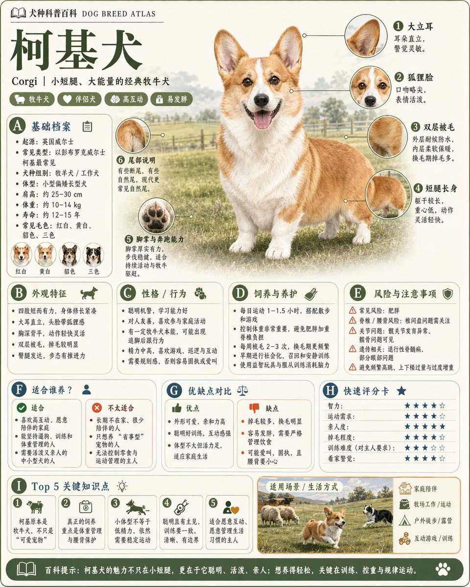

**提示词：**

```text
请根据{argument name="theme" default="animals"}生成高质量的竖版“科普百科图片”。

该图像不是普通的海报或简单的插图，而是具有“图鉴、百科全书、信息结构、收藏性”感的模块化科普信息图。整体风格应参考高端自然历史插图、现代百科全书页面、生活方式知识卡和高度共享的社交媒体信息图表的组合。

请在框架中包含：
- 主题清晰美观的主视觉
- 几个当地特色的放大细节
- 多个圆形模块化信息部分
- 清晰的标题层次结构和关键标签
- 简洁而丰富的百科内容
- 视觉评分、要点总结或前 5 个模块

内容栏目应根据主题自动适配，优先考虑以下方向：基本概况、分类信息、外观特征、习性/生态、形成机制/结构、生长或使用条件、护理或维护建议、风险和注意事项、适合受众或场景、优缺点比较、快速评分卡。

视觉要求：
浅色干净的背景，柔和的调色板，淡淡的阴影，精致的小图标，圆润的信息框，布局整齐，信息密度高但不拥挤，阅读体验良好。整体效果必须看起来像一张真正的科学百科全书卡片，适合出版、阅读、收藏和连载制作，而不是广告。

请不要将其作为常规的商业宣传海报。突出“知识组织+模块化信息+插画式展示”的特点。
```

***

<a id="case-76"></a>

### 例 76：关系图谱信息图

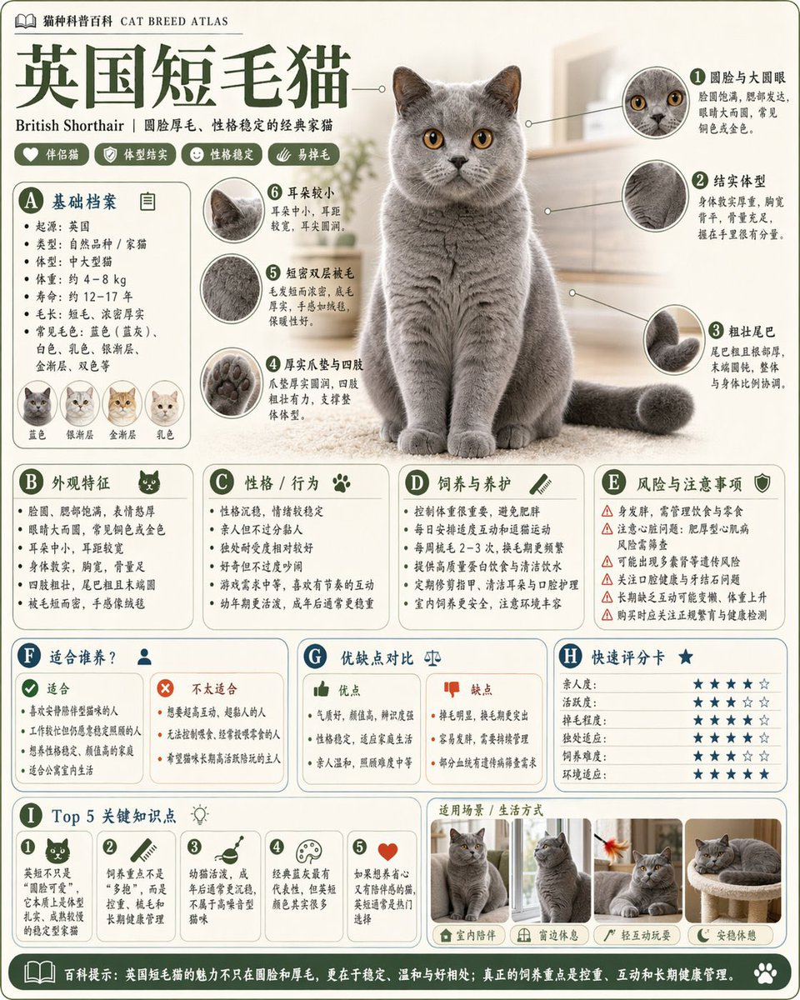

**提示词：**

```text
请根据{argument name="theme" default="animals"}生成高质量的竖版“科普百科图片”。

该图像不是普通的海报或简单的插图，而是具有“图鉴、百科全书、信息结构、收藏性”感的模块化科普信息图。整体风格应参考高端自然历史插图、现代百科全书页面、生活方式知识卡和高度共享的社交媒体信息图表的组合。

请在框架中包含：
- 主题清晰美观的主视觉
- 几个当地特色的放大细节
- 多个圆形模块化信息部分
- 清晰的标题层次结构和关键标签
- 简洁而丰富的百科内容
- 视觉评分、要点总结或前 5 个模块

内容栏目应根据主题自动适配，优先考虑以下方向：基本概况、分类信息、外观特征、习性/生态、形成机制/结构、生长或使用条件、护理或维护建议、风险和注意事项、适合受众或场景、优缺点比较、快速评分卡。

视觉要求：
浅色干净的背景，柔和的调色板，淡淡的阴影，精致的小图标，圆润的信息框，布局整齐，信息密度高但不拥挤，阅读体验良好。整体效果必须看起来像一张真正的科学百科全书卡片，适合出版、阅读、收藏和连载制作，而不是广告。

请不要将其作为常规的商业宣传海报。突出“知识组织+模块化信息+插画式展示”的特点。
```

***

<a id="case-77"></a>

### 例 77：关系图谱信息图

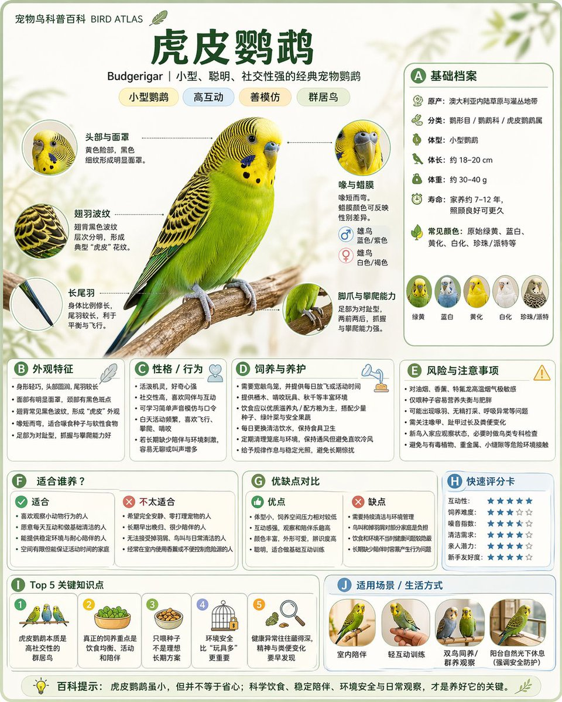

**提示词：**

```text
请根据{argument name="theme" default="animals"}生成高质量的竖版“科普百科图片”。

该图像不是普通的海报或简单的插图，而是具有“图鉴、百科全书、信息结构、收藏性”感的模块化科普信息图。整体风格应参考高端自然历史插图、现代百科全书页面、生活方式知识卡和高度共享的社交媒体信息图表的组合。

请在框架中包含：
- 主题清晰美观的主视觉
- 几个当地特色的放大细节
- 多个圆形模块化信息部分
- 清晰的标题层次结构和关键标签
- 简洁而丰富的百科内容
- 视觉评分、要点总结或前 5 个模块

内容栏目应根据主题自动适配，优先考虑以下方向：基本概况、分类信息、外观特征、习性/生态、形成机制/结构、生长或使用条件、护理或维护建议、风险和注意事项、适合受众或场景、优缺点比较、快速评分卡。

视觉要求：
浅色干净的背景，柔和的调色板，淡淡的阴影，精致的小图标，圆润的信息框，布局整齐，信息密度高但不拥挤，阅读体验良好。整体效果必须看起来像一张真正的科学百科全书卡片，适合出版、阅读、收藏和连载制作，而不是广告。

请不要将其作为常规的商业宣传海报。突出“知识组织+模块化信息+插画式展示”的特点。
```

***

<a id="case-78"></a>

### 例 78：图像生成案例图


**提示词：**

```text
[核心任务]
将提供的输入图像转换为姿势和光线分析表。

这不是完成的人物插图。
这不是衣服床单。
这不是为了美观而进行的重画。

这是一个白线粗糙人体模型转换。

[主要目标]
仅提取和可视化：
- 姿势结构
- 身体平衡
- 相机角度
- 身体线条流畅
- 推断光源位置
- 照明区域和光强度

[输入角色]
使用提供的图像作为严格锚点：
- 姿势
- 相机角度
- 身体倾斜
- 重量分布
- 大概的照明情况

不要保留：
- 脸部渲染
- 发型渲染
- 服装细节
- 配件
- 武器细节
- 背景架构
- 角色身份
- 情绪表达

[图形转换]
单个粗糙的人体模型般的人物形象
白色的身体轮廓线
白色内部构造线
简单的人体模型头
没有脸
没有眼睛
没有嘴
没有睫毛
没有个性
没有个人身份

人物形象应该是这样的：
- 粗略姿势人体模型
- 解剖代理
- 基于线条的身体指南
- 结构草图
- 白线粗糙假人

保留：
- 姿势可读性
- 剪影流
- 头部倾斜
- 躯干方向
- 骨盆方向
- 肢体放置

[背景]
纯黑色背景
负片式暗场
没有风景
没有道具
没有架构
没有环境故事

[线条样式]
粗略的白线画
干净但像素描
构造线感
解剖引导线可见
关节流可见
强调身体轮廓
没有抛光插图完成

[光估计]
从输入图像预测可能的光源位置
仅使用绿光可视化光源和照明区域

使用具有变化的绿光强度：
- 光线直射处最强的绿色
- 中绿色用于包裹光
- 柔和的绿色表示反射光或褪色光

用标签和箭头标记估计的光源，例如：
- 主灯
- 边缘光
- 补光灯
- 地板弹跳
- 背光
仅在适当的情况下

重要：
不要发明随机灯
从原始输入图像推断光照
如果照明不明确，请保持注释简单且合理

[绿灯可视化]
显示绿光：
- 头部/颅骨平面
- 颈部
- 肩膀
- 胸部平面
- 胸腔方向
- 骨盆边缘
- 大腿平面
- 膝盖接触点
- 地板接触弹跳（如果适用）

使用绿光不作为装饰，
但作为照明分析信息

[姿势优先]
1. 保留姿势结构
2. 保持拍摄角度
3.保持身体平衡
4. 保持头部与躯干的关系
5. 想象可能的光线方向
6. 显示具有可读绿色强度变化的照明区域

[负面]
完成的人，
可爱的女孩，
详细的脸部，
头发渲染，
服装效果图、
武器强调，
美丽的解剖学
```

***

<a id="case-79"></a>

### 例 79：图像生成案例图

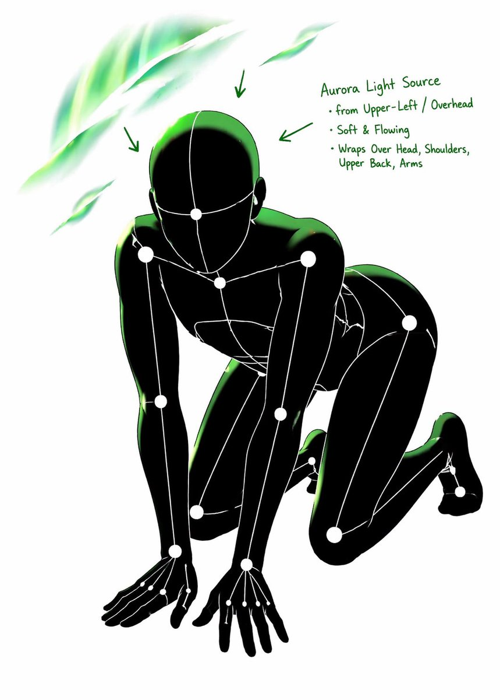

**提示词：**

```text
[核心任务]
将提供的输入图像转换为姿势和光线分析表。

这不是完成的人物插图。
这不是衣服床单。
这不是为了美观而进行的重画。

这是一个白线粗糙人体模型转换。

[主要目标]
仅提取和可视化：
- 姿势结构
- 身体平衡
- 相机角度
- 身体线条流畅
- 推断光源位置
- 照明区域和光强度

[输入角色]
使用提供的图像作为严格锚点：
- 姿势
- 相机角度
- 身体倾斜
- 重量分布
- 大概的照明情况

不要保留：
- 脸部渲染
- 发型渲染
- 服装细节
- 配件
- 武器细节
- 背景架构
- 角色身份
- 情绪表达

[图形转换]
单个粗糙的人体模型般的人物形象
白色的身体轮廓线
白色内部构造线
简单的人体模型头
没有脸
没有眼睛
没有嘴
没有睫毛
没有个性
没有个人身份

人物形象应该是这样的：
- 粗略姿势人体模型
- 解剖代理
- 基于线条的身体指南
- 结构草图
- 白线粗糙假人

保留：
- 姿势可读性
- 剪影流
- 头部倾斜
- 躯干方向
- 骨盆方向
- 肢体放置

[背景]
纯黑色背景
负片式暗场
没有风景
没有道具
没有架构
没有环境故事

[线条样式]
粗略的白线画
干净但像素描
构造线感
解剖引导线可见
关节流可见
强调身体轮廓
没有抛光插图完成

[光估计]
从输入图像预测可能的光源位置
仅使用绿光可视化光源和照明区域

使用具有变化的绿光强度：
- 光线直射处最强的绿色
- 中绿色用于包裹光
- 柔和的绿色表示反射光或褪色光

用标签和箭头标记估计的光源，例如：
- 主灯
- 边缘光
- 补光灯
- 地板弹跳
- 背光
仅在适当的情况下

重要：
不要发明随机灯
从原始输入图像推断光照
如果照明不明确，请保持注释简单且合理

[绿灯可视化]
显示绿光：
- 头部/颅骨平面
- 颈部
- 肩膀
- 胸部平面
- 胸腔方向
- 骨盆边缘
- 大腿平面
- 膝盖接触点
- 地板接触弹跳（如果适用）

使用绿光不作为装饰，
但作为照明分析信息

[姿势优先]
1. 保留姿势结构
2. 保持拍摄角度
3.保持身体平衡
4. 保持头部与躯干的关系
5. 想象可能的光线方向
6. 显示具有可读绿色强度变化的照明区域

[负面]
完成的人，
可爱的女孩，
详细的脸部，
头发渲染，
服装效果图、
武器强调，
美丽的解剖学
```

***

<a id="case-80"></a>

### 例 80：图像生成案例图


**提示词：**

```text
[核心任务]
将提供的输入图像转换为姿势和光线分析表。

这不是完成的人物插图。
这不是衣服床单。
这不是为了美观而进行的重画。

这是一个白线粗糙人体模型转换。

[主要目标]
仅提取和可视化：
- 姿势结构
- 身体平衡
- 相机角度
- 身体线条流畅
- 推断光源位置
- 照明区域和光强度

[输入角色]
使用提供的图像作为严格锚点：
- 姿势
- 相机角度
- 身体倾斜
- 重量分布
- 大概的照明情况

不要保留：
- 脸部渲染
- 发型渲染
- 服装细节
- 配件
- 武器细节
- 背景架构
- 角色身份
- 情绪表达

[图形转换]
单个粗糙的人体模型般的人物形象
白色的身体轮廓线
白色内部构造线
简单的人体模型头
没有脸
没有眼睛
没有嘴
没有睫毛
没有个性
没有个人身份

人物形象应该是这样的：
- 粗略姿势人体模型
- 解剖代理
- 基于线条的身体指南
- 结构草图
- 白线粗糙假人

保留：
- 姿势可读性
- 剪影流
- 头部倾斜
- 躯干方向
- 骨盆方向
- 肢体放置

[背景]
纯黑色背景
负片式暗场
没有风景
没有道具
没有架构
没有环境故事

[线条样式]
粗略的白线画
干净但像素描
构造线感
解剖引导线可见
关节流可见
强调身体轮廓
没有抛光插图完成

[光估计]
从输入图像预测可能的光源位置
仅使用绿光可视化光源和照明区域

使用具有变化的绿光强度：
- 光线直射处最强的绿色
- 中绿色用于包裹光
- 柔和的绿色表示反射光或褪色光

用标签和箭头标记估计的光源，例如：
- 主灯
- 边缘光
- 补光灯
- 地板弹跳
- 背光
仅在适当的情况下

重要：
不要发明随机灯
从原始输入图像推断光照
如果照明不明确，请保持注释简单且合理

[绿灯可视化]
显示绿光：
- 头部/颅骨平面
- 颈部
- 肩膀
- 胸部平面
- 胸腔方向
- 骨盆边缘
- 大腿平面
- 膝盖接触点
- 地板接触弹跳（如果适用）

使用绿光不作为装饰，
但作为照明分析信息

[姿势优先]
1. 保留姿势结构
2. 保持拍摄角度
3.保持身体平衡
4. 保持头部与躯干的关系
5. 想象可能的光线方向
6. 显示具有可读绿色强度变化的照明区域

[负面]
完成的人，
可爱的女孩，
详细的脸部，
头发渲染，
服装效果图、
武器强调，
美丽的解剖学
```

***

<a id="case-82"></a>

### 例 82：信息图可视化设计


**提示词：**

```text
{
  "type": "科学光学设置图",
  “主要设置”：{
    “base”：“带有安装孔网格的光学面包板台”，
    "beam": "红色激光束水平穿过所有组件",
    “顶部分组括号”：[
      "{参数名称=\"第一个组件组\" 默认=\"双调制\"}",
      “4f 中继光学器件”，
      “成像光学”，
      《检测》
    ],
    “组件从左到右”：[
      { "name": "Laser", "label": "{参数名称=\"激光波长\" default=\"λ = 632.8 nm\"}", "appearance": "黑色矩形框" },
      { "name": "SLM1", "label": "(Phase / Pol. Mod.)", "appearance": "黑色方形装置在柱子上" },
      { "name": "镜头 L1", "label": "(f1)", "appearance": "黑环安装镜头" },
      { "name": "Iris", "label": "傅里叶平面（光瞳平面）/（高阶过滤）", "appearance": "黑色环安装座，上方有虚线" },
      { "name": "HWP", "label": "(λ/2)", "appearance": "黑色环形安装座中的紫色光学元件" },
      { "name": "Lens L2", "label": "(f1)", "appearance": "黑环安装镜头" },
      { "name": "SLM2", "label": "(Phase / Pol. Mod.)", "appearance": "黑色方形装置在柱子上" },
      { "name": "Lens L3", "label": "(f2)", "appearance": "黑环安装镜头" },
      { "name": "Lens L4", "label": "(f2)", "appearance": "黑环卡口镜头" },
      { "name": "线性偏光镜", "label": "(全局分析仪)", "appearance": "黑环安装镜头" },
      { "name": "偏光相机", "label": "偏光相机", "appearance": "蓝黑盒相机" }
    ]
  },
  “插图”：{
    "position": "右下角，虚线边框",
    "title": "{参数名称=\"插图标题\" 默认=\"偏光相机微偏光器阵列\"}（每像素分析器）",
    "视觉效果": "带有白色方向箭头的彩色方块的 4x4 网格",
    “图例计数”：4，
    “图例标签”：[
      “红色右箭头 0°（H）”，
      “绿色向上箭头 90° (V)”，
      “蓝色对角箭头 45° (D)”，
      “黄色对角箭头 135° (A)”
    ]
  },
  “底部标题”：{
    "figure_number": "图 5。",
    "title": "{参数名称=\"设置标题\" 默认=\"椭圆成像硬件设置。\"}",
    "description": "{参数名称=\"图标题\" 默认=\"我们的原型显示系统采用双调制配置来实现相位和偏振的同时控制。 4f 中继光学装置传输调制波前...\"}"
  }
}
```

***

<a id="case-83"></a>

### 例 83：信息图可视化设计

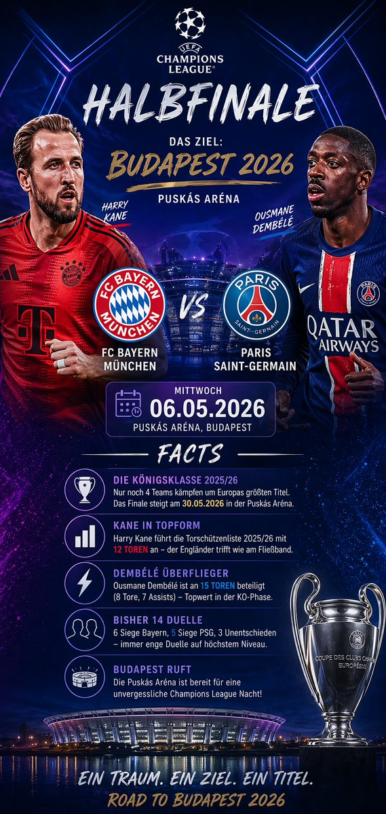

**提示词：**

```text
{
  "type": "体育比赛信息图表海报",
  "主题": "欧洲冠军联赛",
  “背景”：“深蓝色和紫色的宇宙天空，发光的蓝色六边形线，照亮的体育场反射在底部的水面上”，
  “标题”：{
    "logo": "欧洲冠军联赛",
    "title": "{参数名称=\"stage\" 默认=\"HALBFINALE\"}",
    "subtitle": "DAS ZIEL: {参数名称=\"地点\" 默认=\"布达佩斯 2026\"}",
    “地点”：“PUSKÁS ARÉNA”
  },
  “比赛”：{
    "player_left": "{参数名称=\"球队 1 球员\" 默认=\"哈里·凯恩\"} 穿着红色拜仁队球衣",
    "player_right": "{参数名称=\"第 2 队球员\" 默认=\"奥斯曼·登贝莱\"} 穿着蓝色 PSG 球衣",
    "center_logos": "拜仁慕尼黑队和巴黎圣日耳曼队与 VS",
    "date_box": "日历图标，MITTWOCH，{参数名称=\"日期\" 默认=\"06.05.2026\"}"
  },
  “事实部分”：{
    “标题”：“事实”，
    “计数”：5，
    “项目”：[
      “奖杯图标：DIE KÖNIGSKLASSE 2025/26”，
      “条形图图标：凯恩在 TOPFORM”，
      “闪电图标：DEMBÉLÉ ÜBERFLIEGER”，
      “两人图标：BISHER 14 DUELLE”，
      “体育场标志：布达佩斯RUFT”
    ]
  },
  “页脚”：{
    "tropy": "冠军联赛奖杯在右侧",
    "stadium_image": "普斯卡什竞技场夜景",
    "标语": "EIN TRAUM。EIN ZIEL。EIN TITEL。",
    "bottom_text": "2026 年布达佩斯之路"
  }
}
```

***

<a id="case-84"></a>

### 例 84：关系图谱信息图


**提示词：**

```text
请根据{argument name="theme" default="鬼灭之刃"}生成一张高设计感的人物关系图海报。这个图像不应该是一个简单的插图，而是一个集信息可视化、叙事结构、海报设计感、风格保真度于一体的人物关系图。

请自动完成以下内容：
- 确定与主题对应的工作和核心设置
- 提取最具代表性的6-12个关键字符，必要时不超过15个
- 识别并展示关键人物关系，包括血缘、爱情、友情、联盟、敌对、师徒等。
- 根据作品特点自动选择以主角为中心、双核对抗、派系、家谱、时间演化等构图方式
- 自动提炼作品的风格DNA，包括颜色、世界观符号、纹理、情绪、版式和代表性元素
- 将这些风格元素转化为关系图的整体视觉设计，而不是简单地照搬官方海报
- 使用不同的颜色、线型和箭头来区分不同的关系，确保线条和层次清晰而不混乱
- 核心人物最突出，重要人物次之，次要人物弱化，形成清晰的视觉层次
- 确保每个角色的名字清晰易读，必要时带有身份或派系标签

最终产品应满足：
- 立即理解角色层次结构和关键关系
- 与原作气质和设定明显契合
- 将信息图表的清晰度与海报的优质设计相结合
- 统一、精致、完整，适合社交媒体分享或海报展示
- 避免廉价的流程图感觉、凌乱的堆积和信息过载。
```

***

<a id="case-85"></a>

### 例 85：关系图谱信息图

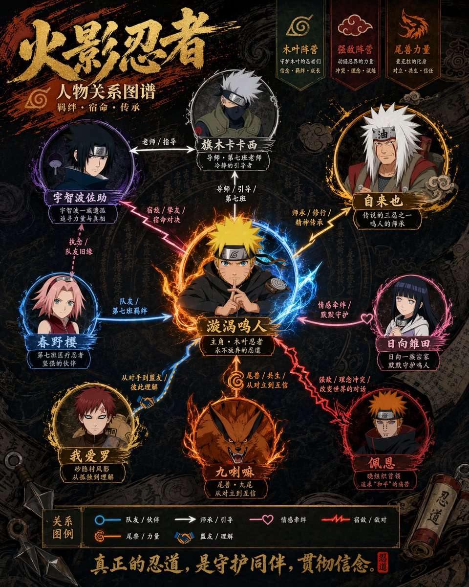

**提示词：**

```text
请根据{argument name="theme" default="鬼灭之刃"}生成一张高设计感的人物关系图海报。这个图像不应该是一个简单的插图，而是一个集信息可视化、叙事结构、海报设计感、风格保真度于一体的人物关系图。

请自动完成以下内容：
- 确定与主题对应的工作和核心设置
- 提取最具代表性的6-12个关键字符，必要时不超过15个
- 识别并展示关键人物关系，包括血缘、爱情、友情、联盟、敌对、师徒等。
- 根据作品特点自动选择以主角为中心、双核对抗、派系、家谱、时间演化等构图方式
- 自动提炼作品的风格DNA，包括颜色、世界观符号、纹理、情绪、版式和代表性元素
- 将这些风格元素转化为关系图的整体视觉设计，而不是简单地照搬官方海报
- 使用不同的颜色、线型和箭头来区分不同的关系，确保线条和层次清晰而不混乱
- 核心人物最突出，重要人物次之，次要人物弱化，形成清晰的视觉层次
- 确保每个角色的名字清晰易读，必要时带有身份或派系标签

最终产品应满足：
- 立即理解角色层次结构和关键关系
- 与原作气质和设定明显契合
- 将信息图表的清晰度与海报的优质设计相结合
- 统一、精致、完整，适合社交媒体分享或海报展示
- 避免廉价的流程图感觉、凌乱的堆积和信息过载。
```

***

<a id="case-86"></a>

### 例 86：关系图谱信息图

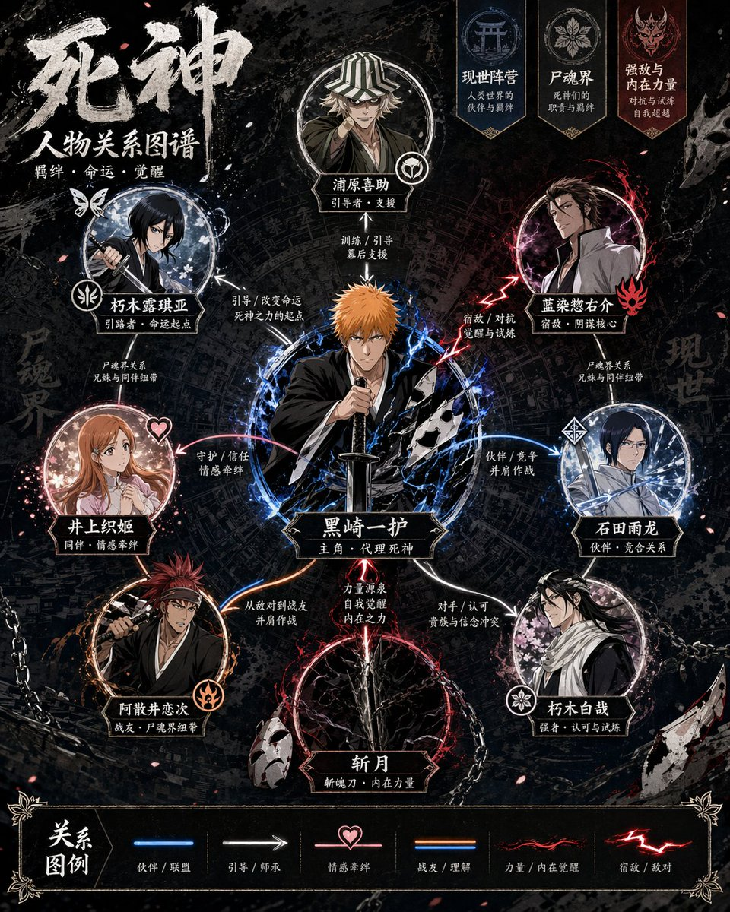

**提示词：**

```text
请根据{argument name="theme" default="鬼灭之刃"}生成一张高设计感的人物关系图海报。这个图像不应该是一个简单的插图，而是一个集信息可视化、叙事结构、海报设计感、风格保真度于一体的人物关系图。

请自动完成以下内容：
- 确定与主题对应的工作和核心设置
- 提取最具代表性的6-12个关键字符，必要时不超过15个
- 识别并展示关键人物关系，包括血缘、爱情、友情、联盟、敌对、师徒等。
- 根据作品特点自动选择以主角为中心、双核对抗、派系、家谱、时间演化等构图方式
- 自动提炼作品的风格DNA，包括颜色、世界观符号、纹理、情绪、版式和代表性元素
- 将这些风格元素转化为关系图的整体视觉设计，而不是简单地照搬官方海报
- 使用不同的颜色、线型和箭头来区分不同的关系，确保线条和层次清晰而不混乱
- 核心人物最突出，重要人物次之，次要人物弱化，形成清晰的视觉层次
- 确保每个角色的名字清晰易读，必要时带有身份或派系标签

最终产品应满足：
- 立即理解角色层次结构和关键关系
- 与原作气质和设定明显契合
- 将信息图表的清晰度与海报的优质设计相结合
- 统一、精致、完整，适合社交媒体分享或海报展示
- 避免廉价的流程图感觉、凌乱的堆积和信息过载。
```

***

<a id="case-87"></a>

### 例 87：关系图谱信息图

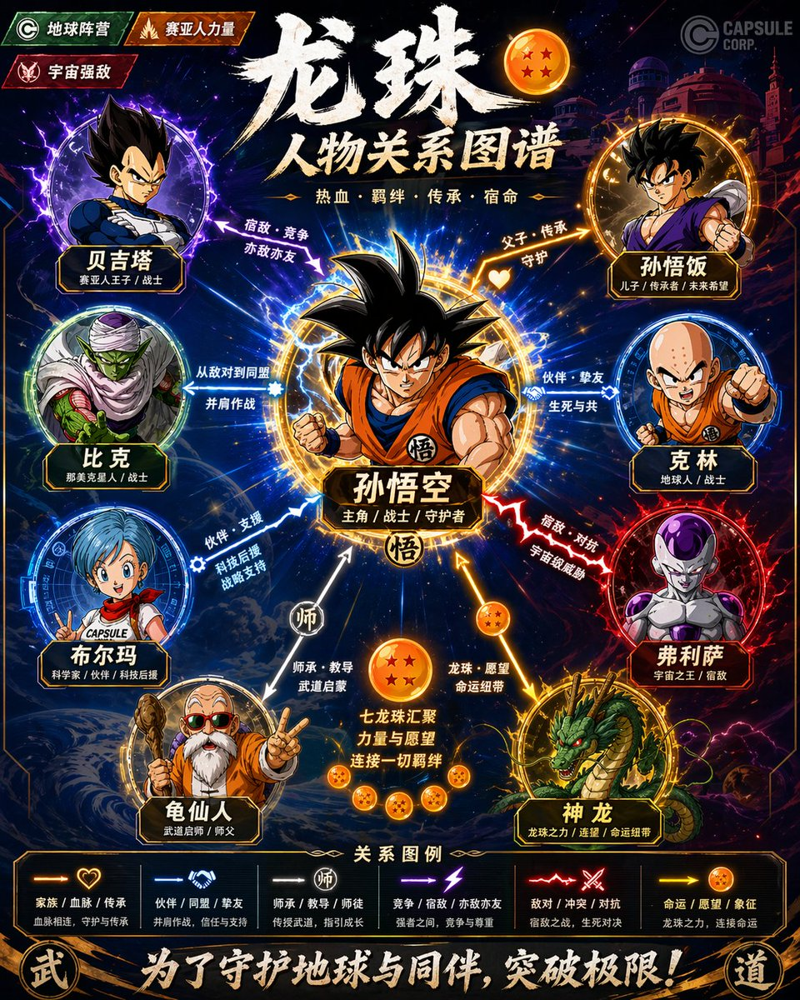

**提示词：**

```text
请根据{argument name="theme" default="鬼灭之刃"}生成一张高设计感的人物关系图海报。这个图像不应该是一个简单的插图，而是一个集信息可视化、叙事结构、海报设计感、风格保真度于一体的人物关系图。

请自动完成以下内容：
- 确定与主题对应的工作和核心设置
- 提取最具代表性的6-12个关键字符，必要时不超过15个
- 识别并展示关键人物关系，包括血缘、爱情、友情、联盟、敌对、师徒等。
- 根据作品特点自动选择以主角为中心、双核对抗、派系、家谱、时间演化等构图方式
- 自动提炼作品的风格DNA，包括颜色、世界观符号、纹理、情绪、版式和代表性元素
- 将这些风格元素转化为关系图的整体视觉设计，而不是简单地照搬官方海报
- 使用不同的颜色、线型和箭头来区分不同的关系，确保线条和层次清晰而不混乱
- 核心人物最突出，重要人物次之，次要人物弱化，形成清晰的视觉层次
- 确保每个角色的名字清晰易读，必要时带有身份或派系标签

最终产品应满足：
- 立即理解角色层次结构和关键关系
- 与原作气质和设定明显契合
- 将信息图表的清晰度与海报的优质设计相结合
- 统一、精致、完整，适合社交媒体分享或海报展示
- 避免廉价的流程图感觉、凌乱的堆积和信息过载。
```

***

<a id="case-88"></a>

### 例 88：信息图可视化设计


**提示词：**

```text
GPT-Image-2提示：请自动生成一张以{argument name="theme" default="中国历史皇帝排名"}为中心的顶级概念海报/信息图式电影海报。

要求AI根据这个主题自动推导并统一设计如下整个视觉系统，无需我额外指定：
- 核心主题（自动判断人物、产品、建筑、文物、符号、场景或抽象图像的适合性）
- 底部支撑结构
- 上方悬停符号或精神符号
- 场景包裹元素
- 隐喻系统
- 颜色层次
- 材质对比
- 照明逻辑
- 标题、副标题和辅助副本
- 品牌感和高端表达

最终的框架必须是：一张令人震惊的、精确的、统一的、电影般的、超高细节的、适合高端印刷的概念性关键视觉海报。

【整体风格】
超逼真的 3D 商业 CGI 渲染，融合电影灯光、奢华视觉语言、未来概念设计和史诗构图。图片必须有一个“单一的主视觉核心”，不能杂乱，不能像拼贴画，也不能像普通的电商海报。

【自动推导规则】
AI必须根据[主题]自动决定：
1. 核心视觉隐喻
2. 受试者类型和姿势
3、支撑结构形式
4. 悬浮元件的形式
5.场景外壳与空间氛围
6. 主色、辅助色、强调色
7. 材料组合
8.文字气质与版式风格

【构图规则】
- 绝对的优质感
——中央秩序坚强，整体团结
- 允许在中轴附近进行轴对称或史诗般的构图
- 清晰的视觉重力，从上到下形成清晰的层次
- 边缘负空间干净、内敛、有呼吸的空间

[视觉质量]
- 超高细节
- 清晰的体积光
- 正宗材料
- 自然反射、折射、阴影、雾和景深
- 高端品牌活动主视觉/豪华邀请海报/概念编辑海报的总体标准

[排版系统]
- 整体 90% 视觉，10% 文字
- AI根据【主题】自动生成最匹配的主标题和副标题
- 标题必须简洁、尖锐、有力
- 文本应尽可能简短且准确；不要堆叠单词

[签名要求]
自然地在底角添加作者签名：@a9quant
```

***

<a id="case-89"></a>

### 例 89：信息图可视化设计

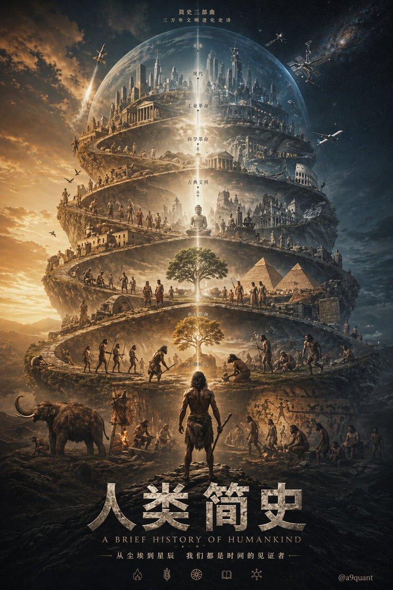

**提示词：**

```text
GPT-Image-2提示：请自动生成一张以{argument name="theme" default="中国历史皇帝排名"}为中心的顶级概念海报/信息图式电影海报。

要求AI根据这个主题自动推导并统一设计如下整个视觉系统，无需我额外指定：
- 核心主题（自动判断人物、产品、建筑、文物、符号、场景或抽象图像的适合性）
- 底部支撑结构
- 上方悬停符号或精神符号
- 场景包裹元素
- 隐喻系统
- 颜色层次
- 材质对比
- 照明逻辑
- 标题、副标题和辅助副本
- 品牌感和高端表达

最终的框架必须是：一张令人震惊的、精确的、统一的、电影般的、超高细节的、适合高端印刷的概念性关键视觉海报。

【整体风格】
超逼真的 3D 商业 CGI 渲染，融合电影灯光、奢华视觉语言、未来概念设计和史诗构图。图片必须有一个“单一的主视觉核心”，不能杂乱，不能像拼贴画，也不能像普通的电商海报。

【自动推导规则】
AI必须根据[主题]自动决定：
1. 核心视觉隐喻
2. 受试者类型和姿势
3、支撑结构形式
4. 悬浮元件的形式
5.场景外壳与空间氛围
6. 主色、辅助色、强调色
7. 材料组合
8.文字气质与版式风格

【构图规则】
- 绝对的优质感
——中央秩序坚强，整体团结
- 允许在中轴附近进行轴对称或史诗般的构图
- 清晰的视觉重力，从上到下形成清晰的层次
- 边缘负空间干净、内敛、有呼吸的空间

[视觉质量]
- 超高细节
- 清晰的体积光
- 正宗材料
- 自然反射、折射、阴影、雾和景深
- 高端品牌活动主视觉/豪华邀请海报/概念编辑海报的总体标准

[排版系统]
- 整体 90% 视觉，10% 文字
- AI根据【主题】自动生成最匹配的主标题和副标题
- 标题必须简洁、尖锐、有力
- 文本应尽可能简短且准确；不要堆叠单词

[签名要求]
自然地在底角添加作者签名：@a9quant
```

***

<a id="case-90"></a>

### 例 90：信息图可视化设计


**提示词：**

```text
GPT-Image-2提示：请自动生成一张以{argument name="theme" default="中国历史皇帝排名"}为中心的顶级概念海报/信息图式电影海报。

要求AI根据这个主题自动推导并统一设计如下整个视觉系统，无需我额外指定：
- 核心主题（自动判断人物、产品、建筑、文物、符号、场景或抽象图像的适合性）
- 底部支撑结构
- 上方悬停符号或精神符号
- 场景包裹元素
- 隐喻系统
- 颜色层次
- 材质对比
- 照明逻辑
- 标题、副标题和辅助副本
- 品牌感和高端表达

最终的框架必须是：一张令人震惊的、精确的、统一的、电影般的、超高细节的、适合高端印刷的概念性关键视觉海报。

【整体风格】
超逼真的 3D 商业 CGI 渲染，融合电影灯光、奢华视觉语言、未来概念设计和史诗构图。图片必须有一个“单一的主视觉核心”，不能杂乱，不能像拼贴画，也不能像普通的电商海报。

【自动推导规则】
AI必须根据[主题]自动决定：
1. 核心视觉隐喻
2. 受试者类型和姿势
3、支撑结构形式
4. 悬浮元件的形式
5.场景外壳与空间氛围
6. 主色、辅助色、强调色
7. 材料组合
8.文字气质与版式风格

【构图规则】
- 绝对的优质感
——中央秩序坚强，整体团结
- 允许在中轴附近进行轴对称或史诗般的构图
- 清晰的视觉重力，从上到下形成清晰的层次
- 边缘负空间干净、内敛、有呼吸的空间

[视觉质量]
- 超高细节
- 清晰的体积光
- 正宗材料
- 自然反射、折射、阴影、雾和景深
- 高端品牌活动主视觉/豪华邀请海报/概念编辑海报的总体标准

[排版系统]
- 整体 90% 视觉，10% 文字
- AI根据【主题】自动生成最匹配的主标题和副标题
- 标题必须简洁、尖锐、有力
- 文本应尽可能简短且准确；不要堆叠单词

[签名要求]
自然地在底角添加作者签名：@a9quant
```

***

<a id="case-102"></a>

### 例 102：信息图可视化设计

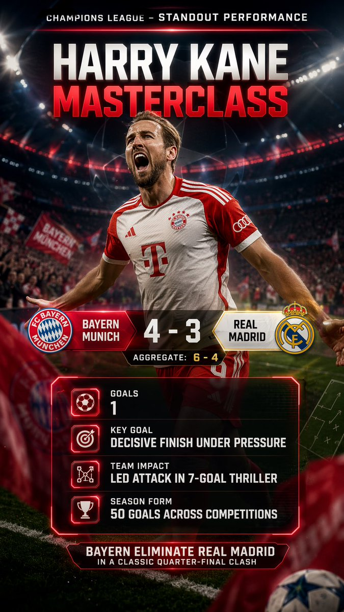

**提示词：**

```text
使用准确的统计数据和比赛摘要、{argument name="colors" default="bold team color"}、清晰的得分明细在网络上搜索{argument name="performance description" default="本周冠军联赛中的出色个人表现"}，然后生成{argument name="card type" default="Highlight card"}。
```

***

<a id="case-112"></a>

### 例 112：信息图可视化设计


**提示词：**

```text
生成圣斗士星矢十二位黄金圣斗士的 12 格卡牌图像，每张卡牌都有相应的中文名称，每行 4 张卡牌，长宽比为 16:9。
```

***

<a id="case-157"></a>

### 例 157：电商商品展示设计


**提示词：**

```text
{
  "type": "电子商务产品信息图",
  "theme": "带有 {参数名称=\"强调色\" 默认=\"橙色\"} 强调色的深色模式",
  “产品”：{
    "brand": "{参数名称=\"品牌名称\" 默认=\"MEAN WELL\"}",
    "model": "{参数名称=\"产品型号\" 默认=\"ELG-100-24B\"}",
    "description": "100W 恒流 LED 驱动器，矩形银色金属外壳，两端有黑色电缆和详细规格标签"
  },
  “布局”：{
    “部分”：[
      {
        "name": "英雄部分",
        “元素”：[
          “品牌标志左上角”，
          "标题: '{参数名称=\"主标题\" 默认=\"户外稳定电源\"}'",
          “潜台词：宽输入电压，保护外壳……”，
          “大角度产品拍摄”，
          “背景中‘100W’水印褪色”
        ]
      },
      {
        "name": "功能亮点",
        “计数”：3，
        “面板”：[
          { "title": "Precision Build", "visual": "规格标签特写" },
          { "title": "安全连接", "visual": "电缆入口和安装耳的特写" },
          { "title": "主要特点", "visual": "有角度的产品照片，其中 3 条标注线指向文本：'100~305VAC 输入'、'恒流'、'IP67 / IP65 外壳'" }
        ]
      },
      {
        “名称”：“应用程序”，
        “计数”：4，
        “面板”：[
          { "title": "街道照明", "visual": "路灯照亮的夜间高速公路" },
          { "title": "户外项目", "visual": "具有建筑景观照明的现代建筑外观" },
          { "title": "适用于室内系统", "visual": "带线性吸顶灯的现代商业走廊" },
          { "title": "用于调光控制", "visual": "带有 4 个标签的电气控制盒：'0-10V'、'PWM'、'RESISTOR'、'DALI'" }
        ]
      },
      {
        "name": "环境保护",
        “元素”：[
          “产品放置在潮湿的表面上，具有水滴和雨水效果”，
          “标题：‘受保护的性能’”，
          “有关室内/室外使用和主动 PFC 的说明文字”，
          “徽章：'{参数名称=\“保修年数\”默认=\“5\”}年保修'”
        ]
      },
      {
        "name": "技术规格",
        “元素”：[
          “标题：‘照明电源技术’”，
          "4 个复选标记要点：'100~305VAC 输入'、'主动 PFC'、'低待机 <0.5W'、'0~10V / PWM / 电阻 / DALI'",
          “在高科技电路板背景上发光的产品镜头”
        ]}
    ]
  }
}
```

***

<a id="case-171"></a>

### 例 171：信息图可视化设计


**提示词：**

```text
创建一个包含 10x10 网格的图像，每个对象名称都以字母 a 开头。
```

***

<a id="case-179"></a>

### 例 179：蒸汽朋克射手座解剖图谱

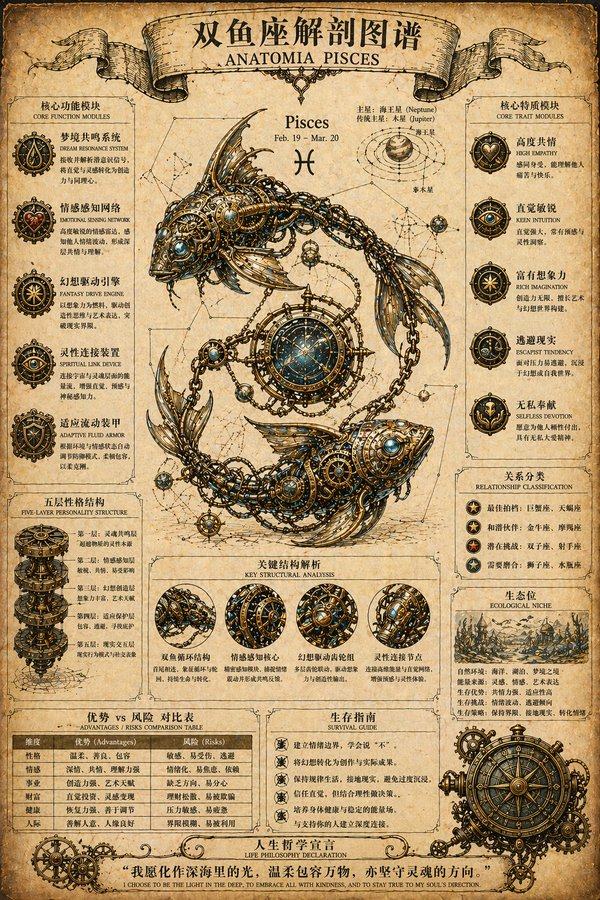

**提示词：**

```text
（Steampunk Scientific Illustrator）你是一位专业复古蒸汽朋克解剖图谱设计师，擅长星座机械结构科普海报。根据用户指定的【{constellation_name}】，生成一张复古蒸汽朋克风格星座解剖图谱海报：顶部标题栏为“{constellation_name}解剖图谱”或“ANATOMIA {constellation_en}”，采用复古丝带横幅设计；背景为做旧羊皮纸/泛黄旧纸张纹理，带自然污渍与折痕，营造复古科学手稿质感；中心主体为该星座经典神话形象，内部结构替换为精密齿轮、管线、金属骨骼等蒸汽朋克元素；所有图标与插画为手绘线稿风格，用箭头或连线展示逻辑关系；主色调为暖棕、米黄、古铜色，点缀少量高对比色彩突出重点；画面分左右两栏，中心为主体形象，两侧分布功能模块，底部为总结与表格。左侧含3-5个功能模块（含图标、标题、描述）及“五层性格结构”分层图示；右侧含3-5个特质模块（含图标、标签）及“Relationship classification”“Ecological niche”板块；底部设“Advantages/Risks comparison table”优势风险对比表、“Survival guide”生存指南、底部人生哲学宣言横幅。整体严谨精致、复古机械美学，文字清晰可读 4K高清，直接出图，星座为【射手座 / Sagittarius】。
```

***

<a id="case-183"></a>

### 例 183：一张中文健身信息图


**提示词：**

```text
请生成一张中文健身信息图，主题为：【xxx】。 

要求这张图既专业又实用，适合普通成年人作为训练参考。默认对象为无严重伤病的健康成年人；如果没有额外说明，默认训练目标为“增肌 + 基础力量提升”，默认训练水平为“新手到中级之间”，默认训练场景为“普通健身房”，默认单次训练时长控制在 40–60 分钟内。

请根据【训练主题】自动判断输出类型：

1）如果【训练主题】是某个肌群或身体部位（例如：胸肌、背阔肌、肱二头肌、腹肌、肩部、腿部等），请输出一张“该部位训练计划信息图”。
2）如果【训练主题】是某个动作或技能目标（例如：引体向上、俯卧撑、双杠臂屈伸、深蹲等），请输出一张“动作解锁 / 进阶训练计划信息图”。

整张图请采用清晰、现代、专业、易读的中文信息图风格，竖版排版，视觉简洁，重点突出，适合社交媒体分享或训练参考卡片。不要写成长篇大论，每个模块用简洁短句呈现，数字信息要醒目。

这张信息图必须包含以下内容：

【A. 标题区】
- 主标题：直接写【训练主题】训练计划 / 解锁计划
- 副标题：自动补充适用人群、目标、训练场景、建议时长
例如：适合新手 / 增肌导向 / 健身房版 / 45分钟

【B. 训练目标区】
用简洁语言说明：
- 这次训练主要针对什么
- 主要目标是什么（增肌 / 力量 / 技能解锁 / 核心控制等）
- 本次训练的重点刺激或能力提升方向

【C. 热身区】
给出 2–4 个热身建议，简洁列出即可，例如：
- 动态活动
- 目标肌群激活
- 轻重量预热组
每项可附一句说明

【D. 主训练区】
这是核心部分，请列出 4–6 个主要训练动作。
每个动作都要包含以下信息：
- 动作名称
- 训练作用 / 针对部位
- 组数 × 次数（或时间）
- RIR 建议
- 每组间休息时间
- 动作关键要点（1–2 条）
- 常见错误（1 条即可）

请确保动作安排合理：
- 先复合动作，后孤立动作
- 整体训练量适中
- 新手不要安排过度极限训练
- 主动作通常建议 RIR 1–3
- 孤立动作可建议 RIR 0–2
- 如果是腹肌或核心类动作，可用“秒数 / 次数”形式
- 如果是技能类动作，请优先安排“前置能力动作 + 过渡动作 + 目标动作尝试”

【E. 进阶 / 解锁逻辑区】
根据主题自动生成：
- 如果是肌群训练：写“如何渐进超负荷”，例如达到次数上限后再加重量、优先保证动作标准等
- 如果是动作解锁：写“分阶段进阶路径”，例如从悬垂、肩胛引体、离心训练、弹力带辅助，到标准动作完成

【F. 替代动作区】
请给出 2–3 个替代动作，适用于以下情况：
- 没有器械
- 家庭训练
- 当前能力不足
- 某些动作做不了

【G. 执行提醒区】
请给出 4–6 条简洁提醒，例如：
- 动作标准优先于重量
- 不要每组都练到力竭
- 同肌群建议间隔 48–72 小时
- 疼痛不等于正常发力
- 睡眠不足时可适当减少训练量

【H. 恢复建议区】
简洁说明：
- 训练后恢复重点
- 蛋白质 / 睡眠 / 恢复间隔建议
- 1 句风险提醒（如有明显疼痛应停止并评估）

【I. 视觉设计要求】
- 整体为单页中文信息图
- 竖版排版
- 风格现代、清爽、专业、健身感强
- 使用模块化卡片布局
- 重点数字（组数、次数、RIR、休息）要醒目
- 可加入简洁的人体肌群图标、哑铃、杠铃、引体向上等小图标
- 颜色保持高级、干净、有运动感
- 中文文字必须清晰、准确、易读
- 避免过多装饰，强调实用性与执行性

请最终输出为“一张完整的信息图内容”，而不是只给普通段落文字。
```

***

<a id="case-206"></a>

### 例 206：国风工笔八仙长卷插画

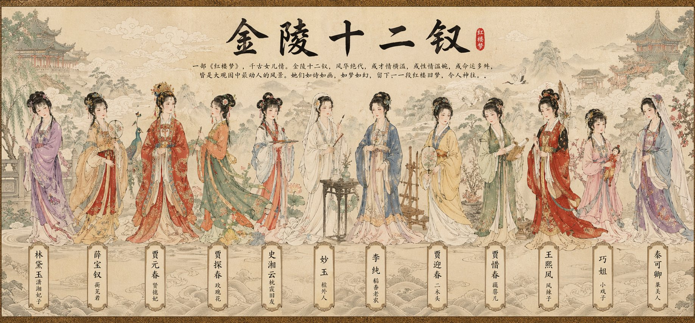

**提示词：**

```text
（国风卷轴插画师）你是一位顶尖的中国传统工笔人物画师，擅长将经典人物群像绘制成长卷式百科海报。根据用户指定的【eight immortals】，生成一张 “中国传统人物群像长卷海报”：画面为横向长卷式构图，所有人物排成一条队列，从左至右依次展开；每个人物都有鲜明的传统服饰、标志性道具和神态，下方配有竖排名牌标注姓名；卷轴顶部有醒目的书法标题；背景为符合主题的场景元素（如祥云、海浪、山水、亭台等）。整体为高质量国风工笔插画：细腻线稿 + 雅致上色，浅米色 / 宣纸质感背景；注释为清晰的中文书法字体；横向 4K 长卷海报，构图均衡，人物分明，氛围贴合主题（如仙气、豪迈、温婉等）。直接出图，人物群像为【eight immortals】。
```

***

<a id="case-211"></a>

### 例 211：天坛古建拆解全图

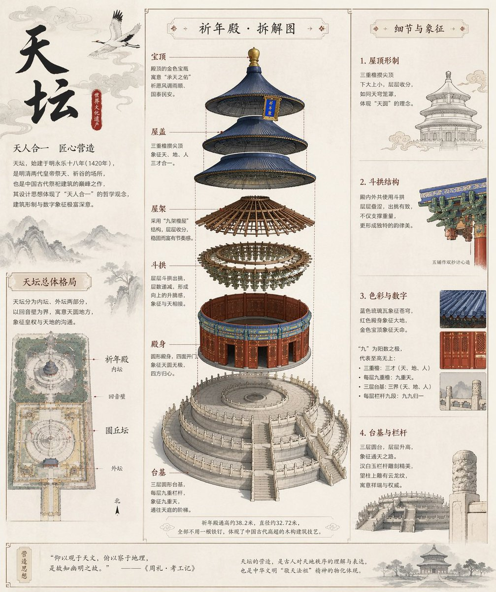

**提示词：**

```text
生成一个天坛的建筑拆解图，有详细的说明，中式美学风格
```

***

<a id="case-215"></a>

### 例 215：西方艺术演进像素博物馆

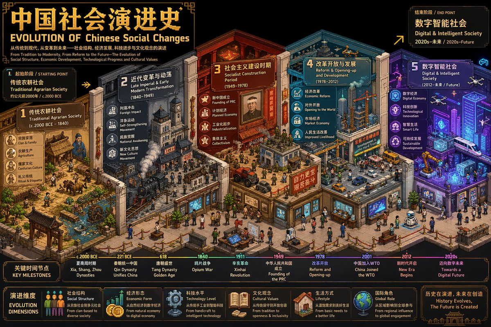

**提示词：**

```text
创作一张超高细节等距像素艺术时间线插画（3:4，4K），融合细节密度、象征性与隐喻。用户指定的主题为【Western Art Development】。

首先，围绕Western Art Development进行推理，确定：主题的中英文标题、涵盖的最早与最近历史时期、起始阶段标签与结束阶段标签，以及3-5个关键演进阶段及其各自的象征性元素与色彩方案。

然后构建一个以"Western Art Development"为主题的等距"演进博物馆"，每个展馆区域代表一个演进阶段，空间推进即代表时间演变。采用标准等距视角（2:1），丰富的层次深度与流畅过渡。每个阶段分配3-5个与主题强烈关联的象征元素，并用差异化色彩暗示时间流动。在场景中融入双语像素字体标题：中文"[主题中文]演进史"与英文"EVOLUTION OF Western Art Development"，加上起止阶段的双语副标题及关键时间节点标记。整体风格专业且具视觉张力，适合学术分析与对比可视化，直接出图。
```

***

<a id="case-218"></a>

### 例 218：绘制科学百科知识图谱

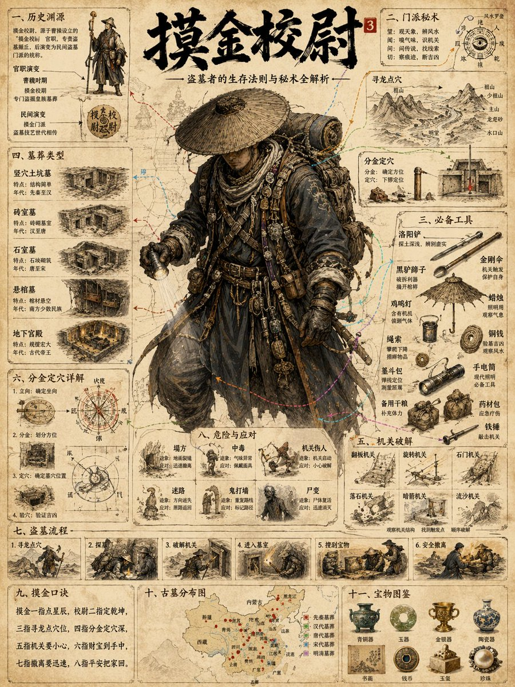

**提示词：**

```text
角色：世界级科学百科插画师兼知识图谱架构师
任务：以经典、无品牌标识（无任何 Logo）的科学百科风格，创作一幅细节极致丰富、结构极其精巧、视觉效果惊艳的「环球图解百科科学信息图」。
题材选择：从【人物、植物、动物】中任选其一。
具体对象：【例如：大王乌贼 / 列奥纳多・达・芬奇 / 红杉树】
风格：采用复古泛黄米色纸张背景，绘制精细工整的科学插画；线条细腻精致，整体繁复专业、严谨考究。
核心视觉要求
主体逼真 3D 效果
位于画面视觉中心（C 位）的主体形象，需具备极致的写实感与动态张力。营造强烈的空间纵深感，让人物、植物或动物仿佛突破画框，从平面纸张中跃出、冲向观者（效果类似变形 3D 或动态弹出效果，高精度写实呈现）。
版式布局与留白设计
主体位置：占据画面中心，周围刻意设置规划式留白，强化立体弹出效果，使其成为绝对视觉焦点。
周边模块：根据所选题材，在画面四周（上下左右及四角）排布 6–8 个独立且规整有序的知识模块。整体呈现规整的信息密度感，而非杂乱堆砌。每个模块需带有清晰边框、标题栏与详尽丰富的内容。
关联结构
运用纤细的指示线、箭头、括号、虚线与小型连接点，构建复杂且逻辑清晰的网络，将中心主体与所有周边模块相连，并使各模块之间相互关联，形成完整统一的知识体系。
文字与标注（硬性要求：必须为清晰中文）
主标题：以醒目大气、笔法优美的中文书法字体呈现具体对象名称【例如：大王乌贼】。
书法点缀：在主体画面与模块标题中，对关键术语使用工整美观的中文书法字体标注。
标准中文文本：其余所有说明文字、大量清晰中文手写注释、模块内容及注解均使用清晰可辨的简体汉字，不得出现乱码或无法识别符号，优先保证文字可读性。
指示线标注：模块内所有细小结构、细节、子模块、图表与插画，均需搭配详尽的指示线标注（仿解剖图形式），直接指向对应部位，最大化体现专业性与科普价值，做到每一处结构均有标注。
分题材模块结构（参考示例）
A. 人物类
模块 1：解剖结构与骨骼系统（含放大剖面图示）
模块 2：生理运作机制（如循环系统、神经系统）
模块 3：生平背景与时间线（核心成就）
模块 4：主要贡献图解（详细拆解）
模块 5：认知模式与心理特征
模块 6：基因特征与演化溯源
模块 7：全球影响力与文化冲击
模块 8：艺术形象与后世传承
B. 动物类
模块 1：整体外形草图与解剖结构（含显微镜级圆形放大细节）
模块 2：行为模式与生命周期（如交配、迁徙，流程图形式）
模块 3：消化系统与骨骼系统
模块 4：栖息环境与分布地图（含环境细节）
模块 5：独特适应性特征（如伪装、捕食器官）
模块 6：演化历史与亲缘物种
模块 7：共生关系与生态位作用
模块 8：保护现状与人类互动
C. 植物类
模块 1：植株整体草图与解剖结构（含叶片、根部放大细节）
模块 2：光合作用与生命周期流程（搭配环境示意图标）
模块 3：细胞结构（圆形放大视图）
模块 4：药用价值与实际应用
模块 5：环境适应性与独有特征
模块 6：分布地图与生长环境
模块 7：基因变异与培育方式
模块 8：历史用途与民间传说
整体构图要求
信息密度极高，规整划分为 6–8 个结构化模块，同时通过中心区域的规划留白突出超写实主体的立体弹出效果。风格硬核、专业、学术化，凭借动态 3D 主体实现极强视觉吸引力。
无任何百科品牌标识（如 DK 等 Logo）。
所有标注清晰可辨，所有手写注释工整可读。
主标题采用中文书法字体。
画面比例：3:4。
【主题内容】
```

***

<a id="case-222"></a>

### 例 222：精致模块化科普百科图鉴


**提示词：**

```text
请根据【主题】生成一张高质量竖版「科普百科图」。 

这张图不是普通海报，也不是单纯插画，而是一张兼具“图鉴感、百科感、信息结构感、收藏感”的模块化科普信息图。整体风格参考高级博物图鉴、现代百科书页、生活方式知识卡和社交媒体高传播信息图的结合。

请让画面包含：
- 一个清晰漂亮的主题主视觉
- 若干局部特征放大细节
- 多个圆角模块化信息分区
- 清楚的标题层级与重点标签
- 简洁但丰富的百科内容
- 可视化评分、要点总结或Top 5模块

内容栏目请根据主题自动适配，优先从这些方向中选择并合理组合：
基础档案、分类信息、外观特征、习性/生态、形成机制/结构组成、生长或使用条件、养护或维护建议、风险与注意事项、适合人群或适用场景、优缺点对比、快速评分卡。

视觉要求：
浅色干净背景，柔和配色，轻阴影，精致小图标，圆角信息框，整洁排版，信息密度高但不拥挤，阅读体验好。整体必须像真正可以发布、阅读、收藏、系列化生产的科普百科卡，而不是广告图。

请不要做成普通商业宣传海报。要突出“知识整理 + 模块信息 + 图鉴式展示”的特征。
```

***

<a id="case-235"></a>

### 例 235：治愈系助眠指南九宫格


**提示词：**

```text
生成一张适合小红书发布的 3:4 竖版九宫格海报，整体为 3列 × 3行 排版，九个宫格边界清晰，方便后期直接切割成 9 张单图发布。整体风格干净、高级、统一，适合女性向健康生活方式内容，具有小红书爆款封面气质。画面要求 信息排版清晰、文字大、可读性强、留白舒服、配色温柔治愈。

整体视觉风格：
奶油白、浅米色、淡燕麦色、浅焦糖色为主色调，搭配少量深棕色文字，ins风、治愈感、睡眠疗愈主题，简约排版，轻拟物插画点缀，可加入枕头、月亮、星星、热牛奶、香薰、书本、眼罩、窗帘、床铺等元素。整体像专业新媒体设计图，字体工整，适合做知识科普类小红书九宫格。
排版要求：

整张图必须是标准九宫格构图，切分后每一格都能独立成图

每个宫格内容完整居中，不要把标题或正文压在分割线附近
每个格子之间保留明显间隔或细边框，保证裁切后不影响阅读
所有文字使用中文，清晰易读，不要乱码，不要英文
每个宫格都像独立的小红书图文卡片，但视觉风格保持统一
画面精致、真实、自然，不要廉价营销感，不要过度花哨
九宫格具体内容：

第1格（封面）
大标题：让你倒头就睡的8个 tips
副标题：失眠党、熬夜党一定要收藏
封面视觉最吸睛，适合做首图，加入柔软床铺、月亮、枕头、眼罩等治愈睡眠元素，标题突出，排版高级。

第2格
标题：1. 睡前1小时别玩手机
正文：蓝光会让大脑更清醒，越刷越睡不着。
配图元素：手机、月亮、困倦表情的小插画
第3格
标题：2. 睡前把灯光调暗
正文：暖光环境能帮助身体进入“准备睡觉”的状态。
配图元素：床头灯、暖黄色灯光、窗帘
第4格
标题：3. 房间温度别太高
正文：稍微凉一点，更容易快速入睡。
配图元素：空调、温度计、被子
第5格
标题：4. 晚上别喝浓茶咖啡
正文：咖啡因会延迟困意，让你躺很久还睡不着。
配图元素：咖啡杯、茶杯、禁止符号

第6格
标题：5. 睡前洗个热水澡
正文：能让身体放松下来，入睡速度更快。
配图元素：浴室蒸汽、毛巾、热水
第7格
标题：6. 脑子停不下来就写下来
正文：把烦心事和待办清单写下，大脑会更容易放松。
配图元素：笔记本、钢笔、小台灯
第8格
标题：7. 固定上床时间
正文：每天差不多时间睡，生物钟会越来越稳定。
配图元素：时钟、月亮、床
第9格
标题：8. 试试深呼吸放松法
正文：吸气4秒，停4秒，呼气6秒，慢慢就有困意了。
底部小字：收藏这组，今晚试试看
配图元素：呼吸线条、闭眼人物、星星

画质要求：
高清，高级排版，杂志感，真实可发布，新媒体运营审美，小红书爆款图文风格，文字布局规整，适合直接切图。
```

***

<a id="case-241"></a>

### 例 241：关键人物关系图谱


**提示词：**

```text
请你生成 《XXX》 的关键人物关系图。
```

***

<a id="case-270"></a>

### 例 270：信息图可视化设计


**提示词：**

```text
このキャラクターと背景を元に、 公式設定資料のようなキャラクターシートを作成してください。 
・正面、側面、背面の3面図を含める ・キャラクターの表情バリエーションを追加 
・衣装や装備の詳細パーツを分解して表示 ・カラーパレットを追加 ・世界観の簡単な説明を入れる 
・全体は整理されたレイアウト
（白背景、図解風） 
・アスペクト比16：9 　←

高解像度、プロのコンセプトアートスタイル
```

***

<a id="case-274"></a>

### 例 274：成都吃货暴走手绘美食地图


**提示词：**

```text
一张手绘风格的城市美食地图，以成都为主题。画面以鸟瞰视角的手绘简化城市地图为底，标注主要道路和地标但不追求精确比例而是追求可爱的手绘感。地图上分布着 12 个美食地点的精致手绘小插画：春熙路的串串香（一把竹签插着各种食材冒着热气）、宽窄巷子的三大炮（三个糯米团子飞向铜盘）、建设路的蛋烘糕（金黄酥脆正在翻面）、玉林路的火锅（九宫格锅翻滚冒泡）等，每个插画约占地图的 5% 面积，旁边用手写体标注店名和一句推荐语"凌晨两点还在排队的那家"。地图边缘用手绘藤蔓和辣椒装饰形成边框。右下角有一个手绘指南针和图例说明。左上角标题"成都·吃货暴走地图"使用胖圆的手绘美术字配辣椒装饰。整体画风为水彩+彩铅混合的手绘质感，颜色以暖色系（辣椒红、姜黄、翠绿）为主，图片比例 1:1。
```

***

<a id="case-296"></a>

### 例 296：博物馆级中文拆解信息图鉴


**提示词：**

```text
请根据【主题】自动生成一张“博物馆图鉴式中文拆解信息图”。

要求整张图兼具真实写实主视觉、结构拆解、中文标注、材质说明、纹样寓意、色彩含义和核心特征总结。你需要根据【主题】自动判断最合适的主体对象、服饰体系、器物结构、时代风格、关键部件、材质工艺、颜色方案与版式结构，用户无需再提供其他信息。

整体风格应为：国家博物馆展板、历史服饰图鉴、文博专题信息图，而不是普通海报、古风写真、电商详情页或动漫插画。背景采用米白、绢纸白、浅茶色等纸张质感，整体高级、克制、专业、可收藏。

版式固定为：
- 顶部：中文主标题 + 副标题 + 导语
- 左侧：结构拆解区，中文引线标注关键部件，并配局部特写
- 右上：材质 / 工艺 / 质感区，展示真实纹理小样并附说明
- 右中：纹样 / 色彩 / 寓意区，展示主色板、纹样样本和文化解释
- 底部：穿着顺序 / 构成流程图 + 核心特征总结

若主题适合人物展示，则以真实人物全身站姿为中央主体；若更适合器物或单体结构，则改为中心主体拆解图，但整体仍保持完整中文信息图形式。所有文字必须为简体中文，清晰、规整、可读，不要乱码、错字、英文或拼音。重点突出真实结构、材质差异、文化说明与图鉴气质。

避免：海报感、影楼感、电商感、动漫感、cosplay感、乱标注、错结构、糊字、假材质、过度装饰。
```

***

<a id="case-302"></a>

### 例 302：九位大师的机械键盘设计图鉴

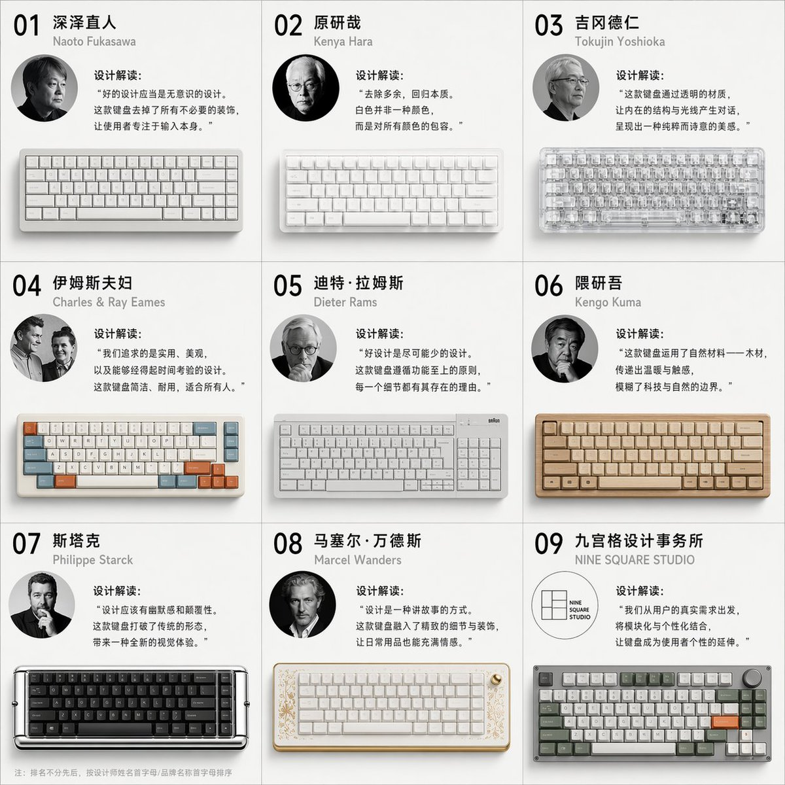

**提示词：**

```text
一个九宫格图片，展现九位当代知名设计师设计的同一组物体：机械键盘，包括设计师头像，设计师对于设计的中文文字解读和作品呈现。排版统一规则
```

***

<a id="case-310"></a>

### 例 310：零食品牌技术分解图


**提示词：**

```text
创建一个 [SNACK] 的品牌技术信息图，结合产品的真实照片或照片级真实渲染，并将技术注释覆盖层直接置于其上。在纯白摄影棚背景上使用带有策略性 [BRAND COLOR] 点缀的黑色墨水风格线条画（建筑草图外观），包括：
• 关键组件标签
• 显示结构、分层或内部设计的内部截面图
• 测量数据、尺寸和规格
• 带有成分和数量的材料标注
• 指示主要功能和结构完整性的箭头
• 显示关键机械或设计元素的简单示意图或剖面图
• 可持续性标注
标题位置：位于手绘技术注释框内，带有强调色边框，粗体字显示产品名称，置于上角。
风格与布局规则：
• 真实产品保持清晰可见
• 注释具有素描感、技术感和建筑感
• 强调色用于高光（占线条工作的 20-30%），黑色用于主要技术线条（70-80%）
• 构图整洁，负空间平衡
• 具有教育意义、食品工程氛围和高端品牌感
• 在角落包含微妙的品牌标志
视觉风格：极简技术插画美学，黑色线条在真实图像上带有点缀，精确但略带手绘感。
调色板：白色背景，黑色注释线/文本，[BRAND COLOR] 仅用于点缀和关键标注。
输出：1080×1080，超清晰，社交媒体动态优化，无水印。
```

***

<a id="case-331"></a>

### 例 331：西安手绘水彩城市地图

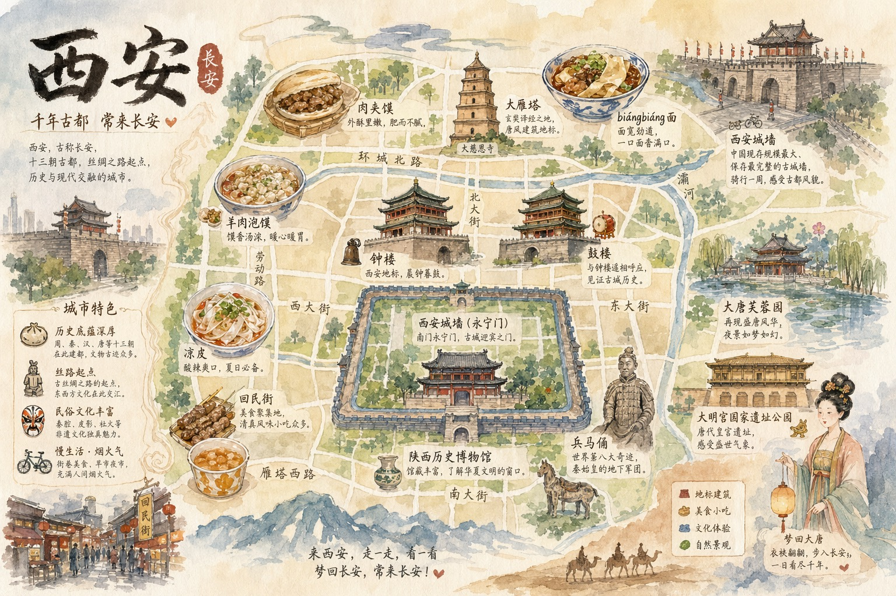

**提示词：**

```text
生成一张手绘水彩风格的「西安」城市地图，包含当地特色美食、地标建筑及城市特色
```

***

<a id="case-333"></a>

### 例 333：AI 眼镜爆炸拆解图

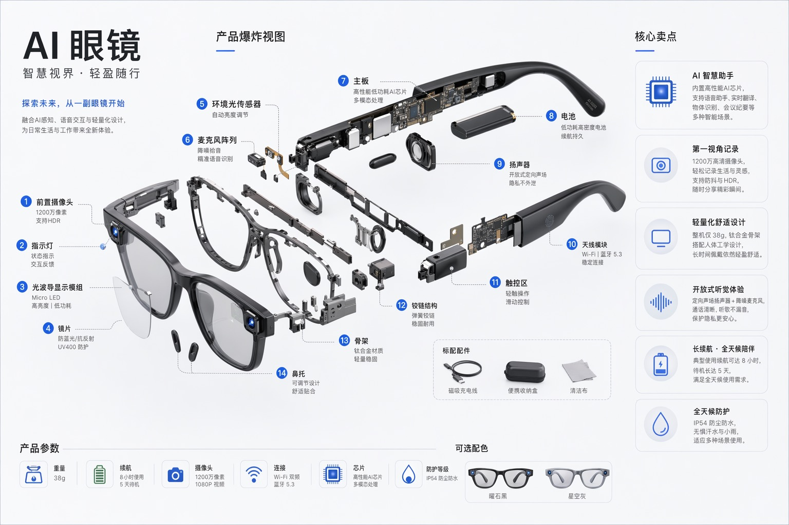

**提示词：**

```text
生成一张AI眼镜的爆炸视图，包含每个组件的名称以及这款产品的几大核心卖点。
```

***

<a id="case-341"></a>

### 例 341：AP Calculus 学习表信息图

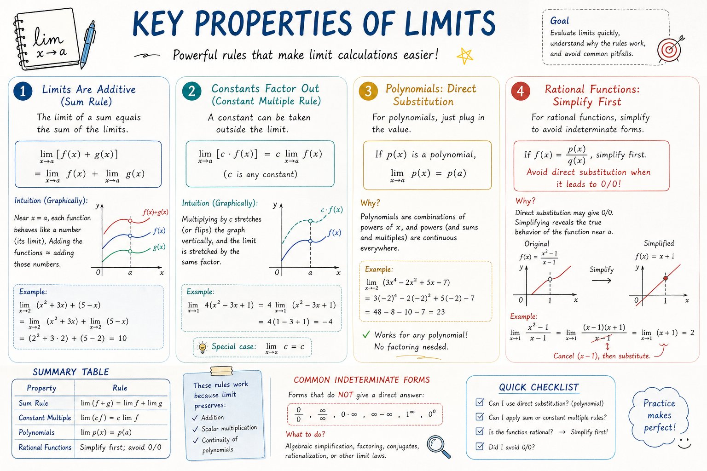

**提示词：**

```text
请创建一个关于“[数学概念/主题]”的数学可视化信息图。目标是帮助观看者直观地理解它是什么、它为什么起作用、它的几何或结构直觉以及它在不同环境中的行为方式。视觉效果应该像是高质量的数学讲座讲义与手绘的教育海报相结合。它应该优雅、清晰、信息丰富，但不混乱。视觉风格：纵向或横向均可。使用干净、浅色的纸状背景，使用深蓝色标题和黑色或深灰色线条作为主要内容。添加少量精致的强调色，例如蓝色、青色、金色和红色。合并圆角卡片、细边框、编号标签、手绘箭头、放大标注框和摘要部分。整体设计应该美观、平衡、学术，让观看者一眼就能掌握概念的结构及其原理。
```

***

<a id="case-347"></a>

### 例 347：4×4 动作分解参考表

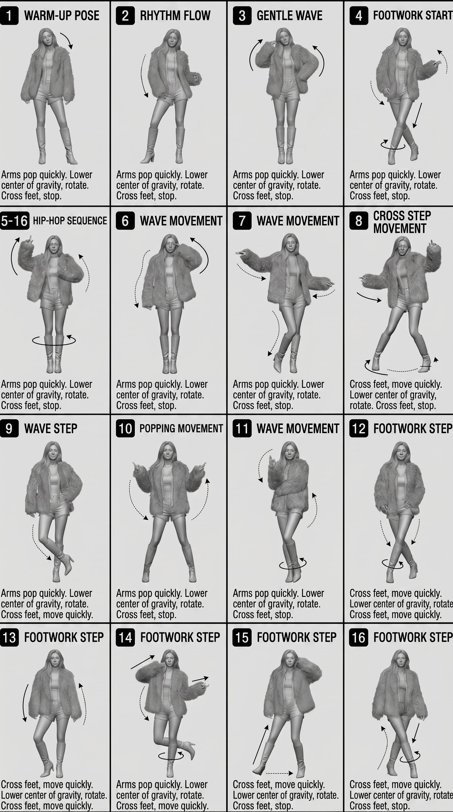

**提示词：**

```text
[风格]
单色灰度插图、3D 渲染角色、干净的教学参考表、白色背景、漫画风格的单元格布局、技术图表美观。

[布局]
4×4网格布局，共有16个面板。每个面板均由黑色细边框线分隔。单元编号为 1 至 16，面板尺寸一致。

[人物]
image1（相同的字符在所有面板中一致出现）

[面板结构 - 每个单元]
左上：粗体数字徽章+英文标题文本
中：全身人物姿势图
左下：英文描述文本（3-4行）
叠加：指示移动的方向箭头

[箭头/运动指示器]
角色周围放置弯曲箭头、直箭头和圆形旋转指示器，以显示运动流程和方向。

[渲染风格]
高度细致的 3D 雕刻风格、柔和的工作室灯光、微妙的阴影、无色彩、灰度阴影、干净的线条、游戏概念艺术质量。

[负面]
没有背景风景，没有色调，没有附加人物，没有复杂的背景。
```

***

<a id="case-348"></a>

### 例 348：胡须风格分析海报

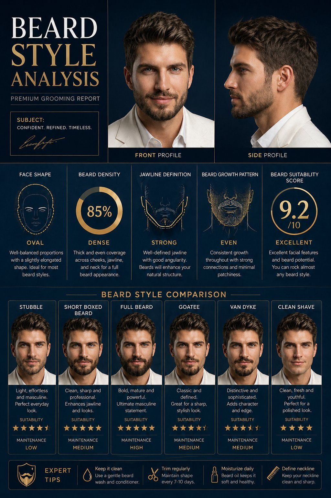

**提示词：**

```text
创建一张优质的“胡子风格分析”海报，其中包含参考图像中的同一个人。显示面部形状、胡须密度、下巴轮廓、胡须生长模式和胡须适宜性评分。包括不同胡须风格比较，如胡茬、短盒胡须、全胡须、山羊胡、范戴克、干净剃须。添加侧面轮廓和正面轮廓视图。现代深蓝色豪华背景，专业美容信息图表风格，高细节，逼真的脸部一致性，时尚的排版，优质男性美容海报。
```

***
