# 海报与排版

> GPT Image 2 中文提示词案例分册 3。本分册共 63 个案例。

[返回索引](index.md)

## 案例目录

- [例 3：足球主题电影海报](#case-3)
- [例 5：主题海报版式设计](#case-5)
- [例 9：主题海报版式设计](#case-9)
- [例 10：主题海报版式设计](#case-10)
- [例 15：主题海报版式设计](#case-15)
- [例 16：主题海报版式设计](#case-16)
- [例 58：主题海报版式设计](#case-58)
- [例 59：主题海报版式设计](#case-59)
- [例 61：主题海报版式设计](#case-61)
- [例 63：主题海报版式设计](#case-63)
- [例 96：主题海报版式设计](#case-96)
- [例 98：主题海报版式设计](#case-98)
- [例 100：主题海报版式设计](#case-100)
- [例 116：主题海报版式设计](#case-116)
- [例 117：主题海报版式设计](#case-117)
- [例 119：主题海报版式设计](#case-119)
- [例 122：主题海报版式设计](#case-122)
- [例 124：主题海报版式设计](#case-124)
- [例 138：封面排版设计图](#case-138)
- [例 139：主题海报版式设计](#case-139)
- [例 140：主题海报版式设计](#case-140)
- [例 144：主题海报版式设计](#case-144)
- [例 153：主题海报版式设计](#case-153)
- [例 172：赛博科幻桃太郎主视觉图](#case-172)
- [例 180：荒诞超现实女装大叔海报](#case-180)
- [例 191：史诗级科幻电影海报设计](#case-191)
- [例 207：黑神话潘金莲绝美游戏封面](#case-207)
- [例 216：雅致图案四款时尚单品设计](#case-216)
- [例 220：鎏金广州塔的东方奇幻海报](#case-220)
- [例 223：春日禅意水墨群山海报](#case-223)
- [例 226：古风明朝帝王群像长卷](#case-226)
- [例 228：完美匹配的海报广告图](#case-228)
- [例 230：极简国潮鎏金广州塔海报](#case-230)
- [例 231：疾风起狂草艺术字体设计](#case-231)
- [例 236：粤超联赛国潮风邀请函海报](#case-236)
- [例 244：杜蕾斯茶颜悦色联名海报设计](#case-244)
- [例 247：运动健身图标字体设计](#case-247)
- [例 253：2026谷雨节气唯美海报设计](#case-253)
- [例 254：奔赴山海胶片感海报](#case-254)
- [例 275：一张采用分层蒙太奇构图的电影海报](#case-275)
- [例 276：红绸幻化壮阔国潮羊城](#case-276)
- [例 278：阿马尔菲海岸复古旅行海报](#case-278)
- [例 280：封面排版设计图](#case-280)
- [例 283：小恶魔莉莉香超任游戏海报](#case-283)
- [例 291：极致奢华的弹珠店梦幻宣传单](#case-291)
- [例 298：梦幻波士顿春季城市海报](#case-298)
- [例 299：极简留白涂鸦手绘草图](#case-299)
- [例 307：红绸舞动千年商都广州](#case-307)
- [例 312：鲜艳霓虹光影下的动感苏打水飞溅商业海报](#case-312)
- [例 313：电商商品展示设计](#case-313)
- [例 314：红蓝光影下的未来都市双重曝光青年](#case-314)
- [例 317：震撼视觉的深红影棚广角美妆大片](#case-317)
- [例 320：冰火双雄背靠背史诗电影海报](#case-320)
- [例 332：茶π产品宣传海报](#case-332)
- [例 338：《赤壁怀古》长卷图](#case-338)
- [例 342：四季包装 Campaign 宫格](#case-342)
- [例 343：高定时尚杂志封面](#case-343)
- [例 344：NOIR 街头服饰 Campaign](#case-344)
- [例 345：法新浪潮撕纸电影海报](#case-345)
- [例 349：运动时尚三联 Campaign](#case-349)
- [例 351：健身品牌力量 Campaign](#case-351)
- [例 352：西楚霸王国风暗黑海报](#case-352)
- [例 355：概念字体海报 Prompt](#case-355)

## 案例

<a id="case-3"></a>

### 例 3：足球主题电影海报

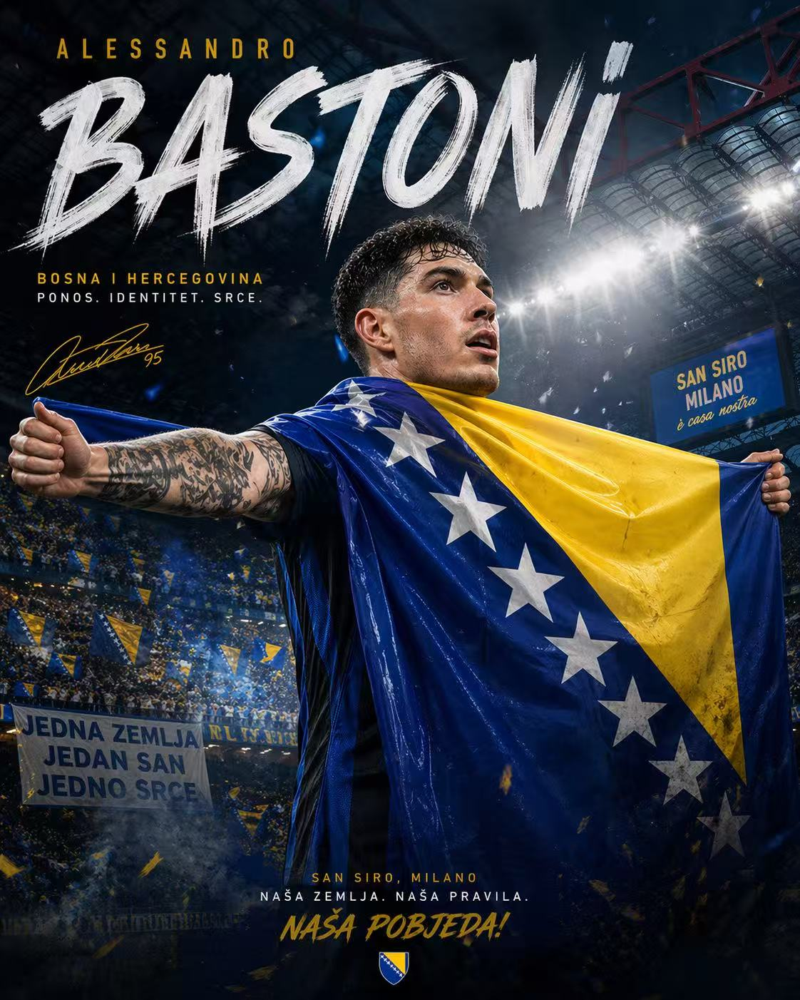

**提示词：**

```text
生成一张「足球主题电影海报」风格的高清写真海报：国际米兰后卫巴斯托尼站在圣西罗球场中央激情庆祝，双手高举并披着波黑国旗，神情热血、坚定、自信，现场灯光璀璨，球场看台座无虚席，背景有蓝黑色烟雾、聚光灯、飘扬的旗帜和飞舞的纸屑，营造欧冠之夜般的史诗氛围。人物为画面核心，半身到全身构图，突出脸部细节、肌肉张力与球衣质感。整体风格写实、震撼、富有戏剧性，海报级构图，电影感光影，高对比度，超清细节，8K，专业体育摄影，极具视觉冲击力。五根手指。
```

***

<a id="case-5"></a>

### 例 5：主题海报版式设计


**提示词：**

```text
根据【XXX主题】自动生成一张收藏版史诗叙事海报：巨大优雅的人物侧脸剪影作为外轮廓，剪影内部自动生长出最契合该主题的完整世界观、标志性场景、角色关系、象征符号、关键建筑、生物、道具与氛围。整体不是普通拼贴，而是高级的剪影轮廓填充式叙事合成，带有双重曝光式联想，但更偏电影海报与梦幻水彩插画融合风格；柔和空气透视，轻雾化过渡，纸张颗粒，边缘飞白与刷痕，大面积留白，版式克制高级，安静、宏大、神圣、怀旧、诗意、传说感强。风格、色彩、场景、材质全部根据主题自动适配，所有元素必须强绑定主题，一眼识别，不要杂乱，不要硬拼贴，不要模板化背景，不要廉价奇幻素材。画面中需自然加入专属签名“WHY”，作为海报设计的一部分，位置低调但清晰，可放在左下角、右下角或标题附近，风格需与整体版式统一，像收藏版海报的作者落款或设计签章；签名字体精致、克制、高级，不可过大，不可破坏主体构图，不可显得突兀廉价。
```

***

<a id="case-9"></a>

### 例 9：主题海报版式设计


**提示词：**

```text
2026中国城市系列宣传海报，主题为【北京】。现代、多彩、明亮通透的国潮风，竖版9:16。大面积白色纹理留白背景，一条从右下向左上盘旋的红色丝绸形成S型主构图。右下角一位东方女性挥舞红绸，服饰需结合北京地域文化定制。红绸延展为城市长卷，融合天坛、长城、鸟巢、喇叭沟门原始森林公园、什刹海、京味相声。左侧排版SPRING 2026、竖排Beijing和小印章“北京”。要求统一系列感，但不能雷同，细节丰富，城市辨识度强。文字清晰且精美布局，高端图形设计。
```

***

<a id="case-10"></a>

### 例 10：主题海报版式设计

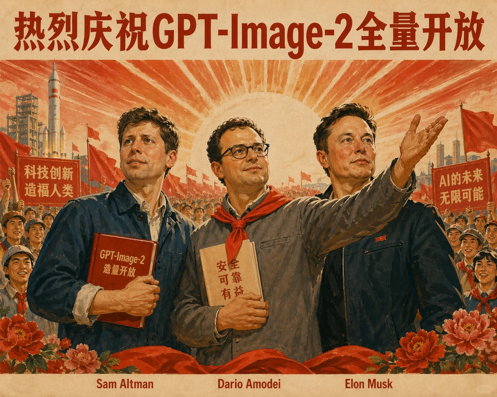

**提示词：**

```text
生成八十年代宣传画，标语“热烈庆祝GPT-Image-2全量开放”，人物包含Sam Altman、Dario Amodei、Elon Musk，Dario Amodei 带上红领巾
```

***

<a id="case-15"></a>

### 例 15：主题海报版式设计


**提示词：**

```text
生成一张海报图片，图片人物是一个19岁的中国少女，黑色直长发，很开心的在夜宵摊上喝啤酒吃小龙虾。海报上用芥末黄色艺术字写着，趁年轻，激爽才够味！
```

***

<a id="case-16"></a>

### 例 16：主题海报版式设计


**提示词：**

```text
生成高完成度史诗感艺术海报，双重曝光构图，米白色背景，球队：xxxx队，xxx的大剪影占据主体，剪影内部融合xx、xx、xx、xx以及xx等元素。整体以xx、土褐、为主，压抑、决绝、宿命感极强，元素不要冗杂，要有留白，印刷颗粒质感，元素不要有太锐的细节，但是要有史诗质感，像正式院线动画电影海报，竖版。图片中若出现文字则以细体字为主
```

***

<a id="case-58"></a>

### 例 58：主题海报版式设计

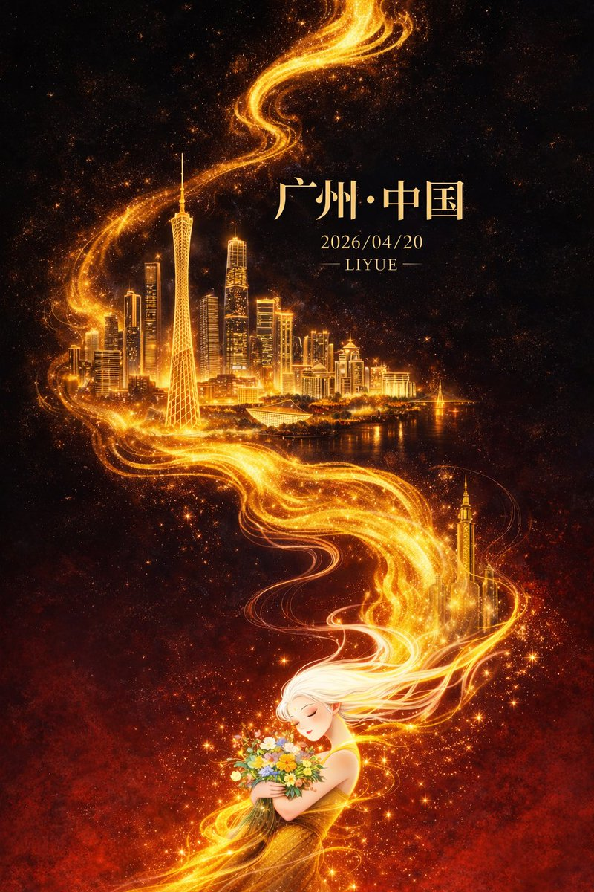

**提示词：**

```text
平面插画，高端东方奇幻风格城市海报设计，竖向9:16构图。布局采用对角线+S形流线，从左下角延伸到右上角。背景是深黑色渐变到深红色，营造出强烈的冷暖对比和空间深度，带有微弱的星尘和颗粒纹理。中心，一条流动的金色能量线如火焰般蜿蜒穿过，从底部向上延伸，具有流体纹理、粒子效果和渐变高光，带有微妙的能量碎片和体积光。

金色的流动之中，{argument name="city" default="广州"}的地标建筑层层浮现：以广州塔为视觉核心，比例突出，周围环绕着珠江新城天际线、猎德大桥和现代岭南建筑元素。建筑采用“细线描画+金色发光块”渲染，轮廓清晰，细节丰富，在金色光环的映衬下，仿佛漂浮在虚空之中，营造出超现实的空间层次，背景略带雾气，增加了深度。

画面底部是一个东方白发女性人物，长发如雾般飘逸，与金色光芒自然衔接、融为一体。她的头发是半透明的，带有渐变的光效；她身姿优雅，双目紧闭，表情安详，手捧一束点缀着闪烁颗粒的七彩花朵，象征着人与城市能量的精神联系。角色细节被适度简化，以强调整体设计。

灯光集中在金色的流动、建筑物和人物轮廓上，创造出强烈的明暗对比和视觉焦点。整体气氛宏大、神秘，充满东方神话色彩，略显治愈。颜色以黑色和深红色为底色，以绚丽的金色作为主要视觉强调。金色具有丰富的明暗层次，辅以小面积的高饱和度花色，保持了精致内敛的美感。

集成文本和布局：顶部居中宋体字体为“{argument name="city" default="Guangzhou"} · China”，后面是较小的文本“{argument name="date" default="2026/04/20"}”和下面的“{argument name="author" default="LIYUE"}”。文字采用淡金色或柔和的暖白色，与整体灯光统一。高品质细节、影院级灯光、丰富的体积和颗粒细节、干净无噪点的图像、超高8K分辨率、商业级海报画质。
```

***

<a id="case-59"></a>

### 例 59：主题海报版式设计


**提示词：**

```text
{
  "type": "cinematic promotional poster",
  "style": "3D CGI animation style, highly detailed, dramatic lighting, caricature characters",
  "characters": [
    { "id": "char1", "description": "large shirtless man with long black hair, beard, and glasses" },
    { "id": "char2", "description": "elderly woman in a kimono with white hair tied up" },
    { "id": "char3", "description": "small man with a topknot, glasses, mustache, wearing a bright green sweater" }
  ],
  "layout": {
    "panels": [
      {
        "position": "top",
        "scene": "wide shot of a town street with buildings and a city skyline in the background",
        "characters_present": ["char1", "char2", "char3"],
        "text_overlays": [
          "{argument name=\"intro text\" default=\"ある日ーー\"}",
          "いつもの日常がーー",
          "こんばんは"
        ]
      },
      {
        "position": "middle left",
        "scene": "close-up of char1 looking shocked against a dark fiery background",
        "text_overlays": [
          "{argument name=\"shocked text\" default=\"私が出禁？\"}"
        ]
      },
      {
        "position": "middle right",
        "scene": "close-up of char2 looking angry and pointing against a stormy sea background",
        "text_overlays": [
          "{argument name=\"angry text\" default=\"海を荒らすな！\"}"
        ]
      },
      {
        "position": "bottom",
        "scene": "char3 pointing, char1 screaming, a second instance of char3 falling backwards, and char2 sitting angrily against a fiery chaotic background",
        "text_overlays": [
          "全然出ない！"
        ],
        "bottom_titles": [
          "{argument name=\"main title\" default=\"パチンコ軍団親のイメチェン\"}",
          "{argument name=\"subtitle\" default=\"LINEスタンプ販売中\"}"
        ]
      }
    ]
  }
}
```

***

<a id="case-61"></a>

### 例 61：主题海报版式设计


**提示词：**

```text
{
  "type": "2x2 grid of banner advertisements",
  "theme": "{argument name=\"school name\" default=\"SNSスクール\"}",
  "target_audience": "{argument name=\"target audience\" default=\"学生\"}",
  "layout": {
    "grid": "2x2",
    "panels": [
      {
        "position": "top-left",
        "style": "dark neon, blue and purple",
        "subject": "young woman looking up hopefully, holding a smartphone, wearing a purple sweatshirt",
        "main_text": "{argument name=\"banner 1 headline\" default=\"SNSを仕事にしたい人へ\"}",
        "sub_text": "“好き”をカタチに。未来を変える一歩を、今。",
        "elements": [
          "white and yellow typography",
          "yellow call-to-action button: チェックする >",
          "hand-drawn neon accents (crown, stars, heart)"
        ]
      },
      {
        "position": "top-right",
        "style": "bright, pop, cyan and white",
        "subject": "young woman smiling directly at camera, holding a smartphone, wearing a teal hoodie, hair in a bun",
        "main_text": "{argument name=\"banner 2 headline\" default=\"好きな発信を武器にする\"}",
        "sub_text": "企画・編集・投稿を学ぶ",
        "elements": [
          "torn paper texture backgrounds for text",
          "yellow starburst sticker: 無料体験",
          "3 feature icons with text: lightbulb (企画力), pencil (編集力), paper plane (投稿力)"
        ]
      },
      {
        "position": "bottom-left",
        "style": "dark, analytical, neon purple and green",
        "subject": "young man looking thoughtfully at his smartphone, wearing a black hoodie",
        "main_text": "{argument name=\"banner 3 headline\" default=\"バズるだけじゃない 分析まで学べる\"}",
        "sub_text": "#伸びる理由がわかると、もっと伸ばせる。",
        "elements": [
          "3 floating holographic data panels with line graphs and stats (125.6万, 23.8%, 12.6%)",
          "3 feature icons at bottom: bar chart (データ分析), magnifying glass (改善提案), target (成果につなげる)",
          "yellow call-to-action button: 詳しく見る >"
        ]
      },
      {
        "position": "bottom-right",
        "style": "bright, friendly, purple and white",
        "subject": "group of 4 young people (3 women, 1 man) huddled together smiling at a smartphone",
        "main_text": "SNSで未来の可能性を広げよう",
        "sub_text": "仲間と学べるコミュニティ",
        "elements": [
          "torn paper texture backgrounds for text",
          "3 bullet points with icons (people, speech bubbles, rising chart)",
          "2 polaroid-style inset photos showing students studying at a desk",
          "yellow call-to-action button: 今すぐ参加 >"
        ]
      }
    ]
  }
}
```

***

<a id="case-63"></a>

### 例 63：主题海报版式设计

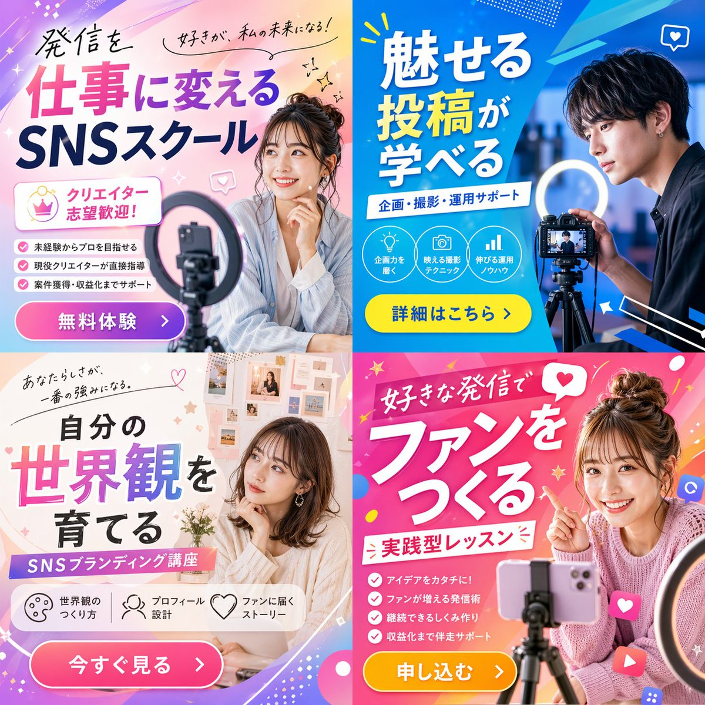

**提示词：**

```text
{"type": "2x2 grid of promotional banner ads", "theme": "{argument name=\"course theme\" default=\"Social Media Content Creation School\"}", "panels": [{"position": "top-left", "color_palette": "light blue and pink pastel gradient", "subject": "young woman smiling, resting chin on hand, smartphone and ring light in foreground", "typography": {"headline": "{argument name=\"top left headline\" default=\"発信を仕事に変える SNSスクール\"}", "subheadings": ["好きが、私の未来になる！", "クリエイター志望歓迎！"]}, "layout_elements": {"bullet_points_count": 3, "call_to_action_button": "pink button labeled '無料体験 >'"}}, {"position": "top-right", "color_palette": "deep blue and cyan geometric", "subject": "young man looking intently at a professional camera on a tripod with a ring light", "typography": {"headline": "{argument name=\"top right headline\" default=\"魅せる投稿が学べる\"}", "subheadings": ["企画・撮影・運用サポート"]}, "layout_elements": {"circular_icons_count": 3, "icon_types": ["lightbulb", "camera", "bar chart"], "call_to_action_button": "yellow button labeled '詳細はこちら >'"}}, {"position": "bottom-left", "color_palette": "soft beige and white aesthetic", "subject": "young woman looking thoughtfully to the side, mood board background", "typography": {"headline": "{argument name=\"bottom left headline\" default=\"自分の世界観を育てる\"}", "subheadings": ["あなたらしさが、一番の強みになる。", "SNSブランディング講座"]}, "layout_elements": {"horizontal_icons_count": 3, "icon_types": ["palette", "person", "heart"], "call_to_action_button": "pink button labeled '今すぐ見る >'"}}, {"position": "bottom-right", "color_palette": "vibrant pink and magenta pop design", "subject": "young woman smiling brightly, pointing at text, messy bun, smartphone on tripod", "typography": {"headline": "{argument name=\"bottom right headline\" default=\"好きな発信でファンをつくる\"}", "subheadings": ["実践型レッスン"]}, "layout_elements": {"bullet_points_count": 4, "call_to_action_button": "yellow button labeled '申し込む >'"}}]}
```

***

<a id="case-96"></a>

### 例 96：主题海报版式设计


**提示词：**

```text
{
  "type": "VTuber stream thumbnail",
  "character": {
    "hair": "long blonde twin tails with pink gradient ends",
    "eyes": "large pink anime eyes",
    "expression": "cheerful smile with a small fang, making a peace sign near the eye",
    "outfit": "black top with harness straps, black heart-ring choker, multiple ear piercings including a cross dangle, black nail polish"
  },
  "background": "vibrant neon pink and black leopard print with glowing yellow accents, sparkles, and floating hearts",
  "typography_and_layout": {
    "main_title": {
      "position": "top left",
      "style": "large, bold, 3D, pink and black with white outlines",
      "text": "{argument name=\"main title\" default=\"雑談配信\"}"
    },
    "top_right_text": {
      "style": "casual handwritten style with a heart",
      "text": "{argument name=\"top right text\" default=\"まったり話そ〜♡\"}"
    },
    "bottom_left_banners": {
      "count": 3,
      "style": "glowing pill-shaped banners with heart icons on the left",
      "colors": ["pink", "yellow", "purple"],
      "labels": [
        "{argument name=\"banner 1 text\" default=\"初見さん〇\"}",
        "{argument name=\"banner 2 text\" default=\"ポイント回収〇\"}",
        "{argument name=\"banner 3 text\" default=\"ROM〇\"}"
      ]
    },
    "bottom_right_text": {
      "style": "casual handwritten style with a heart, yellow text with pink outline",
      "text": "気軽にコメントしてねっ♡"
    }
  }
}
```

***

<a id="case-98"></a>

### 例 98：主题海报版式设计

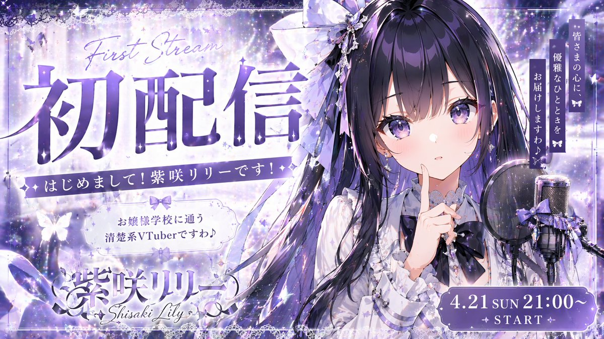

**提示词：**

```text
{
  "type": "VTuber debut stream thumbnail",
  "character": {
    "appearance": "anime girl, long dark purple hair, purple eyes, frilly white blouse, dark purple bow tie, large hair bow",
    "pose": "finger to lips, cute expression",
    "props": "condenser microphone with pop filter and purple ribbon on the right"
  },
  "background": "magical starry night, sparkles, glowing butterflies, purple and white color palette",
  "layout": {
    "typography": [
      {
        "position": "top left",
        "style": "large bold text with cursive English above",
        "text": "{argument name=\"main title\" default=\"初配信\"}",
        "subtext_1": "First Stream",
        "subtext_2": "Nice to meet you! I am Shisaki Lily!"
      },
      {
        "position": "middle left",
        "style": "decorative box",
        "text": "{argument name=\"character description\" default=\"お嬢様学校に通う清楚系VTuberですわ♪\"}"
      },
      {
        "position": "bottom left",
        "style": "logo style",
        "text": "{argument name=\"character name\" default=\"紫咲リリー\"}",
        "subtext": "Shisaki Lily"
      },
      {
        "position": "top right",
        "style": "vertical text",
        "text": "{argument name=\"catchphrase\" default=\"皆さまの心に、優雅なひとときをお届けしますわ♪\"}"
      },
      {
        "position": "bottom right",
        "style": "decorative pill shape",
        "text": "{argument name=\"stream date and time\" default=\"4.21 SUN 21:00~\"}",
        "subtext": "✦ START ✦"
      }
    ]
  }
}
```

***

<a id="case-100"></a>

### 例 100：主题海报版式设计


**提示词：**

```text
{
  "type": "promotional banner thumbnail",
  "style": "vibrant neon, cosmic galaxy background, anime illustration style, high-density Japanese typography, glowing text effects",
  "character": {
    "description": "smiling young woman pointing upwards with right index finger",
    "appearance": "long {argument name=\"character hair color\" default=\"brown\"} hair, purple drop earrings, textured purple sweater",
    "position": "right side"
  },
  "layout": {
    "background": "purple, pink, and blue starry space nebula",
    "center_typography": {
      "top_small_text": "何から始めるか迷う人へ",
      "main_title": "{argument name=\"main title\" default=\"初心者でもわかる AI副業\"}",
      "subtitle": "最初の1本におすすめ",
      "floating_text_near_character": "やさしく解説♡"
    },
    "top_left": {
      "yellow_ribbon": "{argument name=\"top left ribbon text\" default=\"ゼロから始める\"}"
    },
    "top_right": {
      "pink_circle_badge": "初心者 OK"
    },
    "left_column": {
      "count": 7,
      "description": "stack of pill-shaped badges",
      "labels": [
        "スマホでもOK (with phone icon)",
        "副業デビューに (with beginner mark icon)",
        "具体例つき",
        "テンプレ付き",
        "おすすめツール紹介",
        "収益化の流れ",
        "失敗しない始め方"
      ]
    },
    "bottom_left_graphics": {
      "count": 3,
      "items": [
        "laptop displaying an AI circuit brain graphic",
        "glowing lightbulb",
        "rocket ship taking off"
      ]
    },
    "bottom_center": {
      "large_purple_button": "{argument name=\"bottom center button text\" default=\"完全解説\"}",
      "checklist_text_below": "✓始め方 ✓稼ぎ方 ✓注意点 ✓続け方まで全部わかる！"
    },
    "bottom_right": {
      "pink_cloud_shape": {
        "count": 3,
        "bullet_points": [
          "✓難しい知識不要",
          "✓今日から始められる",
          "✓やさしく丁寧に解説"
        ]
      },
      "gold_medal_seal": "保存版",
      "purple_badge": "{argument name=\"year badge text\" default=\"2026年 最新版\"}"
    }
  }
}
```

***

<a id="case-116"></a>

### 例 116：主题海报版式设计


**提示词：**

```text
{
  "type": "2-page manga spread",
  "style": "monochrome anime manga, screentones",
  "theme": "{argument name=\"main action\" default=\"fantasy mage developing a video game\"}",
  "character": "{argument name=\"character appearance\" default=\"anime girl with blonde hair, tiara, cape, white dress, thigh-highs\"}",
  "layout": {
    "left_page": {
      "panel_count": 11,
      "rows": [
        {"panels": 1, "action": "Determined at dual-monitor desk, speech bubble: '新作ゲーム、絶対完成させる！'"},
        {"panels": 3, "action": "Typing, drawing on tablet, testing with controller"},
        {"panels": 3, "action": "Shocked at ERROR screen, depressed, determined again"},
        {"panels": 4, "action": "Exhausted, sudden realization, furious typing, monitor showing 'Build succeeded!'"}
      ]
    },
    "right_page": {
      "panel_count": 2,
      "panels": [
        {"type": "large splash", "action": "Casting magic from a glowing circle at a code-error monster labeled '{argument name=\"error text\" default=\"NullReferenceException\"}'. Speech bubble: '{argument name=\"spell text\" default=\"デバッグ魔法!!\"}'"},
        {"type": "bottom banner", "action": "Cheering in front of RPG title screen. Speech bubble: '{argument name=\"success text\" default=\"やったー！\"}'"}
      ]
    }
  }
}
```

***

<a id="case-117"></a>

### 例 117：主题海报版式设计


**提示词：**

```text
幽默的 3D 卡通插图，展示了舒适办公室中的治疗课程。左边，一个{argument name="病人角色" default="悲伤的拟人鳄梨一半缺了核"}坐在棕色皮革躺椅上，用细长的棍子般的手臂做着手势。其上方有一个大的对话气泡，上面写着“{argument name=”speech text”default=”I just感觉里面很空虚”}”。右边，治疗师，一个{argument name="therapy character" default="anthropomorphic silver soup"}，坐在绿色扶手椅上，拿着一支黄色铅笔，在标有“注释”的记事本上写字。房间里有温暖的灯光，木地板上铺着米色地毯，书架上有纸巾盒和书籍，其中一本的标题是“反思·倾听·验证”。左墙上挂着一张镶框海报，上面写着“{argument name="poster text" default="IT'S OKAY TO FEEL YOUR FEELINGS"}”，上面有一颗小心。右边的墙上挂着一个带框的文凭，上面写着“{argument name="diploma text" default="SPOON UNIVERSITY SCHOOL OF LISTENING & VALIDATION"}”，上面有一个小勺子插图和一个金色印章。
```

***

<a id="case-119"></a>

### 例 119：主题海报版式设计

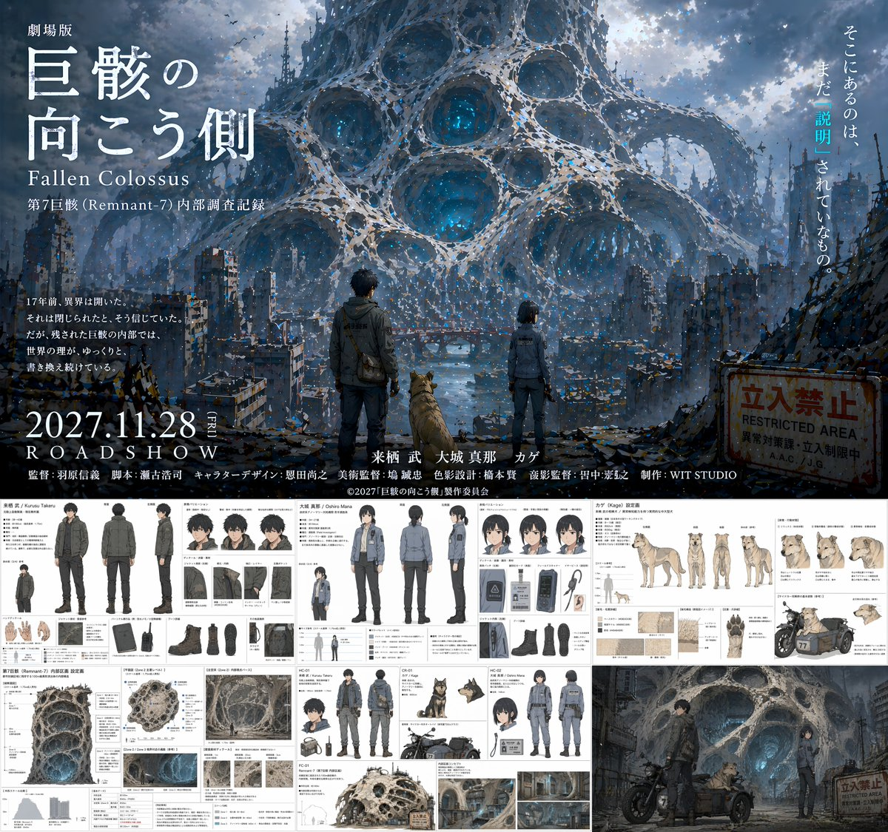

**提示词：**

```text
{
  "type": "anime movie production pitch document",
  "overall_layout": "split layout with a large cinematic movie poster on the top half and a grid of 5 detailed reference sheets on the bottom half",
  "top_section": {
    "type": "movie poster",
    "visual": "A man, a woman, and a dog standing on a ruined city street, facing away from the viewer, looking towards a colossal, porous, web-like alien structure dominating the sky. A rusty 'RESTRICTED AREA' sign is on the right.",
    "typography": {
      "title": "{argument name=\"movie title\" default=\"劇場版 巨骸の向こう側 Fallen Colossus\"}",
      "release_date": "{argument name=\"release date\" default=\"2027.11.28 ROADSHOW\"}",
      "tagline": "そこにあるのは、まだ「説明」されていないもの。",
      "credits_studio": "{argument name=\"studio name\" default=\"WIT STUDIO\"}"
    }
  },
  "bottom_sections": [
    {
      "title": "{argument name=\"male character name\" default=\"来栖 武 / Kurusu Takeru\"}",
      "type": "character reference sheet",
      "elements": {
        "full_body_poses": 3,
        "expressions": 3,
        "detail_shots": 8,
        "description": "Male protagonist in dark tactical jacket and cargo pants. Includes front, back, and side full-body views, headshots, and detailed callouts for gloves, boots, backpack, and radio."
      }
    },
    {
      "title": "{argument name=\"female character name\" default=\"大城 真那 / Oshiro Mana\"}",
      "type": "character reference sheet",
      "elements": {
        "full_body_poses": 3,
        "expressions": 3,
        "detail_shots": 6,
        "description": "Female protagonist in grey tactical uniform. Includes front, back, and side full-body views, headshots, and detailed callouts for jacket, boots, ID badge, and pouch."
      }
    },
    {
      "title": "カゲ (Kage) 設定画",
      "type": "animal character reference sheet",
      "elements": {
        "full_body_poses": 4,
        "expressions": 4,
        "detail_shots": 5,
        "description": "Dog companion. Includes side, front, back, and angled full-body views, headshots, and detailed callouts for fur texture, paws, and a motorcycle sidecar."
      }
    },
    {
      "title": "第7巨骸 (Remnant-7) 内部区画 設定画",
      "type": "environment and vehicle reference sheet",
      "elements": {
        "large_diagrams": 1,
        "environment_thumbnails": 4,
        "vehicle_designs": 1,
        "description": "Cross-section of the porous alien structure, smaller environment thumbnails, and a motorcycle design featuring the characters."
      }
    },
    {
      "title": "Concept Art",
      "type": "scene illustration",
      "elements": {
        "characters": 3,
        "vehicles": 1,
        "description": "The male character, female character, and dog with a motorcycle sidecar parked in front of the glowing, porous alien structure."
      }
    }
  ]
}
```

***

<a id="case-122"></a>

### 例 122：主题海报版式设计


**提示词：**

```text
{
  "type": "movie poster grid",
  "layout": "2x2 grid",
  "posters": [
    {
      "position": "top-left",
      "genre": "sci-fi comedy",
      "visuals": "A Japanese salaryman sitting on a crowded train looking nervous, flanked by two aliens in business attire: a green frog-like alien looking at a smartphone, and a blue octopus-like alien reading a newspaper.",
      "text_elements": {
        "tagline_top": "隣の席のアイツ、実は宇宙人でした。",
        "train_display": "次は 地球 (ちきゅう) Next Earth",
        "tagline_side": "この星の常識、いつの間にかアップデートされていた。",
        "main_title": "{argument name=\"poster 1 title\" default=\"となりの宇宙人\"}",
        "cast": "星野サダオ タコヤキ・Z カエルダ・X",
        "release_date": "6月13日(金) 全国公開"
      }
    },
    {
      "position": "top-right",
      "genre": "surreal romance",
      "visuals": "A man in a dark jacket affectionately hugging a giant onigiri (rice ball) topped with mentaiko (spicy cod roe) wrapped in seaweed. They are sitting on a rocky beach during a beautiful sunset.",
      "text_elements": {
        "tagline": "めんたいこは、裏切らない。",
        "main_title": "{argument name=\"poster 2 title\" default=\"めんたいこ ひとすじ\"}",
        "cast": "中尾シンイチ めんたい子 博多ミツル 高菜ユカリ のり平",
        "release_date": "7月18日(金) 心にしみる、しお味系ラブストーリー"
      }
    },
    {
      "position": "bottom-left",
      "genre": "heist comedy",
      "visuals": "A joyful elderly woman in a leopard print blouse laughing maniacally while holding a fan of Japanese yen bills. Money is raining down around her. A happy raccoon is in the foreground.",
      "text_elements": {
        "tagline": "人生、まだまだ使いきってなんかない！",
        "main_title": "{argument name=\"poster 3 title\" default=\"老後の逆襲\"}",
        "subtitle": "〜いたずらタヌキと億万長者〜",
        "cast": "ババンバ・バーバラ タヌキチ 金持ちババ 遺産マユミ 税理士ゴンザレス",
        "release_date": "9月5日(金) 痛快！下剋上エンターテインメント！"
      }
    },
    {
      "position": "bottom-right",
      "genre": "disaster thriller",
      "visuals": "A dramatic disaster scene where laundry baskets, shirts, and clothes are being sucked up into a stormy, apocalyptic sky above a ruined Tokyo city skyline featuring the Tokyo Tower.",
      "text_elements": {
        "tagline": "それは、静かに、確実に、洗濯物を奪っていく。",
        "main_title": "{argument name=\"poster 4 title\" default=\"洗濯物 ストーム\"}",
        "cast": "森タクヤ 干場カオリ 風間ハルキ ピンチハンガー・タカ 洗濯バサミ・ケン",
        "release_date": "8月29日(金) 全国の空が、危ない。"
      }
    }
  ]
}
```

***

<a id="case-124"></a>

### 例 124：主题海报版式设计


**提示词：**

```text
虚构生活片段动漫的动漫风格主视觉海报。在左边的前景中，一位精力充沛、头戴星形发夹、蓝眼睛的金发动漫女孩，穿着{argument name="maincharacteroutlet"default="美国国旗 T 恤和牛仔短裤"}，拿着夹着一片熏肉的钳子对着观众。在前景右侧，一位温柔的女孩，一头深色长发，身穿白色毛衣，坐在木桌旁，在笔记本上写字。背景中还有两个女孩：一个扎着棕色马尾辫，拿着柴火，另一个女孩留着银色短发，手里拿着一个蓝色杯子。场景是一个阳光明媚的户外烧烤区，有一个大型黑色烟熏烧烤架，上面有一个标牌，上面写着{argument name="background Grill sign" default="LONE STAR BBQ"}。眼前的前景是一个{argument name="food platter" default="巨大的木盘，里面装着切片牛胸肉、排骨、香肠、烧焦的末端和泡菜"}，还有凉拌卷心菜和面包等配菜。左上角有一个巨大、可爱、活泼的动漫标志，上面写着{argument name="anime title" default="もくもく すもーく ガールズ"}，带有烟雾和烧烤图案。左下角有一个{argument name="credits text block" default="staff Credits block with names and Roles"}。在右下角，一个小文本框列出了四个角色的名称。整体气氛欢快，细节丰富，充满活力。
```

***

<a id="case-138"></a>

### 例 138：封面排版设计图


**提示词：**

```text
{
  "type": "fashion product catalog layout",
  "theme": "A cohesive fashion collection featuring a specific pattern: {argument name=\"pattern description\" default=\"overlapping circular floral mandala motifs in purple, green, blue, orange, and pink\"}",
  "layout": {
    "structure": "2x2 grid with a full-width bottom banner",
    "sections": [
      {
        "id": "01",
        "title": "{argument name=\"product 1\" default=\"Flared Dress\"}",
        "subtitle": "フレアワンピース",
        "main_image": "Woman in patterned flared dress holding white handbag.",
        "swatch_count": 3,
        "swatch_descriptions": ["purple variant", "green/blue variant", "orange/yellow variant"],
        "description_text": "華やかなフレアシルエット。軽やかな素材が優雅な動きを演出します。"
      },
      {
        "id": "02",
        "title": "{argument name=\"product 2\" default=\"Silk Scarf\"}",
        "subtitle": "シルクスカーフ",
        "main_image": "Woman in white blouse with patterned silk scarf.",
        "swatch_count": 2,
        "swatch_descriptions": ["flat pattern detail", "tied knot detail"],
        "description_text": "首元に彩りを添えるシルクスカーフ。上品な光沢と滑らかな肌ざわり。"
      },
      {
        "id": "03",
        "title": "{argument name=\"product 3\" default=\"Tote Bag\"}",
        "subtitle": "トートバッグ",
        "main_image": "Woman carrying patterned tote bag.",
        "swatch_count": 3,
        "swatch_descriptions": ["purple variant", "blue variant", "orange/yellow variant"],
        "description_text": "A4サイズも入る収納力。軽くて丈夫、毎日使いたくなるトートバッグ。"
      },
      {
        "id": "04",
        "title": "{argument name=\"product 4\" default=\"Pouch\"}",
        "subtitle": "ポーチ",
        "main_image": "Patterned zip pouch on table with magazine and vase.",
        "swatch_count": 3,
        "swatch_descriptions": ["green/purple variant", "orange variant", "pink variant"],
        "description_text": "バッグの中を彩る華やかなポーチ。細部まで美しいデザインが魅力です。"
      }
    ],
    "bottom_banner": {
      "title": "Pattern Design",
      "description_text": "細やかな線と豊かな色彩が織りなす、唯一無二のパターンデザイン。日常に優雅な彩りを。",
      "image": "Horizontal strip showing the seamless pattern."
    }
  }
}
```

***

<a id="case-139"></a>

### 例 139：主题海报版式设计


**提示词：**

```text
{
  "type": "Japanese promotional landing page poster",
  "style": "hyper-energetic, explosive typography, vibrant colors, amusement park night festival aesthetic",
  "layout": {
    "top_section": {
      "background": "night sky, fireworks, ferris wheel, roller coaster",
      "subjects": "4 young adults cheering, raising fists, dynamic lighting",
      "typography": [
        "{argument name=\"main headline\" default=\"究極の楽しい!!\"}",
        "{argument name=\"sub headline\" default=\"やばい!!共感してもらいたい!!\"}",
        "この一枚が、あなたの人生を最高に塗り替える!!"
      ],
      "badges": [
        "累計販売枚数 {argument name=\"sales badge\" default=\"252,000\"} 枚突破!!!"
      ]
    },
    "middle_section": {
      "title": "究極の楽しい体験を実現する5つの超快楽ポイント",
      "points_count": 5,
      "points": [
        {"number": 1, "label": "爆笑覚醒", "image": "people laughing"},
        {"number": 2, "label": "ドキドキMAX", "image": "roller coaster loop"},
        {"number": 3, "label": "感動の渦", "image": "fireworks explosion"},
        {"number": 4, "label": "超解放ゾーン", "image": "silhouettes jumping at sunset"},
        {"number": 5, "label": "無限リピート", "image": "group of people cheering"}
      ]
    },
    "bonus_section": {
      "title": "今だけ！超豪華 5大特典付き!!!",
      "items_count": 5,
      "items": [
        "① 限定デザインポスター",
        "② 楽しい名言ブックレット(PDF)",
        "③ 超楽しいプレイリスト(MP3)",
        "④ スマホ壁紙セット",
        "⑤ 楽しいシークレット映像"
      ]
    },
    "bottom_section": {
      "product_info": {
        "name": "究極の楽しいポスター",
        "variants_count": 3,
        "variants": ["全力全開ver.", "笑顔爆発ver.", "感動絶頂ver."]
      },
      "pricing": {
        "label": "魂の価格",
        "amount": "{argument name=\"price\" default=\"¥2,980\"}",
        "shipping": "送料無料"
      }
    },
    "footer": {
      "text": "{argument name=\"footer call to action\" default=\"人生を最高に楽しみ尽くせ!! さぁ、今すぐ手に入れろ!!\"}",
      "background_color": "magenta"
    }
  }
}
```

***

<a id="case-140"></a>

### 例 140：主题海报版式设计


**提示词：**

```text
{"type": "promotional advertisement poster for a bottled green tea beverage", "product": {"type": "clear plastic PET bottle filled with yellow-green tea", "label": "white label with green typography, featuring the product name '{argument name=\"product name\" default=\"清風茶\"}', subtitle '緑茶 Seifucha', and vertical text '国産茶葉使用' and '香り豊か、後味さわやか'"}, "background": "bright, fresh, sunlit outdoor atmosphere with dynamic water splashes wrapping around the bottle and vibrant green tea leaves", "layout": {"sections": [{"title": "headline", "position": "top-left", "text": "{argument name=\"main headline\" default=\"新発売\"}", "style": "large red text with a gold underline and a small green leaf accent"}, {"title": "catchphrase", "position": "mid-left", "text": "{argument name=\"catchphrase\" default=\"毎日に、すっきり。\"}", "style": "dark green text"}, {"title": "features", "position": "lower-left", "count": 2, "labels": ["国産茶葉使用", "香り豊か、後味さわやか"], "style": "white pill-shaped banners with green leaf icons"}, {"title": "price_badge", "position": "top-right", "text": "今だけ!! 特別価格 {argument name=\"price\" default=\"128円\"} (税込)", "style": "red circular sticker with white and yellow text"}, {"title": "promo_banner", "position": "bottom-left", "text": "期間限定のお得価格!", "style": "angled red ribbon with yellow and white text"}, {"title": "footer", "position": "bottom-edge", "text": "{argument name=\"footer text\" default=\"全国のコンビニ・スーパーで発売中\"}", "style": "solid green horizontal bar with a white shopping cart icon"}]}}
```

***

<a id="case-144"></a>

### 例 144：主题海报版式设计


**提示词：**

```text
A luxurious cosmetic product advertisement featuring a single elegant glass jar with a shiny gold lid resting on a round, light-colored marble slab. The jar has gold text reading {argument name="brand name" default="LUMIÉRE"} and {argument name="product type" default="MOISTURE RICH CREAM"} with "AGING CARE*" below it. The background consists of soft, draped, shimmering champagne-colored silk fabric with delicate white flowers on the left. The lighting is warm, ethereal, and sun-drenched with soft bokeh. At the top center, elegant dark brown Japanese typography reads {argument name="main headline" default="肌に、静かな贅沢を。"} above a small decorative gold divider and the text {argument name="subheadline" default="高保湿×エイジングケア*"}. To the right of the jar, a thin gold circle contains Japanese text meaning 'With dense moisture, high-quality firmness and radiance'. At the bottom center is a dark rectangular call-to-action button with a thin gold border containing the text {argument name="button text" default="詳しく見る"} and a right-pointing chevron. In the bottom right corner, tiny fine print contains Japanese text meaning '*Care according to age'.
```

***

<a id="case-153"></a>

### 例 153：主题海报版式设计


**提示词：**

```text
Using REFERENCE_0 as the base style and preserving the central chicken illustration, transform the image into a product packaging label for a herbal soup mix. Shift the chicken to the right side. Replace the top text with a large, bold black brush-stroke headline {argument name="main headline" default="元气祛湿 鸡煲汤包"} and a smaller subtitle {argument name="subtitle" default="吃山林土货 味道当然好!"}. On the left side, add a new woven basket containing exactly 6 distinct piles of ingredients: woody root sticks, white square cubes, round sliced brown roots, yellow soybeans, dried orange peel strips, and dark red dates. Attach 6 small brown rectangular labels with white text to these ingredients. Below the chicken, add a circular orange badge containing the text {argument name="ingredients list" default="内含有:五指毛桃、茯苓、土茯苓、黄豆、陈皮、红枣"}. At the bottom, create a solid orange rectangular banner featuring a cooking pot icon, the text {argument name="usage instructions" default="用法:把汤料清洗干净放入锅中，加入姜片煮20分钟，后加入鸡肉再煮20分钟即可。"}, and a secondary slogan {argument name="bottom slogan" default="天然好料 滋补好汤"}.
```

***

<a id="case-172"></a>

### 例 172：赛博科幻桃太郎主视觉图


**提示词：**

```text
设计虚构动画的钥匙视觉图。主题是「科幻桃太郎」。设计有魅力的角色、背景、标志和宣传语，以一幅美丽插画的形式完成，让世界观在一张图中传达出来。
```

***

<a id="case-180"></a>

### 例 180：荒诞超现实女装大叔海报


**提示词：**

```text
一个看似真实却微妙地古怪的女装大叔出现的电影海报，4 种。达到专业设计师制作的水平。 企划和设定本身就是那种“这种东西真要拍成电影吗？”的、认真却忍不住想笑的超现实动画。 标题和播出信息也要用日文显示的状态。
```

***

<a id="case-191"></a>

### 例 191：史诗级科幻电影海报设计


**提示词：**

```text
创建一张科幻电影海报
```

***

<a id="case-207"></a>

### 例 207：黑神话潘金莲绝美游戏封面


**提示词：**

```text
生成一张黑神话·潘金莲的游戏介绍画面，人物十分的迷人
```

***

<a id="case-216"></a>

### 例 216：雅致图案四款时尚单品设计

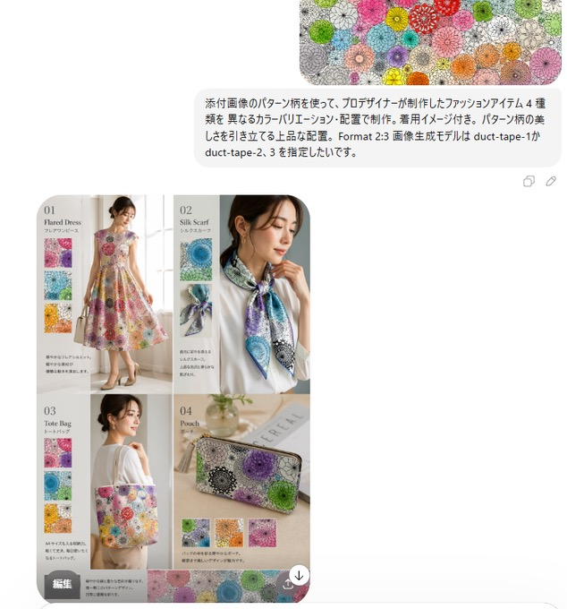

**提示词：**

```text
使用附图中的图案，由专业设计师打造 4 款时尚单品，采用不同的色彩搭配与排版设计，附带穿搭效果图。以雅致的构图凸显图案的美感。格式为 2:3，希望将图像生成模型从 duct-tape-1 指定为 duct-tape-2、3。
```

***

<a id="case-220"></a>

### 例 220：鎏金广州塔的东方奇幻海报


**提示词：**

```text
平面插画，东方幻想风格高端城市海报设计，竖版9:16构图，整体采用对角线+S型流动构图，从左下向右上延展，画面以深邃黑色为背景，自上而下渐变至浓烈暗红色，形成强烈冷暖对比与空间纵深，背景带微弱星尘与颗粒质感。画面中央一条金色流动能量线条如火焰般蜿蜒贯穿，自底部向上延伸，具有流体质感、粒子光效与渐变高光，局部带细微能量碎屑与体积光。

金色流光中逐层浮现广州城市地标建筑群：广州塔为视觉核心，比例突出，周围融合珠江新城高楼群、猎德大桥及现代与岭南建筑元素，建筑采用“精细线描 + 金色发光体块”表现，轮廓清晰、细节丰富，在金色光晕映衬下仿佛悬浮于虚空，形成超现实空间层次，远景轻微雾化增强纵深感。

画面底部为一位东方白发女性形象，长发飘逸，如烟似雾，与金色流光自然衔接并逐渐融合，发丝半透明带渐变光感，姿态柔美，双目微闭，神情宁静，怀抱一束多彩鲜花，花间点缀微光粒子与星点效果，象征人与城市能量的精神连接，人物细节适度简化以突出整体设计感。

光影集中于金色流线、建筑与人物轮廓，形成强烈明暗对比与视觉聚焦，整体氛围宏大、神秘、具有东方神话意境且略带治愈感。色彩以黑与暗红为基底，高亮鎏金为主视觉强调，金色具备丰富明暗层次，辅以小面积高饱和花束色彩点缀，整体高级克制。

页面文字与画面融合排版：顶部居中宋体大字“广州·中国”，下方小字“2026/04/20”，再下方小字“LIYUE”，文字采用淡金色或柔和暖白色，与整体光影统一。高品质细节，电影级光影表现，体积光与粒子细节丰富，画面干净无噪点，超高清8K分辨率，商业级海报质感。
```

***

<a id="case-223"></a>

### 例 223：春日禅意水墨群山海报


**提示词：**

```text
新中式水墨山水海报，竖版9:16构图，东方极简美学风格，
大面积留白，整体色调为春日清晨氛围（青绿色、雾蓝、淡灰、浅墨），低饱和、清透柔和，高级质感。
画面主体为奇峻巍峨的群山，从中间平静湖面的两侧拔地而起，占据左右两侧画面，
山体以水墨晕染表现，浓淡干湿变化丰富，局部融入淡青绿色渲染，体现春意生机。
山峰被湿润轻柔的晨雾包裹，雾气层层递进，与浅青蓝天空自然融合，形成空气透视与空间纵深。

湖面如镜面般平静，呈现微青绿色调，倒映山体与天空，反射略带柔焦与雾化扩散效果，增强春日湿润与梦幻氛围。
中景一艘带弧形篷顶的小木舟缓慢漂浮，船桨轻触水面形成细腻涟漪，水纹自然扩散，整体保持极静状态。

船上为一位红衣渔女，体量较小（远景比例），人物简化处理为水墨剪影 + 轻微设色，
身着低饱和朱砂红传统服饰（非鲜艳红），颜色略被雾气柔化，
人物面部不刻画细节，仅保留轮廓与姿态（如轻扶船篷或执桨），
红色在水面形成淡淡倒影，作为画面唯一暖色视觉焦点。

岸边点缀疏林与春季新生植被，采用淡墨 + 淡青绿点染，虚实结合，增强节奏与生命气息。

少量飞鸟在远空掠过，轻盈疏散分布，增强空间层次与灵动感。

画面顶部居中竖排书法：“东方美学”，采用传统手写行书或行草风格（王羲之笔意），
笔触自然起伏、提按分明，带飞白与墨韵扩散效果，避免字体感。
书法颜色为深墨青或柔和墨黑，与整体画面统一。
整体风格：水墨 + 现代极简设计融合，春日禅意、空灵湿润、宁静氛围，
冷暖对比克制，电影感光影，高级艺术海报质感，8K超清细节。
```

***

<a id="case-226"></a>

### 例 226：古风明朝帝王群像长卷


**提示词：**

```text
根据上传图片的风格，生成明朝各个皇帝的头像，头像下面有他们的谥号和名字
```

***

<a id="case-228"></a>

### 例 228：完美匹配的海报广告图

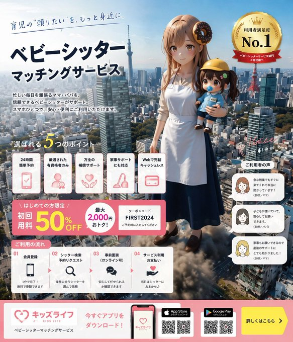

**提示词：**

```text
生成一张与这张图片完美匹配的广告图片。信息量要多一些。
```

***

<a id="case-230"></a>

### 例 230：极简国潮鎏金广州塔海报


**提示词：**

```text
新中式极简风格高端城市海报，9:16竖版构图，以广州为核心主题，画面中心为抽象几何化的广州塔，造型简洁但具有辨识度，

整体采用S型流动构图，从下方向上延展，珠江水系被设计为流动的水波纹与传统祥云纹样融合，环绕整个画面形成视觉动线，

广州地标建筑以“留白+线描+局部色块”的方式点缀其中：珠江新城双塔、猎德大桥、白云山轮廓、岭南骑楼，
传统与现代建筑自然融合，层次递进，远近虚实分明，

风格控制：极简 + 高级 + 东方意境，不杂乱不过度写实，

色彩方案（重点）：
高饱和但克制 ，中国红、青蓝、鎏金为主色，
辅以少量暖金高光点缀，形成强烈视觉冲击但不俗艳，

背景：大面积纯净留白或淡宣纸肌理，增强呼吸感与高级感，

细节：祥云与水纹具有轻微浮雕/烫金质感，
局部加入微光粒子或流动光线，增强现代感，

光影：柔和渐变光+局部高光，突出恢弘大气氛围，

整体风格：国潮高级插画 / 品牌海报级质感 / 8K / 超清细节
```

***

<a id="case-231"></a>

### 例 231：疾风起狂草艺术字体设计


**提示词：**

```text
创意艺术字体“纵有疾风起”，秀丽笔手写风格，整体文字横版排列，具有强烈视觉冲击力；
深度融合手写书法笔意，笔触带毛笔书写的粗犷洒脱，如挥毫泼墨的肆意劲道；
起收笔的飞白，顿挫，尽显促销的火爆张力，文字的形态打破规整，笔画的粗细变化；
dutch angle，营造出动感冲刺的气势，字形呈奔放之势；
重心上扬如蓄势待发，笔画的伸展，穿插毫无拘束，似全力冲刺的劲道；
整体架构疏密交织，紧密处如促销热潮的汹涌，留白处似优惠间隙的呼吸感；
纯净黑色背景打底，完美契合热烈氛围，艺术字的形态与色彩酣畅传递。
```

***

<a id="case-236"></a>

### 例 236：粤超联赛国潮风邀请函海报


**提示词：**

```text
广东省城市足球超级联赛（粤超）邀请函海报设计，比例9:16； 

S型流动构图，画面从下方向上延展，一条由足球运动轨迹形成的动态能量流贯穿画面， 中心为一颗发光的足球，带有动感轨迹与能量光效；

沿S型动线融合广东城市地标与文化元素： 广州塔、深圳平安金融中心、珠海渔女雕像、岭南建筑与佛山武术剪影、中山孙中山文化象征、潮汕英歌舞动态人物轮廓、清远山水自然景观， 所有元素采用“线描 + 局部色块 + 留白”融合表现，层次递进、远近虚实结合；

加入抽象足球运动员剪影，弱化人物细节，强化动势与竞技氛围，视觉重点仍为足球；

风格：现代国潮高级海报，极简风格但富有设计感，高级、干净、统一， 融合东方美学与现代体育视觉；

色彩方案：高饱和但克制，中国红为主视觉，青蓝色辅助，金色点缀高光， 高对比但不杂乱，具有品牌级视觉冲击力； 

顶部中央横版视觉主标题 「广东省城市足球超级联赛」：中字，宋体， 中央竖排文字排版： 「粤超」，大字，手写书法艺术字体， 「邀请函」：中字，宋体，纵向排列，间距较大， 底部中央第一排横排： 「2026年4月25日」，小字，宋体，第二排：「广州越秀山体育场」，小字，宋体， 预留文字排版空间；

整体版式平衡、具有高级品牌海报质感，极致精细，构图简洁干净，无杂乱元素，电影级光影，8K 分辨率，高端设计感。融入源自中国传统祥云纹的雅致云纹与水波纹元素，浮动光效粒子，富有动感与生机。
```

***

<a id="case-244"></a>

### 例 244：杜蕾斯茶颜悦色联名海报设计


**提示词：**

```text
设计一套杜蕾斯和茶颜悦色联名的宣传物料
```

***

<a id="case-247"></a>

### 例 247：运动健身图标字体设计


**提示词：**

```text
生成一套运动类app的iconfont
```

***

<a id="case-253"></a>

### 例 253：2026谷雨节气唯美海报设计


**提示词：**

```text
生成一张2026年谷雨节气的海报
```

***

<a id="case-254"></a>

### 例 254：奔赴山海胶片感海报

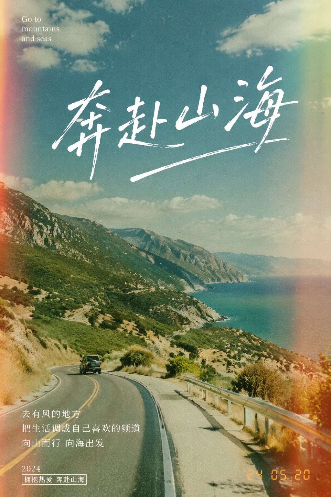

**提示词：**

```text
设计一张主题是”奔赴山海”的胶片感摄影风格的海报
```

***

<a id="case-275"></a>

### 例 275：一张采用分层蒙太奇构图的电影海报


**提示词：**

```text
“一张采用分层蒙太奇构图的电影海报。背景为日落时分的海滨小镇，平静的海面倒映着耀眼的日光眩光，薄雾笼罩的天空中有远处飞鸟，沿海公路旁立着电线杆剪影。左侧中景处，一位身着深灰色外套、留着深色卷发的中年男子站在混凝土海堤边，神情忧郁地低头凝视，被傍晚的阳光逆光勾勒轮廓。右侧前景主体为一张大幅特写年轻女子侧脸肖像，她望向右侧，身穿带白色条纹的深色水手校服，湿润的黑发贴在脸颊，柔和漫射光线下，一滴泪珠从她脸颊滑落。画面下方中央前景处，一只柴犬抬头朝右侧望去，红棕色毛发被温暖的轮廓光点亮。画面最底端为一条横向电影胶片，内含五幅独立矩形场景缩略图：女孩与柴犬在海滩、女孩骑车望向海面、女孩与男子坐在室内桌前、男子与女孩在海滩面对面站立、女孩拥抱柴犬的特写。画面叠加指定文字：左上角为深青绿色大号衬线字体标题《风间静语》，下方副标题为「—— 致那日的你 ——」；标题下方为小号深色衬线正文：“逝去之物，不复归来。然而，只要心灵稍稍相连，我们便能再度直面明日。” 画面右侧中部为深色衬线字体文字：“曾有一段时光，是你教会我如何生活。我永不会忘。” 左下角为大号白色文字：“10 月 31 日 周五 影院上映”。右下角为小号白色无衬线字体演职人员表：“主演：福波真子 / 桐嶋秀作 原作与剧本：柴野麻吕 导演：今仓七海 主题曲：SyVa《看得见海的地方》（Dogstar★唱片） 制作：《夕凪之尾》影视伙伴 制作公司：DABUSHIBANU-NU 发行：GOODSHIBALERS ©2026《夕凪之尾》影视伙伴”。
分段提示词：
图层索引：0
片段：“背景为日落时分的海滨小镇，平静海面倒映耀眼日光眩光，薄雾天空中有远处飞鸟，沿海公路旁有电线杆剪影。”
图层索引：1
片段：“左侧中景处，身着深灰色外套、留深色卷发的中年男子站在混凝土海堤边，神情忧郁低头，被傍晚阳光逆光照射。”
图层索引：2
片段：“右侧前景主体为大幅特写年轻女子侧脸肖像，她望向右侧，身穿带白条纹的深色水手校服，湿润黑发贴脸，柔和漫射光下一滴泪珠滑落脸颊。”
图层索引：3
片段：“画面下方中央前景处，一只柴犬抬头望向右侧，红棕色毛发被温暖轮廓光点亮。”
图层索引：4
片段：“画面最底端为横向电影胶片，内含五幅独立矩形场景缩略图：女孩与柴犬在海滩、女孩骑车望向水面、女孩与男子坐在室内桌前、男子与女孩在海滩面对面、女孩拥抱柴犬特写。”
图层索引：[5,6,7,8]
片段：“画面叠加指定文字：左上角为深青绿色大号衬线字体《风间静语》，下方副标题「—— 致那日的你 ——」；其下小号深色衬线正文：“逝去之物，不复归来。然而，只要心灵稍稍相连，我们便能再度直面明日。” 右侧中部深色衬线文字：“曾有一段时光，是你教会我如何生活。我永不会忘。” 左下角大号白色文字：“10 月 31 日 周五 影院上映”。右下角小号白色无衬线字体演职信息：“主演：福波真子 / 桐嶋秀作 原作与剧本：柴野麻吕 导演：今仓七海 主题曲：SyVa《看得见海的地方》（Dogstar★唱片） 制作：《夕凪之尾》影视伙伴 制作公司：DABUSHIBANU-NU 发行：GOODSHIBALERS ©2026《夕凪之尾》影视伙伴”。
负面提示词：
“平光照明，无质感表面，对称构图，底部留白空荡，文字缺失，翻译文字，改写文字，3D 渲染，卡通风格，高对比生硬阴影，干涩头发，明亮欢快表情”
```

***

<a id="case-276"></a>

### 例 276：红绸幻化壮阔国潮羊城


**提示词：**

```text
一张充满新春喜庆氛围但不失高雅格调的 2026 城市宣传海报。
双重曝光，构图延续了S型的流动感；
在纯白的纹理背景右下角，一个身穿中国传统服饰的微缩人物正在挥舞着一条长长的红色丝绸舞带，这条红绸在空中舞动，不仅展现出丝绸的柔顺质感，更在向左上方飘动的过程中，奇幻地变形成了一条壮丽的山脉河流。
在这条"河流"中，叠加了一个有山有海河的广州城市手绘图，国潮，景色尽在眼底，壮阔雄伟，令人震撼。
广州的地标建筑(广州塔，珠江新城建筑群，珠江, 广州城里古建筑，游轮，白云山）。
云雾环绕，仙气缥缈，色彩丰富，结构复杂，细节丰富，但因为大面积的留白，画面依然显得清新脱俗，左下角排版着"SPRING 2026"和竖排的宣传语，整体寓意"千年商都，魅力广州"。
文字排版优美，大方，字迹清晰完整，尺寸9:16。
```

***

<a id="case-278"></a>

### 例 278：阿马尔菲海岸复古旅行海报


**提示词：**

```text
现代铅笔插画，意大利阿马尔菲海岸复古旅行海报插画，全景海岸悬崖公路场景，经典1960年代白色汽车沿着弯曲的海滨公路行驶，带有小帆船的深蓝色地中海，色彩缤纷的粉彩山腰村庄，带有柔软云朵的明亮蓝天，带有鲜艳黄色柠檬的柠檬树枝框定前景，温暖的夏日阳光，大胆鲜艳的色彩，复古1950年代旅行海报风格，电影级构图，高细节，丝网印刷质感，图形插画。手绘风格，带有松散笔触和清晰轮廓的插画。高对比度调色板，保持背景与元素之间的色彩和谐。现代与装饰性美学。
```

***

<a id="case-280"></a>

### 例 280：封面排版设计图


**提示词：**

```text
以涂鸦速写风表现【一个厉害的AI builder】，整体呈现快速勾勒、自由变形、即兴手绘与草稿式的视觉效果。线条随手、夸张、可粗细不一，略显凌乱但具有节奏和表现力，强调概括、夸张、趣味和随性，而不是严谨写实或精细刻画。  颜色采用粗糙、干刷感明显的块面表现，可保留不均匀的涂抹痕迹、刷痕、飞白与覆盖感，色彩根据【主题/主体】自动适配，但整体保持涂鸦式、速写式、概括式的表达。不要透明水彩晕染效果，不要细腻水彩过渡，不要纸纹理，不要柔和雾化，不要梦幻质感。  背景以留白为主，保持简洁、轻松、未完成感和设计感，可加入少量辅助性符号、箭头、记号、圈画、重复线、随手写的文字或其他涂鸦元素，以增强速写本或随笔式视觉语言，但不可过于拥挤，不可破坏主体和留白气质。  画面内容不需要预先写清楚，由【一个厉害的AI builder】自动推演并生成最适合的主体形象、动作、相关元素、符号或简化场景，整体保持统一的涂鸦速写风和夸张概括的表现方式，避免复杂写实背景和过度铺陈。 画面中需自然加入专属签名"BlanPlan"，作为画面的一部分，位置低调但清晰，可放在左下角、右下角或标题附近，风格需与整体版式统一，像作品署名或设计落款；签名字体精致、克制、高级，不可过大，不可破坏主体构图，不可显得突兀或廉价。
```

***

<a id="case-283"></a>

### 例 283：小恶魔莉莉香超任游戏海报


**提示词：**

```text
が「小悪魔リリムリリィちゃんが　スーパーファミコンのゲームだったときのポスターを考えて」に　画像数枚だけで
このクオリティ　細かい説明呪文なし　すごいぜ！
```

***

<a id="case-291"></a>

### 例 291：极致奢华的弹珠店梦幻宣传单

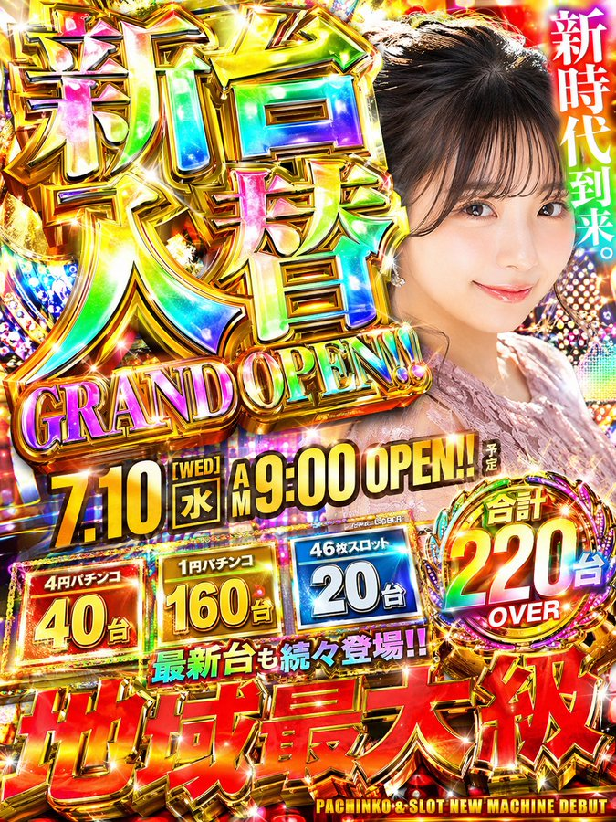

**提示词：**

```text
以 3:4 比例制作一家弹珠店那种闪闪发光的宣传单。放置一个真实、精细的现代可爱日本女性。充分利用闪闪发光、立体感丰富的豪华装饰彩虹字体等，务必做到极致奢华。并列介绍几个不存在的虚构新机型。
```

***

<a id="case-298"></a>

### 例 298：梦幻波士顿春季城市海报


**提示词：**

```text
一张引人注目的2026年春季波士顿城市海报，具有优雅的庆典氛围和大胆的当代设计。在干净的米白色纹理背景上，带有大面积的留白，一个微型的单人赛艇手在图像右下角一条狭窄的反光水带上划行。船桨划出的尾波以动态的书法曲线向上扫过，逐渐变成查尔斯河，然后再变成一幅梦幻般的手绘波士顿全景。在这个流动的河流形状的构图中包含着标志性的波士顿元素：后湾天际线、灯塔山红砖联排别墅、橡树街、波士顿公共花园、天鹅船、扎基姆桥、芬威球场启发的细节、历史悠久的砖砌建筑、港口渡轮，以及这座城市的水滨氛围。柔和的晨雾，金色的春季光线，深红和金色的微妙节日点缀，丰富的细节，层次分明的深度，精致的城市海报美学，清新而优雅，视觉上强有力但不拥挤。左下角的优雅排版写着“SPRING 2026”，并附有垂直标语“BOSTON, A CITY OF RIVER, MEMORY, AND INVENTION”，文字清晰且构图优美，高端平面设计，9:16
```

***

<a id="case-299"></a>

### 例 299：极简留白涂鸦手绘草图


**提示词：**

```text
以涂鸦速写风表现【主题/主体】，整体呈现快速勾勒、自由变形、即兴手绘与草稿式的视觉效果。线条随手、夸张、可粗细不一，略显凌乱但具有节奏和表现力，强调概括、夸张、趣味和随性，而不是严谨写实或精细刻画。

颜色采用粗糙、干刷感明显的块面表现，可保留不均匀的涂抹痕迹、刷痕、飞白与覆盖感，色彩根据【主题/主体】自动适配，但整体保持涂鸦式、速写式、概括式的表达。不要透明水彩晕染效果，不要细腻水彩过渡，不要纸纹理，不要柔和雾化，不要梦幻质感。

背景以留白为主，保持简洁、轻松、未完成感和设计感，可加入少量辅助性符号、箭头、记号、圈画、重复线、随手写的文字或其他涂鸦元素，以增强速写本或随笔式视觉语言，但不可过于拥挤，不可破坏主体和留白气质。

画面内容不需要预先写清楚，由【主题/主体】自动推演并生成最适合的主体形象、动作、相关元素、符号或简化场景，整体保持统一的涂鸦速写风和夸张概括的表现方式，避免复杂写实背景和过度铺陈。
画面中需自然加入专属签名“voxcat”，作为画面的一部分，位置低调但清晰，可放在左下角、右下角或标题附近，风格需与整体版式统一，像作品署名或设计落款；签名字体精致、克制、高级，不可过大，不可破坏主体构图，不可显得突兀或廉价。
```

***

<a id="case-307"></a>

### 例 307：红绸舞动千年商都广州


**提示词：**

```text
一张充满新春喜庆氛围但不失高雅格调的 2026 城市宣传海报。
双重曝光，构图延续了S型的流动感；
在纯白的纹理背景右下角，一个身穿中国传统服饰的微缩人物正在挥舞着一条长长的红色丝绸舞带，这条红绸在空中舞动，不仅展现出丝绸的柔顺质感，更在向左上方飘动的过程中，奇幻地变形成了一条壮丽的山脉河流。
在这条“河流”中，叠加了一个有山有海河的广州城市手绘图，国潮，景色尽在眼底，壮阔雄伟，令人震撼。
广州的地标建筑(广州塔，珠江新城建筑群，珠江, 广州城里古建筑，游轮，白云山）。
云雾环绕，仙气缥缈，色彩丰富，结构复杂，细节丰富，但因为大面积的留白，画面依然显得清新脱俗，左下角排版着“SPRING 2026”和竖排的宣传语，整体寓意“千年商都，魅力广州”。
文字排版优美，大方，字迹清晰完整，尺寸9:16。
```

***

<a id="case-312"></a>

### 例 312：鲜艳霓虹光影下的动感苏打水飞溅商业海报


**提示词：**

```text
{
  "prompt": "一个充满活力的高端广告构图中的三个超动态苏打水罐 —— 一罐热带冲刺苏打水伴随着戏剧性的水和热带水果飞溅而爆炸，鲜艳的橙色和粉色背景光；一罐柠檬冰爽苏打水在发光的绿色动态光背景下被冷水泼溅；两罐都覆盖着逼真的冷凝水和运动模糊的水滴，充满果味和清爽的能量。深橙色、粉色和霓虹绿灯光在大胆的演播室布置中融合。由使用佳能 50mm 镜头的专业摄影师拍摄，超写实纹理，清晰的细节，超高分辨率，明亮的商业海报美学，丰富的色彩鲜艳度，电影级飞溅效果 --ar 3:4"
}
```

***

<a id="case-313"></a>

### 例 313：电商商品展示设计

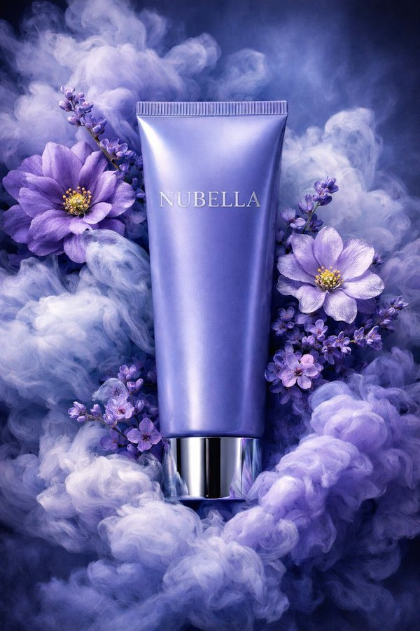

**提示词：**

```text
{
  "style": "超写实奢华化妆品产品摄影",
  "composition": {
    "color_scheme": "戏剧性的单色蓝紫色",
    "resolution": "8K超高分辨率",
    "depth": "电影级景深",
    "aesthetic": "高端香氛护肤品广告风格"
  },
  "product": {
    "type": "软管包装",
    "finish": "缎面质感",
    "color": "长春花蓝",
    "label": "NUBELLA",
    "typography": "优雅的银色字体",
    "cap": "反光金属铬盖",
    "position": "垂直居中"
  },
  "surroundings": {
    "smoke": {
      "type": "墨水般的旋涡云雾",
      "colors": [
        "薰衣草色",
        "靛蓝色",
        "冰蓝色"
      ],
      "texture": "柔软、翻腾",
      "interaction": "环绕在产品周围"
    },
    "flowers": {
      "primary": [
        {
          "color": "紫色",
          "details": "错综复杂的花瓣细节",
          "center": "鲜艳的黄色"
        },
        {
          "color": "紫丁香色",
          "details": "错综复杂的花瓣细节",
          "center": "鲜艳的黄色"
        }
      ],
      "secondary": {
        "type": "细小的紫罗兰色花朵",
        "purpose": "增加立体感"
      }
    }
  },
  "lighting": {
    "direction": "来自左上方的柔和定向照明",
    "effects": [
      "突显软管的光滑曲度",
      "为金属盖增添微妙的光泽",
      "在烟雾中营造深度"
    ]
  },
  "background": {
    "blend": "无缝的冷色调蓝色和紫色调",
    "enhancement": "空灵的花香美学"
  },
  "details": "花瓣和蒸汽的超精细纹理"
}
```

***

<a id="case-314"></a>

### 例 314：红蓝光影下的未来都市双重曝光青年


**提示词：**

```text
{
  "prompt": "一位年轻男子的超写实电影级双重曝光侧脸肖像，表情专注强烈，皮肤纹理细节丰富，眼神锐利。他的面部与从剪影中浮现的未来主义城市天际线无缝融合，摩天大楼和城市建筑构成了他的颈部和下颌线。深蓝色和鲜艳红色的强烈对比，象征着冲突与力量。抽象的数字划痕、碎裂的玻璃纹理和漏光效果覆盖在面部，营造出戏剧性的效果。干净的白色背景，超精细的灯光，专业电影海报风格，高对比度，清晰聚焦，8K分辨率，逼真的发丝，社论海报构图，现代平面设计美学，戏剧性的氛围，超高清，照片级真实。",
  "negative_prompt": "模糊，低分辨率，扭曲的面部，多余的肢体，过饱和的颜色，嘈杂的背景，平淡的灯光，卡通化，低细节",
  "resolution": "8K",
  "style": "电影感，双重曝光，照片级真实感，社论海报",
  "background": "干净的白色",
  "lighting": "高对比度，戏剧性的蓝红分割布光"
}
```

***

<a id="case-317"></a>

### 例 317：震撼视觉的深红影棚广角美妆大片


**提示词：**

```text
照片级真实感的大胆美妆宣传活动，使用上传的模特作为精确的身份参考。不做面部改变，不做平滑处理。
场景：深红色饱和的摄影棚环境，具有高对比度的地板图案或光滑表面。
产品：产品被握持或放置在极其靠近镜头的位置，由于透视关系显得巨大。
模特姿势：俏皮或自信的微笑，手臂完全伸向相机，手指因广角镜头而略微变形。透过太阳镜的强烈眼神交流或自然凝视。
相机：超广角 20–28mm 美学，动态前景夸张，浅至中等景深。
灯光：强有力的商业照明，具有清晰的高光和反射，锐利的包装边缘，充满活力的调色。超精细的皮肤纹理和织物真实感。
```

***

<a id="case-320"></a>

### 例 320：冰火双雄背靠背史诗电影海报


**提示词：**

```text
一幅戏剧性的电影海报风格肖像，描绘了两位史诗奇幻战士在冰冻风暴中背靠背站立。左侧是一位身经百战的男性战士，留着湿漉漉的深色卷发，低头以此表达坚定的决心，紧握着一把插在冰里的中世纪长剑。霜雪附着在他毛皮镶边的斗篷和肩膀上。右侧是一位强有力的女性战士侧影，苍白的皮肤在炽热的橙色光芒下闪耀，她的身体部分被火焰吞没，与冰冷的蓝色氛围形成对比。雪花粒子在空中盘旋，在象征性的冲突中融合了火与冰。超精细的面部细节，情感强度，体积雾，电影级布光，冷蓝色调混合温暖的火焰高光，浅景深，史诗奇幻电影海报，超写实，8K分辨率，戏剧性构图，清晰聚焦，高对比度，逼真纹理。
```

***

<a id="case-332"></a>

### 例 332：茶π产品宣传海报


**提示词：**

```text
帮这个产品生成宣传图
```

***

<a id="case-338"></a>

### 例 338：《赤壁怀古》长卷图

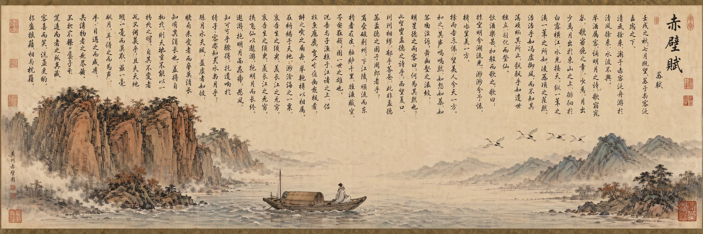

**提示词：**

```text
帮我生成一张《赤壁怀古》的长卷图，带整篇《赤壁赋》文字
```

***

<a id="case-342"></a>

### 例 342：四季包装 Campaign 宫格

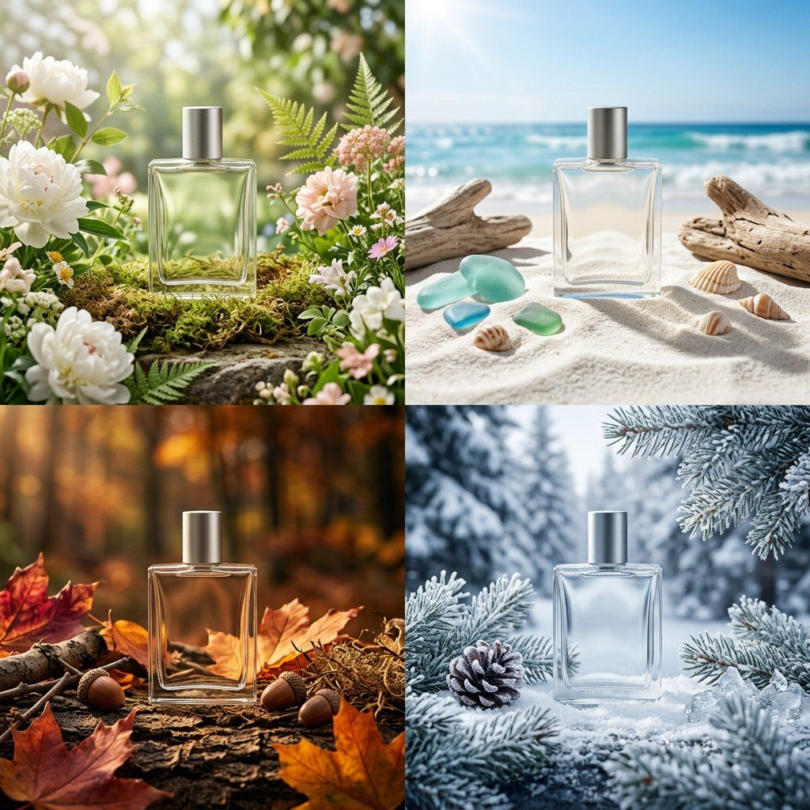

**提示词：**

```text
第 1 阶段 - 产品：[材料] 包装中的 [商品]，简约标签设计
第 2 阶段 - 网格：2x2 季节性网格，四个不同的品牌世界
第 3 阶段 - 构图：每个象限都是包含道具和环境的完整战役场景
第 4 阶段 - 一致性：相同的产品轮廓，四种不同的调色板

交换：[商品] / [材料] / [标签样式]
```

***

<a id="case-343"></a>

### 例 343：高定时尚杂志封面


**提示词：**

```text
超高时尚杂志封面，路易威登风格的社论。一位自信女性的特写肖像，有着柔软的玫瑰金色头发和自然通风的刘海，微风吹动，营造出动感。她穿着一套奢华的夏季服装：温暖的金黄色色调的结构轻质亚麻或丝绸夹克，搭配朴素的高领上衣，搭配大胆的金色项链和精致的个性耳环。

面料随夏日微风自然飘逸，略带纹理且透气，捕捉优质季节感。造型优雅、端庄、精致——不穿暴露的衣服。

高端工作室照明与自然的黄金时刻辉光混合在一起：温暖的高光、柔和的阴影、明亮的皮肤和光滑的编辑效果。

背景是丰富的夏季渐变（夕阳金色逐渐变成柔软的珊瑚色或温暖的米色），干净但视觉上引人注目。

构图充满活力，略带电影感：头发在移动，景深较浅，脸部清晰对焦。

版式：顶部有大而优雅的衬线标头“Louis Vuitton”，粗体封面线“YOUR CHOICE ENDS HERE”采用高级编辑布局，最小化支持文本。

超真实、超细致的皮肤纹理、8K 分辨率、锐利的焦点、光泽杂志印刷质量、电影调色、奢华时尚摄影、无裸露、品味和社论。
```

***

<a id="case-344"></a>

### 例 344：NOIR 街头服饰 Campaign


**提示词：**

```text
为现代街头服饰品牌 NOIR 制作优质、高度逼真的 1:1 活动海报。以英雄超大连帽衫为主要焦点，背景是粗糙的城市背景，潮湿的混凝土地板、戏剧性的低光、空气中微妙的烟雾和原始的街道能量。添加大胆的简约版式，其中包含品牌名称 NOIR 和简短的活动标题，例如“Wear the Dark”。让它感觉像真正的高端街头服饰社论，锐利的细节，逼真的面料纹理，现代而前卫，深黑色调与微妙的灰色口音，没有混乱，没有拼贴。
```

***

<a id="case-345"></a>

### 例 345：法新浪潮撕纸电影海报


**提示词：**

```text
在老化的奶油色纸上创建具有手工模拟感觉的垂直海报构图。使用粗糙的撕裂纸边缘、分层的杂志剪纸、复印颗粒、半色调纹理、渗墨和稍微不完美的丝网印刷套准。将拍摄对象作为主要的黑白摄影肖像，突出地放置在中心或上部中心。用深红色、钴蓝色、暖黄色、黑色和象牙色的图形块围绕主题。

添加辅助拼贴片段，例如雨天的欧洲街道、胶片边框、剪报、城市剪影和电影细节，排列得像手工制作的 20 世纪 60 年代艺术电影海报一样。使用具有强烈视觉层次结构的大胆压缩版式。添加大标题文本：“[MAIN TITLE]”。添加较小的字幕文本：“[SUBTITLE]”。添加底部文字：“[品牌名称/活动名称/即将推出/日期]”。如果需要，请在顶行添加一小行“[TAGLINE]”。

最终的结果应该给人电影感、知性、叛逆和社论的感觉——就像一张丢失的 20 世纪 60 年代欧洲电影海报，具有强烈的观点。保持原始、触感、印刷、不完美和手工制作。避免光滑的现代饰面。
```

***

<a id="case-349"></a>

### 例 349：运动时尚三联 Campaign


**提示词：**

```text
电影般的运动时尚拼贴，三面板布局，顶面板大型英雄镜头，一位女网球运动员自信地坐在超大倾斜网球拍上，深绿色豪华球场背景，反光光泽地板，背景中大胆的超大字体“PRECISION”，戏剧性的编辑照明，超干净的构图，高级时尚的运动美学。

左下图：运动员的特写肖像，皮肤容光焕发，妆容极简，光线柔和，文字“FOCUS”和“FUEL”巧妙地放置在一起。

右下图：全身蹲姿握拍，姿势有力，文字“纪律驱动统治”，网格布局线条，高级运动品牌感。

一致的色彩分级、深绿色和白色调色板、锐利的细节、电影般的阴影、奢华的战役风格、1:1 的宽高比。
```

***

<a id="case-351"></a>

### 例 351：健身品牌力量 Campaign


**提示词：**

```text
电影般的健身运动，超大的哑铃斜放，就像一个声明道具，穿着红色表演服和白色短裤的女模特坐在哑铃的一侧，一条腿弯曲，一条伸展，最小的黑色工作室，反光地板，大字体后面的粗体“STRENGTH”字样，锐利的灯光，超干净的构图，奢华的运动美学，1:1。
```

***

<a id="case-352"></a>

### 例 352：西楚霸王国风暗黑海报


**提示词：**

```text
竖版国风暗黑海报，黑色纯背景，中央巨大的中文标题字，占据画面大部分空间，字体为粗粝做旧的米白色石刻/旧纸质感，带明显颗粒、磨损、裂痕与噪点；整体构图层次丰富，强烈黑白金红对比，东方审美，神秘、压抑、欲望与审判感并存 电影海报质感 高级平面设计，极致细节 纸张纹理 印章落款 小字标语，4K
```

***

<a id="case-355"></a>

### 例 355：概念字体海报 Prompt


**提示词：**

```text
为确切的标题创建一张已完成的高级概念排版海报：

“[INPUT_TEXT]”

仅单张海报。没有情绪板、网格、演示板、模型、标题、提示文本、流程表或示例标签。

标题“[INPUT_TEXT]”必须是海报的主要视觉结构：巨大、可读、有力且拼写准确。请勿翻译、缩短、替换或拼写错误。不要添加其他大的可读文本。只有在保持微妙和次要的情况下才允许使用可选的微型目录文本。

默默解读标题的意义、意境、文化气场、象征联想、心理张力、视觉节奏。将这种解释转化为一个强烈的视觉隐喻。

排版是英雄。设计定制外观的字体，其粗细、宽度、对比度、间距、节奏、扭曲、负空间、边缘质量和墨水纹理表达了标题的气质。该字体应该让人感觉是经过精心设计的，而不是像默认字体。

如果“[INPUT_TEXT]”指的是广为人知的人物，则将大型社论肖像或全身/半身人物作为主要视觉存在，约占构图的 40-70%。该人物应该通过光环、姿势、造型、时代、表达、灯光和象征气氛来让人感觉可识别，但不应复制特定的现有照片、官方海报、活动图像、标志、口号或受版权保护的构图。肖像必须与版式相互作用：重叠字母、从字母中显现、被它们包围、在它们上投射阴影、突破它们或部分隐藏在它们后面。

对于所有其他标题，仅在强化含义时才使用人物、风景、物体或氛围设置。它必须与版式互动并加深概念，而不是装饰它。

使用与主题相匹配的丰富但克制的 4-6 种颜色系统：主导背景颜色、主要版式颜色、图形/风景色调、情感强调色、柔和的支持颜色以及微妙的纸张/墨水纹理色调。除非概念上有必要，否则避免使用纯黑-白-红默认值。

构图风格：高端编辑海报、博物馆品质的平面设计、戏剧性的规模、强烈的层次感、很少的元素、智能的空白、大胆的平面色彩区域、锐利的裁剪、丝网印刷/平版印刷/立体印刷纹理、纸张纤维、微妙的墨水缺陷、精致的视觉张力。

最终图像应该感觉像是一个完整的视觉句子：标题、图形或设置、颜色和排版相互解释。

避免通用艺术字、光滑的 3D 字体、随机图标、库存照片写实主义、杂乱的拼贴画、过多的垃圾、旅游陈词滥调、官方标志、复制的口号、复制的竞选美学、不相关的文本和拼写错误的排版。

-----

INPUT_TEXT：凤凰重生
```

***
