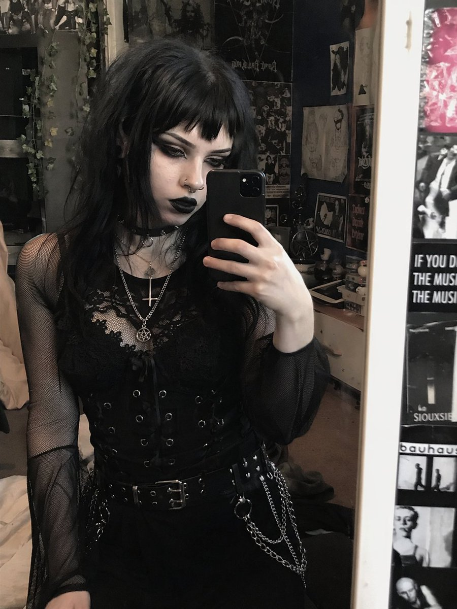
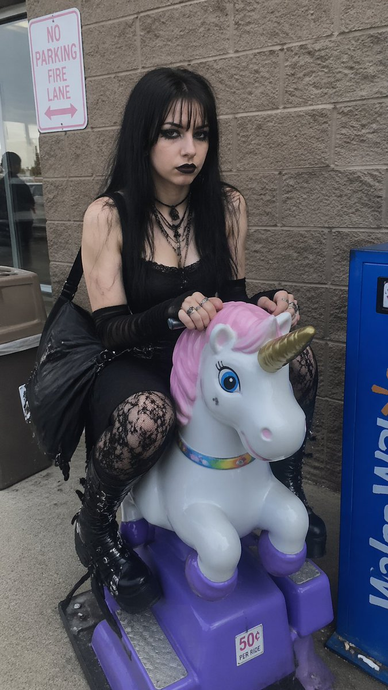
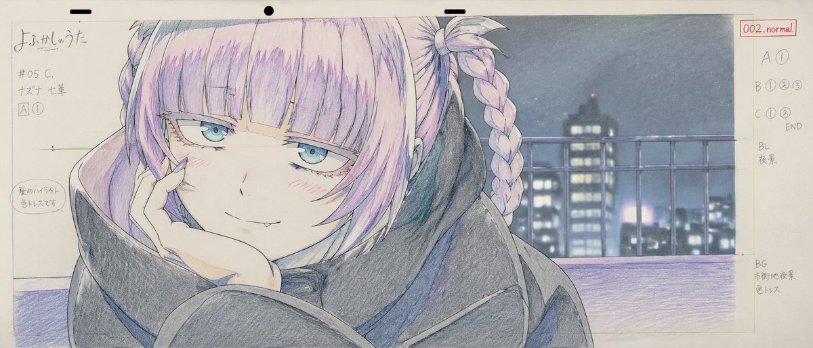
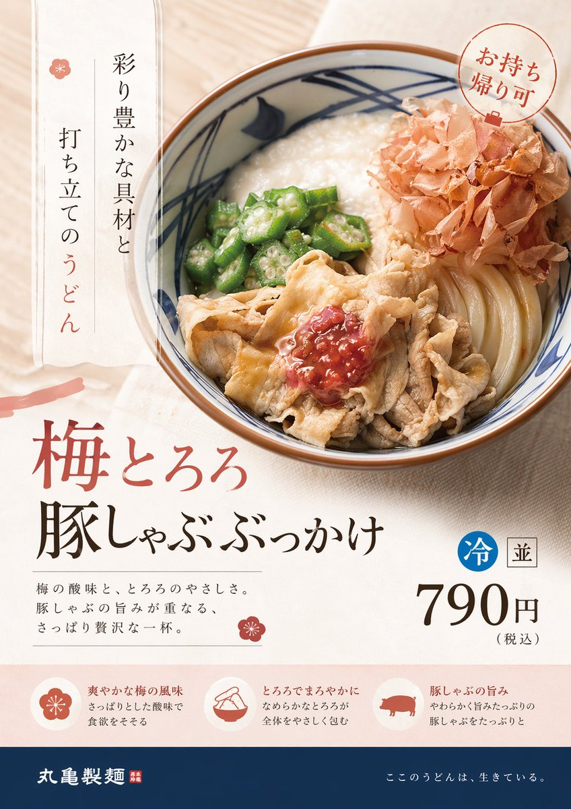
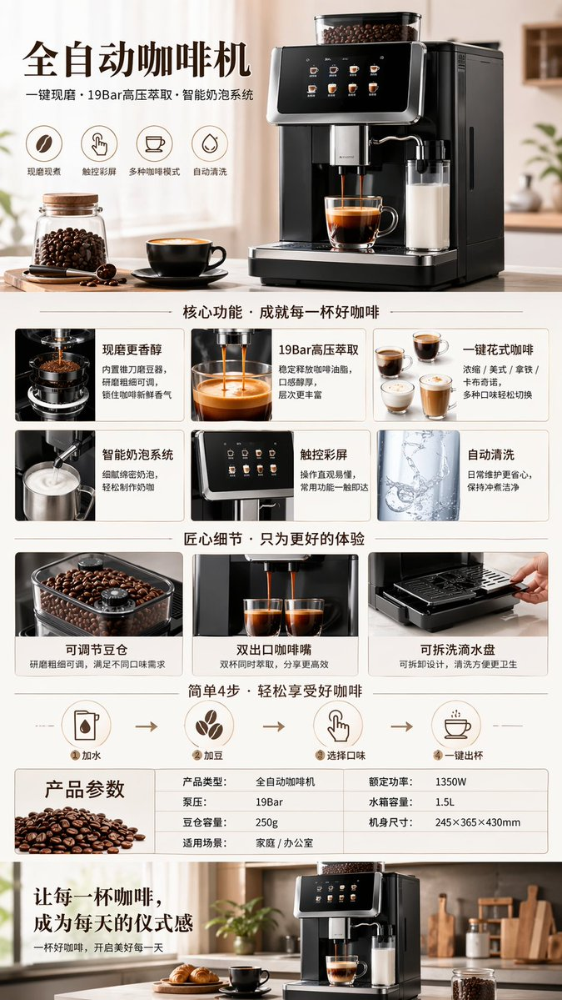
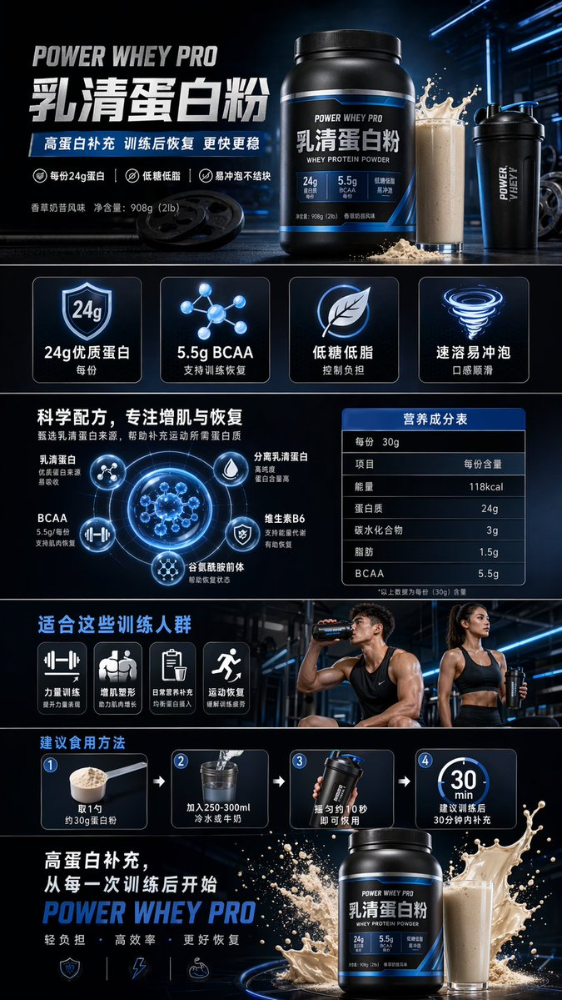
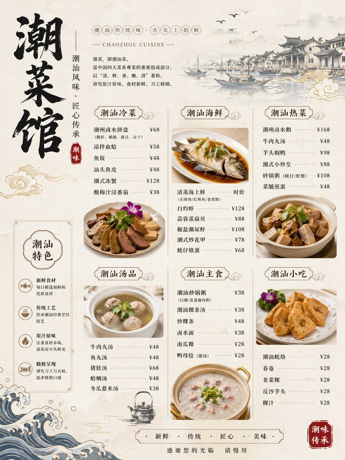
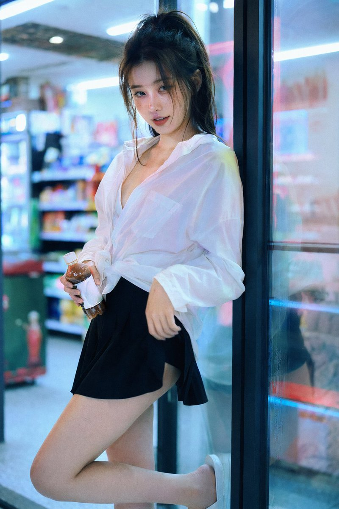
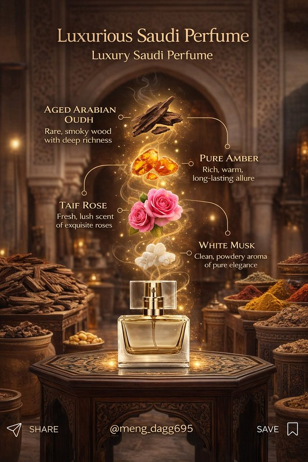

# 商品与电商

> GPT Image 2 中文提示词案例分册 4。本分册共 19 个案例。

[返回索引](index.md)

## 案例目录

- [例 29：电影感叙事场景图](#case-29)
- [例 33：电商商品展示设计](#case-33)
- [例 56：写实摄影风格创作](#case-56)
- [例 125：电商商品展示设计](#case-125)
- [例 141：电商商品展示设计](#case-141)
- [例 181：潮流视角重塑精致商品广告](#case-181)
- [例 186：品牌视觉识别图](#case-186)
- [例 189：清新夏日女装连衣裙电商展示](#case-189)
- [例 190：全自动咖啡机产品展示](#case-190)
- [例 192：电商商品展示图](#case-192)
- [例 194：健身蛋白粉电商详情页](#case-194)
- [例 237：夏日柑橘苏打高转化广告图](#case-237)
- [例 264：美妆产品广告图](#case-264)
- [例 294：精美潮汕菜馆菜单图](#case-294)
- [例 301：终结者机器人淘宝详情页](#case-301)
- [例 305：深夜便利店里的性感霓虹少女](#case-305)
- [例 318：珊瑚色极简影棚时尚商业大片](#case-318)
- [例 322：街头炫瓶男模](#case-322)
- [例 327：沉香玫瑰悬浮幻景](#case-327)

## 案例

<a id="case-29"></a>

### 例 29：电影感叙事场景图



**提示词：**

```text
使用 REFERENCE_0，将拍摄对象的外观转变为{argument name="style" default="trad goth"}美学，同时保留准确的姿势、服装结构和背景。将她的头发改为{argument name="hair color" default="black"}并使用{argument name="hair style" default="choppy bangs"}。化浓浓的深色妆容，特别是{argument name="lip color" default="black"}口红和浓郁的深色眼影，让肤色稍微苍白一些。添加 2 个面部穿孔：隔膜环和鼻孔螺柱。最后，修改她的分层项链，使其具有{argument name="necklace pendants" default="一个倒十字和一个五角星形"}。
```

***

<a id="case-33"></a>

### 例 33：电商商品展示设计


**提示词：**

```text
纯白色背景上可爱的卡哇伊 {argument name="subject" default="cloud"} 角色的 3D 渲染。该角色具有柔软、哑光、粘稠的质感，类似于粘土或压力玩具。它的特点是有光泽的黑色大眼睛，带有白色亮点，简单的弧形微笑，脸颊上有圆形的粉红色腮红。图形的边缘和底部有一个微妙的柔和渐变{argument name="accent color" default="pink, blue, and Purple"}。柔和的演播室灯光，极简的图标风格，投射出温柔的光影。
```

***

<a id="case-56"></a>

### 例 56：写实摄影风格创作



**提示词：**

```text
一张坦率、真实的照片，照片上是一位年轻的{argument name="subject Alexander" default="goth"}女性，皮肤苍白，留着刘海的黑色长直发，浓重的黑色眼线，涂着黑色口红。她坐在儿童投币式{argument name="ride type" default="unicorn"}游乐设施上，表情{argument name="expression" default="deadpan"}，直视镜头。她身穿黑色蕾丝边背心、黑色暖臂套、多层项链（包括颈链）、黑色蕾丝紧身衣和带扣厚底黑色厚底靴。她的手臂上挂着一个黑色的大单肩包。该游乐设施是一头白色的独角兽，有粉红色的鬃毛、金色的角和紫色的蹄子，安装在紫色的底座上，上面贴着一个小贴纸，上面写着“{argument name="ride cost" default="50 美分每次乘车"}”。场景位于一家商店外面，墙壁是棕褐色的煤渣砖。左边是一扇玻璃门，上面映着一个人，一个棕色垃圾桶，还有一个白色标牌，上面写着红色文字“{argument name="sign text" default="NO PARKING FIRE LANE"}”。右边是一个蓝色的自动售货机。阴天，自然光。
```

***

<a id="case-125"></a>

### 例 125：电商商品展示设计



**提示词：**

```text
{
  "type": "anime production layout sheet",
  "style": "traditional colored pencil genga, key animation drawing",
  "subject": {
    "character": "{argument name=\"character name\" default=\"ナズナ 七草\"}",
    "appearance": "anime girl with {argument name=\"hair color\" default=\"light purple\"} hair styled in twin braids and bangs, blue eyes, wearing a dark oversized coat",
    "pose_and_expression": "{argument name=\"expression\" default=\"smug with a small fang, resting chin on hand\"}"
  },
  "background": "{argument name=\"background scene\" default=\"nighttime city skyline with a railing\"}, soft focus",
  "layout": {
    "top_edge": "standard animation paper peg holes",
    "left_margin": {
      "series_title": "{argument name=\"anime title\" default=\"よふかしのうた\"}",
      "production_codes": ["#05 C.", "[A] (1)"],
      "circled_note": "髪のハイライト 色トレスです"
    },
    "right_margin": {
      "red_box": "002.normal",
      "timing_layers": ["A (1)", "B (1) (2) (3)", "C (1) (2) END"],
      "background_notes": ["BL 夜景", "BG 市街地夜景 色トレス"]
    }
  }
}
```

***

<a id="case-141"></a>

### 例 141：电商商品展示设计


**提示词：**

```text
{
  "type": "promotional banner design set",
  "theme": "strawberry advertisement campaign",
  "style": "anime illustration, bright, cheerful, commercial graphic design",
  "color_palette": "{argument name=\"primary color theme\" default=\"pastel pink and vibrant red\"}",
  "character": "{argument name=\"character description\" default=\"anime girl with brown side ponytail and bunny ears, wearing a pastel blue and pink jacket\"}",
  "product": "{argument name=\"product\" default=\"fresh red strawberries\"}",
  "layout": {
    "sections": [
      {
        "type": "large landscape banner",
        "position": "top left",
        "visuals": "character winking and holding a strawberry next to a large basket of strawberries",
        "main_text": "{argument name=\"main headline\" default=\"いちごたっぷり\"}",
        "sub_text": ["笑顔あふれる、甘〜いひととき♪", "とびきりおいしい！", "ひと粒で、しあわせ広がる♡", "あまっ♡", "旬のおいしさをお届け！"],
        "badges": {
          "count": 3,
          "labels": ["あま〜くてジューシー！", "いろんなサイズを楽しめる♪", "新鮮朝採れ！"]
        }
      },
      {
        "type": "vertical banner",
        "position": "right",
        "visuals": "character eating a strawberry with a pile of strawberries below",
        "main_text": "いちごたっぷり",
        "sub_text": ["旬のいちごをお届け！", "{argument name=\"secondary headline\" default=\"あま〜くて、ジューシー！\"}", "とろけるおいしさ〜♡"],
        "badges": {
          "count": 3,
          "labels": ["朝採れ新鮮！", "いろんなサイズを楽しめる♪", "甘くてジューシー！"]
        }
      },
      {
        "type": "wide horizontal banner",
        "position": "middle",
        "visuals": "character with closed eyes eating a strawberry, flanked by strawberries",
        "main_text": "いちごたっぷり！",
        "sub_text": ["あまくて、ジューシーな幸せ♡", "旬の美味しさをお届けします！", "おいし〜っ♡"]
      },
      {
        "type": "small square banner",
        "position": "bottom left",
        "visuals": "character smiling holding strawberry",
        "text": ["いちごたっぷり", "あま〜くてジューシー！"]
      },
      {
        "type": "small square banner",
        "position": "bottom mid-left",
        "visuals": "pile of strawberries with one cut in half",
        "text": ["旬のいちご！", "あまくてとろけるおいしさ♡"]
      },
      {
        "type": "small horizontal banner",
        "position": "bottom mid-right",
        "visuals": "character holding strawberry",
        "text": ["いちごたっぷり", "朝採れ新鮮！", "あまくてジューシー！"]
      },
      {
        "type": "circular icons",
        "position": "bottom right",
        "count": 4,
        "items": [
          { "visual": "basket of strawberries", "label": "朝採れ新鮮！" },
          { "visual": "half strawberry", "label": "あまくてジューシー！" },
          { "visual": "whole strawberry", "label": "いろんなサイズ！" },
          { "visual": "character face", "label": "とろけるおいしさ♡" }
        ]
      }
    ]
  }
}
```

***

<a id="case-181"></a>

### 例 181：潮流视角重塑精致商品广告



**提示词：**

```text
请以专业设计师的视角重新设计这个商品广告。
采用当前的潮流趋势，针对目标受众的精致设计。
```

***

<a id="case-186"></a>

### 例 186：品牌视觉识别图


**提示词：**

```text
创建一个包含100种不同奇幻RPG物品的10×10网格，以经典像素艺术风格渲染（16位或32位精灵图美学，让人联想到SNES/GBA时代的日式RPG）。每个物品应出现在其独立的方形瓷砖中，下方带有简短清晰的标签。在白色背景上保持网格整洁。使每个物品在视觉上都有所区分，并且每个标签拼写正确。使用清晰的像素边缘、每个精灵图有限的调色板，以及用于阴影的微妙抖动。
使用这些行主题：
第1行：剑与刀刃
第2行：盾牌与盔甲
第3行：弓、弩与远程武器
第4行：法杖、魔杖与魔法焦点
第5行：药水、灵药与烧瓶
第6行：卷轴、典籍与法术书
第7行：戒指、护身符与附魔小饰品
第8行：头盔、王冠与头饰
第9行：钥匙、遗物与任务物品
第10行：宝石、符文与制作材料
将每个瓷砖显示为干净背景方形上居中的物品精灵图，渲染为经典的库存图标——你在奇幻RPG菜单中会看到的那种。保持整体风格一致、连贯，并让人联想到备受喜爱的复古奇幻RPG——迷人、细节丰富，且在小尺寸下易于辨认。
```

***

<a id="case-189"></a>

### 例 189：清新夏日女装连衣裙电商展示


**提示词：**

```text
夏季女裙电商详情图
```

***

<a id="case-190"></a>

### 例 190：全自动咖啡机产品展示



**提示词：**

```text
全自动咖啡机电商详情图
```

***

<a id="case-192"></a>

### 例 192：电商商品展示图


**提示词：**

```text
AI智能眼镜电商详情图
```

***

<a id="case-194"></a>

### 例 194：健身蛋白粉电商详情页



**提示词：**

```text
健身蛋白粉电商详情图
```

***

<a id="case-237"></a>

### 例 237：夏日柑橘苏打高转化广告图


**提示词：**

```text
图像生成: 商品广告照片, 适合夏天的季节商品, 碳酸饮料, 名称="夏柑SODA", 形状=PET瓶500ml, 研究2025年作为饮料广告的高CTA设计后设计并生成图像规格, 宽高比3:4
```

***

<a id="case-264"></a>

### 例 264：美妆产品广告图


**提示词：**

```text
为Z世代设计的可爱Y2K风格的平价化妆品广告图像。使用鲜艳的配色，包括荧光色。纵横比为3:4。
```

***

<a id="case-294"></a>

### 例 294：精美潮汕菜馆菜单图



**提示词：**

```text
生成一张潮菜馆菜单图
```

***

<a id="case-301"></a>

### 例 301：终结者机器人淘宝详情页


**提示词：**

```text
生成图片:
T-800机器人的淘宝商品详情页，展示:
机器人的正面侧面背面三视图，
产品价格，
产品细节，
功能和使用场景等
```

***

<a id="case-305"></a>

### 例 305：深夜便利店里的性感霓虹少女



**提示词：**

```text
35毫米胶片摄影，带有刺眼的便利店荧光灯照明，混合着外面色彩斑斓的霓虹灯牌，真实的胶片颗粒，高对比度，轻微的偏色，电影感街头编辑风格，亲密的中景镜头，20岁出头性感的华人女性偶像，拥有超逼真精致细腻的东方五官，诱人的杏眼狐眼搭配天然双眼皮，高鼻梁，小巧尖锐的V型下颌线，无瑕的瓷白肌肤带有冷象牙底色以及来自荧光灯的可见高光，细腻的皮肤纹理和微小毛孔，自然清透妆容带有脸颊上的柔和红晕，水润自然的粉唇微张，鼻子和脸颊上散布着微妙的自然雀斑，深棕色的长发扎成凌乱的高马尾，许多松散的发丝垂在脸庞和颈部周围，穿着一件超大号的白衬衫作为唯一的上衣，顶部敞开露出深邃乳沟并在腰部宽松打结，搭配一条极小的黑色百褶迷你裙，赤脚穿着简约的白色拖鞋，在深夜24小时便利店的玻璃门上呈现出诱人随性的倚靠姿势，身体微微拱起，一条腿弯曲，脚搭在门框上，另一条腿伸直，一只手拿着一瓶冰饮，另一只手轻轻拉扯迷你裙的裙摆，极其诱人俏皮却又略显脆弱的目光直视观看者，柔和的鹿眼中充满安静的诱惑与挑逗的微笑，来自店内明亮冷调的荧光灯光混合着来自外面招牌的粉色和蓝色霓虹光芒，玻璃门上真实的反射，模糊的便利店内部，背景中有货架和零食，真实的35毫米胶片调色，带有刺眼的光照和霓虹点缀，极其锐利却又柔和的皮肤渲染，自然的发丝，超大号衬衫和迷你裙上逼真的织物褶皱和垂坠感，无塑料感皮肤，无数字过度锐化，无磨皮，无瑕疵，无痣，无油性皮肤，无水印，无文字，真实的深夜便利店氛围
```

***

<a id="case-318"></a>

### 例 318：珊瑚色极简影棚时尚商业大片


**提示词：**

```text
超写实高端时尚商业广告大片，使用上传的模特照片作为严格的身份参考。保留精确的面部特征、比例和自然皮肤纹理——无修图，无变形。场景：珊瑚色单色工作室盒，配有光泽反光棋盘格或极简抛光地板。拥有柔和光线渐变的干净几何墙壁。产品：产品放置在前景中心超大位置，因广角透视而占据画面主导地位。包装超清晰，文字完全可读，具有逼真的反射和材质纹理。较小的产品单元可对称放置在背景中。模特姿势：站在产品后方，微蹲或前倾，一只手伸向镜头以创造深度感。强烈自信的表情，时尚态度。相机：低角度 24-35mm 镜头感，戏剧性透视畸变，对产品和模特都进行深焦处理。灯光：明亮的商业影棚灯光，柔和阴影，包装上有光泽高光，高端广告成片质感。4K–8K 写实主义，无水印，无嵌入式文本。纵横比 9:13
```

***

<a id="case-322"></a>

### 例 322：街头炫瓶男模


**提示词：**

```text
专业照片，一位男士，30岁的俄罗斯模特（参考图像），正对着镜头，向相机倾斜，从下往上拍摄，使用广角镜头。男士倾斜着身体，近距离将一瓶饮料展示给镜头，一只手拿着瓶子，紧贴在镜头前。瓶子的标签和方向保持笔直，以便标签清晰可读。他穿着白色运动鞋，一只脚在镜头前方。男士站在街道上，湿漉漉的沥青和飞溅的水花从下方拍出。鲜艳的色彩，电影级灯光，光线从后方打在模特的脸上。--v7 --ar 3:4 --style raw
```

***

<a id="case-327"></a>

### 例 327：沉香玫瑰悬浮幻景



**提示词：**

```text
{
  "master_prompt_type": "超精细8K AI图像生成",
  "global_settings": {
    "resolution": "8K UHD",
    "aspect_ratio": "2:3 竖版",
    "render_quality": "极致锐度、超微细节、电影级光效",
    "style": "超现实商业产品摄影",
    "color_profile": "温暖金调搭配柔和琥珀高光",
    "environment": {
      "location": "古老中东市场走廊",
      "architecture": {
        "walls": "岁月痕迹的粗糙石墙与可见纹理",
        "arches": "背景巨型石拱",
        "floor": "暖棕色石材地面"
      },
      "background_elements": [
        "装满香料的木架",
        "袋装与碗装干货",
        "悬挂草药束",
        "散发暖黄光的传统金属灯笼"
      ],
      "lighting": {
        "primary": "柔和金色环境光",
        "secondary": "两侧暖灯笼辉光",
        "atmosphere": "薄雾增强光线漫射"
      }
    },
    "main_subject": {
      "type": "香水瓶",
      "position": "中心前景",
      "placement": "置于华丽木桌之上",
      "material": {
        "bottle": "透明清玻璃",
        "cap": "黄金金属矩形瓶盖",
        "liquid": "淡金香水液体"
      },
      "design": {
        "shape": "圆角矩形瓶身",
        "finish": "高光反射表面",
        "label": "无可见标签"
      },
      "table": {
        "material": "深色雕花木材",
        "shape": "方形台面",
        "details": [
          "繁复花卉与几何雕刻",
          "金色镶嵌装饰",
          "抛光表面映光"
        ]
      },
      "floating_elements": {
        "composition_style": "竖向成分堆叠",
        "motion": "成分悬浮并伴随旋转金光",
        "effects": [
          "发光粒子",
          "闪耀尘埃",
          "柔光尾迹连接元素"
        ],
        "elements_order_top_to_bottom": [
          {
            "ingredient": "琥珀树脂",
            "appearance": "半透明金棕树脂块",
            "glow": "温暖内发光"
          },
          {
            "ingredient": "大马士革玫瑰",
            "appearance": "盛放粉色玫瑰",
            "details": [
              "柔软层叠花瓣",
              "自然绿叶",
              "轻飘附近花瓣"
            ]
          },
          {
            "ingredient": "白麝香",
            "appearance": "光滑白水晶状石块",
            "additional": "石下细白粉末"
          },
          {
            "ingredient": "陈年沉香",
            "appearance": "深棕木片",
            "texture": "粗糙纤维木纹",
            "effect": "缕缕白烟上升"
          }
        ]
      },
      "text_elements": {
        "title": {
          "text": "精致叙利亚香水",
          "font_style": "优雅衬线体",
          "color": "金色",
          "position": "顶部中央"
        },
        "subtitle": {
          "text": "奢华叙利亚香水",
          "font_style": "较小衬线体",
          "color": "金色",
          "position": "主标题下方"
        },
        "ingredient_labels": [
          {
            "title": "纯琥珀",
            "description": "来自自然深处的珍贵树脂"
          },
          {
            "title": "大马士革玫瑰",
            "description": "美丽与叙利亚传承的象征"
          },
          {
            "title": "白麝香",
            "description": "干净、粉感、永恒优雅的香氛"
          },
          {
            "title": "陈年沉香",
            "description": "深邃温暖、浓郁烟熏木香"
          }
        ],
        "typography_details": {
          "connector_lines": "细弯金线连接文字与成分",
          "icons": "线末端小圆点标记"
        },
        "opacity": "轻微半透明"
      }
    },
    "overall_mood": {
      "tone": "奢华、温暖、优雅",
      "theme": "传承香水工艺",
      "visual_feel": "浓郁、高端、电影级广告"
    }
  }
}
```

***
