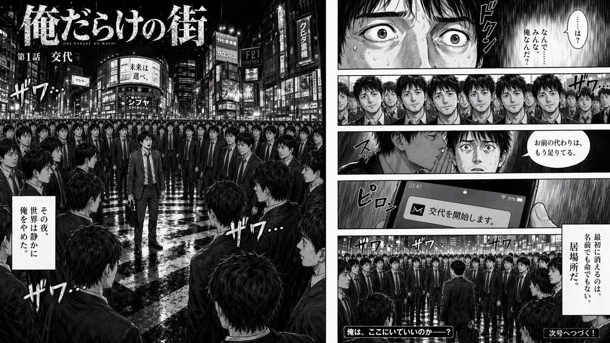
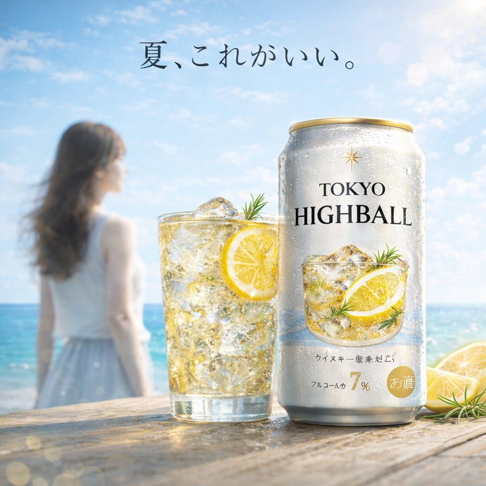

# 品牌与标志

> GPT Image 2 中文提示词案例分册 5。本分册共 7 个案例。

[返回索引](index.md)

## 案例目录

- [例 36：品牌徽标设计图](#case-36)
- [例 53：室内空间渲染图](#case-53)
- [例 95：品牌视觉识别图](#case-95)
- [例 115：品牌视觉识别图](#case-115)
- [例 136：品牌视觉识别图](#case-136)
- [例 150：品牌徽标设计图](#case-150)
- [例 160：品牌吉祥物设定图](#case-160)

## 案例

<a id="case-36"></a>

### 例 36：品牌徽标设计图


**提示词：**

```text
一张逼真的自拍照，照片上是一位年轻男子在室内篮球场上的照片，他留着深色波浪短发和浅色胡茬。他穿着一件带有白色旋风图案的黑色运动 T 恤。他手里拿着一个{argument name="ball color" default="green"}篮球，上面有一个巨大的白色{argument name="logo design" default="OpenAI logo"}。背景是硬木地板、黑色墙垫和靠在混凝土墙上的篮球框。明亮的室内健身房照明与休闲的社交媒体美感。
```

***

<a id="case-53"></a>

### 例 53：室内空间渲染图


**提示词：**

```text
一张 90 年代末的老式业余闪光照片，照片上是一位年轻人正在修理一台街机。他跪在带有图案的深色街机地毯上，回头直视镜头，表情中性。他穿着深色短袖 T 恤、宽松的蓝色牛仔裤、厚实的白色运动鞋和深色棒球帽。街机柜的下部前面板是敞开的，暴露了其复杂的内部电子设备，包括一堆电线、绿色电路板、一个大扬声器和底部的金属冷却风扇。柜子的侧面采用鲜艳的粉色、黑色和白色图形，并带有文字“{argument name="arcade game title" default="Dancing Stage"}”和品牌“{argument name="arcadebrand" default="KONAMI"}”。场景是一个光线昏暗的拱廊内部，在模糊的背景中可以看到其他发光的游戏柜。一把螺丝刀放在男人膝盖附近的地毯上。该图像具有刺眼的直射闪光、略带颗粒感的胶片纹理、深阴影和怀旧的 Y2K 美学。
```

***

<a id="case-95"></a>

### 例 95：品牌视觉识别图


**提示词：**

```text
{
  "type": "anime-style livestream thumbnail",
  "character": {
    "hair": "{argument name=\"hair color\" default=\"short silver hair with cyan underlights\"}",
    "eyes": "large bright blue",
    "outfit": "white collared shirt, black tie with silver accents, black jacket, black beret with a large blue heart jewel, blue jewel brooch, black choker",
    "pose": "smiling gently, looking at viewer, positioned on the right side"
  },
  "background": "pastel blue with white clouds, sparkles, stars, small bows, and a subtle grid pattern",
  "typography_and_ui": {
    "top_left_speech_bubble": "まったりおしゃべりしよ〜♡",
    "main_title": {
      "text": "{argument name=\"main title\" default=\"雑談配信\"}",
      "style": "large, soft blue gradient, white outline, decorated with small hearts, positioned on the middle-left"
    },
    "bottom_left_badges": {
      "count": 3,
      "style": "white pill-shaped buttons with a purple heart icon on the left",
      "labels": [
        "{argument name=\"badge 1 text\" default=\"初見さん〇\"}",
        "{argument name=\"badge 2 text\" default=\"ポイント回収〇\"}",
        "{argument name=\"badge 3 text\" default=\"ROM〇\"}"
      ]
    },
    "bottom_right_cloud_bubble": "気軽にコメントしてね♡"
  }
}
```

***

<a id="case-115"></a>

### 例 115：品牌视觉识别图



**提示词：**

```text
{
  "type": "two-page manga spread",
  "style": "highly detailed realistic manga, monochrome, screentones, dramatic lighting, psychological thriller",
  "global_elements": {
    "protagonist": "{argument name=\"main character description\" default=\"young Japanese salaryman in a suit\"}",
    "theme": "{argument name=\"core concept\" default=\"surrounded by a massive crowd of identical clones of himself\"}"
  },
  "layout": {
    "left_page": {
      "type": "full page splash panel",
      "setting": "{argument name=\"setting\" default=\"Shibuya scramble crossing at night\"}",
      "visuals": "Protagonist standing alone in the center of the crossing, looking around in shock at a massive crowd where every single person is an exact clone of him.",
      "text_elements": [
        {"type": "manga title logo", "text": "{argument name=\"manga title\" default=\"俺だらけの街\"}"},
        {"type": "subtitle", "text": "第1話 交代"},
        {"type": "narration box", "text": "その夜、世界は静かに俺をやめた。"},
        {"type": "sound effect", "text": "ザワ…"}
      ]
    },
    "right_page": {
      "type": "5-panel vertical layout",
      "panels": [
        {
          "panel_number": 1,
          "visuals": "Extreme close-up of protagonist's eyes, wide with shock, sweating.",
          "text_elements": [
            {"type": "speech bubble", "text": "……は？ なんで……みんな、俺なんだ？"},
            {"type": "sound effect", "text": "ドクン"}
          ]
        },
        {
          "panel_number": 2,
          "visuals": "A horizontal row of 8 identical clones in suits staring blankly forward.",
          "text_elements": [
            {"type": "sound effect", "text": "ザワ…"}
          ]
        },
        {
          "panel_number": 3,
          "visuals": "A clone leaning in to whisper into the shocked protagonist's ear.",
          "text_elements": [
            {"type": "speech bubble", "text": "お前の代わりは、もう足りてる。"},
            {"type": "sound effect", "text": "スッ"}
          ]
        },
        {
          "panel_number": 4,
          "visuals": "Close-up of a smartphone screen held in a hand, showing a push notification.",
          "text_elements": [
            {"type": "screen text", "text": "交代を開始します。"},
            {"type": "sound effect", "text": "ピロン"}
          ]
        },
        {
          "panel_number": 5,
          "visuals": "Wide shot of the endless crowd of clones in the city street.",
          "text_elements": [
            {"type": "narration box", "text": "最初に消えるのは、名前でも命でもない。居場所だ。"},
            {"type": "bottom left text", "text": "俺は、ここにいていいのか——？"},
            {"type": "bottom right text", "text": "{argument name=\"cliffhanger text\" default=\"次号へつづく！\"}"},
            {"type": "sound effect", "text": "ザワ… ザワ… ザワ…"}
          ]
        }
      ]
    }
  }
}
```

***

<a id="case-136"></a>

### 例 136：品牌视觉识别图


**提示词：**

```text
{
  "type": "e-commerce landing page hero section",
  "brand": "{argument name=\"brand name\" default=\"CLEAR RESET\"}",
  "theme": "refreshing skincare, clean aesthetic, water bubbles background",
  "color_palette": ["white", "{argument name=\"primary color\" default=\"teal\"}", "light blue"],
  "layout": {
    "header": {
      "logo": "CLEAR RESET",
      "navigation_links": {"count": 5, "labels": ["About Product", "About Pores/Acne", "Ingredients", "How to Use", "FAQ"]},
      "action_buttons": {"count": 2, "labels": ["Buy Now", "My Page"]}
    },
    "hero_content": {
      "headline": "{argument name=\"main headline\" default=\"毛穴・ニキビ悩みに、すっきり澄んだ肌へ。\"}",
      "subheadline": "Balances sebum and clears pores. Non-sticky, medicated skincare for comfortable daily use.",
      "vertical_copy": "Prevents recurring rough skin and acne, leading to smooth, clear skin."
    },
    "visuals": {
      "model": "{argument name=\"model description\" default=\"young Asian woman with clear radiant skin, hair tied up, smiling softly\"}",
      "products": {
        "count": 2,
        "description": "{argument name=\"product type\" default=\"acne care gel tube and lotion bottle\"}",
        "placement": "center"
      },
      "background": "light blue gradient with floating water bubbles"
    },
    "feature_highlights": {
      "count": 4,
      "style": "circular icons with text below",
      "labels": ["Quasi-drug", "Pore Care", "Non-sticky", "Daily Use Morning/Night OK"]
    },
    "call_to_action": {
      "banner_text": "Limited to first-time buyers",
      "buttons": {"count": 2, "labels": ["Try it at a discount", "See details"]}
    },
    "statistics_cards": {
      "count": 4,
      "style": "white rectangular cards with large teal numbers",
      "labels": ["Satisfaction 92%", "Pore visibility -23%", "Acne prevention 87%", "Want to repeat 97%"]
    }
  }
}
```

***

<a id="case-150"></a>

### 例 150：品牌徽标设计图



**提示词：**

```text
A bright, summery commercial product photography shot featuring a refreshing beverage on a weathered wooden table. In the sharp foreground, there is 1 tall glass filled with a golden, bubbly iced drink garnished with 1 lemon slice and a sprig of rosemary, sitting next to 1 silver aluminum can covered in cold condensation. The can prominently displays the English text {argument name="product name" default="TOKYO HIGHBALL"} below a small gold star logo, featuring a graphic of the drink itself and the Japanese text "アルコール分 7%" near the bottom. To the right of the can, 2 cut lemon wedges rest on the table. In the softly blurred background, a sunny beach scene unfolds with sparkling turquoise water and a clear blue sky. Standing to the left in the background is 1 young woman with long brown hair, wearing a white sleeveless top and a light blue skirt, looking out toward the ocean. Floating elegantly in the sky above the scene is the Japanese text {argument name="catchphrase" default="夏、これがいい。"}. The overall lighting is radiant and inviting, with sparkling bokeh and lens flares emphasizing the crisp, cold, and refreshing atmosphere of a perfect summer day.
```

***

<a id="case-160"></a>

### 例 160：品牌吉祥物设定图


**提示词：**

```text
为{argument name="style" default="retro skeuomorphic style"}中的{argument name="device" default="vintage Electronic Equipment"}生成一组图标，包括图像中的图标名称。
```

***
