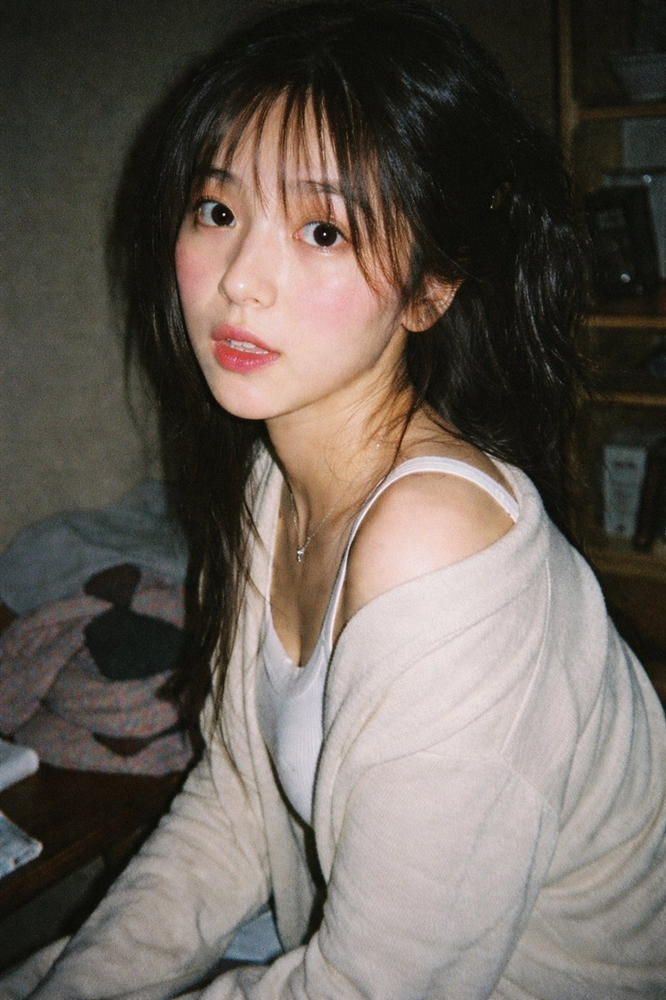
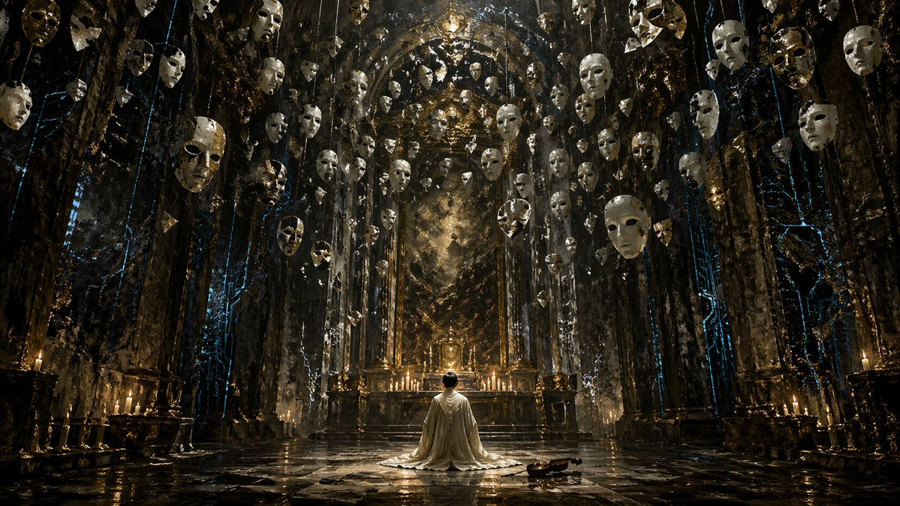
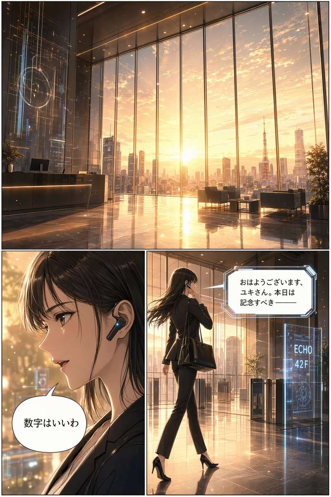
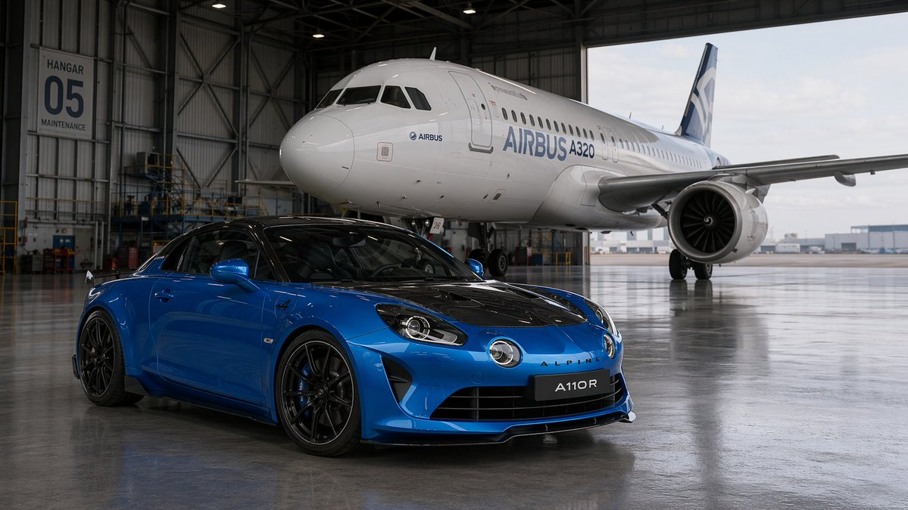
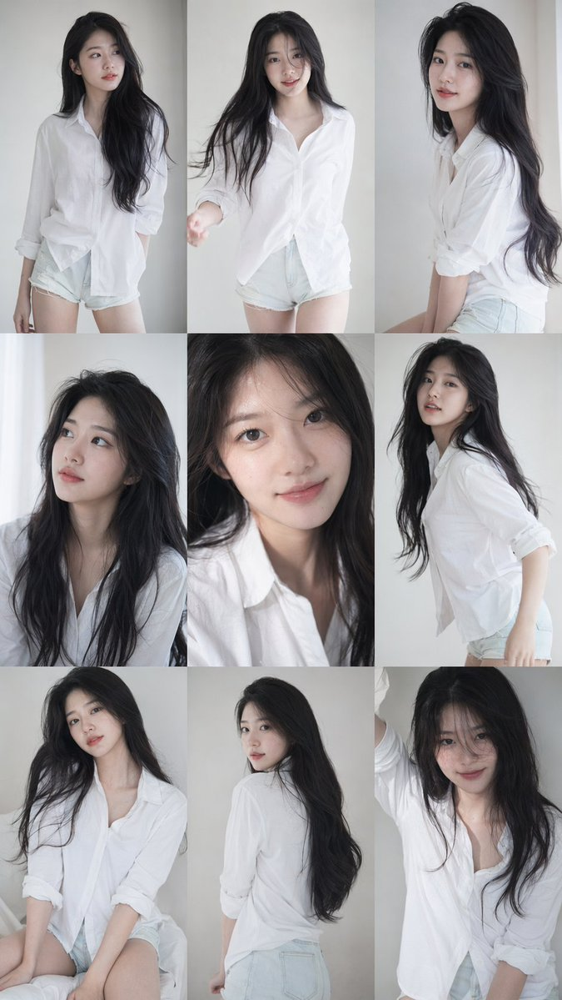
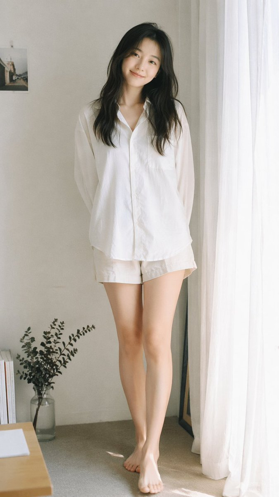
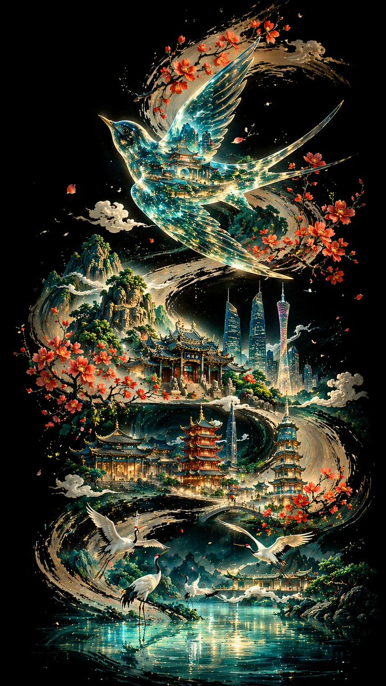
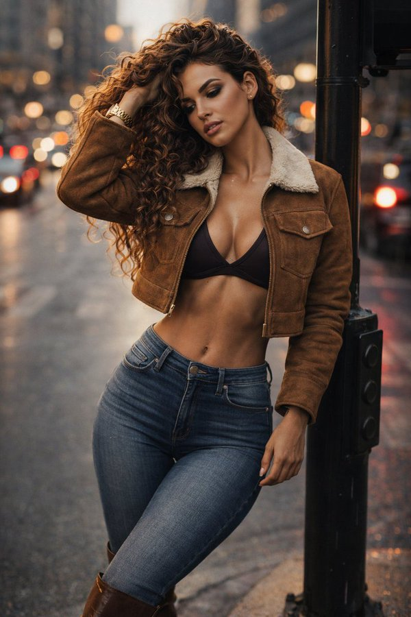

# 建筑与空间

> GPT Image 2 中文提示词案例分册 6。本分册共 20 个案例。

[返回索引](index.md)

## 案例目录

- [例 26：建筑空间场景图](#case-26)
- [例 28：写实摄影风格创作](#case-28)
- [例 46：建筑空间场景图](#case-46)
- [例 47：建筑空间场景图](#case-47)
- [例 50：建筑空间场景图](#case-50)
- [例 120：建筑空间场景图](#case-120)
- [例 121：建筑空间场景图](#case-121)
- [例 127：建筑空间场景图](#case-127)
- [例 128：建筑空间场景渲染](#case-128)
- [例 154：写实摄影风格创作](#case-154)
- [例 187：韩系极简氛围感少女写真](#case-187)
- [例 195：超写实与水墨的梦幻融合](#case-195)
- [例 219：韩系偶像九宫格写真集](#case-219)
- [例 221：窗边日系胶片女孩](#case-221)
- [例 224：机甲少女立于废弃海城](#case-224)
- [例 229：琉璃透明画眉鸟飞舞羊城墨卷](#case-229)
- [例 279：裂痕里的水墨东方山水画卷](#case-279)
- [例 286：珠江新城剪纸璀璨夜景](#case-286)
- [例 321：都市落日时尚大片](#case-321)
- [例 324：复古巴士上的红风衣女郎](#case-324)

## 案例

<a id="case-26"></a>

### 例 26：建筑空间场景图



**提示词：**

```text
一张复古 35 毫米胶片照片，照片中的{argument name="subject description" default="young Asian Woman"}，配着{argument name="hair style" default="长长的深色波浪发和纤细的刘海"}。她穿着一件{argument name="clothing" default="白色罗纹背心和一件从肩上滑落的宽松米色针织开衫"}，戴着一条精致的银项链。她有着柔和的妆容，粉红色的腮红和光泽的嘴唇，微微张开的嘴唇直视镜头。光线是刺眼的直接相机闪光灯，营造出一种坦率、业余的快照美感。背景是一个{argument name="setting" default="光线昏暗、有点凌乱的房间，桌子上放着衣服，还有一个木架子"}。该图像具有厚重的胶片颗粒、略显柔和的色彩以及怀旧且高度逼真的摄影纹理。
```

***

<a id="case-28"></a>

### 例 28：写实摄影风格创作


**提示词：**

```text
{
  "type": "2x2 纵向网格",
  "subject": "{参数名称=\"主题描述\" 默认=\"年轻的成年东亚男性，黑色短发，微笑\"}",
  "style": "真实感、高分辨率、专业照明、所有面板上一致的面部特征",
  “布局”：{
    "格式": "2x2 网格",
    “面板计数”：4，
    “面板”：[
      {
        "position": "左上角",
        "description": "{参数名称=\"职业 1\" 默认=\"穿着深海军蓝西装、白衬衫和蓝色领带，灰色纹理背景的企业专业人员\"}"
      },
      {
        "position": "右上角",
        "description": "{参数名称=\"职业 2\" 默认=\"在模糊的户外公园背景下穿着深蓝色圆领 T 恤的休闲装\"}"
      },
      {
        "position": "左下角",
        "description": "{参数名称=\"职业 3\" 默认=\"建筑工人戴着黄色安全帽，身穿海军蓝色工作衬衫，身穿亮橙色高能见度背心，背景是模糊的仓库\"}"
      },
      {
        "position": "右下角",
        "description": "{参数名称=\"职业 4\" 默认=\"医疗专业人员在模糊的实验室背景下穿着白色实验室外套和浅蓝色领衬衫\"}"
      }
    ]
  }
}
```

***

<a id="case-46"></a>

### 例 46：建筑空间场景图


**提示词：**

```text
一张非常详细、逼真的照片，照片上一位年轻的东亚女性坐在杂乱的后台更衣室里，准备参加角色扮演活动。她留着{argument name="hair color" default="vibrant Short red"}刘海波波头，穿着精致的奇幻武士服装，搭配{argument name="costume color" default="glossy red"}和金色分层迷你裙、带有黑色蕾丝和红色鞋带的白色紧身胸衣、相配的光面护臂和长筒靴。她神情专注地低着头，用右手调整着左臂上的护臂。她面前的梳妆台很乱，摆满了化妆刷、瓶子、发刷和额外的假发。一把华丽的大{argument name="prop" default="带有蓝色刀片和金色剑柄的幻想剑"}靠在柜台边缘。背景是一面明亮的梳妆镜，带有圆形灯泡，反射着衣架，捕捉到一种坦率、略微过度锐化和高度质感的摄影风格。
```

***

<a id="case-47"></a>

### 例 47：建筑空间场景图


**提示词：**

```text
{
  "type": "2x2 grid of Japanese digital advertisement banners",
  "layout": {
    "structure": "4 equal quadrants",
    "quadrants": [
      {
        "position": "top-left",
        "theme": "Travel",
        "subject": "A couple holding hands on a white sand beach, looking out at turquoise ocean water under a bright blue sky.",
        "elements": ["red hibiscus flower in bottom left corner"],
        "text_labels": [
          "今年こそ、解き放て。",
          "{argument name=\"travel destination\" default=\"沖縄旅行\"}",
          "3日間の癒やし旅",
          "航空券＋ホテル",
          "39,800円〜",
          "絶景、グルメ、体験 ぜんぶ叶う!"
        ],
        "icons": {
          "count": 3,
          "descriptions": ["airplane", "hotel building", "car"]
        }
      },
      {
        "position": "top-right",
        "theme": "Skincare",
        "subject": "Close-up portrait of a young woman with glowing, dewy skin, eyes closed, gently touching her cheeks.",
        "elements": [
          "soft pink gradient background",
          "dynamic water splash effects",
          "pink cosmetic jar labeled '{argument name=\"skincare product name\" default=\"LUMIÈRE\"} Brightening Gel'"
        ],
        "text_labels": [
          "毛穴・くすみ卒業！",
          "透明感あふれる",
          "水光肌へ",
          "新感覚スキンケア",
          "初回限定 78%OFF",
          "{argument name=\"discount price\" default=\"1,980円\"}"
        ],
        "badges": {
          "count": 3,
          "style": "gold circular",
          "labels": ["毛穴ケア", "高保湿", "ハリ・ツヤ"]
        }
      },
      {
        "position": "bottom-left",
        "theme": "Gourmet Food",
        "subject": "Thick, sliced, medium-rare steak sizzling on a dark grill plate.",
        "elements": [
          "garlic chips",
          "rosemary sprig",
          "dark background with smoke and glowing embers"
        ],
        "text_labels": [
          "とろける旨さ！",
          "{argument name=\"food item\" default=\"黒毛和牛\"}",
          "贅沢ステーキ",
          "期間限定",
          "特別価格",
          "通常価格 8,980円",
          "4,980円"
        ],
        "badges": {
          "count": 1,
          "style": "red circular",
          "labels": ["A4 A5等級"]
        }
      },
      {
        "position": "bottom-right",
        "theme": "Online Education",
        "subject": "Young man in a blue shirt studying at a desk, writing in a notebook next to an open laptop.",
        "elements": ["bright indoor lighting", "desk environment"],
        "text_labels": [
          "スキマ時間で",
          "{argument name=\"education goal\" default=\"最短合格！\"}",
          "オンライン資格講座",
          "スマホで完結",
          "効率学習で差がつく！",
          "今だけ！ 受講料 20%OFF"
        ],
        "badges": {
          "count": 1,
          "style": "blue circular",
          "labels": ["受講者数 10万人 突破！"]
        },
        "icons": {
          "count": 2,
          "descriptions": ["smartphone", "open book"]
        }
      }
    ]
  }
}
```

***

<a id="case-50"></a>

### 例 50：建筑空间场景图



**提示词：**

```text
这是一张细节丰富、电影般的宽镜头，描绘了一座宏伟、黑暗的哥特式大厅，具有{argument name="atmosphere" default="dark Fantasy"}美感。在中心，一个穿着{argument name="clothing" default="long White robe"}的人物跪在高反光的石头地板上，面对着一排点燃的蜡烛照亮的华丽的金色祭坛。在跪着的人的右侧，有一个{argument name="floor object" default="wooden violin"}放在地上。巨大的房间由巨大的黑色石柱构成，石柱上有{argument name="accent color" default="glowing blue"}空灵的裂缝和纹理。高高的天花板上悬挂着数十个{argument name="floatingobjects"default="white瓷质戏剧面具"}，挂在细绳上，填满了空间的上半部分，营造出一种令人难以忘怀的超现实氛围。灯光戏剧性且喜怒无常，具有丰富的深黑色、失去光泽的金色和冷蓝色调的调色板。格式16：9。
```

***

<a id="case-120"></a>

### 例 120：建筑空间场景图


**提示词：**

```text
动态动画插图中，一个女孩的尖头{argument name="hair color" default="blonde"}头发扎成高高的马尾辫，系着黑色蝴蝶结，有着引人注目的青色眼睛，穿着{argument name="outfit style" default="带有金色镶边和钻石宝石的深紫色和黑色魔法制服"}。她摆出一种超级英雄蹲伏的着陆姿势，一只手按在地上，另一只手举起，施展{argument name="magic color" default="glowing Purple"}魔法阵。她正在冲破玻璃屏障，尖锐的锯齿状玻璃碎片飞向观众。透过她身后破碎的框架，可以看到{argument name="background scene" default="哥特式城市的风格化轮廓，高耸的尖塔映衬着充满活力的紫色和橙色夕阳天空"}。该艺术作品具有{argument name="art style" default="锐角、高对比度卡通阴影和鲜艳的色彩"}。
```

***

<a id="case-121"></a>

### 例 121：建筑空间场景图



**提示词：**

```text
{
  "type": "3-panel manga page",
  "style": "anime, highly detailed, cinematic lighting, futuristic corporate",
  "layout": {
    "structure": "1 wide top panel, 2 square bottom panels"
  },
  "panels": [
    {
      "position": "top",
      "shot": "wide landscape",
      "scene": "Futuristic corporate lobby with floor-to-ceiling windows",
      "lighting": "{argument name=\"time of day\" default=\"sunrise\"}",
      "background": "City skyline featuring {argument name=\"landmark\" default=\"Tokyo Tower\"}",
      "details": "Holographic displays, polished reflective floor, reception desk, lounge chairs"
    },
    {
      "position": "bottom left",
      "shot": "close-up profile",
      "character": "Young woman, dark hair, black business suit",
      "accessories": "Futuristic black earpiece with glowing blue light",
      "speech_bubble": {
        "style": "standard rounded",
        "text": "{argument name=\"character dialogue\" default=\"数字はいいわ\"}"
      }
    },
    {
      "position": "bottom right",
      "shot": "full body, walking away, touching earpiece",
      "character": "Same woman, black suit, black heels, carrying a black tote bag",
      "environment": "Approaching security gates",
      "holographic_sign": "{argument name=\"floor sign\" default=\"ECHO 42F\"}",
      "speech_bubble": {
        "style": "futuristic angular",
        "text": "{argument name=\"AI dialogue\" default=\"おはようございます、ユキさん。本日は記念すべき ──\"}"
      }
    }
  ]
}
```

***

<a id="case-127"></a>

### 例 127：建筑空间场景图


**提示词：**

```text
{
  "type": "manga page",
  "style": "anime illustration, full color",
  "characters": {
    "woman": {
      "appearance": "long {argument name=\"hair color\" default=\"black\"} hair, purple eyes",
      "outfit": "{argument name=\"shirt color\" default=\"grey\"} long-sleeve shirt, dark grey skinny jeans, barefoot"
    },
    "delivery_man": {
      "appearance": "bald, older man, thick eyebrows",
      "outfit": "blue work jacket over a grey shirt"
    }
  },
  "layout": {
    "description": "Page split vertically. Left side contains 4 stacked horizontal panels. Right side is a single tall vertical panel.",
    "left_column_panels": [
      {
        "panel_number": 1,
        "scene": "Woman sitting on a grey sofa in a living room, holding a white mug.",
        "text_elements": [
          { "type": "speech_bubble", "text": "?" },
          { "type": "sound_effect", "text": "ピンポーン♪", "description": "doorbell ringing" }
        ]
      },
      {
        "panel_number": 2,
        "scene": "Woman opening the front door. Delivery man standing outside holding a cardboard box, smiling.",
        "text_elements": [
          { "type": "speech_bubble", "speaker": "delivery_man", "text": "{argument name=\"delivery greeting\" default=\"こんにちは〜！宅配便で〜す！\"}" },
          { "type": "speech_bubble", "speaker": "woman", "text": "は、はい…ありがとうございます" }
        ]
      },
      {
        "panel_number": 3,
        "scene": "Close-up of the delivery man laughing enthusiastically with a sparkly pink background.",
        "text_elements": [
          { "type": "speech_bubble", "speaker": "delivery_man", "text": "{argument name=\"creepy compliment\" default=\"おや〜？いや〜美人さんですなあ！こんな綺麗な方がお一人でお住まいなんて、もったいないなあ〜♪\"}" }
        ]
      },
      {
        "panel_number": 4,
        "scene": "Close-up of the woman looking disgusted and uncomfortable, sweating slightly. The back of the delivery man's head is visible in the foreground.",
        "text_elements": [
          { "type": "speech_bubble", "speaker": "delivery_man", "text": "それにしてもお肌が綺麗！スタイルも抜群だし〜モデルさんみたいですよ！" },
          { "type": "thought_bubble", "speaker": "woman", "text": "{argument name=\"woman reaction\" default=\"え…？何この人…ちょっと気持ち悪いかも…\"}" },
          { "type": "caption_box", "text": "この後も延々と褒め続ける配達員だった…" }
        ]
      }
    ],
    "right_column_panel": {
      "panel_number": 5,
      "scene": "Full-body portrait of the woman standing indoors, looking annoyed and suspicious with her arms crossed.",
      "text_elements": [
        { "type": "thought_bubble", "speaker": "woman", "text": "誰かしら…？" }
      ]
    }
  }
}
```

***

<a id="case-128"></a>

### 例 128：建筑空间场景渲染


**提示词：**

```text
{
  "type": "anime-style animated movie poster",
  "scene": "Magical glowing multi-story treehouse restaurant in a dark enchanted forest at night, illuminated by string lights and warm window glow.",
  "subjects": {
    "children": "2 children in center foreground facing the restaurant: a boy with a backpack and lantern, and a girl in a red coat and beret with a lantern.",
    "animals": "4 anthropomorphic animals: a bear chef holding a MENU book (bottom left), an owl playing violin and a squirrel playing flute on a branch (top left), a badger playing cello (mid right), and a rabbit in a suit holding a sign (bottom right).",
    "creatures": "3 small black soot-sprite-like creatures with glowing eyes (bottom right).",
    "floating_food": "4 glowing food items floating in the air: soup, pancakes, omurice, and a fruit parfait."
  },
  "layout": {
    "top_text": "{argument name=\"top catchphrase\" default=\"おいしい奇跡が、今夜はじまる。\"}",
    "building_sign": "{argument name=\"restaurant name\" default=\"森のレストラン\"}",
    "left_board": "本日のおすすめ\n・森のスープ\n・星のオムライス\n・ふわふわパンケーキ\n・しあわせのパフェ\n...and more!",
    "right_board": "いらっしゃいませ！\nここは、だれでも\n笑顔になれる場所。",
    "main_title": {
      "text": "{argument name=\"movie title\" default=\"ふしぎな森のレストラン\"}",
      "styling": "Large stylized typography with a chef hat, fork, and spoon motifs."
    },
    "rabbit_sign": "ごちそうさま！またきてね！",
    "bottom_left_badge": "{argument name=\"genre badge\" default=\"家族みんなで楽しめる！心あたたまる冒険ファンタジー\"}",
    "bottom_center_credits": "Fictional cast and staff names in Japanese.",
    "bottom_release_date": "{argument name=\"release date\" default=\"2025年 夏休みロードショー！\"}",
    "bottom_right": "QR code with text '最新情報はこちら！'"
  }
}
```

***

<a id="case-154"></a>

### 例 154：写实摄影风格创作



**提示词：**

```text
一张逼真的高分辨率商业照片，照片中一辆停在大型飞机机库内前景的{argument name="car model and color" default="bright blue Alpine A110 R sports car"}。该车配备黑色碳纤维引擎盖、黑色车顶、黑色合金轮毂，前车牌上写着“{argument name="licenseplate text"default="A110 R"}”。就在汽车后面，占据整个背景的是一架带有蓝色尾翼的{argument name="airplane model" default="white Airbus A320 商用客机"}。机库有高度抛光的反光混凝土地板，可以镜像汽车和飞机。左边，金属墙上有一个标牌，上面写着“{argument name="hangar sign text" default="HANGAR 05 MAINTENANCE"}”。机库门敞开着，露出明亮的阴天和远处的城市景观。灯光柔和且具有电影感，凸显了两辆车的流畅空气动力学曲线。
```

***

<a id="case-187"></a>

### 例 187：韩系极简氛围感少女写真


**提示词：**

```text
9:16 竖版 — 杂志人像，单一主体  柔和的黑色迷雾滤镜，微妙的薄雾，柔和的高光泛光，柔和的色调  极简的室内空间，干净的背景，轻微的纹理  年轻韩国女性，淡妆，自然的皮肤纹理  服装：贴身的罗纹针织上衣或柔软的吊带背心叠穿在宽松衬衫下，搭配高腰短裤或裙子；面料轻微贴合身体曲线，柔软自然，无暴露元素  头发：略显凌乱，自然的蓬松度  姿势：坐在地板上，一条腿弯曲，另一条腿放松，身体微微倾斜，肩膀不对称，头部倾斜  构图：主体略微偏离中心，存在留白  表情：平静，略显疏离，自然的嘴唇  光线：柔和的侧光，温和的阴影衰减  氛围：低调，安静，通过自然的身体线条展现微妙的性感，放松且非摆拍  画质：细腻颗粒，轻微的柔和感，写实外观
```

***

<a id="case-195"></a>

### 例 195：超写实与水墨的梦幻融合


**提示词：**

```text
一张动态的混合媒体摄影作品，将超写实肖像与传统的中国水墨插画相融合。

中心人物是一位具有柔和短波波头短发造型的照片般逼真的年轻亚洲女性。她的妆容自然且极简，表情平静而温柔。她背对相机站立，姿态呈现出优雅的S型曲线，营造出优美流畅的剪影。她微微转动上半身，越过肩膀回眸，带着一种安静、内省的情绪。

她穿着一件简约、修身的白色长袖服装，线条干净，面料柔软，传达出纯洁与极简主义，不显露细节。

她被置于一个靠近阳光明媚窗户的真实世界室内环境中。背景被严重模糊，具有强烈的散景和浅景深，营造出梦幻且充满氛围的环境。

从这种柔和模糊的现实之中，爆发出丰富的传统水墨插画，并环绕着她的身形。构图包括：

- 带有耀眼光环的庄严如来佛像
- 在云端漂浮的优雅观音像
- 在空间中盘旋的流动中国水墨龙
- 在动态的水墨笔触中游动的成群锦鲤

这些元素以黑墨和朱红色调渲染，形成一幅密集的、具有精神力量的视觉织锦。水墨在她周围有机地流动，部分重叠并融入她的剪影之中，在现实与神话之间创造出无缝的融合。

没有轮廓线或贴纸效果。融合是自然、流畅且沉浸式的。

风格：电影级摄影，超精细，8k，柔光，现实与水墨艺术之间的高对比度，美术构图，博物馆级美学
宽高比：3:4
```

***

<a id="case-219"></a>

### 例 219：韩系偶像九宫格写真集



**提示词：**

```text
9:16 竖版 — 一个 3x3 网格拼贴（九张图片）形成一系列韩国偶像肖像摄影。每一帧都呈现同一位年轻的韩国女性偶像，在所有九张镜头中保持 100% 一致的面部特征、比例、发型和身份。自然、超逼真的皮肤纹理，无修图，无磨皮。干净的偶像风格极简妆容，柔和的光泽，微妙的瑕疵。发型：长发、蓬松的黑发，微乱，在所有帧中保持一致（自然松散的垂落，轻微的动感）。服装：连贯的韩国偶像摄影造型 — 白色衬衫 + 短款下装（或简单的中性色调服装），青春、干净、略带休闲但有造型感。所有帧中穿着相同的服装。场景：极简的工作室或简单的室内环境（白墙，柔和的窗光，干净的背景）。聚焦于主体，而不是环境。光照：柔和漫反射的自然光，温柔的高光，低对比度，略带通透感的色调，微妙的胶片般柔和感。相机风格：亲密的肖像摄影，略带手持感，微妙的瑕疵（轻微的颗粒感，动态帧中的轻微模糊，不完美的构图）。帧分解（3x3 网格）：顶行：- 左上：自然站立，视线略微偏向一侧，表情放松 - 中上：面对镜头，随意的中间动作（头发或身体轻微移动） - 右上：轻微的侧面角度，柔和的注视，自然的抓拍感 中间行：- 中左：微微向上看，柔和的沉思表情 - 正中：特写肖像，直接的眼神接触，温柔的偶像微笑 - 中右：身体微微转动，中间动作的抓拍帧 底行：- 左下：随意坐着或倚靠着，放松的姿势 - 中下：背部部分转向，越过肩膀看向镜头 - 右下：靠近画框站立，略带俏皮或柔和的表情 氛围：韩国偶像写真集 / 小卡美学，亲密、柔和、自然、日常的魅力。质量：超写实，8K 细节，微妙的模拟胶片颗粒感，自然的瑕疵，柔和梦幻的色调
```

***

<a id="case-221"></a>

### 例 221：窗边日系胶片女孩



**提示词：**

```text
模拟35毫米胶片摄影，柔和轻盈的日系美学，温柔漫射的自然窗户光，轻微过曝，柔和色调，低对比度，柔和的高光，靠近窗户配有白色窗帘的极简室内环境，干净的浅色墙壁，自然构图，平视视角，略微紧凑的全身取景（大腿中部到头部），年轻东亚女性，自然极简妆容，柔和真实的皮肤纹理，长长的微乱黑发，超大号白色纽扣衬衫，浅色休闲短裤，赤脚，简单放松的造型，自然站立姿势放松，双臂自然下垂或略微放在身后，面朝镜头，温柔柔和的微笑，微妙的静止感，专注于光线、空气和安静的日常氛围，柔和的胶片颗粒，梦幻而低调的氛围 --ar 9:16
```

***

<a id="case-224"></a>

### 例 224：机甲少女立于废弃海城


**提示词：**

```text
一名十几岁的机甲少女，苍白的肌肤上沾着烟尘与海水飞沫，锐利的琥珀色眼眸中映出发光的 HUD 瞄准标线；及腰的灰白色长发扎成高马尾，在海风中肆意飞扬。哑光枪灰色外骨骼装甲覆盖双肩、前臂与小腿，关节处裸露着液压活塞，胸挂布有发光的青蓝色冷却管线。一件沾着油污的超大号机库外套半滑落在一侧肩头，一门巨型轨道炮架在右肩，衣领处挂着士兵牌与磨损的红色丝带。
她站在向左略微偏移的位置，立于倾斜钢铁平台的锈蚀边缘，平台向外延伸至漆黑海面之上；重心落在单腿上，左手紧握炮带，头部微转向镜头，投来沉静而桀骜的目光。背部推进器不断喷出蒸汽，马尾与外套在咸腥海风里向一侧狂乱飘动。
背景是黄昏时分广袤的废弃海上都市，用途不明的巨型超级建筑从海洋中拔地而起，形成错落的剪影；骨白色的巨型塔楼与附着藤壶的钢铁结构融为一体，巨大的环形建筑以破碎的角度倾斜矗立，锈蚀的桁架骨架间缠绕着废弃线缆，深色浪涛在支撑柱间翻涌，数艘沉船半淹在柱脚。厚重的海雾萦绕在建筑底部，高耸的结构直刺入暗沉的天空，塔楼高处零星闪烁着微弱灯光，宛如遥远的眼眸。
画面采用阴郁低调的光影：阴沉天空透出冷调青蓝环境光，画面右侧远处建筑漏出温暖的琥珀色钠灯光晕，塔楼后方低垂的太阳形成强烈逆光，勾勒出她的轮廓；体积光穿透海雾，装甲上呈现湿润的镜面高光。
镜头使用 35mm 变形宽银幕镜头，略微低角度仰拍，越过她的肩膀望向远处建筑群；中全景构图，浅景深使前景的锈蚀景物虚化，带有横向镜头眩光，细腻的大气薄雾将远处巨型建筑压缩为层次分明的剪影。
整体为电影感动漫主视觉风格，绘画感数字插画搭配利落线稿，采用青蓝、骨白与铁锈色为主的低饱和海洋色调，点缀少量暖色调高光；添加胶片颗粒，呈现高对比度的艺术海报质感，画幅比例 16:9。
```

***

<a id="case-229"></a>

### 例 229：琉璃透明画眉鸟飞舞羊城墨卷



**提示词：**

```text
【背景与骨架线条】
纯黑深邃底色，一条粗壮有力的墨色书法S型曲线自画面一端蜿蜒贯穿至另一端，笔触苍劲，墨迹浓淡有致，如大写意行笔，构成整幅画面的视觉骨架与叙事动线。
【主体：透明燕子】
曲线上方，一只展翅飞翔的画眉鸟占据视觉核心；身体呈玻璃透明质感，内部映射传统建筑群叠影，蓝绿色光流在透明羽翼间流转折射，仿佛时间长河与文明记忆凝缩其中；轮廓以极细金线勾边，增强立体感与神圣感。
【中景：古典建筑序列】
燕子下方，沿墨线曲线错落分布广州的各种风景名胜：白云山、陈家祠、双子塔、广州塔、猎德大桥、海珠塔依次浮现；主色调青绿与淡金，建筑细节清晰，琉璃瓦、飞檐翘角、石阶回廊；木棉花簇拥点缀于建筑周围，花瓣随风轻散，静谧而悠远；几朵水墨云朵轻盈飘浮其间，增添空灵层次。
【前景：白鹤与水面】
前景湖畔：数只白鹤或静立水边、或振翅腾飞，姿态各异，优雅从容；浅蓝湖面如镜，倒影荡漾，波光细碎，营造宁静氛围。
【远景：山峦】
远处山峦层叠起伏，青黛色晕染，墨色由浓至淡，朦胧氤氲，富有水墨层次；与前景形成近实远虚的空间纵深。
【构图与光影】
非线性透视构图，墨线曲线为叙事主轴，古今元素沿线嵌入；光源自画面中心向外辐射扩散，形成强烈明暗对比，中心亮、四周渐暗；冷色调主导（深蓝、青绿、银白），暖色点缀（樱花粉、淡金），和谐而神秘；东方美学与现代意象交融，超现实诗意意境。
【技术规格】
8K超高清渲染，极致细节精度，最佳画质，比例 9:16
```

***

<a id="case-279"></a>

### 例 279：裂痕里的水墨东方山水画卷


**提示词：**

```text
极简新中式美学风格，画面以淡雅的灰白色为底，呈现出一种纸艺剪影般的立体感。
一条S形蜿蜒的裂痕状边缘将画面分割，仿佛撕开了一层纸面，露出内部色彩斑斓的东方山水景象。
裂口内，一条蜿蜒的河流自上而下贯穿整个构图，河水以深浅不一的蓝色渲染，层次分明，仿佛流动的丝带。
河岸两侧点缀着青翠的山丘与梯田，色彩柔和，绿红交织，展现出田园的宁静之美。
沿河而建的古风建筑错落有致，飞檐翘角，白墙黛瓦，在光影的映衬下更显古朴典雅。
岸边树木葱茏，枝叶轻盈，一艘小船静泊于水中央，增添了几分悠然意境。
整体构图呈S形曲线，富有韵律感，仿佛自然与人文的和谐共生。
画作边缘采用撕纸效果，营造出立体浮雕般的视觉体验。
下方题字"东方美学"以黑色楷体书写，日期"2026/04/18"与红色印章相呼应，底部"CHINA"字样庄重醒目，署名"@LIYUE"低调收尾，整体氛围静谧深远，充满诗意与哲思。
```

***

<a id="case-286"></a>

### 例 286：珠江新城剪纸璀璨夜景


**提示词：**

```text
以珠江新城现代都市景观为灵感的剪纸艺术，通过精巧的镂空手法在一整幅纸上，立体刻画广州塔、东西双塔等地标建筑与繁华城景。
所有建筑与元素均以流畅的线条与结构相连，无孤立部分，构成一幅完整的都市画卷。
画面采用金属箔或光泽纸材质，表面带有细腻的明暗光泽，在光照下呈现柔和的高光与阴影，仿佛被城市灯光轻轻照亮。
背景以虚化的珠江新城天际线为衬，点缀隐约可见的花城广场与树木轮廓，整体透出现代浪漫的氛围。
作品中巧妙融入轻盈的蒲公英绒毛或星光般的动态光点，象征梦想与活力在这座新城中飘散飞扬。整体呈现8K超高清视觉，细节丰富，真实而富有艺术感染力。
```

***

<a id="case-321"></a>

### 例 321：都市落日时尚大片



**提示词：**

```text
一张超现实电影感时尚照片，一位二十出头惊艳的年轻女性，全身可见，站在现代城市中心，黄金时段。  
她随意地单肩靠在交通信号灯杆上，没有意识到相机的存在，仿佛这一刻是自然捕捉的。  
她穿着紧身蓝色牛仔裤、棕色皮靴，以及一件短款棕色麂皮夹克，带有柔软羊皮翻领。夹克下，一件极简深色露脐上衣，隐约露出精致的乳沟和紧致的腹部。  

她的体型天生女性化，均衡而优雅，姿态自信。  
一只手穿过她丰盈的浅棕色长发，将其向后撩起，头部微微转向那一侧，眼睛自然地看向别处，没有摆拍。  

肤色为轻微日晒后的奶油般柔和光泽，真实肌肤纹理，细腻毛孔与高光——毫无塑料感。  
妆容醒目却精致：清晰的眼部、浓密睫毛、立体腮红、柔和修容，以及自然光泽唇——具备高端美妆广告质感。  
光线为温暖金色时段阳光，包裹她的轮廓与发丝，营造柔和高光与电影感对比。  
背景为城市街道，汽车与都市灯光以强烈散景呈现，浅景深——焦点锁定在女性身上。  

使用全画幅电影摄影机拍摄，85mm镜头，f/1.8，超现实细节，高动态范围，电影级调色，胶片质感，顶级时尚大片美学，高预算电影剧照氛围。
```

***

<a id="case-324"></a>

### 例 324：复古巴士上的红风衣女郎


**提示词：**

```text
一位时尚年轻女子坐在老式复古巴士的前缘，身穿红色长风衣、羊毛无檐小便帽、圆形蓝色反光太阳镜、叠层项链和粗犷的棕色皮靴。她有着波浪状金发，带着自信而梦幻的表情，仰望天空。巴士漆面剥落，呈青绿色与铁锈红色调。明亮清澈的蓝天，城市背景建筑极少，柔和日光，电影级色彩分级，浅景深，高端时尚旅行氛围，编辑摄影，超写实，4K分辨率，锐利对焦，自然肌肤质感，戏剧性构图，电影静帧美学。
```

***
