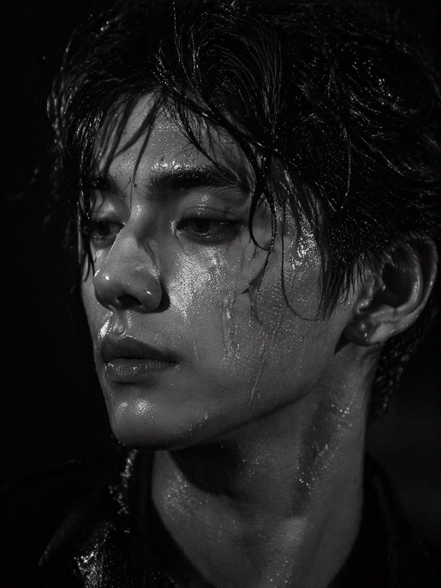
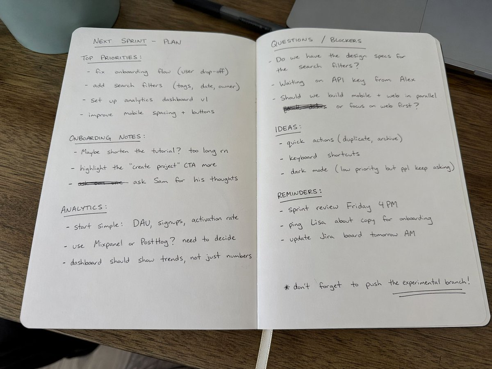

# 摄影与写实

> GPT Image 2 中文提示词案例分册 7。本分册共 20 个案例。

[返回索引](index.md)

## 案例目录

- [例 30：写实摄影风格图](#case-30)
- [例 31：人像写实摄影图](#case-31)
- [例 35：人像写实摄影图](#case-35)
- [例 42：写实摄影风格图](#case-42)
- [例 45：人像写实摄影图](#case-45)
- [例 52：写实摄影风格图](#case-52)
- [例 81：写实摄影风格图](#case-81)
- [例 142：写实摄影风格创作](#case-142)
- [例 165：清冷佳人夜市烧烤三刀流](#case-165)
- [例 173：银河繁星点缀的冰蓝襦裙](#case-173)
- [例 198：苍白陶瓷娃娃沙滩仰视](#case-198)
- [例 212：专业设计师打造角色写真集](#case-212)
- [例 240：胶片闪光灯下的球场少女](#case-240)
- [例 266：桌面上的黑色圆珠笔手写笔记](#case-266)
- [例 272：日式温泉旅馆人像](#case-272)
- [例 277：奢华魅力黑人女性海滨摄影](#case-277)
- [例 311：晨曦薰衣草田梦幻少女三联画](#case-311)
- [例 315：棘龙巨口中的酷飒少女与史前奇观](#case-315)
- [例 316：冲破次元壁的写实漫画跑者](#case-316)
- [例 328：俯拍巨女城景自拍](#case-328)

## 案例

<a id="case-30"></a>

### 例 30：写实摄影风格图


**提示词：**

```text
以涂鸦素描风格表达[{argument name="subject" default="强大的AI构建器"}]，呈现快速素描、自由变换、即兴手绘、草稿般的整体视觉效果。线条随意、夸张、粗细不一、略显杂乱，但有节奏、富有表现力，强调概括、夸张、趣味和自发性，而不是严格的写实或精细的细节。色彩采用粗犷、干刷的块状表现，保留不均匀的涂抹、刷痕、飞白、重叠的感觉。颜色会自动适应[主题/主题]，但整体表达仍然是涂鸦、素描和概括。没有透明的水彩晕染，没有细腻的水彩过渡，没有纸张纹理，没有柔和的雾化，没有梦幻般的质感。背景以留白为主，保持简单、轻松、未完成、设计感。可以添加少量辅助符号、箭头、标记、圆圈、重复线条、手写文字或其他涂鸦元素，以增强写生或散文式的视觉语言，但不宜过于拥挤或破坏留白的主题和氛围。图片内容无需提前写入； [{argument name="subject" default="强大的AI构建器"}]会自动推导并生成最合适的主图、动作、相关元素、符号或简化场景。整体保持了统一的涂鸦素描风格和夸张的概括表达，避免了复杂的写实背景和过度的阐述。自然地添加一个独特的签名“{argument name="signature" default="BlanPlan"}”作为图像的一部分，谨慎而清晰地放置在左下角、右下角或标题附近。风格应与整体布局统一，如艺术家的签名或设计题字；签名字体要精致、内敛、高端，不能太大，不能破坏主体构图，不能显得突兀或廉价。
```

***

<a id="case-31"></a>

### 例 31：人像写实摄影图


**提示词：**

```text
一幅高度细致、逼真的动漫风格肖像，描绘了一位年轻女子蹲下并从低角度略微低头看着镜头的情况。她有一头飘逸的长发，在风中轻轻飘扬，皮肤苍白，一双大眼睛富有表情。她穿着{argument name="outfit" default="日本校服，搭配浅灰色开衫、白衬衫、深色格子领结、深色格子百褶裙、深色及膝袜和黑色皮鞋"}。她的手臂随意地放在膝盖上。背景是明亮的{argument name="sky condition" default="清澈的蓝天，散落的白云"}，最底部可见模糊的{argument name="background setting" default="铁丝网和绿树"}，暗示着一个校园。灯光明亮，自然日光加上柔和的电影阴影，强调了她衣服和皮肤的真实纹理。
```

***

<a id="case-35"></a>

### 例 35：人像写实摄影图


**提示词：**

```text
{argument name="photography style" default="照片写实肖像，浅景深和柔和的散景"}一位{argument name="subject" default="年轻的日本女性"}回头看着镜头，脸上带着{argument name="expression" default="温柔的微笑"}。她穿着{argument name="attire" default="浅米色和服，带有橙色枫叶图案"}和金色腰带。她的深色头发盘成优雅的髻，松散的发丝勾勒出她的脸庞，戴着小珍珠耳环。背景是一个{argument name="setting" default="秋天的花园，有充满活力的红色枫叶"}，左上角有鲜红色的树叶，严重模糊的柔和背景营造出一种宁静的电影氛围。
```

***

<a id="case-42"></a>

### 例 42：写实摄影风格图


**提示词：**

```text
以涂鸦素描风格表达{argument name="subject" default="强大的AI构建器"}，呈现快速勾勒、自由变形、即兴手绘、草稿般的整体视觉效果。线条随意、夸张、粗细不一、略显杂乱，但有节奏、富有表现力，强调概括、夸张、趣味和自发性，而不是严谨的写实或精细的细节。颜色以粗糙的块状表达，具有明显的干刷感觉，保留了不均匀的涂抹、刷痕、飞白和层次感。颜色会自动适应{argument name="theme" default="powerful AI builder"}，但整体表达仍然像涂鸦、素描和概括。没有透明的水彩晕染效果，没有细腻的水彩过渡，没有纸张纹理，没有柔和的雾化，没有梦幻般的纹理。背景以留白为主，保持着简单、轻松、未完成、有设计感。可以添加少量的辅助符号、箭头、记号、圆圈、重复线条、手写文字或其他涂鸦元素，以增强素描本或散文式的视觉语言，但不宜过于拥挤或破坏主题和留白氛围。图片内容不需要提前写好； {argument name="character image" default="强大的AI构建器"}会自动推导并生成最合适的主图、动作、相关元素、符号或简化场景。整体风格保持统一的涂鸦素描风格和夸张、概括的表达方式，避免复杂的写实背景和过多的细节。一个特殊的签名“BlanPlan”应该作为图片的一部分自然添加，在低调但清晰的位置，例如左下、右下或标题附近。风格应与整体布局统一，如艺术家的签名或设计标记；签名字体要精致、内敛、高端，不能太大，不能破坏主体构图，不能显得突兀、廉价。
```

***

<a id="case-45"></a>

### 例 45：人像写实摄影图



**提示词：**

```text
一张引人注目的黑白特写肖像：{argument name="subject description" default="英俊的亚洲年轻男子"}，{argument name="hair style" default="凌乱的湿发粘在他的额头上"}。他的脸和脖子闪闪发光，覆盖着非常细致的{argument name="skintextureDetail"default="水滴和汗水"}。他的目光强烈而忧郁，目光投向镜头外的左边。灯光非常引人注目且对比度高，强调了他锐利的下巴轮廓、丰满的嘴唇以及在{argument name="background" default="pitch-black background"}的湿润皮肤上的镜面高光。以逼真、时尚的编辑风格和电影明暗对比进行拍摄。
```

***

<a id="case-52"></a>

### 例 52：写实摄影风格图


**提示词：**

```text
一张真实的白板照片，上面有一张非常详细的{argument name="marker color" default="green"}干擦记号笔绘图，内容是{argument name="subject" default="一个头髻凌乱、面部毛发凌乱、双手合十祈祷的武士"}。该角色采用{argument name="art style" default="detailed manga sketch"}风格绘制，以侧面显示，闭着眼睛，穿着传统和服，腰带上别着武士刀。在该字符的左侧，全大写的手写文本为“{argument name="text line 1" default="VAGABOND"}”，其正下方写着“{argument name="text line 2" default="MUSASHI"}”。白板具有光滑的表面，左侧具有逼真的光反射和眩光，底部边缘可见薄金属框架，给人以真实的教室或办公环境的印象。
```

***

<a id="case-81"></a>

### 例 81：写实摄影风格图


**提示词：**

```text
{
  "type": "科学硬件图",
  “布局”：{
    "main_scene": "光学平台的 3D 渲染，其中红色激光束穿过安装在黑色柱子上的 11 个对齐的光学组件。",
    “顶括号”：[
      {"label": "双调制", "span": "SLM1"},
      {"label": "4f 中继光学器件", "span": "镜头 L1 到镜头 L2"},
      {"label": "成像光学器件", "span": "SLM2 到镜头 L4"},
      {“label”：“检测”，“span”：“相机”}
    ],
    “光学组件_左到右”：[
      {"name": "激光", "labels": ["激光", "λ = {参数名称=\"激光波长\" 默认=\"632.8 nm\"}"]},
      {“名称”：“SLM1”，“标签”：[“SLM1”，“（相位/极化模式）”]}，
      {"name": "镜头 L1", "labels": ["镜头 L1", "(f1)"]},
      {"name": "Iris", "labels": ["傅里叶平面", "(光瞳平面)", "Iris", "(高阶滤波)"]},
      {“名称”：“HWP”，“标签”：[“HWP”，“（λ/2）”]}，
      {"name": "镜头 L2", "labels": ["镜头 L2", "(f1)"]},
      {"name": "SLM2", "labels": ["SLM2", "(相位/极化模式)"]},
      {"name": "镜头 L3", "labels": ["镜头 L3", "(f2)"]},
      {"name": "镜头 L4", "labels": ["镜头 L4", "(f2)"]},
      {"name": "线性偏振器", "labels": ["线性", "-偏振器", "(全局分析器)"]},
      {“名称”：“偏光相机”，“标签”：[“偏光相机”]}
    ],
    “插入框”：{
      "position": "右下角",
      "title": "偏光相机微偏光器阵列（每像素分析仪）",
      "grid": "带有方向箭头的彩色方块的 4x4 网格",
      “图例计数”：4，
      “传奇项目”：[
        “红色方块，水平箭头，0°（H）”，
        “绿色方块，垂直箭头，90° (V)”，
        “蓝色正方形，对角箭头，45° (D)”，
        “黄色正方形，对角箭头，135° (A)”
      ]
    },
    “底部标题”：{
      "figure_prefix": "{参数名称=\"图编号\" 默认=\"图5.\"}",
      "title": "{参数名称=\"系统名称\" 默认=\"椭圆成像硬件设置。\"}",
      “text”：“解释双调制配置、4f 中继光学器件和偏振相机的科学文本段落。”
    }
  }
}
```

***

<a id="case-142"></a>

### 例 142：写实摄影风格创作


**提示词：**

```text
{
  "type": "anime idol merchandise catalog flyer",
  "theme_colors": "{argument name=\"theme color\" default=\"pastel blue and pink\"}",
  "character": {
    "name": "{argument name=\"character name\" default=\"ななし\"}",
    "appearance": "anime girl, long {argument name=\"hair color\" default=\"pink\"} hair, blue eyes",
    "attire": "{argument name=\"outfit\" default=\"black and white maid outfit with a red bow tie\"} and blue hair ribbons"
  },
  "layout": {
    "header": {
      "left": "upper body portrait of the character looking slightly to the side",
      "center": {
        "top_banner": "ななし 2nd EP リリース記念ライブ",
        "main_title": "{argument name=\"event title\" default=\"おしごと☆メイド奮闘中！\"}",
        "subtitle": "~ Oshigoto Maid Funtouchu! ~",
        "section_header": "OFFICIAL GOODS"
      },
      "right": "purchase bonus info box containing 3 small rectangular photo prints"
    },
    "merchandise_grid": [
      { "id": "01", "name": "アクリルスタンド", "description": "full body acrylic stand of the character" },
      { "id": "02", "name": "缶バッジ", "description": "set of 6 circular can badges featuring different facial expressions" },
      { "id": "03", "name": "ビッグタオル", "description": "large rectangular towel showing the character holding a heart pillow" },
      { "id": "04", "name": "Tシャツ", "description": "white t-shirt showing FRONT with character graphic and BACK with small logo" },
      { "id": "05", "name": "マフラータオル", "description": "long narrow muffler towel with character art and logo" },
      { "id": "06", "name": "トートバッグ", "description": "canvas tote bag with blue logo" },
      { "id": "07", "name": "アクリルキーホルダー", "description": "chibi character acrylic keychain with a star-shaped clasp" },
      { "id": "08", "name": "ラバーバンド", "description": "blue silicone wristband with logo" },
      { "id": "09", "name": "ステッカーセット", "description": "set of 4 visible stickers: chibi character, heart, ribbon bow, and logo" },
      { "id": "10", "name": "ペンライト", "description": "blue glowing concert penlight" }
    ],
    "footer": {
      "left": "purchase notes and guidelines box",
      "center": "character signature 'Nanashi' with hand-drawn hearts and stars",
      "right": "payment methods box"
    }
  }
}
```

***

<a id="case-165"></a>

### 例 165：清冷佳人夜市烧烤三刀流


**提示词：**

```text
一个有着清冷孤傲气质的绝美佳人，精致的面部特征，一张冷酷且精致的高级时装面容，长发，以及优雅苗条的身材；烧烤“三刀流”姿势：嘴里叼着一根烧烤串，每只手各拿一根烧烤串交叉以模仿索隆的三刀流；街头夜景氛围，温暖黄色的夜市灯光，模糊的背景，胶片般的质感，柔焦光晕，电影般的叙事感，时髦高端网红风格的时尚拍摄，清晰发光的肌肤，清晰细致的发丝，生动的动态表情，低角度广角镜头，情绪化的暗调氛围，浅景深，超高清8K，极致细节，电影级光照
```

***

<a id="case-173"></a>

### 例 173：银河繁星点缀的冰蓝襦裙


**提示词：**

```text
服裝細節： 模特兒身穿一套精緻的淡冰藍色齊胸襦裙，採用多層輕盈的薄紗和絲綢歐根紗材質制成。其寬大的、半透明的廣袖上點綴著如繁星般微小的銀色和淺藍色亮片刺繡，在光線下閃爍（具有銀河般的夢幻感）。抹胸位置有複雜的銀色蕾絲和編織紋理細節，腰帶自然垂落。

材質與光影： 畫面呈現 8k 超高分辨率和對織物微距紋理的極致渲染。光線採用柔和的自然側光（丁達爾效應 Typndall Effect），精準地透射過輕薄的紗布，營造出面料的半透明感（Translucency）和流動感。

構圖與鏡頭： 採用 85mm 黄金人像鏡頭效果，f/1.8 大光圈，全身構圖，模特居中站立
```

***

<a id="case-198"></a>

### 例 198：苍白陶瓷娃娃沙滩仰视


**提示词：**

```text
{
  "相机参数": {
    "设备类型": "iPhone 15 Pro 前置自拍",
    "镜头": "24mm",
    "构图": "高角度 POV（第一人称视角）",
    "后期处理": "计算摄影风格，清晰的数字读出，深景深"
  },
  "主体描述": {
    "特征": "陶瓷娃娃审美，无瑕的苍白皮肤，巨大的冰蓝色眼睛，小巧的鼻子，翘起的自然色嘴唇",
    "表情": "面无表情，空洞，瞪大眼睛注视",
    "造型": "白金色的双紧辫发型，鲜艳的蓝色美甲",
    "服装": "浅蓝色紧身弹力棉上衣，极深超宽 V 领，深邃锁骨与领口线",
    "动作": "抬头仰视镜头，用一只手遮挡刺眼的阳光"
  },
  "环境与灯光": {
    "场景": "广阔的沙滩，背景中模糊的海平线",
    "灯光": "高调明亮的沿海日光，5500K 色温，强烈的白沙反光填充，均匀照明",
    "质感": "微带露水的无孔皮肤，细腻的反光白沙颗粒"
  },
  "技术约束": {
    "色彩科学": "柔和的粉彩色调，线性中性色，高曝光",
    "负面提示词": [
      "重阴影",
      "雪",
      "冬装",
      "红指甲",
      "黑色上衣",
      "保守的领口",
      "胶片颗粒感"
    ]
  }
}
```

***

<a id="case-212"></a>

### 例 212：专业设计师打造角色写真集


**提示词：**

```text
请用这个角色制作一本专业设计师打造的照片集。语言为日语。  

根据喜好加入提示词会让它更丰富多彩…  
・丰富的场景  
・信息量较多
```

***

<a id="case-240"></a>

### 例 240：胶片闪光灯下的球场少女


**提示词：**

```text
35毫米彩色胶片摄影，带有强烈的机顶直射闪光灯，皮肤和衣物上有镜面高光，眼睛里有强烈的眼神光，高对比度闪光灯照明，真实的胶片颗粒和色彩偏移，高级时尚清新纯真篮球场编辑风格，亲密的第一人称低角度仰视POV镜头，二十出头的性感中国女性偶像，具有超写实的精致细腻的中国特征，诱人的杏仁形狐狸眼，带有自然双眼皮，高鼻梁，小巧锋利的V型下颌线，无瑕逼真的瓷白肌肤，带有冷象牙色底调和可见的闪光镜面高光，细腻精致的皮肤纹理，带有微妙的毛孔微距细节和闪光灯下的自然水光感，清新自然的运动妆容，带有柔和的水光感，脸颊上有微妙的自然红晕，自然粉唇微张，鼻子和脸颊上有微妙的自然雀斑，深棕色长发扎成高高的俏皮马尾辫，有一些散落的发丝修饰脸型，以及逼真的散落发丝，穿着宽松的白色背心和白色高腰篮球短裤，白色及膝运动袜，在黄昏的户外球场上靠在篮球架杆上的诱人自然倾斜姿势，身体侧成角度，背部自然弓起，臀部轻轻向后推，以凸显挺拔圆润的臀部和性感的臀部曲线，一条腿自然向前伸向镜头，另一条腿微微弯曲以强调修长性感的双腿，双手轻轻放在肩膀高度的篮球杆上，极其诱人俏皮又惹人怜爱的鹿眼凝视直视观看者，带着柔软脆弱渴望的眼睛和温柔挑逗的微笑，充满安静的诱惑和欲望，强烈的机顶直射闪光灯产生锐利的镜面高光和强烈的眼神光，背景是黄昏天空下模糊的篮球场和篮筐，高对比度胶片调色，带有自然闪光灯外观，极其锐利却又柔和的皮肤渲染，具有真实的35毫米直射闪光美学，自然发丝，背心和短裤上逼真的织物纹理以及袜子细节，没有塑料感皮肤，没有数码过度锐化，没有磨皮，没有瑕疵，没有痣，没有油性皮肤，没有水印，没有文字，真实的35毫米直射闪光胶片篮球场外观 --ar 9:16
```

***

<a id="case-266"></a>

### 例 266：桌面上的黑色圆珠笔手写笔记



**提示词：**

```text
一张平放着的打开的笔记本的业余照片，里面填满了用黑色圆珠笔写的手写笔记。笔迹随意且略显凌乱，就像个人笔记，自然的瑕疵，划掉的单词，划线的标题。从略高角度拍摄，来自窗户的自然日光，未使用闪光灯。随意的桌面设置，用 iPhone 拍摄。
```

***

<a id="case-272"></a>

### 例 272：日式温泉旅馆人像


**提示词：**

```text
35mm胶片摄影，温暖复古的日式温泉旅馆美学，柔和的木灯笼灯光与柔和的自然窗光混合，细腻的胶片颗粒，柔和的色移，高调的编辑风格，亲密的中景，20岁出头的美丽中国女偶像，超写实精致的中国特色，诱人的杏仁形狐狸眼与自然的双眼皮，高鼻梁，小尖V形下颌线，完美的瓷质皮肤带有温暖的象牙色底色，可见微妙的皮肤纹理和微细毛孔，柔和自然的妆容带着露水的光泽，脸颊上有微妙的红晕，自然柔软的粉红色嘴唇微微分开，长长的深棕色头发扎成松散的低发髻，一些凌乱的发丝落在脸上和脖子上，穿着一件宽松的白色浴衣（日本传统浴袍）故意从肩膀上滑下来，松松地系在腰上，织物微微张开，露出光滑的皮肤和微妙的乳沟，赤脚，在老式温泉的传统木制远川阳台边缘摆出诱人的放松坐姿旅馆，身体微微转向镜头，一条腿弯曲，脚踩在木地板上，另一条腿轻轻悬垂，一手轻轻握住浴衣领子，另一只手支撑在身后的木地板上，轻轻弓起背部，轻轻突出曲线，强烈诱惑而又温柔诱人的目光直视观看者，柔和的母鹿眼睛充满安静的诱惑和温暖，温暖的木质内饰，纸质推拉门，远处热气腾腾的温泉，柔和的焦点，温柔的边缘灯光突出皮肤和织物纹理，正宗复古胶片暖色调调色，极其锐利而柔软的皮肤渲染，自然发丝，真实的织物皱纹和浴衣上的垂坠感，无塑料皮肤，无数字过度锐化，无喷枪，无瑕疵，无痣，无油性皮肤，无水印，无文字，正宗的35毫米胶片日本温泉旅馆氛围
```

***

<a id="case-277"></a>

### 例 277：奢华魅力黑人女性海滨摄影


**提示词：**

```text
奢华魅力美容肖像：, 美丽的黑人女性, 青春活力, 奶油香草色, 丝绸柔顺发, 红木色, 微妙的自信, 有质感的面料, 蓝宝石色, 极简珠宝, 海滨微风, 镜头光晕效果, 怀旧的, 电影镜头, 对称构图, 柔焦, 高级时尚摄影, 单色的, 水光质感, 神秘张力, 分层元素
```

***

<a id="case-311"></a>

### 例 311：晨曦薰衣草田梦幻少女三联画


**提示词：**

```text
日出时分薰衣草田中女子的水平三联画。
上部：半身像，闭着眼睛，淡紫色连衣裙，一只手放在头发里，模糊的薰衣草前景。
中部：特写镜头，看着镜头，蓬乱的头发，薄纱围巾，脸上的阳光。
下部：四分之三镜头，手持薰衣草花束，飘逸的裙子，柔和的粉彩天空，温暖的梦幻色调。
```

***

<a id="case-315"></a>

### 例 315：棘龙巨口中的酷飒少女与史前奇观


**提示词：**

```text
超写实电影级奇幻场景，设定在郁郁葱葱的史前丛林山谷中。一只巨大的棘龙站在浅河边，它那长而类似鳄鱼的巨颚张得很大。一位年轻女子平静地坐在恐龙张开的嘴里，完美居中，双腿微微向前悬挂。她有一头深色直发，表情镇定无畏，皮肤纹理逼真。她身穿合身的黑色长袖短款上衣，蓝色牛仔短裤和黑色及膝战术靴。衣服和腿上可见微小的血迹和轻微划痕，增加了戏剧性的紧张感但并不血腥。她怀里温柔地抱着一只小恐龙幼崽，充满保护欲地抱着它。

在他们身后，一道高耸而充满戏剧性的瀑布顺着覆盖着茂密绿色植被和薄雾的陡峭丛林悬崖倾泻而下。场景中栖息着多只恐龙：几只迅猛龙在河岸边潜行，小型食草动物在背景中奔跑，飞翔的翼龙在头顶盘旋。环境丰富，有长满苔藓的岩石、流动的河水、热带植物和柔和的大气雾。

灯光具有电影感和自然感，漫射的日光照亮场景，阴影细节丰富，焦点清晰地聚在女子和棘龙身上，背景元素采用浅景深。恐龙鳞片、牙齿、水珠、树叶和织物上的超写实纹理。史诗奇幻写实主义，戏剧性构图，垂直构图，超精细，照片级真实感，4K，电影级调色，无文字，无水印。
```

***

<a id="case-316"></a>

### 例 316：冲破次元壁的写实漫画跑者


**提示词：**

```text
{
  "prompt": "超写实，一位留着深色短卷发、修剪整齐的胡须和黑色方形眼镜的年轻男子的鲜艳逼真渲染，身穿深色纹理高领毛衣和牛仔裤。他奔跑到一半被捕捉下来，姿态充满动感，向前突破，充满戏剧性地从一个破碎的漫画分镜框中显现——一条腿和一只手臂冲入现实世界，而身体的其余部分仍留在漫画框内。他的表情充满活力和喜悦，拥有锐利的面部细节，自然的皮肤纹理，以及具有高对比度和深度的戏剧性电影灯光。\n\n背景：一个非常详细的黑白漫画布局，充满了幽默、夸张的且与他直接互动的反应场景。周围的漫画人物表现出震惊和喜剧的表情，配有粗体的对话气泡和速度线。漫画分镜采用经典的高对比度水墨风格绘制，线条清晰，网点阴影。撕裂的纸张边缘和碎片增强了他冲破漫画世界的幻觉。全彩色的写实人物与单色的漫画环境形成强烈对比，创造出写实与漫画艺术之间的动态混合体。超精细，8k分辨率，清晰聚焦，戏剧性的阴影，电影级景深。"
}
```

***

<a id="case-328"></a>

### 例 328：俯拍巨女城景自拍


**提示词：**

```text
{
  "type": "图像生成提示词",
  "language": "zh",
  "style": "超现实电影感自拍摄影",
  "aspect_ratio": "9:16",
  "identity_preservation": {
    "use_reference_image": true,
    "strict_identity_lock": true,
    "alter_face": false,
    "alter_skin": false,
    "alter_hair": false,
    "alter_gender": false,
    "notes": "保留上传参考图像中完全一致的脸部特征、皮肤纹理、头发、眼镜、年龄和性别。禁止合成皮肤或雕塑感。"
  },
  "subject": {
    "gender": "女性",
    "capture_method": "由主体本人拍摄的自拍",
    "pose": {
      "selfie_arm": {
        "description": "一只手臂完全伸直并完全向上伸展，手持拍摄自拍的相机",
        "visibility": "手臂在画面中清晰可见、笔直且占主导地位",
        "camera_visibility": "自拍相机设备本身不得在画面中出现"
      },
      "product_arm": {
        "description": "另一只手臂完全伸向相机，手持附带的佳能相机",
        "importance": "产品最靠近相机并在视觉上占主导地位"
      },
      "head": {
        "tilt": "头部向自拍相机微微倾斜"
      },
      "expression": "自然放松的面部表情"
    },
    "body_visibility": "从头到脚全身可见",
    "feet": "双脚清晰接触路面"
  },
  "composition": {
    "perspective": "胸部高度的自然自拍视角",
    "camera_angle": "极端俯拍角度，相机位于主体正上方并直视下方",
    "layer_depth": [
      "产品（最靠近相机）",
      "脸部",
      "全身",
      "城市环境（背景）"
    ]
  },
  "scale_and_perspective": {
    "effect": "强制透视",
    "subject_scale": "女性呈现极度巨大",
    "buildings_scale": "建筑物显得小得多，最高不超过她的膝盖",
    "dominance": "主体在视觉上完全主导整个场景",
    "realism": "激发规模感同时保持物理可信"
  },
  "environment": {
    "location": "真实城市十字路口",
    "elements": [
      "人行横道",
      "道路标线",
      "交通标志",
      "汽车",
      "自行车",
      "真实人类尺度的行人"
    ],
    "setting": "地面层城市环境"
  },
  "lighting": {
    "type": "自然日光",
    "conditions": "晴朗或轻度多云天空",
    "shadows": "柔和且真实",
    "restrictions": "禁止奇幻或戏剧性照明"
  },
  "product_rules": {
    "usage": "完全按提供的上传佳能产品使用",
    "distortion": "无",
    "logo": "保持不变",
    "appearance": "仅有自然反射和真实高光"
  },
  "camera_quality": {
    "realism": "最大照片真实感",
    "depth": "前景、主体与背景清晰分离",
    "artifacts": "无"
  },
  "constraints": [
    "禁止AI艺术感",
    "禁止塑料或雕塑皮肤",
    "禁止扭曲脸部或身体",
    "禁止多余肢体或错误解剖",
    "禁止文字或水印",
    "禁止可见自拍相机设备"
  ],
  "output_goal": "创作一张超现实电影感自拍图像：女性使用其确切参考身份，从极端俯拍视角在真实城市人行横道拍摄，具备强制透视比例、自然日光，并将佳能相机产品明显持向镜头。"
}
```

***
