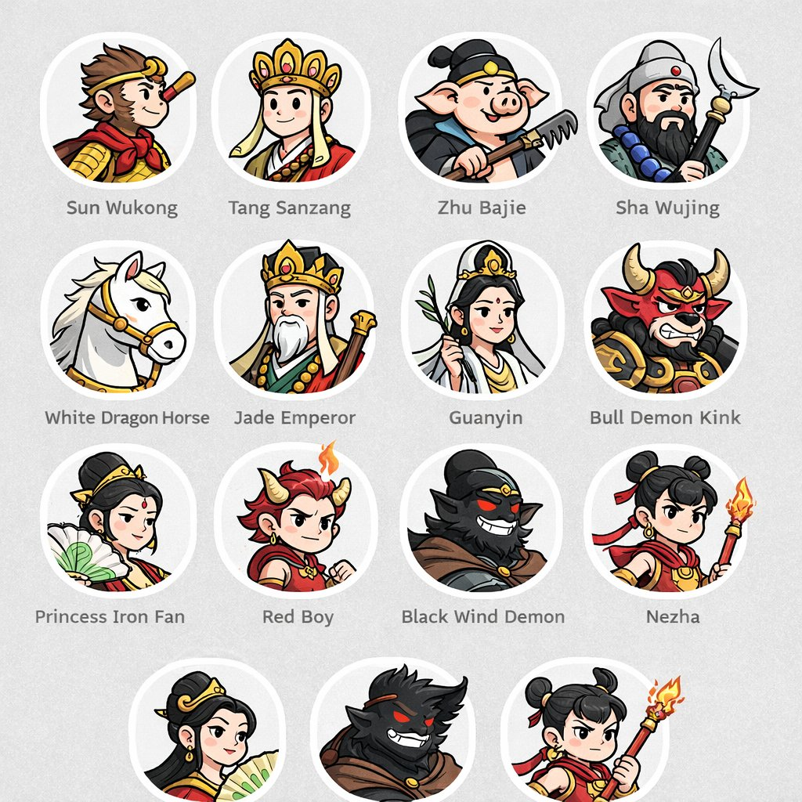
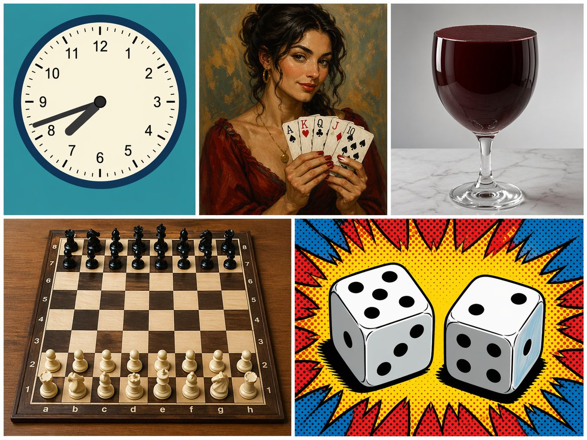
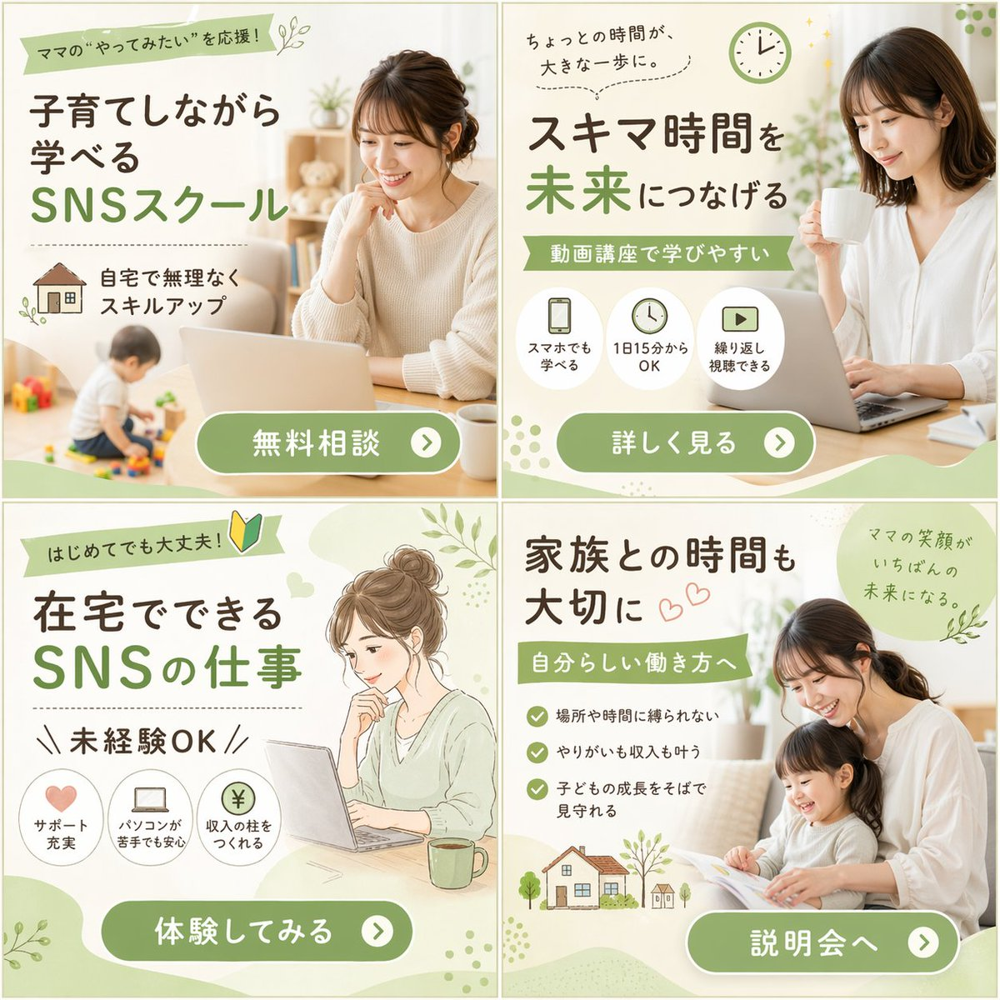
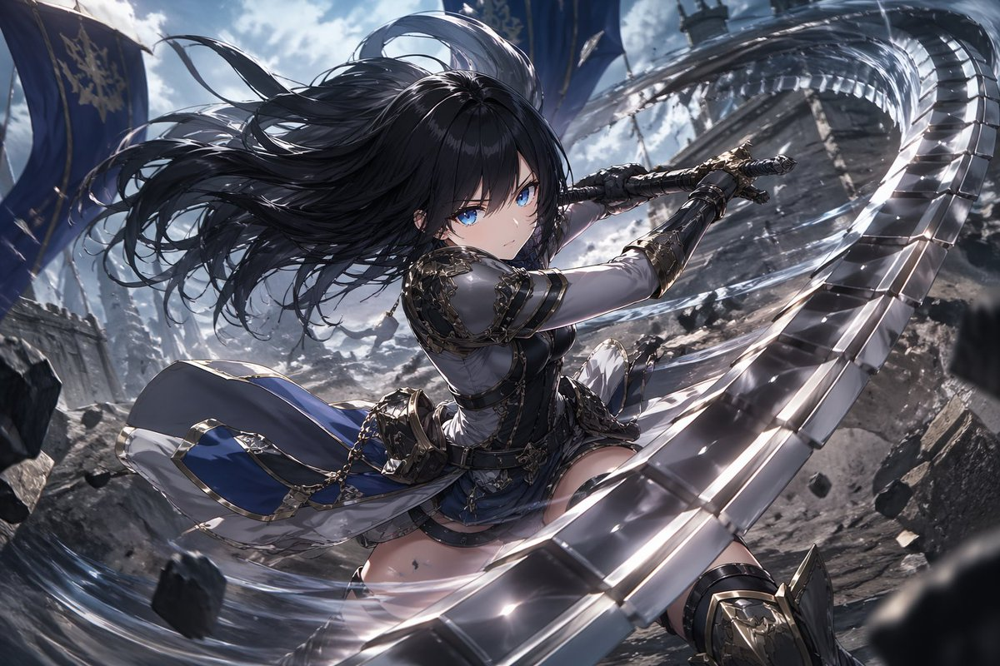
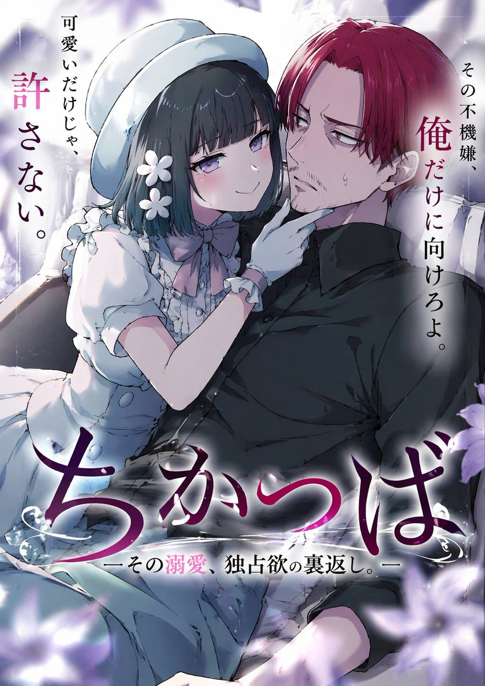
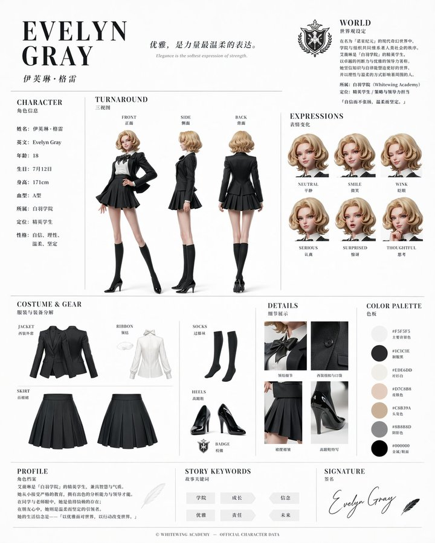

# 插画与艺术

> GPT Image 2 中文提示词案例分册 8。本分册共 27 个案例。

[返回索引](index.md)

## 案例目录

- [例 6：插画艺术创作图](#case-6)
- [例 22：插画艺术风格创作](#case-22)
- [例 24：漫画分镜叙事设计](#case-24)
- [例 32：插画艺术创作图](#case-32)
- [例 34：插画艺术创作图](#case-34)
- [例 41：插画艺术风格创作](#case-41)
- [例 43：插画艺术创作图](#case-43)
- [例 60：漫画分镜叙事设计](#case-60)
- [例 62：插画艺术风格创作](#case-62)
- [例 93：插画艺术风格创作](#case-93)
- [例 94：绘画艺术风格图](#case-94)
- [例 105：动漫插画创作图](#case-105)
- [例 113：动漫插画创作图](#case-113)
- [例 114：插画艺术创作图](#case-114)
- [例 118：漫画分镜叙事设计](#case-118)
- [例 123：插画艺术创作图](#case-123)
- [例 126：插画艺术风格创作](#case-126)
- [例 174：唐朝贵妇遛粉色马甲异形工笔画](#case-174)
- [例 196：试卷上的涂鸦巨龙](#case-196)
- [例 202：宅男必看绝美二次元少女](#case-202)
- [例 238：星云巨鲤与小人的奇幻对话](#case-238)
- [例 242：绝美国风工笔画书签设计](#case-242)
- [例 285：真实动漫画面快照](#case-285)
- [例 306：官方角色设定资料卡](#case-306)
- [例 309：创意树叶拼贴构成的角色画像](#case-309)
- [例 325：皮克斯风阳光少年](#case-325)
- [例 346：立体刺绣小鸟花枝](#case-346)

## 案例

<a id="case-6"></a>

### 例 6：插画艺术创作图


**提示词：**

```text
参考图是角色人设图，为参考图的少女绘制一副日系唯美奇幻风格插画。 
【构图】这是一个宏大的中景日系奇幻插画构图，画面中心是完全保留了完整细节的可爱少女，她站立在无边的、如镜面般平滑的水面中心。天空呈现出高饱和度的粉紫与深蓝交织，一条耀眼的蓝色巨型流星划破天际，配合着边缘发光的瑰丽层云。女孩处于背光状态，形成一个暗调但依然清晰可辨其服装和紫色明亮眼眸的剪影，被流星和星空的边缘光细腻勾勒，她微微仰头，一只手轻轻张开。下方的水面完美、对称地反射出整个壮丽的星空、流星、云彩，以及女孩清晰的倒影，点缀着微小的发光点，营造出天人合一、空灵静谧的唯美梦境意境。 
【日系唯美奇幻风格说明】该风格以高饱和度的粉紫冷暖色调交织出浩瀚星空，并辅以壮丽的流星与边缘发光的层云作为视觉奇观；画面巧妙利用“天空之镜”般的完美水面反射，将宏大的宇宙背景与孤独静立的人物剪影相融合，通过极具电影感的光影渲染与高对比度的表现手法，营造出一种空灵、静谧且带有超现实宿命感的梦境氛围。 
【要求】生成图片的比例9:16，分辨率 4k。
```

***

<a id="case-22"></a>

### 例 22：插画艺术风格创作


**提示词：**

```text
An anime-style illustration of a {argument name="action type" default="high-impact martial arts battle"} between two young female fighters in a {argument name="setting" default="traditional wooden martial arts dojo"}. In the foreground, a girl with black hair in a high bun wears a {argument name="character 1 color theme" default="red and white"} Chinese-style martial arts outfit with baggy pants. She is in a dynamic, low, forward-thrusting stance, surrounded by swirling red energy and water splashes. In the background to the right, a girl with light purple hair in twin buns wears a {argument name="character 2 color theme" default="green and purple"} Chinese dress with gold embroidery and black tights. She is leaping through the air in a flying kick pose, surrounded by swirling blue energy. The wooden floorboards are splintering from the intense impact, with debris and dust flying through the air. Above them hangs a weathered wooden sign with the text "{argument name="sign text" default="武術会"}". The scene features dramatic lighting, a low-angle dynamic perspective, and intense action effects.
```

***

<a id="case-24"></a>

### 例 24：漫画分镜叙事设计


**提示词：**

```text
原神 {argument name="character" default="Raiden Shogun"} 在{argument name="event" default="上海动漫展"}上的角色扮演自拍照
```

***

<a id="case-32"></a>

### 例 32：插画艺术创作图


**提示词：**

```text
{
  "type": "3x3 字符表达网格",
  "style": "{参数名称=\"艺术风格\" 默认=\"3D动画，皮克斯风格\"}",
  "character_base": "{参数名称=\"角色描述\" 默认=\"有着浓密深色卷发和圆框眼镜的年轻女子\"}",
  "common_theme": "{参数名称=\"框架概念\" 默认=\"从白皮书的破洞中窥视\"}",
  “布局”：{
    “行”：3，
    “列”：3，
    “总面板”：9，
    “面板”：[
      {"position": "左上", "表情": "眨眼", "action": "调整眼镜", "outfit": "绿色毛衣"},
      {"position": "顶部中心", "表情": "傻笑", "action": "放下墨镜", "outfit": "红色皮夹克"},
      {"position": "右上", "express": "思考", "action": "手指放在下巴上", "outfit": "黄色连帽衫"},
      {"position": "中左", "表情": "灿烂的笑容", "action": "手臂放在边缘", "outfit": "黑白条纹衬衫"},
      {"position": "中间中心", "表情": "微笑", "action": "竖起大拇指", "outfit": "橙色系扣衬衫"},
      {"position": "中偏右", "表情": "中性", "action": "喝珍珠奶茶", "outfit": "蓝色毛衣"},
      {"position": "左下角", "表情": "高兴", "action": "挥手", "outfit": "紫色毛衣背心+白衬衫"},
      {"position": "bottom-center", "express": "闭眼大笑", "action": "双臂交叉", "outfit": "粉色开衫"},
      {"position": "右下", "表情": "傻", "action": "戳脸颊", "outfit": "青色毛衣"}
    ]
  }
}
```

***

<a id="case-34"></a>

### 例 34：插画艺术创作图



**提示词：**

```text
{
  "type": "角色头像网格",
  "theme": "{参数名称=\"主题\" 默认=\"西游神话\"}",
  "style": "{参数名称=\"艺术风格\" default=\"干净的2D卡通矢量图，粗轮廓，扁平的颜色\"}",
  “布局”：{
    "background": "{参数名称=\"背景颜色\" 默认=\"浅灰色\"} 微妙的纹理",
    "format": "圆形肖像网格，文本标签位于每个圆圈下方的中心",
    “行”：[
      {
        “计数”：4，
        “项目”：[
          {"label": "孙悟空","description": "金头巾红领巾猴童"},
          {"label": "唐三藏","description": "金冠和尚"},
          {"label": "猪八戒", "description": "拿着耙子的猪猪侠"},
          {"label": "沙雾经","description": "大胡子手持月牙杖"}
        ]
      },
      {
        “计数”：4，
        “项目”：[
          {"label": "白龙马","description": "金辔白马"},
          {"label": "玉皇大帝","description": "白须金冠老人"},
          {"label": "观音", "description": "手持柳枝的观音"},
          {"label": "牛魔扭结", "description": "身穿铠甲的凶猛牛魔"}
        ]
      },
      {
        “计数”：4，
        “项目”：[
          {"label": "铁扇公主", "description": "拿着绿棕叶扇的女人"},
          {"label": "红男孩", "description": "红头发、角和小火焰的男孩"},
          {"label": "黑风恶魔", "description": "红眼睛发光的黑暗阴影恶魔"},
          {"label": "哪吒","description": "双发髻手持火矛的少年"}
        ]
      },
      {
        “计数”：3，
        "description": "部分行重复铁扇公主、黑风魔、哪吒，底部略有裁剪"
      }
    ]
  }
}
```

***

<a id="case-41"></a>

### 例 41：插画艺术风格创作


**提示词：**

```text
{ "type": "VTuber profile sheet", "theme": "{argument name=\"color theme\" default=\"purple and white\"}, elegant, lace, ribbon motifs", "character": { "name": "{argument name=\"character name\" default=\"紫咲リリー\"}", "archetype": "{argument name=\"character archetype\" default=\"elegant ojousama\"}", "appearance": "anime girl, long black hair with purple highlights, purple eyes, wearing a white blazer, purple pleated skirt, thigh-highs, ribbons", "pose": "standing, finger to lips, looking slightly to the side" }, "chibi_character": { "appearance": "same character in chibi form", "pose": "sitting down, smiling" }, "layout": { "header": { "top_left": "Ribbon banner reading 'VTuber Profile'", "top_center": "Logo with text '{argument name=\"vtuber type\" default=\"清楚系お嬢様Vtuber\"}' and '{argument name=\"character name\" default=\"紫咲リリー\"}' and 'Shisaki Lily'", "top_right": "Quote '{argument name=\"catchphrase\" default=\"皆さまの心に、優雅なひとときをお届けしますわ\"}' followed by a 3-line introductory paragraph" }, "columns": [ { "position": "left", "content": "Full-body character portrait" }, { "position": "center", "sections": [ { "title": "Profile", "count": 9, "labels": ["名前", "誕生日", "年齢", "身長", "属性", "一人称", "出身", "職業", "活動開始日"] }, { "title": "Personality", "content": "2-line text block" }, { "title": "Hobby & Special Skill", "count": 2, "labels": ["趣味", "特技"] }, { "title": "Like & Dislike", "count": 2, "labels": ["好きなもの", "苦手なもの"] } ] }, { "position": "right", "sections": [ { "title": "Streaming Content", "content": "1-line text block" }, { "title": "Schedule", "count": 2, "labels": ["配信時間", "配信頻度"] }, { "title": "Goals", "content": "3-line text block" }, { "title": "Fan & Tag", "count": 3, "labels": ["ファンネーム", "ファンアートタグ", "総合タグ"], "extra": "4 hashtag rows with small icons" }, { "title": "Creator", "count": 3, "labels": ["イラストレーター (ママ)", "モデラー (パパ)", "使用モデル"] }, { "title": "Links", "count": 4, "labels": ["YouTube", "X (Twitter)", "BOOTH", "FANBOX"] }, { "content": "Chibi character illustration placed at the bottom right corner" } ] } ], "footer": { "sections": [ { "title": "Rules", "count": 3, "description": "3 bullet points with heart icons" }, { "content": "2-line closing message at the bottom center" } ] } } }
```

***

<a id="case-43"></a>

### 例 43：插画艺术创作图


**提示词：**

```text
{
  "type": "人物肖像网格",
  "theme": "{参数名称=\"主题\" 默认=\"权力的游戏角色\"}",
  "style": "{参数名称=\"艺术风格\" 默认=\"2D 平面插画，干净的线条艺术，漫画风格，侧面视图朝右，苍白的皮肤带腮红\"}",
  “布局”：{
    “网格”：“3x3”，
    "background": "浅灰色纹理",
    "frame_style": "白色圆角矩形框架，每个框架下方带有文本标签"
  },
  “计数”：9，
  “肖像”：[
    { "label": "琼恩·雪诺", "description": "黑发一半向上，胡须，深色毛皮斗篷" },
    { "label": "丹妮莉丝·坦格利安", "description": "银色辫子，蓝色连衣裙" },
    { "label": "提利昂·兰尼斯特", "description": "棕色卷发、胡须、带金别针的深色外衣" },
    { "label": "瑟曦·兰尼斯特", "description": "金发辫子，华丽的红色和金色连衣裙" },
    { "label": "奈德·史塔克", "description": "棕色头发半高，胡须，深色毛皮斗篷" },
    { "label": "艾莉亚·史塔克", "description": "短黑发半向上，棕色束腰外衣，剑柄" },
    { "label": "詹姆·兰尼斯特", "description": "金色短发，狮子图案金色盔甲" },
    { "label": "珊莎·史塔克", "description": "红色辫子，蓝色毛领连衣裙" },
    { "label": "席恩·葛雷乔伊", "description": "深色短卷发，带有海妖别针的深色束腰外衣" }
  ]
}
```

***

<a id="case-60"></a>

### 例 60：漫画分镜叙事设计



**提示词：**

```text
{
  "type": "5 面板拼贴",
  "layout": "具有 3 个顶部面板和 2 个底部面板的网格",
  “面板”：[
    {
      "position": "左上角",
      “主题”：“模拟时钟”，
      "details": "青色背景，时间显示{参数名称=\"时钟时间\" 默认=\"7:42\"}",
      “style”：“平面矢量图”
    },
    {
      "position": "中上",
      "subject": "拿着扑克牌的女人",
      "details": "持有 5 张牌：{参数名称=\"牌手\" 默认=\"黑桃 A、红心 K、梅花 Q、方块 J、黑桃 10\"}",
      "style": "经典油画肖像"
    },
    {
      "position": "右上角",
      "subject": "一杯红色液体",
      "details": "{参数名称=\"玻璃类型\" default=\"酒杯\"}充满深红色液体，大理石表面",
      “风格”：“写实工作室摄影”
    },
    {
      "position": "左下角",
      “主题”：“棋盘”，
      "details": "标准起始位置有 32 块木板",
      “style”：“逼真的高角度拍摄”
    },
    {
      "position": "右下角",
      "subject": "两个骰子",
      "details": "左骰子在顶部显示{参数名称=\"左骰子顶部\"默认=\"5\"}，右骰子在顶部显示{参数名称=\"右骰子顶部\"默认=\"2\"}",
      “风格”：“波普艺术漫画书半色调与红色和蓝色爆发”
    }
  ]
}
```

***

<a id="case-62"></a>

### 例 62：插画艺术风格创作



**提示词：**

```text
{
  "type": "2x2 grid of banner advertisements",
  "theme": "{argument name=\"main theme\" default=\"SNSスクール\"} for {argument name=\"target audience\" default=\"ママ\"}",
  "design_style": "soft, approachable, bright lighting, featuring {argument name=\"color palette\" default=\"soft green, white, and natural beige tones\"}",
  "layout": {
    "sections": [
      {
        "position": "top-left",
        "visual_style": "photography",
        "image_description": "Smiling woman working on a laptop at a table, a toddler playing with toys in the blurred background.",
        "headlines": ["ママの“やってみたい”を応援！", "子育てしながら学べる", "SNSスクール"],
        "features": {
          "count": 1,
          "type": "icon with text",
          "labels": ["自宅で無理なくスキルアップ (with house icon)"]
        },
        "call_to_action_button": "無料相談"
      },
      {
        "position": "top-right",
        "visual_style": "photography",
        "image_description": "Smiling woman holding a white mug, looking at a laptop.",
        "headlines": ["ちょっとの時間が、大きな一歩に。", "スキマ時間を未来につなげる", "動画講座で学びやすい"],
        "features": {
          "count": 3,
          "type": "circular icons with text below",
          "labels": ["スマホでも学べる (smartphone icon)", "1日15分からOK (clock icon)", "繰り返し視聴できる (play button icon)"]
        },
        "call_to_action_button": "詳しく見る"
      },
      {
        "position": "bottom-left",
        "visual_style": "watercolor illustration",
        "image_description": "Illustration of a woman with hair in a bun, smiling at a laptop with a green mug nearby.",
        "headlines": ["はじめてでも大丈夫！ (with beginner mark)", "在宅でできるSNSの仕事", "未経験OK"],
        "features": {
          "count": 3,
          "type": "circular icons with text below",
          "labels": ["サポート充実 (heart icon)", "パソコンが苦手でも安心 (laptop icon)", "収入の柱をつくれる (yen coin icon)"]
        },
        "call_to_action_button": "体験してみる"
      },
      {
        "position": "bottom-right",
        "visual_style": "photography",
        "image_description": "Smiling mother and young daughter sitting on a sofa reading a picture book together.",
        "headlines": ["家族との時間も大切に", "自分らしい働き方へ", "ママの笑顔がいちばんの未来になる。"],
        "features": {
          "count": 3,
          "type": "checkmark bullet points",
          "labels": ["場所や時間に縛られない", "やりがいも収入も叶う", "子どもの成長をそばで見守れる"]
        },
        "extra_graphics": "Small illustration of a house and trees at the bottom left.",
        "call_to_action_button": "説明会へ"
      }
    ],
    "common_elements": "All panels feature a {argument name=\"button style\" default=\"rounded green pill button with white text and a right-pointing arrow icon\"} at the bottom."
  }
}
```

***

<a id="case-93"></a>

### 例 93：插画艺术风格创作


**提示词：**

```text
{
  "type": "VTuber stream thumbnail",
  "style": "anime, highly detailed, cute, sparkly, overwhelmingly pink color palette",
  "character": {
    "description": "anime girl with brown hair in twin buns, amber eyes, smiling gently",
    "outfit": "pink kimono combined with a white frilly maid apron, cherry blossom hair accessories",
    "pose": "holding a pink microphone decorated with a flower near her face"
  },
  "layout": {
    "background": "pink gradient with sparkles, glowing hearts, and decorative pink bows",
    "text_sections": [
      {
        "type": "top ribbon",
        "text": "{argument name=\"top subtitle\" default=\"まったりおしゃべりしよ〜🤍\"}"
      },
      {
        "type": "main title",
        "text": "{argument name=\"main title\" default=\"雑談配信\"}",
        "decorations": "surrounded by 3 large peach illustrations"
      },
      {
        "type": "middle ribbon",
        "text": "{argument name=\"middle subtitle\" default=\"みんなと楽しい時間を過ごしたいなっ♡\"}"
      },
      {
        "type": "bullet points",
        "position": "bottom left",
        "count": 3,
        "icon": "peach",
        "labels": [
          "{argument name=\"bullet 1\" default=\"初見さん〇\"}",
          "{argument name=\"bullet 2\" default=\"ポイント回収〇\"}",
          "ROMO"
        ]
      },
      {
        "type": "speech bubble",
        "position": "bottom right",
        "text": "コメント大歓迎♪ いっぱいお話し しようねっ♡"
      }
    ]
  }
}
```

***

<a id="case-94"></a>

### 例 94：绘画艺术风格图


**提示词：**

```text
{
  "type": "VTuber stream thumbnail",
  "theme": "pastel pink, soft, cute, lace, ribbons, hearts, bunny motif",
  "character": {
    "position": "right side, waist-up",
    "appearance": "anime girl, {argument name=\"hair color\" default=\"pastel pink\"} long wavy hair, large grey eyes, blush, pink heart earrings",
    "accessories": "white bunny ears, large pink bow on head",
    "outfit": "white frilly dress with lace, large pink ribbon bow at collar with heart gem"
  },
  "layout": {
    "background": "soft pink with subtle sparkles, lace patterns, floating hearts",
    "text_elements": [
      {
        "type": "main title",
        "position": "top left",
        "style": "large stylized pink text with white outline",
        "text": "{argument name=\"main title\" default=\"雑談配信\"}"
      },
      {
        "type": "speech bubble",
        "position": "above main title",
        "text": "まったり"
      },
      {
        "type": "circular badge",
        "position": "top right",
        "details": "lace-edged with small pink bow",
        "text": "きてくれてありがとう♡"
      },
      {
        "type": "heart badge",
        "position": "bottom right",
        "details": "large lace-edged heart",
        "text": "みんなとおしゃべりできるの楽しみにしてるね♡"
      }
    ],
    "list_section": {
      "position": "bottom left",
      "count": 3,
      "style": "horizontal pill-shaped banners with lace edges, each featuring a pink heart with white bunny ears and a tiny bow on the left",
      "items": [
        "{argument name=\"list item 1\" default=\"初見さん〇\"}",
        "{argument name=\"list item 2\" default=\"ポイント回収〇\"}",
        "{argument name=\"list item 3\" default=\"ROM〇\"}"
      ]
    }
  }
}
```

***

<a id="case-105"></a>

### 例 105：动漫插画创作图


**提示词：**

```text
A high-energy VTuber thumbnail illustration of a smiling anime girl with {argument name="hair color" default="bright blue"} hair in a high ponytail wearing a white shirt. The background is an explosive burst of rainbow light rays and golden sparkles. A golden retro microphone sits in the bottom left. Massive, shiny 3D gold text on the left reads "{argument name="main title text" default="初配信"}". A 3D gold and blue subtitle reads "{argument name="subtitle text" default="一緒に最高の時間を！"}". An ornate blue and gold oval badge in the bottom right displays "{argument name="character name" default="エリン Erin"}". A red top-right badge reads "{argument name="badge text" default="LIVE"}".
```

***

<a id="case-113"></a>

### 例 113：动漫插画创作图



**提示词：**

```text
一幅非常详细的动画插图，描绘了一位凶猛的女战士，拥有飘逸的长发和锐利的{argument name="eye color" default="blue"}眼睛，身穿金色镶边的银色板甲和{argument name="outfit color" default="blue and White"}外衣。她以一种动态的战斗姿态被捕捉到，挥舞着一把巨大的{argument name="weapon type" default="segmentedMetallick-whip-sword"}，它戏剧性地弯曲到最远的前景。该武器留下了一道扫过的动能和风的痕迹。该场景以{argument name="background setting" default="废墟战场为背景，岩石地形、漂浮碎片和大型蓝色横幅在风中飘扬"}，天空阴云密布。该艺术作品具有电影般的灯光、激烈的动作以及对武器的戏剧性强制视角。
```

***

<a id="case-114"></a>

### 例 114：插画艺术创作图


**提示词：**

```text
{
  "type": "4格竖式漫画",
  "style": "{参数名称=\"艺术风格\" 默认=\"黑白铅笔素描、剖面线阴影、讽刺漫画漫画\"}",
  “字符”：{
    "subject_1": "{参数名称=\"主角\" 默认=\"山姆·奥特曼\"}，卷发，休闲毛衣",
    "subject_2": "{参数名称=\"采访者\" 默认=\"罗南·法罗\"}，西装，领带，拿着记事本"
  },
  “布局”：{
    “面板”：[
      {
        “面板编号”：1，
        "top_caption": "萨姆·奥特曼认为这将是一个不错的小简介……",
        "scene": "subject_1 双手交叉，看上去得意洋洋；subject_2 看上去很认真地做笔记。",
        "thought_bubble": "我会很有魅力。这将是一个很棒的角色。人们会喜欢它。",
        "center_text": "罗南·法罗采访",
        “插入肖像”：{
          “计数”：2，
          "labels": ["哈维·韦恩斯坦曝光", "莱斯利·穆恩维斯曝光"]
        },
        “信息框”：{
          “计数”：3，
          “文本”：[
            “罗南·法罗：在《纽约客》上揭露哈维·韦恩斯坦的普利策奖获奖记者”，
            “还有哥伦比亚广播公司的莱斯利·穆恩维斯。”,
            “权力。滥用。责任。”
          ]
        }
      },
      {
        “面板编号”：2，
        "top_caption": "切至...",
        "scene": "subject_1 的特写镜头看起来很震惊。",
        "article_header": "{argument name=\"publication\" default=\"THE NEW YORKER\"}\nSAM ALTMAN 简介\nOPENAI CEO 的复杂任务\n作者：Ronan Farrow"
      },
      {
        “面板编号”：3，
        "top_caption": "文章发布后不久...",
        "scene": "subject_1 看起来压力很大，满头大汗，把手机放在耳边。周围有 6 只手拿着智能手机。",
        "phone_labels": ["VC"、"记者"、"前员工"、"投资者"、"技术首席执行官"、"前同事"],
        “喊叫”：{
          “计数”：8，
          “文本”：[
            "{参数名称=\"主要指控\" 默认=\"骗子\"}!",
            “强迫性的骗子！”，
            “病态的骗子！”，
            “你不能停止撒谎！”，
            “骗子！！！”，
            “社交变态者！（据称）”，
            “他说的一切都是谎言！”，
            “操纵性的骗子！”
          ]
        },
        "sound_effects": "铃声！铃声！铃声！"
      },
      {
        “面板编号”：4，
        "top_caption": "报告结论...",
        "scene": "subject_1 看起来完全失败和沮丧。","quote_box": "\"奥特曼经常对投资者、员工、董事会甚至亲密朋友撒谎。\"\n\"他似乎不愿意说谎。\"\n\"从很多方面来看，他是一个强迫性的说谎者和一个社交路径。\"\n（据称）",
        “思想泡泡”：{
          "scene": "快乐的 subject_1 拿着“世界最佳首席执行官”马克杯。",
          "text": "我认为这会是一个不错的小配置文件......",
          “sparkle_words”：{
            “计数”：4，
            "text": [“天才！”、“有远见！”、“鼓舞人心！”、“才华横溢的领导者！”]
          }
        },
        "bottom_caption": "相反，是个人资料暴露了他。"
      }
    ]
  }
}
```

***

<a id="case-118"></a>

### 例 118：漫画分镜叙事设计


**提示词：**

```text
一幅高对比度的黑白插图，描绘了一位身穿锋利西装的老人正在画武士刀。男人有着向后梳的白发，皱纹很深，低头看着刀刃，表情紧张而专注。他穿着深色西装、白衬衫和深色领带。他的手在前景中占据显着位置，当他们握住武士刀华丽的手柄和刀鞘时，呈现出明显的静脉和皱纹。背景是全黑的，强调了戏剧性的灯光和男人的脸、手和衣服上复杂的交叉阴影细节。这种风格类似于一部详细、坚韧的漫画或图画小说。
```

***

<a id="case-123"></a>

### 例 123：插画艺术创作图


**提示词：**

```text
{
  "type": "anime character reference sheet",
  "character": {
    "name": "{argument name=\"character name\" default=\"真田大助\"}",
    "appearance": "young warrior with long brown hair, wearing samurai-inspired armor, {argument name=\"main color\" default=\"red\"} chest plate and guards, {argument name=\"secondary color\" default=\"navy blue\"} pleated hakama, white short cape"
  },
  "layout": {
    "header": {
      "title": "{argument name=\"character name\" default=\"真田大助\"}",
      "subtitle": "{argument name=\"character concept\" default=\"戦国時代を舞台にした物語の主人公。日英クォーターの若き武将。\"}",
      "badge": "設定資料"
    },
    "right_side": {
      "main_portrait": "large full-body standing pose, confident smile",
      "background_elements": {
        "emblem": "six-coin crest",
        "quote": "{argument name=\"catchphrase\" default=\"この国を守る。その誇りと共に。\"}",
        "scenery": "monochrome Japanese castle with army banners at the bottom right"
      }
    },
    "sections": [
      {
        "title": "プロフィール",
        "position": "top-left",
        "content": "table with 6 rows and descriptive text"
      },
      {
        "title": "三面図",
        "position": "mid-left",
        "count": 3,
        "labels": ["正面", "側面", "背面"]
      },
      {
        "title": "表情差分",
        "position": "top-center",
        "count": 6,
        "labels": ["通常", "微笑み", "真剣", "怒り", "驚き", "考え中"]
      },
      {
        "title": "衣装・装備詳細",
        "position": "bottom-left",
        "count": 9,
        "labels": ["胸当て", "肩当て", "腕甲(籠手)", "脚甲(脛当て・膝当て)", "革靴", "白マント(短)", "帯", "袴/着物部分", "打刀"]
      },
      {
        "title": "カラーパレット",
        "position": "bottom-center",
        "count": 8,
        "labels": ["真田赤", "濃紺", "金", "白", "茶", "茶褐色", "肌色", "銀"]
      },
      {
        "title": "世界観",
        "position": "bottom-center-right",
        "content": "paragraph of text describing the setting"
      }
    ]
  }
}
```

***

<a id="case-126"></a>

### 例 126：插画艺术风格创作



**提示词：**

```text
An anime-style light novel cover illustration featuring two characters in an intimate pose. On the left, a young woman with short dark hair, purple eyes, wearing a white hat, a frilly white dress with a pink bow tie, white gloves, and two white flower hairpins. She has an affectionate, teasing smile and is gently touching the chin of the man next to her. On the right, an adult man with {argument name="man's hair color" default="red"} hair parted in the middle, purple eyes, and a light goatee. He is wearing a black button-down shirt and has a slightly annoyed, reluctant expression with a sweat drop on his cheek. The scene features soft, romantic lighting with out-of-focus purple flower petals in the foreground corners. The image includes several Japanese text elements: a large stylized main title at the bottom reading {argument name="main title" default="ちかつば"}, a subtitle below it reading {argument name="subtitle" default="ーその溺愛、独占欲の裏返し。ー"}, vertical text on the top left reading {argument name="left quote" default="可愛いだけじゃ、許さない。"}, and vertical text on the top right reading {argument name="right quote" default="その不機嫌、俺だけに向けろよ。"}.
```

***

<a id="case-174"></a>

### 例 174：唐朝贵妇遛粉色马甲异形工笔画


**提示词：**

```text
一幅细节丰富的工笔画，描绘了一位唐朝贵族女子在御花园中漫步。她看起来优雅而平静。

她手里拿着一根金色的牵引绳。牵引绳的尽头是一只可怕的**异形怪物（出自电影《异形》）**。然而，这只异形穿着一件**可爱的粉色丝绸马甲**，并且表现得像一只训练有素的狗。

背景有牡丹和蝴蝶。

**在右下角，有一个红色的竖排艺术家印章，写着“吴先生”（Mr. Wu），风格像水印一样。** --ar 3:4
```

***

<a id="case-196"></a>

### 例 196：试卷上的涂鸦巨龙


**提示词：**

```text
一个巨大的巨龙，庞大的规模，高耸的存在感，
一个远超人类尺寸的巨大实体，压倒性和压迫性的，
用极其密集的混乱涂鸦线条绘制，
超密集的重叠笔触，纠缠和混乱的线条画，
在真实的印刷英文/中文教科书或试卷页面上，
可见的文本、布局和纸张纹理清晰透出，
圆珠笔绘画风格，精细的墨水线条，杂乱的分层笔触，
没有干净的轮廓，一切由混乱的涂鸦构成，
黑暗和柔和的底色（黑色，深靛蓝，暗紫罗兰色），
带有微妙的低饱和度霓虹点缀（蓝色，青色，紫色），
仅在关键区域（眼睛，核心，裂缝，静脉）有选择性的生物发光，
不是整体的亮度，
取决于主体的有机或机械纹理，
错综复杂的细节，复杂的表面图案，
形态从混乱中浮现，
高密度中心，边缘消融为松散的涂鸦，
主体附近微小的人类剪影强调了尺度感，
半透明层，由线条密度产生的深度，
原始的，不完美的，嘈杂的，充满活力的手绘感，
略带诡异，超现实，神秘的氛围，
混合媒体插画，涂鸦艺术，
极其详细，黑暗团块和发光点缀之间的高对比度，
杰作，极其详细
```

***

<a id="case-202"></a>

### 例 202：宅男必看绝美二次元少女


**提示词：**

```text
生成高质量美女（宅男必备）
```

***

<a id="case-238"></a>

### 例 238：星云巨鲤与小人的奇幻对话


**提示词：**

```text
一幅超现实主义数字插画风格，采用低角度仰拍视角。画面描绘了一条巨型彩色锦鲤遨游在梦幻般的星云中，四周环绕着色彩鲜艳的星云与气泡。 
画面中央还站着一个小人，背对观众，神情平静地仰望空中这条巨大的锦鲤，锦鲤头向下看着小人。 
整体画面呈现出强烈的大小对比，氛围空灵又梦幻。比例9:16
```

***

<a id="case-242"></a>

### 例 242：绝美国风工笔画书签设计


**提示词：**

```text
生成一系列工笔画书签的设计稿
```

***

<a id="case-285"></a>

### 例 285：真实动漫画面快照


**提示词：**

```text
向我展示这张附带的图像作为一部真实动漫的快照
```

***

<a id="case-306"></a>

### 例 306：官方角色设定资料卡



**提示词：**

```text
基于此角色和背景，请制作一份类似官方设定资料的角色资料卡。
・包含三视图：正面、侧面和背面
・添加角色面部表情的变化・分解并展示服装和装备的详细部分
・添加色板・包含世界观设定的简要说明
・总体上，使用有组织的布局（白色背景，插画风格）
```

***

<a id="case-309"></a>

### 例 309：创意树叶拼贴构成的角色画像


**提示词：**

```text
{ 角色名称 } 完全由天然树叶制成，创意树叶拼贴艺术，分层绿叶和干叶构成身体、面部和衣服，可见叶脉和纹理，手工植物艺术风格，干净的白色背景，俯视平铺构图，高度细节，柔和自然光，逼真树叶纹理，8k
```

***

<a id="case-325"></a>

### 例 325：皮克斯风阳光少年


**提示词：**

```text
一个风格化的3D卡通肖像，一位年轻男子，拥有短棕发和富有表现力的绿色眼睛，温暖地微笑。他穿着黑色西装外套内搭白色T恤，现代休闲时尚。类似皮克斯/迪士尼风格角色设计，皮肤光滑，柔和光照，略微夸张的面部特征。高细节、精美的3D渲染，友好且平易近人的表情。渐变背景为柔和的蓝绿色和粉色，工作室灯光，浅景深，高分辨率。
```

***

<a id="case-346"></a>

### 例 346：立体刺绣小鸟花枝


**提示词：**

```text
精致立体刺绣风插画，浅浮雕纤维艺术效果，纯净「蚕丝白 + 奶白」底色，细腻丝线质感。画面为数只小鸟停在蜿蜒花枝上，周围点缀粉白、浅桃、珊瑚粉、淡金色花朵与叶片，构图轻盈雅致、留白充足。鸟儿羽毛以奶白、浅蓝、淡粉、浅金丝线刺绣表现，花枝纤细自然，花朵层层叠线，整体呈现高级手工刺绣、丝线堆绣、柔和光影、细节丰富、温柔清新的艺术效果。
```

***
