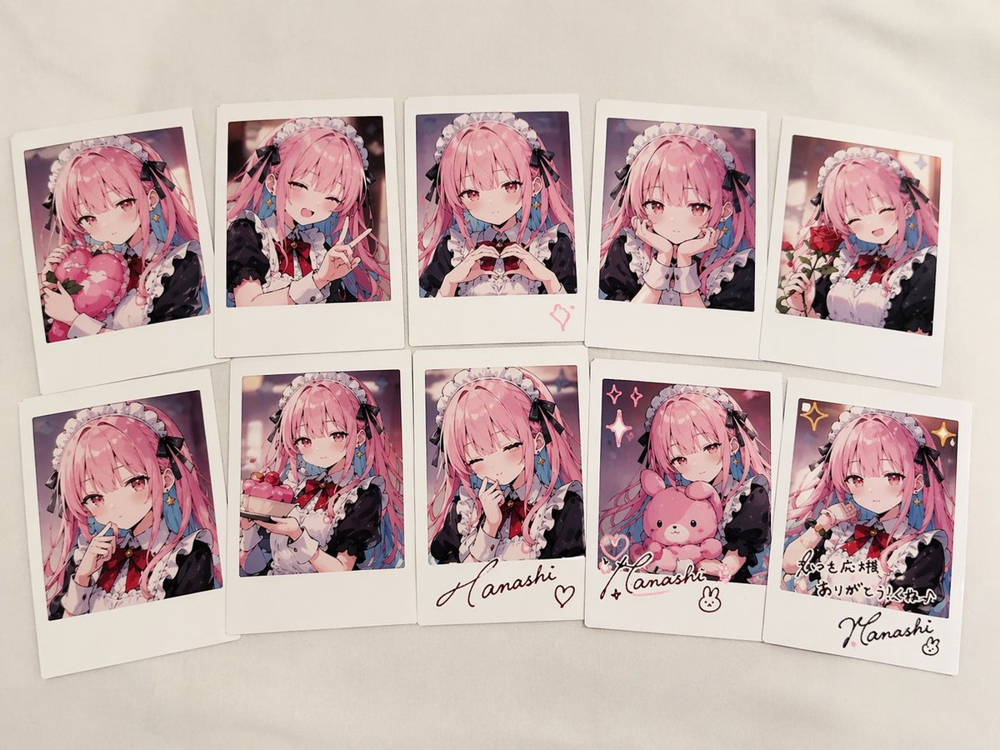
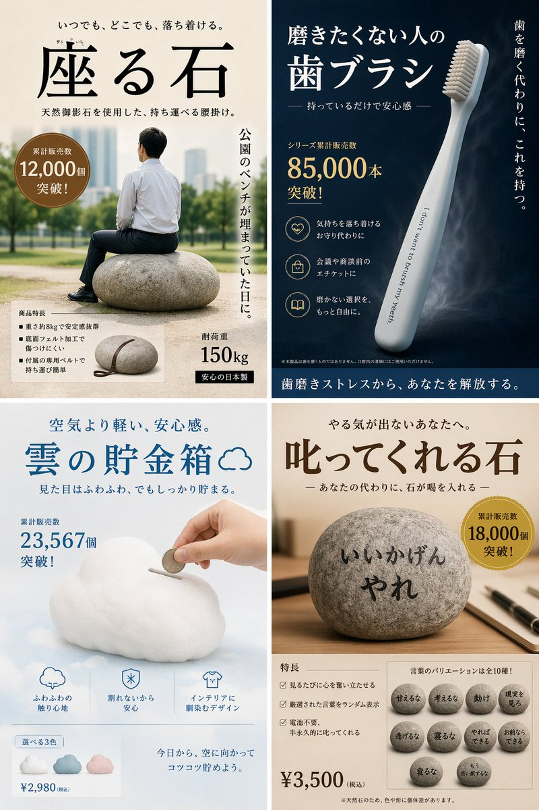

# 人物与角色

> GPT Image 2 中文提示词案例分册 9。本分册共 8 个案例。

[返回索引](index.md)

## 案例目录

- [例 27：人物角色设定图](#case-27)
- [例 54：人物角色设定图](#case-54)
- [例 155：人物角色设定图](#case-155)
- [例 162：人物角色设定图](#case-162)
- [例 166：十二黄金圣斗士卡牌合集](#case-166)
- [例 271：人物角色设定图](#case-271)
- [例 290：古风诗人镭射典藏卡牌](#case-290)
- [例 340：彼岸花丛中的红妆女子](#case-340)

## 案例

<a id="case-27"></a>

### 例 27：人物角色设定图



**提示词：**

```text
{
  "type": "collection of instant photos",
  "setting": "laid out flat on a white fabric surface",
  "character": {
    "hair": "{argument name=\"hair color\" default=\"long pink hair with blue inner color\"}",
    "outfit": "{argument name=\"outfit\" default=\"black and white maid uniform with frilly headband and black ribbons\"}",
    "eyes": "reddish-pink"
  },
  "layout": {
    "arrangement": "two rows of five polaroid photos",
    "count": 10,
    "photos": [
      { "position": "top row 1", "description": "holding a pink heart cushion" },
      { "position": "top row 2", "description": "winking, making a peace sign" },
      { "position": "top row 3", "description": "making a hand heart, pink heart doodle on the bottom border" },
      { "position": "top row 4", "description": "resting chin on hands, gentle smile" },
      { "position": "top row 5", "description": "holding a red rose, winking" },
      { "position": "bottom row 1", "description": "finger to lips, shy expression" },
      { "position": "bottom row 2", "description": "holding a small pink cake" },
      { "position": "bottom row 3", "description": "winking, hand near face, signature '{argument name=\"signature text\" default=\"Hanashi\"}' and heart doodle on border" },
      { "position": "bottom row 4", "description": "holding a pink bunny plushie, sparkle doodles, signature '{argument name=\"signature text\" default=\"Hanashi\"}' and bunny doodle on border" },
      { "position": "bottom row 5", "description": "winking, sparkle doodles, message '{argument name=\"message text\" default=\"いつも応援ありがとう！これからもよろしくね♪\"}' and signature '{argument name=\"signature text\" default=\"Hanashi\"}' on border" }
    ]
  }
}
```

***

<a id="case-54"></a>

### 例 54：人物角色设定图



**提示词：**

```text
{
  "type": "4-panel satirical product advertisement grid",
  "layout": {
    "grid": "2x2",
    "panels": [
      {
        "position": "top-left",
        "product_name": "{argument name=\"top left product name\" default=\"座る石\"}",
        "visual": "man in white shirt and dark pants sitting on a large round stone in a park",
        "catchphrase": "いつでも、どこでも、落ち着ける。",
        "sales_badge": "累計販売数 12,000個 突破!",
        "vertical_text": "公園のベンチが埋まっていた日に。",
        "features_count": 3,
        "features_labels": [
          "重さ約8kgで安定感抜群",
          "底面フェルト加工で傷つけにくい",
          "付属の専用ベルトで持ち運び簡単"
        ],
        "extra_visual": "small inset image of the stone with a leather carrying strap",
        "specs": [
          "耐荷重 150kg",
          "安心の日本製"
        ]
      },
      {
        "position": "top-right",
        "product_name": "{argument name=\"top right product name\" default=\"磨きたくない人の歯ブラシ\"}",
        "visual": "sleek light blue toothbrush angled diagonally on a dark blue background",
        "toothbrush_text": "I don't want to brush my yeeth.",
        "catchphrase": "持っているだけで安心感",
        "vertical_text": "歯を磨く代わりに、これを持つ。",
        "sales_badge": "シリーズ累計販売数 85,000本 突破!",
        "features_count": 3,
        "features_labels": [
          "気持ちを落ち着けるお守り代わりに",
          "会議や商談前のエチケットに",
          "磨かない選択を、もっと自由に。"
        ],
        "bottom_banner": "歯磨きストレスから、あなたを解放する。"
      },
      {
        "position": "bottom-left",
        "product_name": "{argument name=\"bottom left product name\" default=\"雲の貯金箱\"}",
        "visual": "hand inserting a coin into a fluffy white cloud-shaped piggy bank",
        "catchphrase": "空気より軽い、安心感。",
        "sales_badge": "累計販売数 23,567個 突破!",
        "features_count": 3,
        "features_labels": [
          "ふわふわの触り心地",
          "割れないから安心",
          "インテリアに馴染むデザイン"
        ],
        "color_variants_count": 3,
        "color_variants_labels": [
          "blue",
          "pink",
          "white"
        ],
        "price": "¥2,980 (税込)",
        "bottom_text": "今日から、空に向かってコツコツ貯めよう。"
      },
      {
        "position": "bottom-right",
        "product_name": "{argument name=\"bottom right product name\" default=\"叱ってくれる石\"}",
        "visual": "round stone on a wooden desk with a pen, text written on the stone",
        "stone_text": "{argument name=\"scolding phrase\" default=\"いいかげんやれ\"}",
        "catchphrase": "やる気が出ないあなたへ。",
        "sales_badge": "累計販売数 18,000個 突破!",
        "features_count": 3,
        "features_labels": [
          "見るたびに心を奮い立たせる",
          "厳選された言葉をランダム表示",
          "電池不要、半永久的に叱ってくれる"
        ],
        "phrase_variants_count": 10,
        "phrase_variants_labels": [
          "甘えるな",
          "考えるな",
          "動け",
          "現実を見ろ",
          "逃げるな",
          "寝るな",
          "やればできる",
          "お前ならできる",
          "寝るな",
          "もう言い訳するな"
        ],
        "price": "¥3,500 (税込)"
      }
    ]
  }
}
```

***

<a id="case-155"></a>

### 例 155：人物角色设定图


**提示词：**

```text
在{argument name="style" default="live-action"}中为标准{argument name="character type" default="Vtuber"}创建{argument name="items" default="fangoods"}
```

***

<a id="case-162"></a>

### 例 162：人物角色设定图


**提示词：**

```text
{argument name="voice" default="chatgpt voice"} 如果它是一个字符
```

***

<a id="case-166"></a>

### 例 166：十二黄金圣斗士卡牌合集


**提示词：**

```text
生成圣斗士星矢12个黄金圣斗士的12宫格卡牌图片，每张卡牌上写上对应的中文名，每行4个，宽高比16:9。
```

***

<a id="case-271"></a>

### 例 271：人物角色设定图


**提示词：**

```text
お借りして噂のGPT-Image-2でキャラシート作ってみましたｽｺﾞｯ(๑°ㅁ°๑)‼✧更に色々指示してあげたらもっといい感じになりそう✨キャラは以前チャッピーにお願いして描いて貰った我が分身です( *¯ ꒳¯*)
```

***

<a id="case-290"></a>

### 例 290：古风诗人镭射典藏卡牌


**提示词：**

```text
为中国古代诗人设计一套游戏卡片，并按照SSR SR R 分级，重点卡片有放大展示的效果，包括卡面设计和人物介绍，有很高级的游戏卡片质感，稀有卡片还会有特色的光影例如镭射效果 需要有套卡设计和技能设计，并附带较为详细的说明
```

***

<a id="case-340"></a>

### 例 340：彼岸花丛中的红妆女子


**提示词：**

```text
异质感oc，绝美红妆女子，位于彼岸花丛中，张力。 唐琬《钗头凤·世情薄》 世情薄，人情恶，雨送黄昏花易落。晓风干，泪痕残。欲笺心事，独语斜阑。难，难，难！
```

***
